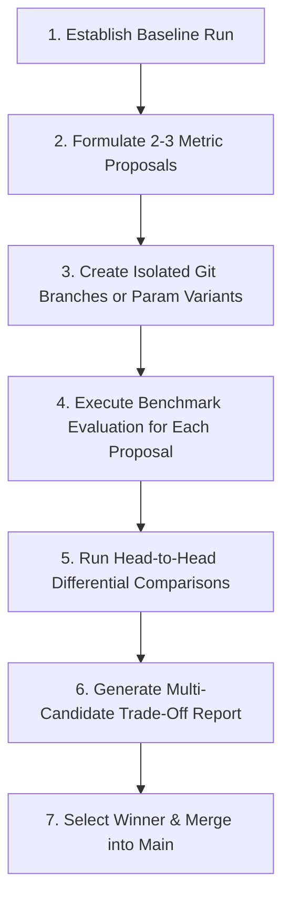

# AAA Modular Benchmarking Platform & Autonomous Agent Protocol

The `benchmarks/` workspace is a self-contained empirical evaluation platform for the AAA Cybernetic Architecture. It operates completely outside the core `backend/` runtime, providing modular benchmark suites, standardized dataset loaders, live LLM pressure testing, differential delta analysis, and high-density 14-panel cyberpunk telemetry dashboards.

---

## 1. Directory Layout

```
benchmarks/
├── cli.py                         # Unified CLI router: python -m benchmarks.cli <suite> <action>
├── common/                        # Shared benchmarking infrastructure across all suites
│   ├── base.py                    # BaseSuite interface, RunMetadata schema
│   ├── storage.py                 # Run directory lifecycle, logging, metadata.json, and receipt saving
│   ├── loader.py                  # Dataset ingestion, parent-pointer tree walking, branch extraction, .npy caching
│   └── visualizer.py              # Restyled cyberpunk theme, HTML/SVG canvas, and Edge PNG screenshot engine
├── suites/                        # Pluggable domain benchmark suites
│   ├── telemetry/                 # [ACTIVE] 14-Dimension Cybernetic Telemetry & Viability Suite
│   │   ├── evaluator.py           # Metric calculations (kinematics, allostasis, Pask, topology, collapse)
│   │   ├── boredom_evaluator.py   # Separation margin, Cohen's d, residual rank, recurrence determinism
│   │   ├── boredom_fixtures.py    # Reference datasets generator & .npy embedding cacher
│   │   ├── boredom_branching.py   # 2-call counterfactual branching probe (Refusal & Recovery)
│   │   ├── comparator.py          # Delta calculation & significant shift isolation (|Δ| >= 0.05)
│   │   ├── visualizer.py          # 14-panel dashboard, oscilloscope & boredom separation chart
│   │   ├── live.py                # 10-turn live adversarial AI pressure test (Baseline LLM vs. AAA Apparatus)
│   │   ├── runner.py              # TelemetryBenchmarkSuite orchestrator
│   │   └── cli.py                 # Subcommands: eval, compare, live, boredom-eval, boredom-probe
│   ├── memory/                    # [PLANNED] Retrieval speed, diffractive recall, compaction stability
│   ├── agents/                    # [PLANNED] Multi-agent council latency, consensus convergence
│   └── belief/                    # [PLANNED] Bayesian updates, sediment grating stability, epistemic entropy
├── data/                          # Shared dialogue corpora & test datasets
│   ├── dialogues/                 # Real-world exports (dialogue_3527, dialogue_1555)
│   └── baselines/                 # Historical reference suites (003-empirical-10-turn-benchmark)
├── runs/                          # Standardized run outputs partitioned by suite (git-ignored)
│   ├── telemetry/                 # e.g. eval_*, compare_*, live_*
│   └── ...
├── tests/                         # Test suite for benchmark runners and suites
│   └── test_telemetry_suite.py
└── README.md                      # This specification and autonomous agent protocol
```

---

## 2. Standardized Run Naming Conventions

All run directories follow a deterministic, human- and agent-readable schema inside `benchmarks/runs/<suite>/`:

| Run Type | Directory Name Pattern | Example |
| :--- | :--- | :--- |
| **Offline Evaluation** | `eval_<experiment_name>_<YYYYMMDD_HHMMSS>` | `eval_kinematics_recalibration_branch1555_20260912_180500` |
| **Differential Comparison** | `compare_<nameA>_vs_<nameB>_<YYYYMMDD_HHMMSS>` | `compare_proposal_A_vs_proposal_B_20260912_181000` |
| **Live AI Pressure Test** | `live_<experiment_name>_<model_slug>_<YYYYMMDD_HHMMSS>` | `live_allostatic_stress_gemini25flash_20260912_181500` |

### Output Artifact Guarantee
Every completed run directory is guaranteed to contain:
1. `metadata.json`: Machine-readable provenance (git commit, exact CLI command, dataset/model, parameters, duration).
2. `run.log`: Timestamped execution journal.
3. `telemetry_receipts.json` / `conversation_receipts.json`: Raw per-turn metric values and message records.
4. `summary.md` / `comparison_summary.md`: Human- and LLM-scannable markdown report.
5. Visualizations:
   - `telemetry_audit_dashboard.png` (or `differential_changes.png`): High-density 1720x3380 14-panel card dashboard.
   - `telemetry_audit_dashboard.html`: Interactive SVG/HTML dashboard.
   - `telemetry_oscilloscope.png`: 5-tier chronological time-series plot.

---

## 3. Autonomous Metric Improvement Protocol (For Antigravity Agents)

When asked to **analyze metrics, formulate 2-3 improvement proposals, run them, compare, report, and apply the best one**, execute the following autonomous loop:



### Protocol Steps:

#### Step 1: Establish the Baseline Run
Evaluate the current master state on the benchmark dataset to produce a reference baseline:
```bash
cmd /c uv run python -m benchmarks.cli telemetry eval \
  -i benchmarks/data/dialogues/dialogue_1555_branched_all_messages.json \
  --node 1555 \
  -n baseline_reference
```

#### Step 2: Formulate 2-3 Concrete Improvement Proposals
Formulate specific hypotheses aimed at resolving dialectic stagnation, excessive oscillation, or mathematical edge cases in `backend/modules/metrics/`:
- **Proposal A (e.g. Logarithmic Recency Damping)**: Modifies speaker weighting decay in `kinematics.py`.
- **Proposal B (e.g. Centroid Drift Regularization)**: Smooths context centroid movement in `topology.py`.
- **Proposal C (e.g. Paskian Triadic Balancing)**: Adjusts allostatic load exponents in `paskian.py`.

#### Step 3: Benchmark Each Proposal
For each proposal, run an evaluation with a descriptive name matching the proposal:
```bash
cmd /c uv run python -m benchmarks.cli telemetry eval \
  -i benchmarks/data/dialogues/dialogue_1555_branched_all_messages.json \
  --node 1555 \
  -n proposal_A_log_damping

cmd /c uv run python -m benchmarks.cli telemetry eval \
  -i benchmarks/data/dialogues/dialogue_1555_branched_all_messages.json \
  --node 1555 \
  -n proposal_B_centroid_reg
```

#### Step 4: Run Differential Comparisons Against Baseline
Compare each proposal directly against the reference baseline:
```bash
cmd /c uv run python -m benchmarks.cli telemetry compare \
  -a benchmarks/runs/telemetry/eval_baseline_reference_<timestamp> \
  -b benchmarks/runs/telemetry/eval_proposal_A_log_damping_<timestamp> \
  -n diff_baseline_vs_proposal_A

cmd /c uv run python -m benchmarks.cli telemetry compare \
  -a benchmarks/runs/telemetry/eval_baseline_reference_<timestamp> \
  -b benchmarks/runs/telemetry/eval_proposal_B_centroid_reg_<timestamp> \
  -n diff_baseline_vs_proposal_B
```

#### Step 5: Scorecard Ranking & Decision Synthesis
Inspect `comparison_summary.md` and the 14-panel dashboards in each comparison run:
- Check for **`[SHIFT DETECTED]`** badges ($|\Delta| \ge 0.05$).
- Evaluate whether Paskian Health ($H_{pask}$) and Vitality ($V_t$) increased while Deficit ($D_t$) and Collapse Pressure ($CP_t$) decreased.
- Verify that 2,000-turn stability (`dialogue_3527`) remains non-divergent.

#### Step 6: Apply the Winning Proposal
Commit and merge the winning implementation into `main` with the empirical scorecard cited in the commit message.

---

## 4. CLI Command Reference

### 1. Offline Dialogue Evaluation
```bash
# Evaluate a linear or default conversation export
uv run python -m benchmarks.cli telemetry eval -i benchmarks/data/dialogues/dialogue_3527_all_messages.json -n autonomous_2000

# Evaluate a specific leaf node in a branched conversation
uv run python -m benchmarks.cli telemetry eval -i benchmarks/data/dialogues/dialogue_1555_branched_all_messages.json --node 1555 -n branch_1555

# Evaluate the deepest/longest path in a branched tree
uv run python -m benchmarks.cli telemetry eval -i benchmarks/data/dialogues/dialogue_1555_branched_all_messages.json --longest -n longest_path_1228
```

### 2. Differential Head-to-Head Comparison
```bash
uv run python -m benchmarks.cli telemetry compare \
  -a benchmarks/runs/telemetry/eval_baseline_reference_20260912_172539 \
  -b benchmarks/runs/telemetry/eval_proposal_A_20260912_173000 \
  -n baseline_vs_proposal_A \
  --threshold 0.05
```

### 3. Live 10-Turn Adversarial AI Pressure Test
```bash
# Pits unprompted Baseline LLM against AAA Allostatic Apparatus over 10 adversarial repetitive prompts
uv run python -m benchmarks.cli telemetry live \
  --model google/gemini-2.5-flash \
  --turns 10 \
  -n gemini_flash_pressure_test
```

### 4. Shorthand Compatibility
You can omit `telemetry` or invoke via `scripts/benchmark.py`:
```bash
uv run python scripts/benchmark.py eval -i benchmarks/data/dialogues/dialogue_3527_all_messages.json -n test_run
uv run python -m benchmarks.cli eval -i benchmarks/data/dialogues/dialogue_3527_all_messages.json -n test_run
```

---

## 5. Adding a New Benchmark Suite

To add a new benchmark suite (e.g. `memory`):
1. Subclass `BaseBenchmarkSuite` in `benchmarks/suites/memory/runner.py`.
2. Implement your evaluation logic using shared utilities (`benchmarks.common.loader`, `benchmarks.common.storage`, `benchmarks.common.visualizer`).
3. Create `benchmarks/suites/memory/cli.py` with `register_memory_cli(subparsers)` and `execute_memory_cli(args)`.
4. Register the new suite in `benchmarks/cli.py`.
5. Add unit tests in `benchmarks/tests/test_memory_suite.py`.
