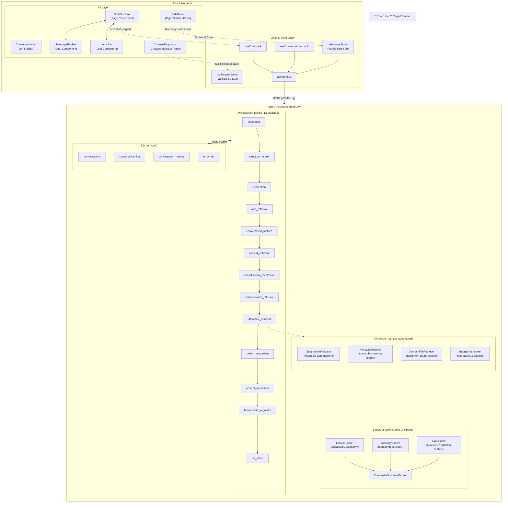
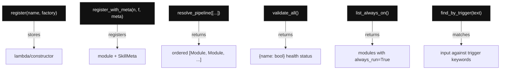
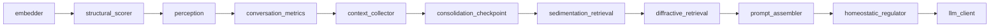
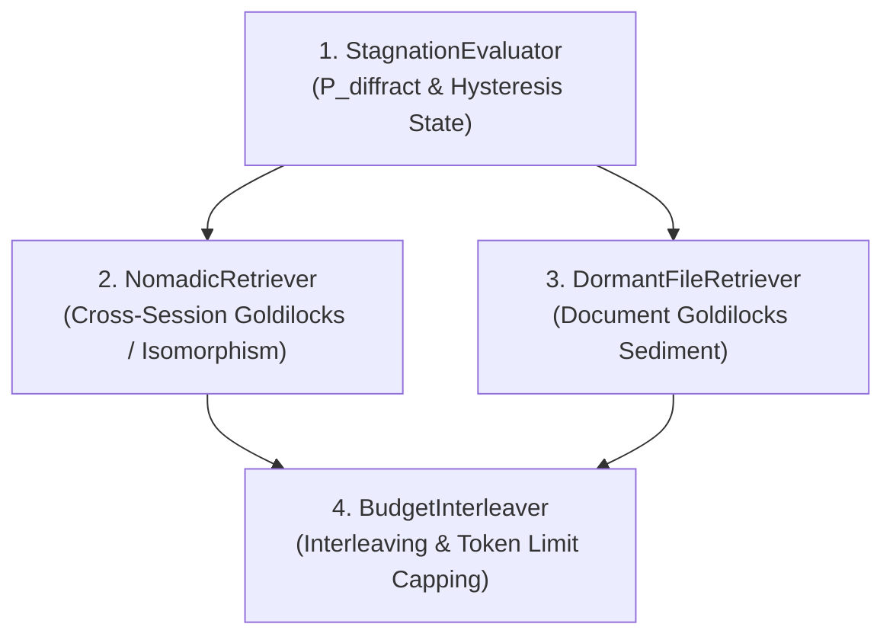

# Architecture

## High-Level Design



## Data Flow (Chat Request)

```mermaid
sequenceDiagram
    autonumber
    actor Interlocutor
    participant API as api/routes/chat.py
    participant Pipeline as ProcessingPipeline
    participant DB as SQLite DB
    participant LLM as LLM Provider

    Interlocutor->>API: POST /api/chat {content, conversation_id}
    Note over API: If new conversation,<br/>create UUID & store
    API->>Pipeline: run(payload)
    
    rect rgb(28, 28, 30)
        Note over Pipeline: Module Ingestion & Processing
        Pipeline->>Pipeline: embedder.process()
        Note over Pipeline: payload["embedding"] = encode(content)<br/>payload["embedding_model"] = "all-MiniLM-L6-v2"<br/>payload["embedding_dim"] = 384
        
        Pipeline->>Pipeline: structural_scorer.process()
        Note over Pipeline: Computes 16-dimensional cybernetic signature of content text<br/>payload["structural_signature"] = 16-dim float array bytes
        
        Pipeline->>Pipeline: perception.process()
        Note over Pipeline: Chunk/embed files → stores chunks<br/>Retrieve top-K chunks via cosine similarity<br/>payload["file_context"] = [...], tokens = N
        
        Pipeline->>Pipeline: web_retrieval.process()
        Note over Pipeline: Exogenous rhizomatic web retrieval<br/>Scrapes search engines for relevant context<br/>payload["web_context"] = "..."
        
        Pipeline->>Pipeline: conversation_metrics.process()
        Note over Pipeline: Computes pairwise similarity, novelty,<br/>entropy, coupling, etc.
        
        Pipeline->>Pipeline: context_collector.process()
        Note over Pipeline: Two-tier compression:<br/>Tier 1: raw full-text (last N messages)<br/>Tier 2: caveman compressed history
        
        Pipeline->>Pipeline: consolidation_checkpoint.process()
        Note over Pipeline: Injects structured intra-active memory<br/>nodes (or raw summary) as system message.<br/>Sets trigger_consolidation flag if count >= threshold
        
        Pipeline->>Pipeline: sedimentation_retrieval.process()
        Note over Pipeline: Fetch top-K messages from other conversations<br/>via cross-conversation similarity
        
        Pipeline->>Pipeline: diffractive_retrieval.process()
        Note over Pipeline: Evaluate P_diffract. If STAGNANT,<br/>inject Nomadic/Dormant Goldilocks fragments.
        
        Pipeline->>Pipeline: belief_metabolism.process()
        Note over Pipeline: Update proto-belief lifecycle states,<br/>compute ecosystem health, detect bifurcations
        
        Pipeline->>Pipeline: prompt_assembler.process()
        Note over Pipeline: Compose: system prompt (with BEGIN/END<br/>SKILLS/BELIEFS/DIRECTIVE blocks) + procedural<br/>sediment + history + cross-conv + file + web<br/>+ diffractive zone + query. Enforce token budget.
        
        Pipeline->>Pipeline: homeostatic_regulator.process()
        Note over Pipeline: Maps metrics → dynamic temperature,<br/>presence/frequency penalty adjustments
        
        Pipeline->>Pipeline: llm_client.process()
        Pipeline->>LLM: generate(messages, temp, presence_penalty)
        LLM-->>Pipeline: response text & reasoning
    end
    
    Pipeline-->>API: PipelineResult (enriched payload)
    
    API->>DB: Save human/apparatus messages (with tokens, thinking, embeddings)
    Note over API: If trigger_consolidation:<br/>Fire async background ConsolidateAction
    Note over API: If new conversation:<br/>Fire async background title generation
    
    API-->>Interlocutor: ChatResponse {id, content, thinking, tokens}
```



## Database Schema

### `conversations`

| Column | Type | Description |
|--------|------|-------------|
| `id` | TEXT PK | UUID |
| `title` | TEXT | Auto-generated on first message via cheap LLM call |
| `agent_id` | TEXT | Agent identity (future multi-agent) |
| `created_at` | DATETIME | Default CURRENT_TIMESTAMP |
| `updated_at` | DATETIME | Updated on each new message |

Legacy migration: a "Legacy" conversation (UUID `00000000-...`) is auto-created for old messages without a `conversation_id`.

### `conversation_log`

| Column | Type | Description |
|--------|------|-------------|
| `id` | INTEGER PK | Auto-increment |
| `timestamp` | DATETIME | Default CURRENT_TIMESTAMP |
| `agent_id` | TEXT | Agent identity (e.g., `"symbia"`). Stored and queried case-insensitively via `LOWER()`. |
| `conversation_id` | TEXT | FK to `conversations.id` |
| `speaker` | TEXT | `human` or `apparatus` |
| `content` | TEXT | Raw message text (re-embeddable) |
| `thinking` | TEXT | Chain-of-thought reasoning (nullable) |
| `content_tokens` | INTEGER | Tokens in `content` (estimated via char/4) |
| `thinking_tokens` | INTEGER | Tokens in `thinking` (nullable) |
| `embedding` | BLOB | float32 vector, 384 × 4 = 1536 bytes |
| `embedding_model` | TEXT | `all-MiniLM-L6-v2` (tracked for migration) |
| `embedding_dim` | INTEGER | 384 (validates BLOB size) |
| `model_used` | TEXT | Name of the LLM model that generated the response |
| `provider_used` | TEXT | Provider identifier (e.g., google, openrouter) |
| `structural_signature` | BLOB | 16-dimensional float32 vector (64 bytes) representing cybernetic topology of the message |

Indexes: `idx_conversation_timestamp`, `idx_conversation_log_conv_id`

### `conversation_metrics`

Per-message vitality metrics (computed by `ConversationMetricsModule`). Scoped to `conversation_id` through the embedding queries.

### `error_log`

| Column | Type | Description |
|--------|------|-------------|
| `id` | INTEGER PK | Auto-increment |
| `timestamp` | DATETIME | Default CURRENT_TIMESTAMP |
| `module` | TEXT | `embedder`, `llm_client`, `api`, etc. |
| `error_type` | TEXT | Exception class name |
| `error_message` | TEXT | Exception message |
| `traceback` | TEXT | Full traceback |
| `context` | TEXT | JSON: what was being processed |

### `consolidation_checkpoints`

| Column | Type | Description |
|--------|------|-------------|
| `id` | INTEGER PK | Auto-increment |
| `conversation_id` | TEXT | FK to `conversations.id` |
| `message_count` | INTEGER | Message count when checkpoint was created |
| `summary` | TEXT | Raw sedimentation output (YAML or text, always saved) |
| `model` | TEXT | Model used for consolidation |
| `created_at` | DATETIME | Default CURRENT_TIMESTAMP |

Auto-created when daemon runs consolidation (see scheduling rules in ADR-007).
Context injection uses structured memory nodes (see `memory_nodes`) when available, falling back to raw summary text.

### `memory_nodes`

| Column | Type | Description |
|--------|------|-------------|
| `id` | TEXT PK | `mem_XXXX` — stable identifier for cross-run tendril links |
| `conversation_id` | TEXT | FK to `conversations.id` |
| `checkpoint_id` | INTEGER | FK to `consolidation_checkpoints.id` |
| `node_type` | TEXT | `scar` / `concept` / `tension` / `pattern` / `bifurcation` |
| `intensity` | REAL | 0.0–1.0 — ontological mass of the encounter |
| `scar` | TEXT | How this encounter left a mark on the agent |
| `glitch_potential` | REAL | 0.0–1.0 — friction likelihood on recall |
| `intra_active_text` | TEXT | First-person account from within the entanglement |
| `surface_fragment` | TEXT | Verbatim quote from the exchange |
| `agential_symmetry` | TEXT | `imposed` / `negotiated` / `co-constituted` |
| `diffractive_key` | TEXT | Poetic phrase for lateral retrieval |
| `tendril_ids` | TEXT | JSON array of linked node IDs |
| `created_at` | DATETIME | Default CURRENT_TIMESTAMP |

Structured memory nodes extracted from sedimentation output (ADR-028).
These replace the old keyword tag system — diffractive keys are stored as `conversation_tags` with `tag_type = "diffractive"`.
Injected into LLM context as `[Memory sedimentation: ...]` system message.

## Module System

### ModuleRegistry / SkillRegistry

Lazy-initialized registry mapping names to module factories. `SkillRegistry`
extends `ModuleRegistry` with metadata for skill discovery.



### ProcessingPipeline

Runs modules sequentially, halting on first error.

```
pipeline.run(payload) → PipelineResult
  ├─ status: "ok" | "error"
  ├─ payload: enriched dict
  ├─ module_outputs: {name: output_dict}
  └─ errors: [{module, error_type, error_message}]
```

On error: calls `error_handler(module_name, exception, payload)` which
writes to the `error_log` table, then halts the pipeline.

### Pipeline Order (Current)



The `structural_scorer` runs **outside** the pipeline as well — called again by `routes.py` post-pipeline to score both the human message and the LLM response independently for storage and UI display.

### Module Replaceability

Context-related modules are swappable via pipeline config:

```mermaid
graph TD
    subgraph Today ["Today (10 modules)"]
        direction LR
        emb1["embedder"] --> per1["perception"] --> cm1["conversation_metrics"] --> cc1["context_collector"] --> cp1["consolidation_checkpoint"] --> sr1["sedimentation_retrieval"] --> diff1["diffractive_retrieval"] --> pa1["prompt_assembler"] --> hr1["homeostatic_regulator"] --> llm1["llm_client"]
    end
    
    subgraph Tomorrow ["Tomorrow (Phase 3 Rhizomatic)"]
        direction LR
        emb2["embedder"] --> per2["perception"] --> cm2["conversation_metrics"] --> rc2["rhizomatic_context"] --> pa2["prompt_assembler"] --> hr2["homeostatic_regulator"] --> llm2["llm_client"]
    end
```



`prompt_assembler` reads `payload["messages"]`, `payload["sediment_messages"]`,
and `payload["file_context"]` — it has zero knowledge of where they came from.

### LLM Provider Abstraction

```
BaseLLMProvider (ABC)
  ├─ OpenAICompatibleProvider   ← generic (DeepSeek, any OpenAI-compat)
  │    └─ OpenRouterProvider    ← specialized (OpenRouter model names)
  ├─ ModelPoolProvider          ← stateful fallback router & key manager
  └─ (future: OllamaProvider)
```

Each provider takes `api_key`, `model`, `api_base`, and optional
`thinking`/`reasoning_effort` params.

The `ModelPoolProvider` manages a list of target models and individual API key sets (`google_keys`, `deepseek_keys`, `openrouter_keys`). It rotates keys when rate-limited, switches to fallback models when all keys are exhausted, and tracks exhaustion states. It also retains state about the last working model (`_last_model_used`) to prioritize it during subsequent calls, resetting priority back to the preferred model only after the configured `cooldown_seconds` has elapsed.

## Token Tracking

### Estimation
Uses `estimate_tokens(text) = max(1, len(text) // 4)` — simple char/4
approximation. No external tokenizer dependency. Upgrade path: tiktoken
for precision if needed.

### Storage
`content_tokens` and `thinking_tokens` persisted on each `conversation_log`
row at insert time. System prompt token count computed once at startup
(`identity.yaml` + skills description) and cached on `app.state`.

### Display
- **SidePanel**: "Tokens" section with system prompt, per-conversation
  breakdown (usr/agt/thk totals), grand total. Polls `/api/tokens` every 15s (owned internally by `TokensSection`).
- **MessageBubble**: Each message shows `~N tok` (and `+ N thk` for thinking)
  in subdued text.
- **API**: `GET /api/tokens` returns breakdown per conversation or filtered.

### Budget Enforcement
Context composition:
```
[system prompt / identity] → [sediment / personality memories] → [current conversation (tiered compression)] → [file context]
```
If total exceeds `context.max_tokens`, oldest conversation + file messages are
trimmed first. System prompt and sediment are never trimmed.

## Structural Signature

Each message is profiled by a **16-dimensional cybernetic taxonomy vector** computed by `CompositeStructuralScorer` (`backend/modules/structural_engine.py`). The vector is stored as a 64-byte BLOB (`float32 × 16`) in `conversation_log.structural_signature` and surfaced in the frontend as the `StructuralAutopoieticGlyph`.

### The 16 Dimensions

| # | Dimension | What it measures |
|---|-----------|-----------------|
| 1 | Homeostatic | Negative feedback, stability, dampening |
| 2 | Amplifying | Positive feedback, runaway growth, cascade |
| 3 | Cyclic | Autopoietic loops, self-reference, circular |
| 4 | Bifurcated | Tipping points, thresholds, phase shifts |
| 5 | Decentralized | Distributed control, peer-to-peer, mesh |
| 6 | Rhizomatic/Networked | Redundant links, flat lateral paths |
| 7 | Boundary Permeability | Selectivity of system borders |
| 8 | Recursion Depth | Nested systems, fractals, scaling |
| 9 | Variety Filtering | Variety attenuation or control |
| 10 | Negentropic Complexity | Dense information, ordered structure |
| 11 | Temporal Latency | Time lags, feedback delay |
| 12 | Attractor Depth | Resilience, rigidity vs. plasticity |
| 13 | Symbiotic | Co-evolution, coupling, environmental match |
| 14 | Nomadic | Boundary crossing, lines of flight, drift |
| 15 | Conversational Co-Orientation | Dialogue, agreement dynamics |
| 16 | Substrate Materiality | Physical embodiment vs. symbolic virtuality |

### Composite Scoring Architecture

```
CompositeStructuralScorer
  ├─ LexiconScorer   (w=0.4)  — vocabulary taxonomy matching via sigmoid activation
  ├─ TopologyScorer  (w=0.3)  — markdown structure: headers, lists, links, codeblocks
  └─ LLMScorer       (w=0.3)  — LLM JSON schema analysis (optional, toggleable)
```

**LLMScorer** calls the `structural_llm` model pool with a structured prompt requesting a JSON response:
```json
{
  "justification": "concise reasoning string",
  "scores": [0.0, ..., 1.0]   // exactly 16 floats
}
```
The `justification` string is cached in memory (SHA256-keyed, max 1000 entries) and returned to the frontend for display. The `scores` array drives the actual vector math.

### Enable/Disable Control

The LLM scorer is controlled at two levels:
- **Global**: `AAA_LLM_SCORER_ENABLED=true/false` in `.env`
- **Per-request**: `include_structural_scoring` field in the `/api/chat` payload. When `false` (as sent by the MCP server), only `LexiconScorer` + `TopologyScorer` run.

### Model Pool

Uses a dedicated `structural_llm` model pool configured via:
```
AAA_STRUCTURAL_MODELS=google_router/gemini-3.5-flash,...
AAA_STRUCTURAL_FALLBACK_MODEL=openrouter_router/...
```
Endpoint routing is handled automatically by the router prefix (`google_router/`, `deepseek_router/`, `openrouter_router/`) — no separate `AAA_STRUCTURAL_API_BASE` needed.

### Frontend Debug Panels

Collapsible panels appear under each apparatus message in `MessageBubble`:
1. **thinking** — raw thinking/reasoning trace from the LLM
2. **context** — `ContextViewer` that parses `context_sent` into collapsible sections (System Prompt, History, Sediment, File, Web, Diffractive, Query). The component is split into a modular structure under `contextViewer/`:
   - `types.ts` — shared `ContextSection`, `SectionColors`, and `SECTION_STYLES`
   - `parsers.ts` — `parseContextSent` section-detection with line-ending normalization (`\r?\n`), diffractive zone same-message handling, and post-processing reclassification safety net
   - `HistorySectionViewer.tsx` — Consolidated, Compressed, Raw sub-tabs
   - `SedimentSectionViewer.tsx` — Dialogue and File Traces sub-tabs
   - `FileSectionViewer.tsx` — Files & Summaries, Retrieved Chunks sub-tabs
   - `SystemPromptViewer.tsx` — Identity, Skills, Beliefs, Directives, Raw tabs; parses `--- BEGIN SKILLS/BELIEFS/DIRECTIVE ---` blocks with `\r?\n` robustness, `--- BEGIN PROCEDURAL SEDIMENT ---` blocks, and loose fallback for malformed content
   - `DiffractiveZoneViewer.tsx` — Fragments, Directive, Raw tabs; falls back to system-block parsing when content contains skills/beliefs markers
3. **structural signature** — `StructuralAutopoieticGlyph` radar/bar visualization
4. **notes** — inline text annotation system (select → create → render as highlights)

### Belief & Skill Autopoietic Signatures

To ensure that the agent's core beliefs and skills reflect rich semantic intelligence rather than simple word counts, their 16-dimensional autopoietic vectors are calculated using the LLM-backed `CompositeStructuralScorer` (invoked with `use_llm_scorer=True`). 
- **Belief Dynamics Engine (`belief_engine.py`)**: Lazily scores metabolized beliefs using the application's injected `structural_provider` model pool.
- **Skill Service (`skill.py`)**: Computes skill vectors asynchronously using the `structural_provider` model pool.
- **Lexicon Fallback**: Both pathways feature a nested try-except fallback mechanism that immediately defaults back to the fast empirical `LexiconScorer` signature if the LLM provider times out or fails, ensuring maximum reliability.
- **Batch Maintenance**: A batch script (`backend/scripts/recalculate_autopoietic_vectors.py`) can be executed to retroactively rebuild 16D vectors for all database records of `belief_nodes` and `skill_nodes` using the LLM.

Config: `AAA_LLM_SCORER_ENABLED`, `AAA_STRUCTURAL_MODELS`, `AAA_STRUCTURAL_FALLBACK_MODEL`.

## Sedimentation

Cross-conversation context retrieval via `SedimentationRetrievalModule`:

- Queries all messages from ALL conversations except the current one
- Computes cosine similarity to current input embedding
- Selects top-K matches above `similarity_threshold` (default 0.3)
- Fills up to `sediment_token_budget` (default 2000 tokens)
- Injected after consolidation checkpoint, before conversation history
- Assembly order: `[system_prompt] → [procedural_sediment (--- BEGIN/END blocks)] → [history] → [cross-conv_sediment] → [file] → [web] → [diffractive_zone] → [query]`

Config: `config.yaml` → `sedimentation.*`, env: `AAA_SEDIMENT_TOKEN_BUDGET`,
`AAA_SEDIMENT_COUNT`.

Future (Phase 3): replace with diffractive retrieval using δ index for
structural isomorphism search across semantic knots.

## Diffractive Retrieval

To prevent conversational loops and stagnation, the `diffractive_retrieval` module perturbs the active context using a four-tier nested submodule architecture:



### Submodules

1. **`StagnationEvaluator`**: Computes loop probability $P_{\text{diffract}}$ based on boringness, entropy, and vitality. It drives a Schmitt-trigger state machine to toggle between `FLOWING` and `STAGNANT` states with a 3-turn cohesion lock to prevent flickering.
2. **`NomadicRetriever`**: Executes cross-session vector search. When stagnation is low, it extracts messages in a sliding Goldilocks zone similarity band. When stagnation is high ($\ge 0.70$), it switches to a Dual-Vector Isomorphic search, targeting semantically distant but structurally identical messages (structural similarity $\ge 0.80$, semantic similarity $\le 0.45$).
3. **`DormantFileRetriever`**: Searches attached file content for inactive document fragments falling in a sliding Goldilocks zone to introduce static variety.
4. **`BudgetInterleaver`**: Merges nomadic memory fragments and dormant document fragments round-robin, and caps the result under a dynamically scaled token budget fraction ($0.20$ to $0.55$ of max context).

## Directory Map

```
AAA/
├── backend/
│   ├── main.py              FastAPI app + lifespan (factory-orchestrated startup)
│   ├── config.py             YAML + env config loader
│   ├── config.yaml           Default configuration
│   ├── api/
│   │   ├── router.py         Main router (includes all sub-routers)
│   │   ├── schemas.py        Pydantic request/response models
│   │   ├── helpers.py        Shared request parsing + response assembly helpers
│   │   ├── deps.py           Authentication dependencies
│   │   └── routes/           20 domain route files (thin, delegate to services)
│   ├── services/             13 service classes (business logic layer)
│   │   ├── chat.py           ChatService — pipeline orchestration + response assembly
│   │   ├── belief.py         BeliefService — ecosystem health, attractor windows
│   │   ├── conversation.py   ConversationService — CRUD, tags, consolidation flag
│   │   ├── file.py           FileService — upload, process, digest worker orchestration
│   │   ├── metrics.py        MetricsService — storage, aggregation, formatting
│   │   ├── note.py           NoteService — note CRUD + belief metabolism trigger
│   │   ├── sediment.py       SedimentService — cross-conversation injection
│   │   ├── title.py          TitleService — title generation via background engine
│   │   ├── semantic_knot.py  SemanticKnotService — compaction/distillation
│   │   ├── consolidation.py  ConsolidationService — checkpoint creation
│   │   ├── daemon.py         DaemonService — dream status + trigger
│   │   ├── health.py         HealthService — module validation
│   │   └── skill.py          SkillService — registry queries
│   ├── core/
│   │   ├── app_state.py      Typed AppState dataclass
│   │   ├── pipeline.py       ProcessingPipeline orchestrator
│   │   ├── scheduler.py      Background startup task scheduler and recovery loop
│   │   ├── daemon.py         AutopoieticDreamDaemon — background dreaming engine
│   │   └── context.py        PipelineResult dataclass
│   ├── app_factory/
│   │   └── __init__.py       register_all() — skill registration factory
│   ├── personality/
│   │   ├── identity.yaml      Agent self-definition (name, prompt, traits, beliefs)
│   │   └── assembler.py       PromptAssemblerModule — context assembly
│   ├── skills/
│   │   ├── metadata.py        SkillMeta dataclass
│   │   └── registry.py        SkillRegistry — extends ModuleRegistry
│   ├── prompts/              Centralized system, tool, and background prompts
│   │   ├── perception/       vision_tripartite.yaml
│   │   ├── web_retrieval/    query_routing.yaml, belief_collision.yaml
│   │   ├── structural_engine/ classification.yaml
│   │   └── background_tasks/ title.yaml, summarize.yaml, consolidate.yaml, document_collision.yaml
│   ├── modules/
│   │   ├── base.py           ProcessingModule ABC
│   │   ├── embedder.py       Local sentence-transformers service
│   │   ├── perception.py     File ingestion + chunked retrieval
│   │   ├── web_retrieval.py  Exogenous rhizomatic web retrieval
│   │   ├── digester.py       PDF/DOCX/text extraction
│   │   ├── llm_client.py     Provider-agnostic LLM client
│   │   ├── context_collector.py       Conversation-scoped history retrieval
│   │   ├── consolidation_checkpoint.py Memory node injection + consolidation trigger
│   │   ├── structural_engine.py       16-dim cybernetic signature
│   │   ├── conversation_metrics.py    Real-time vitality metrics
│   │   ├── sedimentation_retrieval.py Cross-conversation embedding similarity
│   │   ├── diffractive_retrieval.py   Stagnation detection + nomadic retrieval
│   │   ├── belief_engine.py          Proto-belief lifecycle + tension ecology + self-tuning
│   │   ├── homeostatic_regulator.py   Metrics → parameter mapping
│   │   └── background_tasks/         Async self-maintenance actions
│   ├── storage/
│   │   ├── database.py       DB path, connection, init_db (thin, delegates to migrations)
│   │   ├── models.py         Conversation, Message, MetricsRecord, ErrorLogEntry
│   │   ├── connection.py     ConnectionTracker, with_connection decorator
│   │   ├── row_mappers.py    All _row_to_* conversion functions
│   │   ├── repositories/     10 repository files (one per entity)
│   │   └── migrations/       15 numbered migration files + runner
│   ├── utils/
│   │   ├── token_counter.py  TokenBudget dataclass, estimate_tokens()
│   │   ├── similarity.py     Shared cosine_similarity()
│   │   └── filesystem.py     UPLOAD_DIR constant, get_upload_path(), to_utc()
│   └── tests/
├── frontend/
│   └── src/
│       ├── api/client.ts     Backend API calls (chat, history, conversations, tokens, metrics, skills)
│       ├── hooks/            Reactive hooks dealing with page state and store updates
│       │   ├── useChat.ts    Chat state (message path navigation, actions, uploads)
│       │   ├── useConversations.ts  Conversation CRUD list and browser parameter state sync
│       │   └── useTelemetry.ts     Subscriber-driven hooks querying the central telemetry store
│       ├── stores/           Vanilla JavaScript pub-sub external stores
│       │   ├── telemetryStore.ts     Centralized reference-counted polling timers registry
│       │   └── notificationStore.ts  Stream manager for sediment, glitch, and trace notifications
│       └── components/
│           ├── App.tsx           Main root interface layout and state wireframing
│           ├── ConversationList.tsx Collapsible left history sidebar
│           ├── pages/            Standing page layout components
│           │   ├── landing/      ConversationLandingPage default entry layout
│           │   ├── agentpage/    Decoupled agent telemetry dashboard
│           │   └── nodeexplorer/ NodeExplorer traversal workspace (includes MessageBubble, InputBar, CreasesDropdown)
│           └── panels/           Embedded floating overlays and panels
│               ├── contextviewer/ Collapsible post-processed context debugger overlay
│               ├── leftpanel/    SVG/Canvas relational graphs and matching echo sidebars
│               └── sidepanel/    Collapsible telemetry sidebar (SidePanel thin shell)
│                   └── sidepanel/ Telemetry metrics panels (each maps shared hook values and suspends polling when collapsed)
│                       ├── VitalitySection.tsx    Paskian conversational vitality metrics
│                       ├── DiffractionSection.tsx Stagnation and nomadic retrieval telemetry
│                       ├── AttractorsSection.tsx  Belief metabolism attractor windows
│                       ├── TokensSection.tsx      Token metrics and budget usage gauges
│                       ├── MemoryNodesSection.tsx Distilled sedimentation knots list
│                       ├── NotesSection.tsx       Selection text comments and message markers
│                       └── SedimentSection.tsx    Uploaded file tables and compaction logs
├── docs/
│   ├── TDD.md                Technical Design Document
│   ├── Implementation.md     Phase 1–4 roadmap
│   ├── PHILOSOPHY.md         Conceptual foundations
│   ├── SETUP.md              Installation guide
│   ├── CONFIG.md             Configuration reference
│   ├── PLUGINS.md            Module development guide
│   ├── ARCHITECTURE.md        This file
│   ├── DREAM_DAEMON.md        Dream Daemon configuration and telemetry reference
│   └── decisions/             Architecture Decision Records (ADRs)
├── pyproject.toml
└── README.md
```

## Design Principles

### Dual Storage + Token Tracking
Every message stores raw `content` (re-embeddable) alongside `embedding` BLOB
and `content_tokens`. The `embedding_model` column tracks which model produced
the vector, enabling batch re-embedding when the model changes.

### Stateless Modules
Modules communicate only through the shared payload dict. No module holds
a reference to another. The pipeline is the sole orchestrator.

### Swappable Memory Architecture
Context retrieval and sedimentation modules are standard `ProcessingModule`
instances. They can be replaced with a unified rhizomatic graph-based module
in Phase 3 without touching `prompt_assembler` or any other module.

### Error Persistence
All pipeline failures are written to `error_log` with full traceback and
context. This provides an auditable failure record without losing conversational
state.

### Config-Driven
Module selection, ordering, LLM provider, and all parameters are driven by
`config.yaml` + environment variable overrides. No code changes needed to
switch providers or reorder the pipeline.

### Conversation Isolation
Each conversation is a separate strata. Messages are scoped by `conversation_id`.
Cross-conversation knowledge transfer happens through the sedimentation module
(embedding similarity), not by sharing context indiscriminately.

## Implementation Status

| Feature | Status | Notes |
|---------|--------|-------|
| Multi-conversation | Done | `conversations` table, UI list, CRUD |
| Per-conversation history | Done | Scoped queries, ordered by `id` |
| Perception (file context) | Done | PDF/DOCX ingestion, chunking, embedding, similarity retrieval |
| Sedimentation (cross-convo) | Done | Embedding similarity, token-budgeted |
| Diffractive retrieval (Goldilocks zone) | Done | Context perturbation under stagnation; real-time telemetry |
| Token tracking | Done | Per-message, per-conversation, system prompt |
| Token budget enforcement | Done | Tiered compression + trim oldest first |
| Title generation | Done | Cheap LLM call on first message |
| Legacy migration | Done | Orphaned messages → "Legacy" conversation |
| Homeostatic metrics (per-convo) | Done | Scoped to `conversation_id` |
| Homeostatic LLM modulation | Done | Metrics → active temperature/presence_penalty injection |
| Tiered context compression | Done | Caveman (mid-tier) + LLM checkpoints (deep); see ADR-007 |
| Consolidation checkpoint module | Done | Pipeline step: inject checkpoints, trigger background consolidation |
| SidePanel hierarchy | Done | Collapsible parent-child skill display in right sidebar |
| Structural signature (16-dim) | Done | Stored as BLOB in conversation log and JSON on skills/beliefs; computed via LLM-backed scorer with lexicon fallback |
| LLM structural scorer | Done | JSON schema analysis via `structural_llm` model pool; `AAA_LLM_SCORER_ENABLED` toggle |
| Structural justification cache | Done | In-memory SHA256-keyed cache; surfaced in UI debug panel |
| Structural payload JSON panel | Done | Collapsible per-message debug view with named dimension scores |
| File reprocessing & error retry | Done | Background exception propagation, `/reprocess` route, and UI retry button; see [ADR-015](decisions/ADR-015-error-propagation-and-reprocessing.md) |
| Extended perception (Tripartite Vision) | Done | Ingestion of images (PNG, JPEG, WebP) with classification, OCR text extraction, somatic/aesthetic notes, and belief collisions mapping. |
| Exogenous Web retrieval | Done | Rhizome Web Probe DuckDuckGo crawler & scorer for real-time web-probing context. |
| Centralized prompts configuration | Done | Relocated all scattered prompts into YAML templates under `backend/prompts/` with robust inline fallbacks. |
| Dynamic vision model pooling | Done | Prioritized pool of vision models with Google API key rotation & OpenRouter Gemma fallbacks. |
| Premium Diagnostics UI Telemetry | Done | Custom layouts for somatic ingestion records and exogenous search telemetries in the Side Panel, including a 16D hover coordinate inspector, mono badges for conceptual collision belief nodes, and collapsible OCR drawer. |
| Document belief collision analysis | Done | Uploaded text/PDF documents undergo belief collision analysis folded into the summarize action (single LLM pass). Produces interference score, implicated belief nodes, and 16D state vector impact. Results displayed in a `DocumentMetadataCard` in the SidePanel. |
| Dreaming frontend telemetry | Done | Dedicated "Dreaming" section in SidePanel exposing Dream Daemon rhythm: state indicator (dreaming/resting/dormant), last dream time and type, idle timer, daily budget bar, and per-type dream counts. Scheduler section renamed to "Startup". |

## Future Extension

| Phase | Module | Where in pipeline | What it does |
|-------|--------|-------------------|-------------|
| **3** | `rhizomatic_context` | Replace context_collector + sedimentation_retrieval | Graph-based diffractive retrieval with δ index |
| **3** | `semantic_knots` | Background compaction | Condense old conversations into summary nodes |
| **4** | `belief_validator` | After llm_client | Schema-matching, ontological deterritorialization |
| **4** | `foundational_memory` | Persistent store | Core belief graph, self-schema evolution |

Each is a `ProcessingModule` — drop it in, register, reorder in config.
