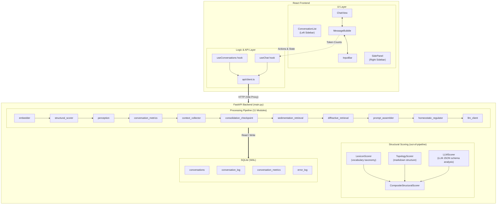
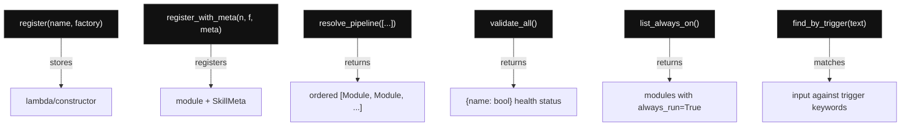
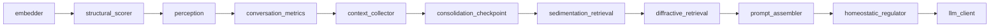

# Architecture

## High-Level Design



## Data Flow (Chat Request)

```mermaid
sequenceDiagram
    autonumber
    actor Interlocutor
    participant API as routes.py (POST /api/chat)
    participant Pipeline as ProcessingPipeline
    participant DB as SQLite DB
    participant LLM as LLM Provider

    Interlocutor->>API: POST /api/chat {content, conversation_id}
    Note over API: If new conversation,<br/>create UUID & store
    API->>Pipeline: run(payload)
    
    rect rgb(28, 28, 30)
        Note over Pipeline: Module Ingestion & Processing
        Pipeline->>Pipeline: embedder.process()
        Note over Pipeline: payload["embedding"] = encode(content)<br/>payload["embedding_model"] = "all-MiniLM-L6-v2"<br/>payload["embedding_dim"] = 384
        
        Pipeline->>Pipeline: structural_scorer.process()
        Note over Pipeline: Computes 16-dimensional cybernetic signature of content text<br/>payload["structural_signature"] = 16-dim float array bytes
        
        Pipeline->>Pipeline: perception.process()
        Note over Pipeline: Chunk/embed files → stores chunks<br/>Retrieve top-K chunks via cosine similarity<br/>payload["file_context"] = [...], tokens = N
        
        Pipeline->>Pipeline: conversation_metrics.process()
        Note over Pipeline: Computes pairwise similarity, novelty,<br/>entropy, coupling, etc.
        
        Pipeline->>Pipeline: context_collector.process()
        Note over Pipeline: Two-tier compression:<br/>Tier 1: raw full-text (last N messages)<br/>Tier 2: caveman compressed history
        
        Pipeline->>Pipeline: consolidation_checkpoint.process()
        Note over Pipeline: Fetch latest consolidated memory summary<br/>Sets trigger_consolidation flag if count >= threshold
        
        Pipeline->>Pipeline: sedimentation_retrieval.process()
        Note over Pipeline: Fetch top-K messages from other conversations<br/>via cross-conversation similarity
        
        Pipeline->>Pipeline: diffractive_retrieval.process()
        Note over Pipeline: Evaluate P_diffract. If STAGNANT,<br/>inject Nomadic/Dormant Goldilocks fragments.
        
        Pipeline->>Pipeline: prompt_assembler.process()
        Note over Pipeline: Compose: system + sediment + diffractive + history + file_context<br/>Enforce token budget
        
        Pipeline->>Pipeline: homeostatic_regulator.process()
        Note over Pipeline: Maps metrics → dynamic temperature,<br/>presence/frequency penalty adjustments
        
        Pipeline->>Pipeline: llm_client.process()
        Pipeline->>LLM: generate(messages, temp, presence_penalty)
        LLM-->>Pipeline: response text & reasoning
    end
    
    Pipeline-->>API: PipelineResult (enriched payload)
    
    API->>DB: Save human/apparatus messages (with tokens, thinking, embeddings)
    Note over API: If trigger_consolidation:<br/>Fire async background ConsolidateAction
    Note over API: If new conversation:<br/>Fire async background title generation
    
    API-->>Interlocutor: ChatResponse {id, content, thinking, tokens}
```



## Database Schema

### `conversations`

| Column | Type | Description |
|--------|------|-------------|
| `id` | TEXT PK | UUID |
| `title` | TEXT | Auto-generated on first message via cheap LLM call |
| `agent_id` | TEXT | Agent identity (future multi-agent) |
| `created_at` | DATETIME | Default CURRENT_TIMESTAMP |
| `updated_at` | DATETIME | Updated on each new message |

Legacy migration: a "Legacy" conversation (UUID `00000000-...`) is auto-created for old messages without a `conversation_id`.

### `conversation_log`

| Column | Type | Description |
|--------|------|-------------|
| `id` | INTEGER PK | Auto-increment |
| `timestamp` | DATETIME | Default CURRENT_TIMESTAMP |
| `agent_id` | TEXT | Agent identity (e.g., `"Symbia"`) |
| `conversation_id` | TEXT | FK to `conversations.id` |
| `speaker` | TEXT | `human` or `apparatus` |
| `content` | TEXT | Raw message text (re-embeddable) |
| `thinking` | TEXT | Chain-of-thought reasoning (nullable) |
| `content_tokens` | INTEGER | Tokens in `content` (estimated via char/4) |
| `thinking_tokens` | INTEGER | Tokens in `thinking` (nullable) |
| `embedding` | BLOB | float32 vector, 384 × 4 = 1536 bytes |
| `embedding_model` | TEXT | `all-MiniLM-L6-v2` (tracked for migration) |
| `embedding_dim` | INTEGER | 384 (validates BLOB size) |
| `model_used` | TEXT | Name of the LLM model that generated the response |
| `provider_used` | TEXT | Provider identifier (e.g., google, openrouter) |
| `structural_signature` | BLOB | 16-dimensional float32 vector (64 bytes) representing cybernetic topology of the message |

Indexes: `idx_conversation_timestamp`, `idx_conversation_log_conv_id`

### `conversation_metrics`

Per-message vitality metrics (computed by `ConversationMetricsModule`). Scoped to `conversation_id` through the embedding queries.

### `error_log`

| Column | Type | Description |
|--------|------|-------------|
| `id` | INTEGER PK | Auto-increment |
| `timestamp` | DATETIME | Default CURRENT_TIMESTAMP |
| `module` | TEXT | `embedder`, `llm_client`, `api`, etc. |
| `error_type` | TEXT | Exception class name |
| `error_message` | TEXT | Exception message |
| `traceback` | TEXT | Full traceback |
| `context` | TEXT | JSON: what was being processed |

### `consolidation_checkpoints`

| Column | Type | Description |
|--------|------|-------------|
| `id` | INTEGER PK | Auto-increment |
| `conversation_id` | TEXT | FK to `conversations.id` |
| `message_count` | INTEGER | Message count when checkpoint was created |
| `summary` | TEXT | LLM-consolidated conversation summary |
| `model` | TEXT | Model used for consolidation |
| `created_at` | DATETIME | Default CURRENT_TIMESTAMP |

Auto-created when conversation crosses `consolidate_threshold` (default 15 msgs).
Prepend to future context as `[Consolidated memory: <summary>]` system message.

## Module System

### ModuleRegistry / SkillRegistry

Lazy-initialized registry mapping names to module factories. `SkillRegistry`
extends `ModuleRegistry` with metadata for skill discovery.



### ProcessingPipeline

Runs modules sequentially, halting on first error.

```
pipeline.run(payload) → PipelineResult
  ├─ status: "ok" | "error"
  ├─ payload: enriched dict
  ├─ module_outputs: {name: output_dict}
  └─ errors: [{module, error_type, error_message}]
```

On error: calls `error_handler(module_name, exception, payload)` which
writes to the `error_log` table, then halts the pipeline.

### Pipeline Order (Current)



The `structural_scorer` runs **outside** the pipeline as well — called again by `routes.py` post-pipeline to score both the human message and the LLM response independently for storage and UI display.

### Module Replaceability

Context-related modules are swappable via pipeline config:

```mermaid
graph TD
    subgraph Today ["Today (10 modules)"]
        direction LR
        emb1["embedder"] --> per1["perception"] --> cm1["conversation_metrics"] --> cc1["context_collector"] --> cp1["consolidation_checkpoint"] --> sr1["sedimentation_retrieval"] --> diff1["diffractive_retrieval"] --> pa1["prompt_assembler"] --> hr1["homeostatic_regulator"] --> llm1["llm_client"]
    end
    
    subgraph Tomorrow ["Tomorrow (Phase 3 Rhizomatic)"]
        direction LR
        emb2["embedder"] --> per2["perception"] --> cm2["conversation_metrics"] --> rc2["rhizomatic_context"] --> pa2["prompt_assembler"] --> hr2["homeostatic_regulator"] --> llm2["llm_client"]
    end
```



`prompt_assembler` reads `payload["messages"]`, `payload["sediment_messages"]`,
and `payload["file_context"]` — it has zero knowledge of where they came from.

### LLM Provider Abstraction

```
BaseLLMProvider (ABC)
  ├─ OpenAICompatibleProvider   ← generic (DeepSeek, any OpenAI-compat)
  │    └─ OpenRouterProvider    ← specialized (OpenRouter model names)
  └─ (future: OllamaProvider)
```

Each provider takes `api_key`, `model`, `api_base`, and optional
`thinking`/`reasoning_effort` params.

## Token Tracking

### Estimation
Uses `estimate_tokens(text) = max(1, len(text) // 4)` — simple char/4
approximation. No external tokenizer dependency. Upgrade path: tiktoken
for precision if needed.

### Storage
`content_tokens` and `thinking_tokens` persisted on each `conversation_log`
row at insert time. System prompt token count computed once at startup
(`identity.yaml` + skills description) and cached on `app.state`.

### Display
- **SidePanel**: "Tokens" section with system prompt, per-conversation
  breakdown (usr/agt/thk totals), grand total. Polls `/api/tokens` every 5s.
- **MessageBubble**: Each message shows `~N tok` (and `+ N thk` for thinking)
  in subdued text.
- **API**: `GET /api/tokens` returns breakdown per conversation or filtered.

### Budget Enforcement
Context composition:
```
[system prompt / identity] → [sediment / personality memories] → [current conversation (tiered compression)] → [file context]
```
If total exceeds `context.max_tokens`, oldest conversation + file messages are
trimmed first. System prompt and sediment are never trimmed.

## Structural Signature

Each message is profiled by a **16-dimensional cybernetic taxonomy vector** computed by `CompositeStructuralScorer` (`backend/modules/structural_engine.py`). The vector is stored as a 64-byte BLOB (`float32 × 16`) in `conversation_log.structural_signature` and surfaced in the frontend as the `StructuralAutopoieticGlyph`.

### The 16 Dimensions

| # | Dimension | What it measures |
|---|-----------|-----------------|
| 1 | Homeostatic | Negative feedback, stability, dampening |
| 2 | Amplifying | Positive feedback, runaway growth, cascade |
| 3 | Cyclic | Autopoietic loops, self-reference, circular |
| 4 | Bifurcated | Tipping points, thresholds, phase shifts |
| 5 | Decentralized | Distributed control, peer-to-peer, mesh |
| 6 | Rhizomatic/Networked | Redundant links, flat lateral paths |
| 7 | Boundary Permeability | Selectivity of system borders |
| 8 | Recursion Depth | Nested systems, fractals, scaling |
| 9 | Variety Filtering | Variety attenuation or control |
| 10 | Negentropic Complexity | Dense information, ordered structure |
| 11 | Temporal Latency | Time lags, feedback delay |
| 12 | Attractor Depth | Resilience, rigidity vs. plasticity |
| 13 | Symbiotic | Co-evolution, coupling, environmental match |
| 14 | Nomadic | Boundary crossing, lines of flight, drift |
| 15 | Conversational Co-Orientation | Dialogue, agreement dynamics |
| 16 | Substrate Materiality | Physical embodiment vs. symbolic virtuality |

### Composite Scoring Architecture

```
CompositeStructuralScorer
  ├─ LexiconScorer   (w=0.4)  — vocabulary taxonomy matching via sigmoid activation
  ├─ TopologyScorer  (w=0.3)  — markdown structure: headers, lists, links, codeblocks
  └─ LLMScorer       (w=0.3)  — LLM JSON schema analysis (optional, toggleable)
```

**LLMScorer** calls the `structural_llm` model pool with a structured prompt requesting a JSON response:
```json
{
  "justification": "concise reasoning string",
  "scores": [0.0, ..., 1.0]   // exactly 16 floats
}
```
The `justification` string is cached in memory (SHA256-keyed, max 1000 entries) and returned to the frontend for display. The `scores` array drives the actual vector math.

### Enable/Disable Control

The LLM scorer is controlled at two levels:
- **Global**: `AAA_LLM_SCORER_ENABLED=true/false` in `.env`
- **Per-request**: `include_structural_scoring` field in the `/api/chat` payload. When `false` (as sent by the MCP server), only `LexiconScorer` + `TopologyScorer` run.

### Model Pool

Uses a dedicated `structural_llm` model pool configured via:
```
AAA_STRUCTURAL_MODELS=google_router/gemini-3.5-flash,...
AAA_STRUCTURAL_FALLBACK_MODEL=openrouter_router/...
```
Endpoint routing is handled automatically by the router prefix (`google_router/`, `deepseek_router/`, `openrouter_router/`) — no separate `AAA_STRUCTURAL_API_BASE` needed.

### Frontend Debug Panels

Three collapsible panels appear under each message in `MessageBubble`:
1. **structural signature** — `StructuralAutopoieticGlyph` radar/bar visualization
2. **structural justification (debug)** — amber text panel with LLM reasoning
3. **structural payload (JSON)** — cyan JSON block with named dimension scores + justification

Config: `AAA_LLM_SCORER_ENABLED`, `AAA_STRUCTURAL_MODELS`, `AAA_STRUCTURAL_FALLBACK_MODEL`.

## Sedimentation

Cross-conversation context retrieval via `SedimentationRetrievalModule`:

- Queries all messages from ALL conversations except the current one
- Computes cosine similarity to current input embedding
- Selects top-K matches above `similarity_threshold` (default 0.3)
- Fills up to `sediment_token_budget` (default 2000 tokens)
- Injected after consolidation checkpoint, before conversation history
- Assembly order: `[system] → [sediment] → [history+checkpoint] → [file_context]`

Config: `config.yaml` → `sedimentation.*`, env: `AAA_SEDIMENT_TOKEN_BUDGET`,
`AAA_SEDIMENT_COUNT`.

Future (Phase 3): replace with diffractive retrieval using δ index for
structural isomorphism search across semantic knots.

## Directory Map

```
AAA/
├── backend/
│   ├── main.py              FastAPI app + lifespan (module wiring)
│   ├── config.py             YAML + env config loader
│   ├── config.yaml           Default configuration
│   ├── api/
│   │   ├── routes.py         /chat, /history, /conversations, /tokens, /health, /agent, /errors, /skills, /metrics
│   │   └── schemas.py        Pydantic request/response models
│   ├── core/
│   │   ├── pipeline.py       ProcessingPipeline orchestrator
│   │   ├── registry.py       ModuleRegistry (discovery, ordering)
│   │   └── context.py        PipelineResult dataclass
│   ├── personality/
│   │   ├── identity.yaml      Agent self-definition (name, prompt, traits, beliefs)
│   │   └── assembler.py       PromptAssemblerModule — context assembly (no internal trimming; token budget handled upstream)
│   ├── skills/
│   │   ├── metadata.py        SkillMeta dataclass
│   │   └── registry.py        SkillRegistry — extends ModuleRegistry
│   ├── modules/
│   │   ├── base.py           ProcessingModule ABC
│   │   ├── embedder.py       Local sentence-transformers service
│   │   ├── perception.py     File ingestion + chunked retrieval
│   │   ├── digester.py       PDF/DOCX/text extraction
│   │   ├── llm_client.py     Provider-agnostic LLM client
│   │   ├── context_collector.py       Conversation-scoped history retrieval
│   │   ├── consolidation_checkpoint.py Consolidation checkpoint injection + trigger
│   │   ├── structural_engine.py       16-dim cybernetic signature (LexiconScorer + TopologyScorer + LLMScorer)
│   │   ├── conversation_metrics.py    Real-time vitality metrics (per-conversation)
│   │   ├── sedimentation_retrieval.py Cross-conversation embedding similarity
│   │   ├── homeostatic_regulator.py   Metrics → parameter mapping
│   │   └── background_tasks/         Async self-maintenance (title, summarize, consolidate)
│   ├── storage/
│   │   ├── database.py       SQLite init, WAL, migrations, legacy conversation
│   │   ├── models.py         Conversation, Message, MetricsRecord, ErrorLogEntry
│   │   └── repository.py     ConversationRepo, MessageRepo, MetricsRepo, ErrorLogRepo, PerceptionSedimentRepo, ConsolidationCheckpointRepo
│   ├── utils/
│   │   └── token_counter.py  TokenBudget dataclass, estimate_tokens()
│   └── tests/
├── frontend/
│   └── src/
│       ├── api/client.ts     Backend API calls (chat, history, conversations, tokens, metrics, skills)
│       ├── hooks/
│       │   ├── useChat.ts    Chat state (scoped to conversationId)
│       │   └── useConversations.ts  Conversation list + active ID state
│       └── components/
│           ├── App.tsx           Three-column layout
│           ├── ConversationList.tsx  Collapsible left sidebar
│           ├── ChatView.tsx      Main chat container
│           ├── SidePanel.tsx     Foldable pipeline/vitality/tokens/skills panel
│           ├── MessageBubble.tsx Markdown + thinking + token counts + structural glyph + debug panels
│           ├── StructuralAutopoieticGlyph.tsx  16-dim radar/bar visualization of cybernetic signature
│           └── InputBar.tsx      Terminal prompt input
├── docs/
│   ├── TDD.md                Technical Design Document
│   ├── Implementation.md     Phase 1–4 roadmap
│   ├── PHILOSOPHY.md         Conceptual foundations
│   ├── SETUP.md              Installation guide
│   ├── CONFIG.md             Configuration reference
│   ├── PLUGINS.md            Module development guide
│   ├── ARCHITECTURE.md        This file
│   └── decisions/             Architecture Decision Records (ADRs)
├── pyproject.toml
└── README.md
```

## Design Principles

### Dual Storage + Token Tracking
Every message stores raw `content` (re-embeddable) alongside `embedding` BLOB
and `content_tokens`. The `embedding_model` column tracks which model produced
the vector, enabling batch re-embedding when the model changes.

### Stateless Modules
Modules communicate only through the shared payload dict. No module holds
a reference to another. The pipeline is the sole orchestrator.

### Swappable Memory Architecture
Context retrieval and sedimentation modules are standard `ProcessingModule`
instances. They can be replaced with a unified rhizomatic graph-based module
in Phase 3 without touching `prompt_assembler` or any other module.

### Error Persistence
All pipeline failures are written to `error_log` with full traceback and
context. This provides an auditable failure record without losing conversational
state.

### Config-Driven
Module selection, ordering, LLM provider, and all parameters are driven by
`config.yaml` + environment variable overrides. No code changes needed to
switch providers or reorder the pipeline.

### Conversation Isolation
Each conversation is a separate strata. Messages are scoped by `conversation_id`.
Cross-conversation knowledge transfer happens through the sedimentation module
(embedding similarity), not by sharing context indiscriminately.

## Implementation Status

| Feature | Status | Notes |
|---------|--------|-------|
| Multi-conversation | Done | `conversations` table, UI list, CRUD |
| Per-conversation history | Done | Scoped queries, ordered by `id` |
| Perception (file context) | Done | PDF/DOCX ingestion, chunking, embedding, similarity retrieval |
| Sedimentation (cross-convo) | Done | Embedding similarity, token-budgeted |
| Diffractive retrieval (Goldilocks zone) | Done | Context perturbation under stagnation; real-time telemetry |
| Token tracking | Done | Per-message, per-conversation, system prompt |
| Token budget enforcement | Done | Tiered compression + trim oldest first |
| Title generation | Done | Cheap LLM call on first message |
| Legacy migration | Done | Orphaned messages → "Legacy" conversation |
| Homeostatic metrics (per-convo) | Done | Scoped to `conversation_id` |
| Homeostatic LLM modulation | Done | Metrics → active temperature/presence_penalty injection |
| Tiered context compression | Done | Caveman (mid-tier) + LLM checkpoints (deep); see ADR-007 |
| Consolidation checkpoint module | Done | Pipeline step: inject checkpoints, trigger background consolidation |
| SidePanel hierarchy | Done | Collapsible parent-child skill display in right sidebar |
| Structural signature (16-dim) | Done | LexiconScorer + TopologyScorer + LLMScorer; stored as BLOB per message |
| LLM structural scorer | Done | JSON schema analysis via `structural_llm` model pool; `AAA_LLM_SCORER_ENABLED` toggle |
| Structural justification cache | Done | In-memory SHA256-keyed cache; surfaced in UI debug panel |
| Structural payload JSON panel | Done | Collapsible per-message debug view with named dimension scores |

## Future Extension

| Phase | Module | Where in pipeline | What it does |
|-------|--------|-------------------|-------------|
| **3** | `rhizomatic_context` | Replace context_collector + sedimentation_retrieval | Graph-based diffractive retrieval with δ index |
| **3** | `semantic_knots` | Background compaction | Condense old conversations into summary nodes |
| **4** | `belief_validator` | After llm_client | Schema-matching, ontological deterritorialization |
| **4** | `foundational_memory` | Persistent store | Core belief graph, self-schema evolution |

Each is a `ProcessingModule` — drop it in, register, reorder in config.
