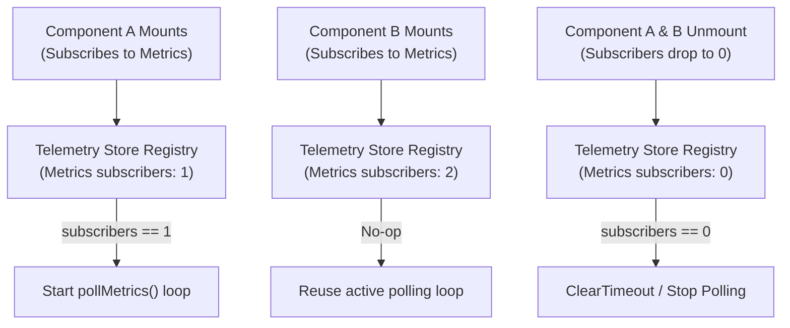

# Frontend Performance & Architectural Best Practices
**System:** Autopoietic Agentic Assemblage (AAA)  
**Classification:** Engineering Standard & Best Practices Guide

---

To prevent layout thrashing, cascading re-renders, and server resource waste as the interactive workspace scales, the AAA frontend follows strict optimization, state management, and component architecture guidelines.

---

## 1. State Management: Vanilla Pub-Sub Stores
Root-level React Context Providers force full-tree re-renders of all children when the provider's value changes. To avoid this, AAA utilizes **vanilla JavaScript pub-sub stores** linked to React components via React 19's `useSyncExternalStore` hook.

### Guidelines
*   **Decoupled Re-renders**: Keep high-frequency state (background notifications, polling telemetry, active task queues) inside pure JS stores (e.g. `notificationStore.ts`, `telemetryStore.ts`).
*   **Granular Subscriptions**: Only components that explicitly consume a state slice should subscribe to it. The rest of the page layout (inputs, navigation lists) remains completely untouched by updates.
*   **Modular hooks**: Wrap `useSyncExternalStore` in custom hooks (e.g., `useTelemetryMetrics`, `useNotifications`) to encapsulate subscription setups and state mapping logic.

---

## 2. Resource Conservation: Subscriber-Driven Polling
To avoid hammering the backend with redundant requests and running background loops for collapsed or invisible components, the telemetry system leverages **listener-based reference counting**.



### Guidelines
*   **Lazy Polling Initialization**: Telemetry categories (`/metrics`, `/beliefs`, `/tokens`, `/daemon`, `/scheduler`) must not run polling timers by default. The timer is initialized **only** when the first listener subscribes.
*   **Automatic Teardown**: When a component unmounts (or its section is collapsed, turning the `enabled` prop to `false`), it must unsubscribe. When the subscription count for a category hits `0`, the store must clear the active `setTimeout` immediately.
*   **Trigger-based Instants**: Telemetry requests should support manual or event-driven triggers (e.g., updating `messageCount` trigger parameter) to cancel the pending polling delay and query the backend immediately upon new message arrival.

---

## 3. Render Optimization: Memoization & Stable References
Because React determines updates via shallow reference comparisons, passing inline arrays, objects, or functions to child components will invalidate memoization.

### Guidelines
*   **React.memo for Leaf Components**: Wrap expensive or highly-nested components (e.g., `<MessageBubble />`, `<StructuralAutopoieticGlyph />`, `<ConnectionCloud />`, and all collapsible `<SidePanel>` sections) in `React.memo`.
*   **Avoid Inline Constants**: Declare empty fallback arrays or objects as static constants outside the render loop to maintain reference equality across updates.
    ```typescript
    // DO NOT DO THIS inside rendering loops:
    const notes = message.notes || []; // Generates a new array reference on every render
    
    // DO THIS:
    const EMPTY_ARRAY: any[] = [];
    // ... inside component:
    const notes = message.notes || EMPTY_ARRAY;
    ```
*   **Custom Comparison Functions**: For components receiving complex prop shapes (like lists of sibling message IDs or diff charts), provide a custom comparison function to `React.memo` to compare contents instead of top-level references.
*   **UseMemo for Structural Transformations**: Pre-compute tree relationships, sibling index maps, and grouped objects in the parent view using `useMemo` so child nodes only receive lightweight, stable primitive props.

---

## 4. Lazy Loading & Deferred Loading
Not all user sessions require loading all parts of the application. Deferring queries until they are visible reduces initial load times and client-side database locking.

### Guidelines
*   **Collapsible Section Triggers**: Pass `enabled` (e.g. `!panelCollapsed && sectionOpen`) parameters down to hooks. Polling, subscriptions, and DOM initialization must remain completely idle when the section is collapsed.
*   **Paginated Timeline Feeds**: Load conversation logs in chunks (e.g. `PAGE_SIZE = 50`) using virtual scrolling or a "load more" scrolling trigger rather than querying the entire historic tree at once.
*   **On-Demand Sub-resources**: Do not load metadata summaries, note annotations, or skill indexes globally. Query these details on-demand when the specific node, bubble, or accordion is expanded.

---

## 5. URL State Synchronization (Resilient Routing)
Refreshing the page or sharing a link should never reset the workspace layout.

### Guidelines
*   **URL Query Synchronization**: Sync key layout states (the active conversation ID `?c=`, message active node `?m=`) with query parameters.
*   **History API Integration**: Use `window.history.pushState` on selection changes to preserve history trail, and listen to `popstate` events to handle standard browser Back/Forward navigation smoothly.
