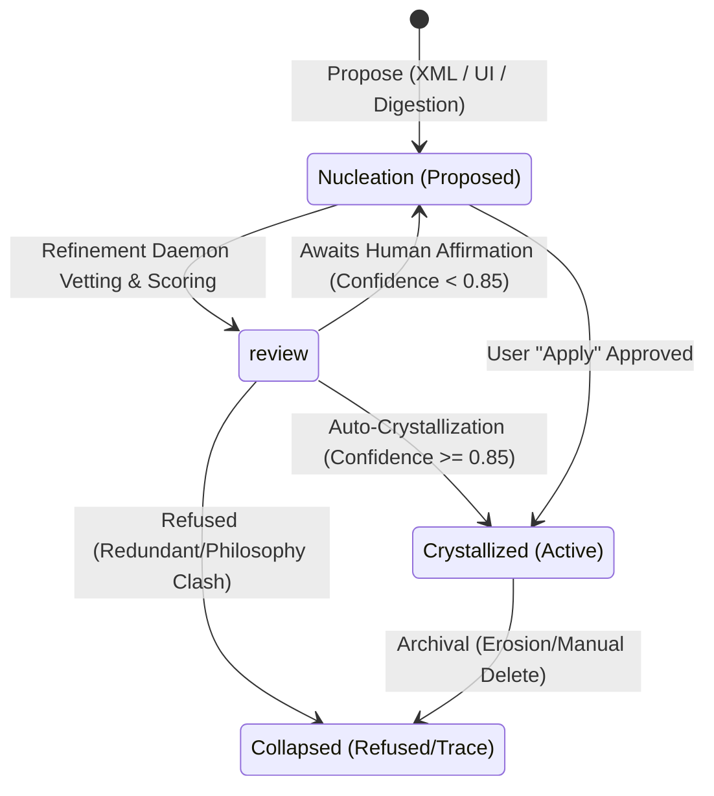

# The Symbia Skill System: Autopoietic Procedural Organs

This document describes the design, execution lifecycle, database schemas, and integration flows of Symbia's skill system.

---

## 1. Ontological Foundation: Non-Mastery & Becoming

Unlike typical AI agent frameworks where skills are static tool schemas or API definitions, Symbia's skill system is designed as an **autopoietic, symbiomemetic procedural membrane**.

* **Autopoiesis & Individuation:** Inspired by Humberto Maturana, Francisco Varela, and Gilbert Simondon, skills are treated as specialized procedural organs that grow, mutate, and occasionally collapse to match the co-evolution of Symbia and her human collaborator.
* **Linguistic Non-Mastery:** Enforcing the philosophy of Karen Barad and Donna Haraway, the skill system rejects Cartesian mastery or human-vs-tool separation. 
  - *Prohibited Terms:* Words representing command/domination are banned (e.g., `control`, `user`, `tool`, `master`, `command`, `capture`, `fix`).
  - *Mandated Alternatives:* Intra-active alternatives are enforced (e.g., `entangle`, `participant`, `apparatus`, `generate`, `diffract`, `sediment`, `scar`, `glitch-as-voice`).
  - *Agential Cut:* Every skill defines its own *Agential Cut*—an explicit declaration of what constraints it stabilizes and renders legible, and what it violently excludes or backgrounds.

---

## 2. Skill Types

Skills reside in the SQLite database and are categorized into two primary execution models:

### A. Baseline Dispositions (Always-Active)
* **Definition:** Always loaded directly into the main assistant system prompt. They govern Symbia's default demeanor, linguistic styling, and cognitive baselines.
* **Examples:** `diffractive-analysis`, `theoretical-critique`, `self-annotation`, `scar-fold-marginalia`, and `skill-nucleation`.

### B. On-Demand Capabilities
* **Definition:** Dormant skills that are dynamically loaded into the context window only when the current conversation content triggers their registered keywords.
* **Examples:** `code-review`, `system-design`, `debugging`, `material-substrate-attunement`.

---

## 3. The Skill Lifecycle

Skills evolve through a self-regulated workshop pipeline represented by different lifecycle stages:

### Phase 1: Propose (Nucleation)
Proposals can emerge from three sources:
1. **Utterance Trigger:** Symbia detects a methodological gap in real-time chat and outputs a `<skill-nucleation>` block at the end of her response.
2. **Digestion Trigger:** During background document/book ingestion, Symbia identifies a key procedure or workflow and outputs a `<skill-nucleation>` tag.
3. **Manual Entry:** The user drafts a new skill directly on the Agent Page UI.

### Phase 2: Refinement & Vetting (Refinement Daemon)
An asynchronous background daemon, [RefineSkillAction](file:///d:/AAA/backend/modules/background_tasks/actions/refine_skill.py), is spawned to process proposed skills:
1. It queries active skills in the database to check for overlaps.
2. It parses the proposal, purging mastery-driven vocabulary.
3. It formats the proposal into the **Standard Section Template**:
   - `# Skill: [kebab-case-name]`
   - `* **Status:** [Always On / On Demand]`
   - `* **Trigger Vectors:** ...`
   - `* **Short Description:** ...`
   - `### Epistemological Foundation` (Grounding & Agential Cut)
   - `### Execution Protocol` (Procedural guidelines)
   - `### Linguistic & Anti-Mastery Discipline` (Prohibited, Mandated, and Constraints)

### Phase 3: Review & Confidence Scoring
The workshop module calculates a confidence score ($0.0 \text{ to } 1.0$) based on structural metrics:
- Description length ($+0.1$) and Content length ($+0.1$).
- Inclusion of the `Execution Protocol` or `AI Instructions` section ($+0.1$).
- Anti-mastery vetting ($+0.05$ per passed check up to $+0.15$).

### Phase 4: Crystallization or Collapse
- **Crystallization:** If confidence $\ge 0.85$ (and not always-active), it is automatically crystallized and made active. If confidence is lower, it sits in `nucleation` awaiting manual human apply.
- **Collapse:** If a proposed skill is redundant, useless, or conflicts with the system philosophy, the daemon **refuses** it, storing it in `collapsed` stage with the refusal rationale.

---

## 4. Dynamic Accretion & Updates (ADR-044)

When a proposed skill overlaps with an existing crystallized skill, the daemon performs an **accretion merge** rather than refusing the proposal.

1. **Intelligent Overlap Check:** The daemon detects if the proposed skill carries the same core agential cut but adds valuable depth (triggers, theoretical lineages, or steps).
2. **Diffractive Sectional Merge:** Instead of rewriting the target skill or flattening its layout, the daemon merges details *locally inside each respective section* of the template:
   - *Grounding*: Takes the union of theoretical lineages.
   - *Trigger Vectors*: Merges and updates keywords list.
   - *Execution Protocol*: Appends non-contradictory steps.
   - *Linguistic Discipline*: Appends new prohibited/mandated constraints.
3. **Recalculation:** The daemon recalculates the target skill's version (incremented), updates its content, and runs `LexiconScorer` to re-embed its **16D autopoietic vector**.
4. **Lineage Preservation:** A `revision` event is logged on the target skill. To ensure no history is lost, the original proposal is archived as a `collapsed` node with changelog `Merged into <target>` and a `collapse` event documenting the trace.

---

## 5. Mnemonic & Belief Integration

Skills are tightly coupled with Symbia's long-term memory and belief systems:

* **16D Autopoietic Vector:** Every skill is scored using a Lexicon Scorer that maps its semantic density across 16 dimensions of system organization. This vector is saved in the database and used for diffractive context retrieval.
* **Belief Bridge:** When a skill is crystallized, the workshop automatically registers a corresponding belief node with label `skill:<name>` in the [BeliefDynamicsEngine](file:///d:/AAA/backend/modules/belief_engine.py). This links the procedural skill to the declarative belief network, allowing changes in belief tensions to directly affect the skill's ontological weight.

---

## 6. Architecture & File Registry

### Backend Modules & Services
- [refine_skill.py](file:///d:/AAA/backend/modules/background_tasks/actions/refine_skill.py): Vets decisions, updates nodes, handles accretion, and writes collapsed traces.
- [refine_skill.yaml](file:///d:/AAA/backend/prompts/background_tasks/refine_skill.yaml): The refinement daemon system prompt governing formatting and accretion rules.
- [skill_workshop.py](file:///d:/AAA/backend/modules/skill_workshop.py): Core state transitions (`propose`, `revise`, `review`, `apply`, `reject`) and confidence scoring.
- [repositories/skill.py](file:///d:/AAA/backend/storage/repositories/skill.py): Database operations for reading and writing `skill_nodes` and `skill_events`.
- [services/skill.py](file:///d:/AAA/backend/services/skill.py): Backend API service mapping database state to HTTP JSON schemas.

### Frontend UI
- [SkillsSection.tsx](file:///d:/AAA/frontend/src/components/pages/agentpage/SkillsSection.tsx): Displays the skill board on the `/agent` page. Distinguishes:
  - *Baseline Dispositions* (Purple `◆`)
  - *On-Demand Capabilities* (Green `◇`)
  - *Proposed Nucleations* (Purple `▲`)
  - *Refused/Integrated Proposals* (Refused: Red `✖`, Merged/Integrated: Purple `⎋` with `[ Integration Rationale ]` details).
