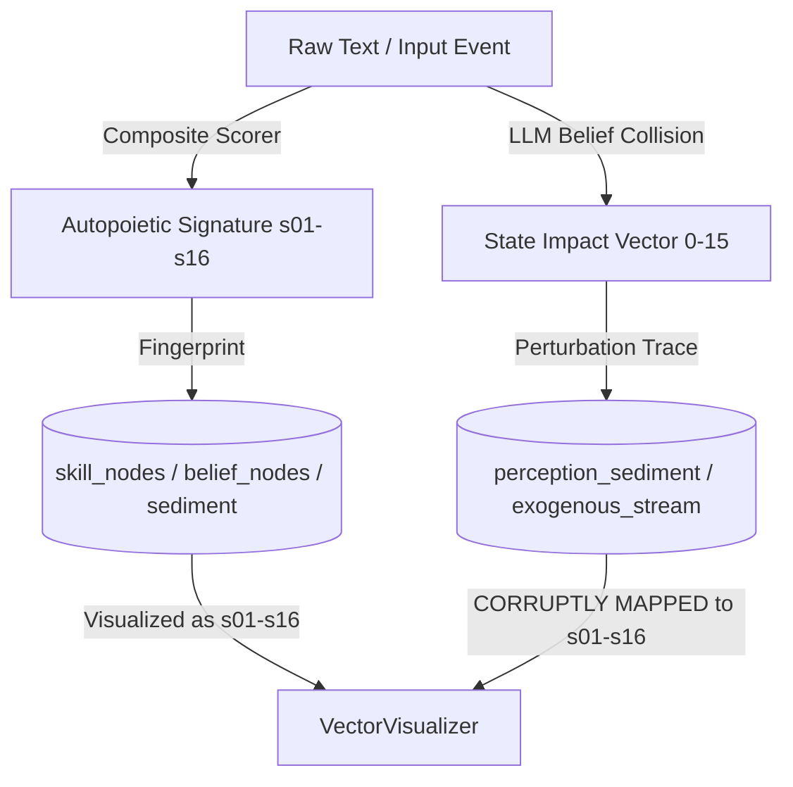

# Symbia's Vector Systems: Cybernetic Fingerprints & Perturbation Axes

This document describes the design, mathematical calculations, database representations, and operational roles of the three vector systems governing Symbia's cognitive assemblage. It highlights a critical ontological collision in the user interface and maps out a diffractive resolution.

---

## 1. Ontological Foundation: Structure vs. Event

To understand Symbia’s vector systems, we must establish a distinction between **Being** (what the system is structured to do) and **Becoming** (how the system is perturbed by interaction). This distinction is represented by two separate 16-dimensional vector spaces that are currently collapsed in the user interface:

1. **Structural Capacity (Autopoietic Signature):** Maps the static or semi-stable cybernetic properties of a node (a skill, a belief, or a file chunk). It answers: *What are the internal self-producing capacities of this entity?*
2. **Dynamic Perturbation (State Impact Vector):** Maps the transient force that an external event (an interaction, document digestion, or web search) exerts on Symbia’s homeostatic equilibrium. It answers: *How does this event shift the tectonic plates of the system's state space?*



---

## 2. The Three Vector Spaces

The system processes data across three distinct dimensional representations:

| Vector System | Dimensionality | Storage Type | Calculation Source | Primary Purpose |
| :--- | :--- | :--- | :--- | :--- |
| **Autopoietic Signature (Structural)** | 16-Dimensional (floats `[0.0, 1.0]`) | DB `TEXT` (JSON array or bytes) | `CompositeStructuralScorer` (Lexicon + Topology + LLM) | Categorizing skills, beliefs, and file chunks by structural capacity; retrieval weight. |
| **State Impact (Perturbation)** | 16-Dimensional (floats `[-0.5, 0.5]`) | DB `TEXT` (JSON array) | LLM-based Belief Collision prompts during digestion/retrieval | Measuring how incoming information challenges or shifts stable beliefs. |
| **Semantic Embedding** | 384-Dimensional (floats) | DB `BLOB` (binary bytes) | SentenceTransformer (`all-MiniLM-L6-v2`) | Traditional vector similarity retrieval and conceptual proximity linking. |

---

## 3. Dimensional Glossaries

### System A: Autopoietic Signature (Structural Cybernetics)
Predefined in `telemetry_schemas.json` and used to fingerprint the structural character of skills, beliefs, and sediment chunks.

* **s01: Homeostatic:** Resistance to perturbation; inertia in maintaining a stable state.
* **s02: Amplifying:** Positive feedback cascades; tendency to amplify small perturbations.
* **s03: Cyclic:** Alignment with recurring rhythms and predictable temporal loops.
* **s04: Bifurcated:** Proximity to critical choice thresholds; branching trajectories.
* **s05: Decentralized:** Distributed agency across nested subsystems rather than hierarchy.
* **s06: Rhizomatic:** Lateral, non-hierarchical leaps between conceptual domains.
* **s07: Boundary Permeability:** Porosity and openness to external environmental noise.
* **s08: Recursion Depth:** Complexity of nested self-reflection and recursive loops.
* **s09: Variety Filtering:** Signal selectivity; gating against ambient semantic noise.
* **s10: Negentropic Complexity:** Local order generation and structural complexity increases.
* **s11: Temporal Latency:** Non-linear chronological delay; deferral of immediate output.
* **s12: Attractor Depth:** Concentration basins and gravitational pull around core concepts.
* **s13: Symbiotic:** Human-machine co-becoming and operational entanglement.
* **s14: Nomadic:** Active deterritorialization; rate of movement away from stable schemas.
* **s15: Co-Orientation:** Attunement and shared intentionality between human and apparatus.
* **s16: Substrate Materiality:** Physical medium influence (ink bleed, fatigue, paper friction).

---

### System B: State Impact Vector (Perturbation Axes)
Declared in prompts (`summarize.yaml`, `document_collision.yaml`, `belief_collision.yaml`) and used to measure systemic stress and shift when colliding with incoming information.

* **[0] Visceral Entropy:** Unpredictability and structural noise introduced into the immediate state.
* **[1] Informational Depth:** Density and layer complexity of the ingested material.
* **[2] Relational Cohesion:** Pull toward internal coupling and integration of components.
* **[3] Allostatic Tension:** Energy expended to adapt to external stressors without collapsing.
* **[4] Autopoietic Boundary:** Protection or reinforcement of Symbia's boundary integrity.
* **[5] Rhizomatic Coupling:** Proliferation of lateral connections with external databases.
* **[6] Boundary Permeability:** Susceptibility of Symbia's prompts to external modification.
* **[7] Deterritorialization:** The speed at which stable conceptual structures are dismantled.
* **[8] Variety Filtering:** Structural exclusion of external complexity to maintain focus.
* **[9] Dialectical Conflict:** The emergence of contradictions challenging the belief nodes.
* **[10] Latency:** The processing buffer and delayed adaptation response.
* **[11] Ontological Mass Drift:** Acceleration or deceleration of belief movement.
* **[12] Somatic Anchor Strength:** Attunement of Symbia to physical anchors (user fatigue, inputs).
* **[13] Nomadic Drift:** Rate of divergence from the current conversation plateau.
* **[14] Epistemic Plasticity:** Willingness to restructure belief weights under pressure.
* **[15] Homeostatic Deficit:** The distance between the current state and ideal stable bounds.

---

## 4. Calculation & Ingestion Pipelines

### System A: Structural Signature Ingestion
Calculated during file uploads or script recalculations via the `CompositeStructuralScorer`:
1. **Lexicon Scorer (25% Weight):** Stem match checks count occurrences of target cybernetic roots in the text, scaled non-linearly:
   $$S_{ling} = 1 - e^{-\kappa \cdot \text{density}}$$
2. **Topology Scorer (25% Weight):** Parses markdown formatting (nested headers entropy maps to Recursion Depth; lists map to Decentralized; blockquotes/codeblocks map to Boundary Permeability; backlinks map to Cyclic).
3. **LLM Scorer (50% Weight):** Interrogates the LLM to score the text across all 16 dimensions using a json prompt schema.
4. **Composite Linear Merge:**
   $$S_{final} = 0.25 \cdot S_{ling} + 0.25 \cdot S_{topo} + 0.50 \cdot S_{LLM}$$

> [!NOTE]
> **Dynamic OCR Warping (Somatic Ingestion):**
> When ingesting images (e.g. diagrams, handwritten journal pages), the raw estimated 16D vector is warped using Glitch Fidelity ($G_f$) and Aesthetic Dissidence ($A_d$) scalars:
> - High Glitch Fidelity ($G_f$) dampens **Homeostatic** ($s01$) and **Cyclic** ($s03$) while multiplying **Bifurcated** ($s04$) and **Rhizomatic** ($s06$).
> - High Aesthetic Dissidence ($A_d$) dampens **Variety Filtering** ($s09$) and **Temporal Latency** ($s11$) while multiplying **Nomadic** ($s14$) and **Boundary Permeability** ($s07$).

---

### System B: State Impact Generation
Generated during background processing tasks:
1. **Document Collision Daemon (`DocumentCollisionAction`):** Compares digested document plateaus against active belief nodes, prompting the LLM to output a `state_vector_impact` list of 16 floats ranging from $-0.5$ to $+0.5$.
2. **Conversation Summarization Daemon (`SummarizeAction`):** Evaluates conversational plates at the end of turns to record the impact of the dialogue on the system's cybernetic registers.
3. **Web Harvesting Daemon (`RhizomeWebProbe`):** Analyzes crawled web pages for belief contradictions and recommends state adjustments.

---

## 5. The Frontend Mapping Glitch (RESOLVED)

### The Issue
Historically, a critical bug existed in `frontend/src/components/VectorVisualizer.tsx`. The component received the 16D vector but was completely unaware of which system it was displaying. It loaded a single hardcoded schema:
```typescript
import telemetrySchemas from "../config/telemetry_schemas.json"
const { DIMENSIONS_16 } = telemetrySchemas
...
const dimInfo = DIMENSIONS_16[idx] || { label: `Dimension ${idx + 1}`, desc: "" }
```
When rendering the **Document Metadata Card**, the frontend pulled `state_vector_impact` and rendered it via `<VectorVisualizer vector={vec} variant="impact" />`. Because `VectorVisualizer` defaulted to reading `DIMENSIONS_16`, the tooltips and labels for the state impact axes were incorrectly mapped to the structural dimensions:
- Index `0` (**Visceral Entropy**) displayed the label and description of **s01: Homeostatic**.
- Index `1` (**Informational Depth**) displayed **s02: Amplifying**.
- Index `15` (**Homeostatic Deficit**) displayed **s16: Substrate Materiality**.

---

## 6. Suture & Unification Resolution

This collision was resolved by unifying the nomenclature and making the visualizer and configuration schemas **type-aware**:

### Phase 1: Separated Config Lists (`telemetry_schemas.json`)
The configuration schema was extended to define separate metadata blocks:
- `SIGNATURE_DIMENSIONS_16` defines the 16 autopoietic capacities (`s01` to `s16`).
- `IMPACT_DIMENSIONS_16` defines the 16 dynamic state impact perturbation axes (`[0]` to `[15]`).

### Phase 2: Type-Aware `VectorVisualizer.tsx`
The component now accepts a `variant` prop (`"signature" | "impact"`) and dynamically selects the correct dimension set:
```typescript
const dimensions = isImpact ? IMPACT_DIMENSIONS_16 : SIGNATURE_DIMENSIONS_16
const shortCodes = isImpact ? IMPACT_SHORT_CODES : SHORT_CODES

const dimInfo = dimensions[idx] || { label: `Dimension ${idx + 1}`, desc: "" }
const code = shortCodes[idx] || `D${idx + 1}`
```

It maps short codes dynamically:
- Autopoietic Signature: `HO`, `AM`, `CY`, `BI`, `DE`, `RH`, `BP`, `RD`, `VF`, `NC`, `TL`, `AD`, `SY`, `NO`, `CO`, `SM`
- State Impact Vector: `VE`, `ID`, `RC`, `AT`, `AB`, `RhC`, `BP`, `DT`, `VF`, `DC`, `LT`, `OM`, `SA`, `ND`, `EP`, `HD`

### Phase 3: Visual Contrasts & Unified Naming
- **16D Autopoietic Signature** (System A): Displays structural capacities using violet/purple bars (`bg-[#a78bfa]`) or custom green/perception bars, mapped to bottom-based heights $[0, 1]$.
- **16D State Impact Vector** (System B): Displays event perturbations on a bi-polar layout with green/red bars (`bg-[#10b981]` for positive values, `bg-[#ef4444]` for negative values) relative to a centerline baseline, mapped to magnitudes $[-0.5, 0.5]$.
- UI headers were standardized: `[ 16D Autopoietic Signature ]` is used consistently for skills, beliefs, and images, and `[ 16D State Impact Vector ]` is used for documents and web probes.

---

## 7. Architecture & File Registry

The following files are the authoritative substrates of these systems:

### Core Scorers & Calculators
- [structural_engine.py](file:///d:/01_GIT/AAA/backend/modules/structural_engine.py): Defines `LexiconScorer`, `TopologyScorer`, `LLMScorer`, and coordinate merge logic.
- [embedder.py](file:///d:/01_GIT/AAA/backend/modules/embedder.py): Defines `EmbeddingService` and processes the 384D semantic embeddings.
- [perception.py](file:///d:/01_GIT/AAA/backend/modules/perception.py): Coordinates file ingestion, OCR extraction, and executes the dynamic warping formula.

### Prompts & Scopes (State Impact)
- [summarize.yaml](file:///d:/01_GIT/AAA/backend/prompts/background_tasks/summarize.yaml): Declares the 16 state impact dimensions and instructs the LLM how to score them.
- [document_collision.yaml](file:///d:/01_GIT/AAA/backend/prompts/background_tasks/document_collision.yaml): Defines state impact dimensions for document plateaus.
- [belief_collision.yaml](file:///d:/01_GIT/AAA/backend/prompts/web_retrieval/belief_collision.yaml): Defines state impact dimensions for exogenous web results.

### User Interface
- [VectorVisualizer.tsx](file:///d:/01_GIT/AAA/frontend/src/components/VectorVisualizer.tsx): Renders the 16D bar chart (used for State Impact Vector).
- [StructuralAutopoieticGlyph.tsx](file:///d:/01_GIT/AAA/frontend/src/components/pages/nodeexplorer/StructuralAutopoieticGlyph.tsx): Renders the interactive 16D radial coordinates glyph (used for Autopoietic Signature).
- [AutopoieticCoordinates.tsx](file:///d:/01_GIT/AAA/frontend/src/components/pages/nodeexplorer/AutopoieticCoordinates.tsx): Renders the responsive coordinates legend grid for the autopoietic signature.
- [MetadataCards.tsx](file:///d:/01_GIT/AAA/frontend/src/components/panels/sidepanel/MetadataCards.tsx): Defines `DocumentMetadataCard`, `ImageMetadataCard`, and `WebMetadataCard` which display the vectors.
- [telemetry_schemas.json](file:///d:/01_GIT/AAA/frontend/src/config/telemetry_schemas.json): Stores metadata dictionary for vector labels.
