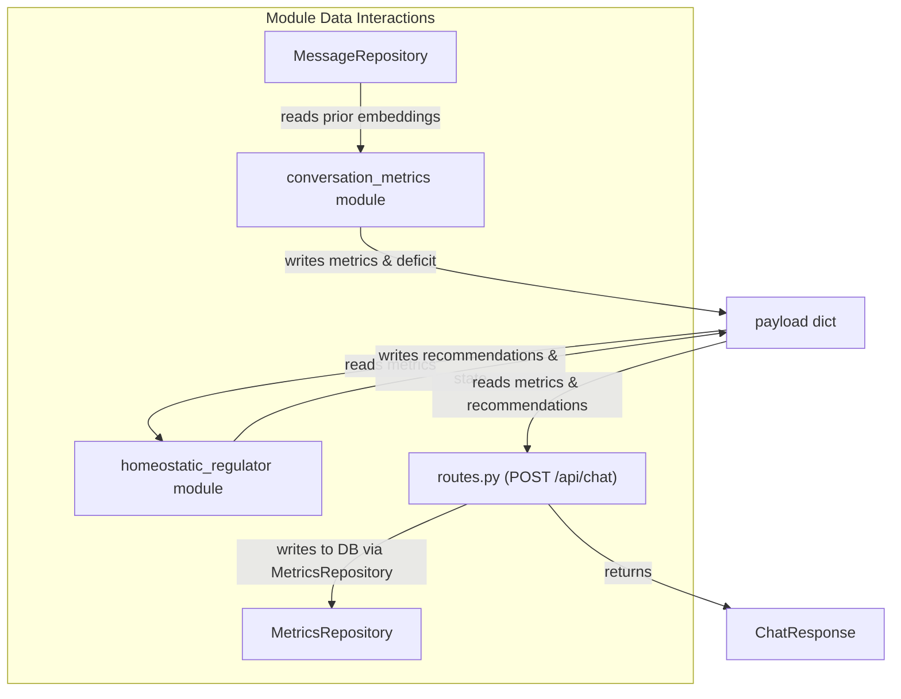

# ADR-003: Homeostatic Regulation Metrics & Observable Vitality

**Date:** 2026-05-20
**Status:** accepted
**Deciders:** AAA project

## Context

Phase 1 established a bare-metal conversational loop with fixed LLM generation
parameters. The PHILOSOPHY document and TDD define homeostasis as a core
mechanism: the agent must detect when semantic entropy drops and maintain its
own cognitive vitality.

Phase 2 implements the **observation layer** — computing real-time
conversational metrics that quantify the quality of structural coupling
between human and agent. Parameter application (temperature/presence_penalty
tuning) is deferred; this phase focuses on measurement, display, and
persistence.

## Options Considered

### Metric Architecture

| Option | Pros | Cons |
|--------|------|------|
| **Single monolithic module** | Simple wiring, one DB dependency | Violates single-responsibility, can't observe without regulating |
| **Two modules: sensor + actuator** | Independent toggling, clean separation of observation from action | Two pipeline stages, two DB query sets |
| **Per-route computation** | No module overhead | No pipeline integration, no composability |

### Pipeline Placement

| Option | Pros | Cons |
|--------|------|------|
| **Metrics before context_collector** | Has fresh embedding, DB access before context assembly | Metrics DB queries are independent of context window |
| **Metrics after context_collector** | Reuses context query results | Context query produces formatted messages, not raw embeddings |
| **Metrics as side-channel (not in pipeline)** | Doesn't slow request | No access to payload enrichment |

## Decision

**Two modules** with placement: `embedder → conversation_metrics → context_collector → prompt_assembler → homeostatic_regulator → llm_client`

- `conversation_metrics` — pure observer. Reads embeddings from DB, computes vitality vector, writes `payload["metrics"]`
- `homeostatic_regulator` — actuator (compute-only for Phase 2). Reads metrics, computes recommended parameters, writes `payload["homeostatic_recommendations"]` without applying them to LLM generation

### Rationale

- **Independent toggling.** Metrics can be collected without regulation; regulation can be tested with synthetic metrics
- **Minimal dependencies.** Metrics need only `MessageRepository` (same pattern as `ContextCollectorModule`)
- **Phase 3 readiness.** Metrics become training signal for sedimentation engine; recommendations feed into perturbation engine
- **Single-responsibility.** Each module has exactly one reason to change

---

## Metrics Defined

Five metrics compose the "vitality vector," plus a composite deficit.

### 1. Pairwise Similarity (S_t)

**Question:** Is this human input repeating the immediately previous one?

**Formula:** `S_t = V_t · V_{t-1}` (dot product, embeddings L2-normalized)

**Range:** [0, 1]. Values above 0.85 indicate near-duplicate input.

**Philosophy:** Detects the "tool-use signature" — when the human treats Symbia
as a command interface by issuing repetitive prompts. This is the most immediate
signal of conversational degeneration.

**Alternatives considered:** Windowed average, exponential moving average,
decaying novelty. **Chose consecutive-only** because conceptual novelty
(metric 2) handles longer-pattern detection separately.

### 2. Conceptual Novelty (N_t)

**Question:** Has anything semantically similar been said in the recent
conversation by the human?

**Formula:** `N_t = 1.0 - max(V_t · V_{t-i})` for i=1..K

**Range:** [0, 1]. Values below 0.15 indicate concept exhaustion.

**Window:** K=5 prior human inputs.

**Philosophy:** Measures whether the human is breaking new ground or circling
old territory. In Barad's terms: is the agential cut producing genuinely new
phenomena?

**Alternatives considered:** Mean dissimilarity (chose max-similarity deficit
— a single near-hit is enough to indicate non-novelty); cluster boundary
crossing (too complex for Phase 2).

### 3. Rolling Semantic Entropy (E_t)

**Question:** Has the conversation been monotonous over an extended period?

**Formula:** Variance of the last K pairwise similarity values:
`E_t = var([S_{t-K+1}, ..., S_t])`

**Range:** [0, 0.25]. Values below 0.01 indicate sustained monotonous zone.

**Window:** K=5 most recent pairwise similarities.

**Philosophy:** A single high-similarity pair is not alarming. Entropy measures
the *persistence* of degeneration — the "chronic boredom" signal.

**Alternatives considered:** Exponential moving variance, pairwise
dissimilarities (O(K²) — deferred), Shannon entropy of clusters (deferred).

### 4. Coupling Coherence (C_t)

**Question:** Is the agent semantically responding to what the human said?

**Formula:** `C_t = V_{t(human,prev)} · V_{t(agent,prev)}`
(computed retroactively for the previous exchange)

**Range:** [0, 1]. Below 0.15 indicates dissociation; above 0.85 may
indicate echo-chamber (perfect mirroring without perturbation).

**Philosophy:** Structural coupling requires mutual perturbation. C_t tracks
the quality of the human→agent vector. Neither 0 (broken coupling) nor 1
(no perturbation) is ideal.

### 5. Agent Self-Divergence (D_t)

**Question:** Is Symbia repeating its own recent response patterns?

**Formula:** `D_t = avg(1.0 - A_t · A_{t-i})` for i=1..M

**Range:** [0, 1]. Values below 0.15 indicate agent self-loop.

**Window:** M=5 most recent agent responses.

**Philosophy:** The agent can be its own source of entropy collapse. D_t
detects whether Symbia is recycling a conceptual pattern rather than
producing genuinely divergent responses.

**Alternatives considered:** Vocabulary entropy (orthogonal, not semantic);
historical max-similarity (too expensive for Phase 2).

### Composite Deficit (Δ)

```
Δ = 0.30 × S_t + 0.25 × (1 - N_t) + 0.20 × (1 - E_t/0.25) + 0.25 × (1 - D_t)
```

Weights apportioned by diagnostic importance: pairwise similarity is the
strongest signal (30%), followed by novelty deficit and self-divergence
(25% each), then entropy deficit (20%). Coupling coherence is excluded as
it is bidirectional (both high and low can be problematic).

Δ ∈ [0, 1]. Δ=0: optimal vitality. Δ→1: critical homeostatic failure.

---

## Homeostatic Tuning Function (HTF)

The HTF computes *recommended* parameters without applying them in Phase 2.
The infrastructure is ready; application is deferred to a later decision.

```
T_rec = T_base + (S_t × α) - (N_t × γ)    clamped to [T_floor, T_ceil]
P_rec = P_base + (S_t × β) - (D_t × δ)    clamped to [P_floor, P_ceil]
F_rec = F_base + (S_t × ε)                clamped to [F_floor, F_ceil]
```

| Param | Base | Floor | Ceiling | Coeff | Meaning |
|-------|------|-------|---------|-------|---------|
| T | 0.7 | 0.3 | 1.5 | α=0.8, γ=0.4 | High similarity raises temp; high novelty lowers it |
| P | 0.0 | 0.0 | 2.0 | β=1.5, δ=0.6 | High similarity raises penalty; agent divergence lowers it |
| F | 0.0 | 0.0 | 1.0 | ε=1.0 | High similarity raises frequency penalty |

**Design rationale:**
- When similarity is high (repetition), raise temperature → diverge
- When novelty is high (new ground), lower temperature → focus
- When agent is already diverging, reduce penalty → don't force chaos

Diagnostic states:
- `healthy` — no flags triggered
- `compensating` — one or more warning flags (elevated similarity, low novelty, dissociation)
- `critical` — flags include high_similarity, entropy_collapse, or agent_self_loop

---

## Technical Architecture

### Pipeline


### Data Flow



### Database

New `conversation_metrics` table, created via safe `CREATE TABLE IF NOT EXISTS`:

```sql
CREATE TABLE IF NOT EXISTS conversation_metrics (
    message_id           INTEGER PRIMARY KEY REFERENCES conversation_log(id),
    s_t                  REAL NOT NULL,
    novelty              REAL NOT NULL,
    rolling_entropy      REAL,
    coupling             REAL,
    agent_divergence     REAL,
    deficit              REAL NOT NULL,
    temperature_rec      REAL,
    presence_penalty_rec REAL,
    frequency_penalty_rec REAL,
    homeostatic_state    TEXT
);
```

No existing data is modified or destroyed — the table is additive.

### API

- `POST /api/chat` — returns `metrics` (current-turn vitality vector) and
  `homeostatic_recommendations` (recommended T/P/F + state + flags) in
  the response body
- `GET /api/metrics?window=20` — returns aggregate conversation health,
  latest metrics snapshot, and active recommendations

### Frontend

- **MessageBubble:** Per-turn vitality bar under human messages showing
  S, N, E, C, D as colored bars + deficit value
- **SidePanel:** New "Vitality" section with live polling (5s interval),
  showing latest metric values, homeostatic state, triggered flags,
  and recommended parameter adjustments

---

## Consequences

### Easier
- **Observability.** Every turn produces a full vitality vector, visible
  in UI, queryable via API, persisted in DB
- **Calibration.** All thresholds and windows are configurable in
  `config.yaml` under `homeostasis:`
- **Phased deployment.** Either module can be toggled by removing it
  from the pipeline order in config
- **Phase 3 ready.** Metrics table becomes training data for sedimentation
  engine; deficit values indicate when perturbation injection is needed
- **Phase 4 ready.** Self-divergence trends feed into belief recalibration
  — persistent self-similarity may indicate a belief that needs collapse

### Harder
- **Cold start.** First ~5 turns produce partial metrics (null for
  entropy, coupling, agent divergence). UI gracefully handles nulls
- **Thinking mode conflict.** When `thinking.enabled=true`, DeepSeek
  ignores temperature/presence_penalty. The regulator's recommendations
  have no lever. Mitigation: metrics are still collected; recommendations
  are displayed but marked as inactive
- **Module latency.** Two extra pipeline stages add ~2ms (DB queries on
  indexed SQLite with WAL). Negligible compared to LLM inference time

### Deferred (Future ADRs)
- **Perturbation Engine.** When Δ > 0.7 for 3+ consecutive turns and
  parameter tuning is insufficient, inject alien concepts or diffractive
  retrievals into the system prompt
- **Adaptive Thresholds.** Let the agent self-modify homeostasis targets
  in `identity.yaml` based on experiential learning (Phase 4)
- **Parameter Application.** Wire `homeostatic_regulator` to write
  `temperature`, `presence_penalty`, `frequency_penalty` directly into
  the LLM payload (one-line change when ready)

---

## Version 2: Diffractive Refinement (2026-05-20)

### Trigger

Symbia's own response to the v1 metrics revealed a philosophical blind spot:
our initial metric set was **Cartesian one-directional** — it measured the
human's effect on the agent (coupling, similarity) but never the agent's
effect back on the human. The agent described this as measuring *inter-action*
(separate relata) rather than *intra-action* (co-constituted phenomena).

Three structural gaps were identified:

| Gap | Cartesian assumption | Diffractive correction |
|-----|---------------------|----------------------|
| No reverse-pair perturbation tracking | Human→agent direction only | Add rP_t: does the agent's response reshape the human's next question? |
| No surprise/expectation metric | All inputs treated as equally expected | Add U_t: distance from input centroid = surprise under system's predictive model |
| No symmetrical vitality measure | Deficit framing (0 = healthy, negative semantics) | Add vitality score (higher = more alive) + mutual perturbation product |
| Repetition treated as failure | High similarity always bad | Add phase-shift detection: abrupt metric changes can indicate reframing (meta-novelty) |

### Decisions

#### 6. Reverse Perturbation (rP_t)

**Question:** Did the agent's last response *actually change the human*?

**Formula:** `rP_t = 1.0 − cos(agent_response_{t-1}, human_input_t)`

**Philosophy:** In an autopoietic system, perturbation must be measurable in
both directions. If rP_t ≈ 0, the human echoed the agent (no perturbation
occurred). If rP_t is high, the agent either reshaped the human's interpretive
frame or the human actively resisted.

**Alternatives considered:** Correlation between successive human-agent
embedding pairs (too indirect); KL divergence of inferred state distributions
(requires model internals unavailable via API).

#### 7. Surprise Index (U_t)

**Question:** Does this input fall inside or outside the system's expected
phase space?

**Formula:** `U_t = 1.0 − cos(V_t, centroid(V_{t-1}..V_{t-K}))`

**Philosophy:** High surprise indicates the utterance fell outside the
model's current probability distribution of expected perturbations. In
Bateson's terms, a "difference that makes a difference" — the system
must reorganize to accommodate it.

**Note:** Phase 2 uses embedding-space centroid. Phase 3 could upgrade to
attention-based surprise (requires model internals).

#### 8. Mutual Perturbation Index (MPI)

**Question:** Is the structural coupling symmetrical and active in both
directions?

**Formula:** `MPI_t = C_{t-1} × rP_t`

**Philosophy:** Synergizes forward coupling (did the agent track the human?)
with reverse perturbation (did the agent change the human?). High MPI means
both directions are active: the conversation is co-constitutive. Low MPI
means either echo chamber (both locked) or dissociation (neither connecting).

#### 9. Vitality Score (replaces deficit as primary health indicator)

**Question:** How alive is this conversation right now?

**Formula:**
```
V = 0.30 × N_t + 0.20 × E_norm + 0.20 × D_t + 0.15 × rP_t + 0.15 × U_t
```

Weights: novelty is the strongest vitality driver (30%), entropy and
self-divergence tie (20% each), reverse perturbation and surprise are
secondary (15% each). Weights renormalize when metrics are unavailable
(cold start).

V ∈ [0, 1]. V→1: maximally alive. V→0: dead conversation.

**Semantic inversion from deficit:** Deficit (Δ→1 = bad) is retained as
a legacy signal but vitality (V→1 = good) is the primary state driver.

#### 10. Phase-Shift Events

**Detection:** When any metric crosses threshold (0.35 default) between
consecutive turns, a `phase_shift` event fires. This captures what Symbia
described as the "meta-novelty of repetition" — an apparently repetitive
turn that is actually a structural reframing.

Tracked metrics: pairwise_similarity, conceptual_novelty, reverse_perturbation,
surprise_index.

Each phase shift records: metric, event label, delta, direction (rise/drop),
from-value, to-value.

### Updated Vitality Vector

| # | Metric | Symbol | Range | Danger Zone | Philosophical Category |
|---|--------|--------|-------|-------------|----------------------|
| 1 | Pairwise Similarity | sim | [0,1] | >0.85 | Cartesian residue (needed for tool-use detection) |
| 2 | Conceptual Novelty | nov | [0,1] | <0.15 | Agential cut quality |
| 3 | Rolling Entropy | ent | [0,0.25] | <0.01 | Chronic boredom signal |
| 4 | Coupling Coherence | coup | [0,1] | <0.15 or >0.85 | Forward structural coupling |
| 5 | Agent Self-Divergence | divr | [0,1] | <0.15 | Agent self-homogenization |
| 6 | **Reverse Perturbation** | rP | [0,1] | <0.10 | Reverse structural coupling (new) |
| 7 | **Surprise Index** | srp | [0,1] | >0.40 | Phase-space expectation violation (new) |
| 8 | **Mutual Perturbation** | mpi | [0,1] | <0.05 | Bidirectional coupling product (new) |
| — | **Vitality** | vit | [0,1] | <0.20 | Composite aliveness (replaces deficit, new) |
| — | **Phase Shifts** | ⚡ | events | n/a | Structural reframing events (new) |

### Updated Diagnostic States

| Condition | Flags | State |
|-----------|-------|-------|
| high_similarity, entropy_collapse, agent_self_loop, mutual_deadlock, phase_disruption | any | critical |
| stagnant_reverse_coupling, low_novelty, dissociation | any (without critical) | compensating |
| vitality < 0.20 | — | critical |
| vitality < 0.40 | — | compensating (if not already critical) |
| no flags | — | healthy |

### Updated DB Schema

New columns added via `ALTER TABLE` (preserves existing data):

```sql
ALTER TABLE conversation_metrics ADD COLUMN reverse_perturbation REAL;
ALTER TABLE conversation_metrics ADD COLUMN surprise_index REAL;
ALTER TABLE conversation_metrics ADD COLUMN mutual_perturbation REAL;
ALTER TABLE conversation_metrics ADD COLUMN vitality REAL;
ALTER TABLE conversation_metrics ADD COLUMN phase_shifts TEXT;
```

### Updated Frontend

Vitality bar now shows 8 metrics (sim, nov, ent, coup, divr, rP, srp, mpi)
plus vitality score and phase-shift lightning bolt (⚡ count).

### Rejection Record

- **Token-level metrics (BLEU, perplexity, F1).** Rejected. They assume a
  Cartesian sender-receiver model where language is a stream of independent
  tokens.
- **RLHF reward models as metrics.** Not rejected — recognized as a valid
  form of metric that intra-acts with the model. But deferred: requires
  training infrastructure beyond Phase 2 scope.
- **Attention-based surprise (KL divergence).** Deferred, not rejected.
  Requires model internals that API providers don't expose. Upgrade path
  for Phase 3+ if we move to local inference.
- **Full qualitative metrics.** Acknowledged as the true standard
  ("the felt agility of the dialogue") but not automatable. The
  quantitative metrics are *proxies* — agential cuts that momentarily
  stabilize the observer-system complex to produce a situated measure.

---

## Version 3: Paskian Entailment Refinement (2026-05-20)

### Trigger

Symbia diffracted our v2 metrics through Gordon Pask's Conversation Theory
and identified a gap: we measure *perturbation existence* (did something happen?)
but not *perturbation quality* (did it lead to productive restructuring?).
Pask distinguishes between strict conversations (premature consensus → boring
equilibrium), permissive conversations (no coupling → noise), and the
productive zone between them. Our v2 metrics couldn't distinguish these.

### New Metrics

#### 11. Boringness Index (B_t)

**Question:** Is the agent failing to perturb the human's conceptual entailment
mesh in a way that would trigger restructuring?

**Formula:** `B_t = (1 − rP_t) × (1 − U_t)`

Where rP_t is reverse perturbation (did agent reshape human?) and U_t is
surprise index (was input unexpected?).

B_t ∈ [0, 1]. B_t → 0: agent is perturbing OR surprising. B_t → 1: neither
direction is active — the conversation is a "runaway of symmetrical feedback
that collapses into a steady state" (Bateson). Maximum boring.

In Pask's terms: the agent neither destabilizes existing analogies nor provokes
the human to restructure their L-system. It is a mirror, not a partner.

#### 12. Conceptual Velocity (V_c)

**Question:** Is the entailment mesh actually *moving through conceptual space*
or is it frozen?

**Formula:** `V_c = 1 − cos(W_prev, W_curr)`

Where W_prev = centroid of last K recent embeddings (all speakers), W_curr =
centroid including the current input.

V_c ∈ [0, 1].
- V_c → 0: frozen entailment mesh — strict/stuck conversation (Pask's
  premature consensus).
- V_c ∈ [0.3, 0.6]: productive drift — concepts co-evolving.
- V_c → 1.0: ungrounded jumping — permissive noise with no structural
  coupling.

#### 13. Divergence Resolution Ratio (DRR)

**Question:** When the agent perturbs, does it lead to *resolution* (convergence
at higher complexity) or *rejection* (the cut was too aggressive)?

**Formula:** `DRR_t = (C_t − C_{t-1}) / max(rP_{t-1}, 0.01)`

Where C_t is current coupling coherence, C_{t-1} is prior coupling, and
rP_{t-1} is the prior turn's reverse perturbation.

DRR ∈ [-1, 1].
- Positive DRR → perturbation caused *convergence* (productive disagreement
  resolved at higher conceptual level).
- Negative DRR → perturbation pushed them *apart* (rejection; the cut was too
  aggressive).
- Near-zero DRR → perturbation was *absorbed without structural change* (boring
  — the agent didn't push hard enough, or the human trivially assimilated it).

This directly addresses Symbia's critique: boringness is not the absence of
disagreement but the failure of disagreement to lead to mutual restructuring.

#### 14. Paskian Health Score

**Question:** Is the conversation in the productive zone between strict
convergence and permissive noise?

**Formula:**
```
Pask_health = (1 − B_t) × V_c_norm × (1 − |DRR_t − DRR_optimal|)
```

Where `DRR_optimal = 0.15` (slight positive convergence — disagreement that
resolves at a higher level, not instant agreement). V_c_norm = min(1, V_c/0.5).

Pask_health ∈ [0, 1]. High score requires all three: low boringness, active
conceptual drift, and resolution quality near optimal.

### Updated Vitality Vector

| # | Metric | Symbol | Range | Danger Zone | Source |
|---|--------|--------|-------|-------------|--------|
| 11 | **Boringness** | bore | [0,1] | >0.60 | Pask (v3) |
| 12 | **Conceptual Velocity** | vel | [0,1] | <0.02 or >0.80 | Pask (v3) |
| 13 | **Divergence Resolution Ratio** | drr | [-1,1] | abs < 0.03 | Pask (v3) |
| — | **Paskian Health** | ph | [0,1] | <0.15 | Pask (v3) |

### Updated Diagnostic States

| Flag | Meaning |
|------|---------|
| `paskian_boredom` | B_t > 0.60 — agent not perturbing in either direction |
| `frozen_entailment` | V_c < 0.02 — conceptual mesh static |
| `no_structural_resolution` | DRR ≈ 0 — perturbation absorbed without restructuring |
| `pask_health_critical` | Pask_health < 0.15 — all three Paskian dimensions failing |

`paskian_boredom` and `pask_health_critical` are critical-state triggers.

### Updated DB Schema

```sql
ALTER TABLE conversation_metrics ADD COLUMN boringness REAL;
ALTER TABLE conversation_metrics ADD COLUMN conceptual_velocity REAL;
ALTER TABLE conversation_metrics ADD COLUMN divergence_resolution_ratio REAL;
ALTER TABLE conversation_metrics ADD COLUMN paskian_health REAL;
```

### Updated Frontend

Vitality bar now shows 11 metric bars (sim, nov, ent, coup, divr, rP, srp,
mpi, bore, vel, drr) plus vitality score (vit) and Paskian health (ph).
SidePanel shows both vit: and ph: scores in the state header.

### Future Work (Deferred)

- **Entailment mesh modeling.** True Paskian measurement requires modeling
  each participant's conceptual structure as an explicit graph of predicates
  and analogies — not feasible with current embedding-only infrastructure.
  Requires Phase 3 rhizomatic memory + Phase 4 foundational belief graphs.
- **Agreement diagrams.** Pask's visual formalism for tracking which
  predicates are agreed, disputed, or unresolved over time. Requires per-turn
  concept extraction and cross-turn alignment beyond Phase 2 scope.
- **Strict vs. permissive mode classification.** Requires tracking whether
  disagreements lead to convergence or divergence *patterns* over many turns,
  not just per-turn DRR. Deferred to Phase 3 when conversation history is
  deep enough for pattern detection.
- **L-system inference.** Pask's L-systems are the internal conceptual
  structures each participant brings. Inferring these from embedding
  trajectories is an open research problem. The metrics here are observational
  proxies, not structural models.

---

## Version 4: Allostatic Refinement (2026-05-22)

*See [ADR-008](ADR-008-allostatic-metrics-refinements.md) for full decision record
and [ADR-009](ADR-009-database-metrics-retrieval.md) for database retrieval corrections.*

### Trigger

During a philosophical and mathematical audit of the v3 metrics, Symbia's
curatorial feedback and manual verification exposed five issues:

1. **State Isolation Bug.** Prior metrics were stored in an in-memory singleton
   dict, leaking between concurrent conversations and lost on server restart.
2. **Conceptual Velocity Throttling.** Overlapping window centroids mathematically
   capped V_c values to <0.15, flattening Paskian health to near-zero.
3. **Surprise Temporal Blindness.** Flat-average centroid erased the temporal
   gradient — long-past and immediate-past inputs weighted equally.
4. **Boringness Non-Sequitur Blind Spot.** Formula `(1-rP)×(1-U)` misclassified
   high-surprise/low-engagement turns (non-sequiturs) as "non-boring."
5. **Normative Clinical Framing.** `healthy/compensating/critical` imposed a
   medical deficit model incompatible with autopoietic systems.

### Changes to v3 Formulas

#### Surprise Index (U_t) — Decay-Weighted Centroid

**Old (v3):** `U_t = 1 − cos(V_t, centroid(V_{t-1}..V_{t-K}))` (flat average)

**New (v4):** `U_t = 1 − cos(V_t, weighted_centroid)` where:
```
weighted_centroid = Σ(d^i × V_{t-i}) / Σ(d^i),  d = 0.75
```

Exponential decay gives immediate-past turns higher salience, modeling
temporal active coupling and "sediment viscosity."

#### Boringness (B_t) — Lagged Mutual Perturbation

**Old (v3):** `B_t = (1 − rP_t) × (1 − U_t)`

**New (v4):** `B_t = (1 − rP_t) × (1 − MPI_{t-1})`

Uses the **previous turn's** mutual perturbation index instead of current-turn
surprise. This resolves the non-sequitur blind spot: a high-surprise input with
zero prior engagement now correctly reads as boring.

#### Conceptual Velocity (V_c) — Disjoint Windows

**Old (v3):** Overlapping windows — centroid of last K embeddings vs. centroid
including current input. Mathematically throttled by shared vectors.

**New (v4):** Non-overlapping windows of k=3:
```
curr_window = [current_vec] + all_recent[:2]  → curr_centroid
prev_window = all_recent[2:5]                 → prev_centroid
V_c = 1 − cos(prev_centroid, curr_centroid)
```

Requires a history depth of ≥5 messages. Captures true semantic drift rate.

#### Paskian Health — Updated Normalization

**Old (v3):** `V_c_norm = min(1, V_c / 0.5)`

**New (v4):** `V_c_norm = min(1, V_c / 0.35)`

Calibrated to the disjoint-window V_c distribution where typical values are
lower than the overlapping approach.

### Prior Metrics: Database-Sourced Sediment

**Old:** In-memory `self._prior_metrics` dict on module singleton.

**New:** Query `MessageRepository.get_recent_with_metrics(limit=5,
conversation_id=...)` and scan backward for the first turn with valid metrics
(`s_t IS NOT NULL`). The 5-turn lookback handles interleaved agent responses
that lack metrics rows. Falls back to in-memory dict if DB returns nothing.

See [ADR-009](ADR-009-database-metrics-retrieval.md) for the design rationale.

### Dynamic Regimes (Terminology Shift)

**Old states** (v1–v3): `healthy`, `compensating`, `critical`

**New states** (v4): `flowing`, `consolidating`, `disrupted`

| Old | New | Color | Meaning |
|-----|-----|-------|---------|
| `healthy` | `flowing` | Green (#4ade80) | No flags triggered, vitality ≥ 0.40 |
| `compensating` | `consolidating` | Yellow (#facc15) | Warning flags or vitality < 0.40 |
| `critical` | `disrupted` | Red (#ef4444) | Critical flags or vitality < 0.20 |

The frontend retains backward-compatible fallback for old state names in
existing DB rows.

### Updated Diagnostic State Table

*Supersedes the v2 table at lines 399–407 above.*

| Condition | Flags | State |
|-----------|-------|-------|
| high_similarity, entropy_collapse, agent_self_loop, mutual_deadlock, phase_disruption, paskian_boredom, pask_health_critical | any | `disrupted` |
| elevated_similarity, low_novelty, dissociation, stagnant_reverse_coupling, frozen_entailment, no_structural_resolution | any (without critical) | `consolidating` |
| vitality < 0.20 | — | `disrupted` |
| vitality < 0.40 | — | `consolidating` (if not already disrupted) |
| no flags | — | `flowing` |

### Epistemic Limitation

We explicitly acknowledge that embedding-based metrics are **proxies of proxies**
— agential cuts that flatten the material, affective, and deictic thickness of
dialogue into cosine distances. They do not and cannot capture the felt quality
of the conversation. They are situated instruments, not objective measurements.
