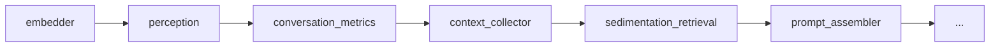
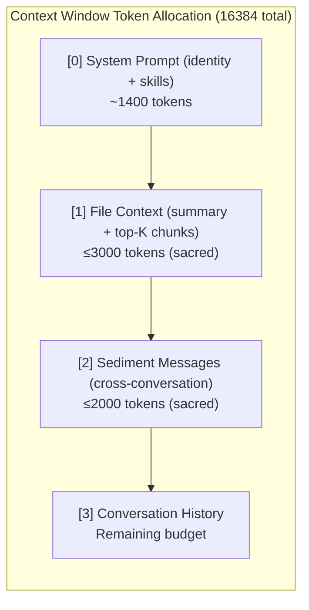

# ADR-005: Perception Module — File Upload & Sediment Retrieval

**Date:** 2026-05-20
**Status:** accepted
**Deciders:** Vector, aaa project

## Context

The agent currently accepts only plain text input (`content: str`). Users
cannot share documents, code files, or reference material with the agent
during a conversation. The agent has no way to "perceive" external artifacts
that shape the conversational field.

In AAA's framework, a file is not a "tool input." It is **sediment** — material
that enters the agent's perceptual field and becomes part of the
material-discursive apparatus. The agent doesn't "read" a file; it
**intra-acts** with it, and the file leaves structural residue in the
conversation's embedding space.

We need:
- File upload (text formats: PDF, EPUB, MOBI, Markdown, TXT, DOCX, code files)
- Extraction → chunking → embedding → storage for retrieval
- Similarity-based retrieval of relevant chunks on every message
- Token-budget-aware injection into the context window
- Frontend: file picker, drag-drop, format icons, token counts
- Pluggable digestion strategies for future philosophical alignment

Images are explicitly deferred — they require vision model support which
DeepSeek V4 does not provide. See Future Work.

## Options Considered

| Option | Pros | Cons |
|--------|------|------|
| **Full file in first message** | Simple; no retrieval needed | Blows token budget on large files; no reuse across turns; file content fades as history is trimmed |
| **Chunk + embed, inject all chunks** | Complete file in context | Still blows budget on large files; irrelevant chunks waste tokens |
| **Chunk + embed, similarity retrieval** | Token-efficient; mirrors existing sedimentation pattern; relevant content only | Slightly more complex; requires chunk strategy |
| **Chunk + embed, semantic retrieval (future)** | Most aligned with rhizomatic philosophy; structural isomorphism search | Requires future graph infrastructure; not implementable now |

## Decision

**Chunk + embed with similarity retrieval — the sedimentation pattern.**

Rationale:
- The existing `SedimentationRetrievalModule` already does cross-conversation
  retrieval via embedding cosine similarity. File chunks follow the exact same
  pattern: embed the chunk, store it, retrieve by similarity to the user's
  query on each turn.
- This is an extension of sedimentation — files become a new sediment layer
  within a conversation, diffractively accessible via the same embedding space.
- Token efficiency: only top-K most relevant chunks enter context (default K=6,
  budget 3000 tokens). File context is "sacred" (never trimmed, like system
  prompt and cross-conversation sediment).
- Modular: the digestion strategy (`FileDigester` ABC) is swappable.
  Today: token-count sliding window. Tomorrow: semantic boundaries.
  Phase 3: rhizomatic graph-based chunking with δ-index retrieval.

### Pipeline Placement



Perception runs **after embedder** (reuses the embedding service for chunk
vectors) and **before prompt_assembler** (injects `file_context` into the
payload). It always runs — on messages without new attachments it queries
the database for previously stored file sediment and retrieves relevant
chunks for the current query.

### Database: `perception_sediment` Table

File chunks are stored separately from `conversation_log`. They are not
conversation turns — they are reference sediment. Mixing them into the message
table would pollute history, metrics, and cross-conversation retrieval.

```sql
CREATE TABLE perception_sediment (
    id                INTEGER PRIMARY KEY AUTOINCREMENT,
    conversation_id   TEXT NOT NULL,
    file_name         TEXT NOT NULL,
    file_type         TEXT NOT NULL,
    chunk_index       INTEGER NOT NULL,
    chunk_text        TEXT NOT NULL,
    embedding         BLOB NOT NULL,
    embedding_model   TEXT NOT NULL,
    token_count       INTEGER NOT NULL,
    created_at        DATETIME DEFAULT CURRENT_TIMESTAMP,
    FOREIGN KEY (conversation_id) REFERENCES conversations(id)
);
```

Only extracted text and embeddings are stored — not raw file bytes.
Users retain the original files on disk.

### File Digestion: Pluggable ABC

```python
class FileDigester(ABC):
    def extract(self, file_path: Path, file_type: str) -> str: ...
    def chunk(self, text: str, chunk_size: int, overlap: int) -> list[str]: ...
```

Initial implementation: `SimpleChunkDigester` with per-format extractors:
- `.txt`, `.md`, `.py`, `.json`, `.yaml`, `.csv` — native `open().read()`
- `.pdf` — `pdfplumber`
- `.docx` — `python-docx`
- `.epub` — `ebooklib` & `beautifulsoup4`
- `.mobi` — `mobi`

No pandoc — avoids heavy system dependency. Pandoc can be added as a
`PandocDigester` implementation later, adhering to the same ABC.

### Context Assembly Order



File context is "sacred" — never trimmed by `_trim_to_budget()`. File summaries
include a 400-character content preview from the first chunk so the model
knows what each file contains. On every message, different chunks enter
context based on similarity to the current query — the file sediment is
re-queried every turn.

### Similarity Retrieval

File chunks are ranked by cosine similarity to the user's query embedding
(using the existing `all-MiniLM-L6-v2` model, 384-dim). The top-K chunks
are always included — similarity is used for ordering, not as a hard gate.
The `similarity_threshold` config key is reserved for future use (filtering
noise chunks). Each chunk entry in context includes its similarity score
for debugging: `[file.md chunk #3 sim=0.321]`.

If embedding fails or no chunk embeddings are found in the database, a
fallback mechanism injects the first K chunks directly to ensure content
is never absent.

### File Summary & Manifest

Every conversation features a persistent `[File Manifest - Co-Participant Sediment]` block in the context listing all files along with their metadata and LLM-generated summaries:

```
- [new] philosophy.md (md, 11594 tokens, 13 chunks) - Summary: An exploration of agential realism, intra-action, and physical-discursive apparatuses...
```

Newly uploaded files are flagged with `[new]` for the first 10 minutes. The LLM-generated summary replaces the original raw text preview, saving tokens and providing a richer cognitive map of the file sediment.

### Config

```yaml
perception:
  enabled: true
  file_token_budget: 3000
  top_k_chunks: 6
  chunk_size: 512
  chunk_overlap: 64
```

The `similarity_threshold` (default `0.25`) is actively enforced to filter out irrelevant chunks. If no chunks exceed this threshold, the manifest remains present, but a system notification `[File Context] No highly resonant memory fragments found...` is injected to signify the cutoff.

### Payload Contract

```
Key: attachments           — list[AttachmentInfo]  (set by API route)
Key: file_context          — list[{role, content}]  (set by perception module)
Key: file_context_tokens   — int                    (set by perception module)
Key: context_sent          — str                    (set by llm_client; debug)
```

`prompt_assembler` reads `payload["file_context"]` and inserts it after the
system prompt. It has zero knowledge of where the file content came from.

`context_sent` captures the full assembled message list as a formatted string
before the LLM call, surfaced in the API response for debugging. The frontend
displays it as a collapsible `▶ context` section on agent messages.

### Frontend

- **InputBar**: `+` button opens OS file picker. Drag-and-drop on the input
  area. File chips with format icon, short name, token count, remove button.
- **useChat**: `attachments: File[]` state, `FormData` multipart send,
  `uploadedFiles` tracking for side panel display.
- **SidePanel**: "Sediment" collapsible section showing uploaded files
  (name, format icon, token count) for the active conversation.
- **API client**: `sendMessage()` switches to `multipart/form-data` when
  files are present. Backward compatible — plain JSON when no files.
- **MessageBubble**: `▶ context` collapsible section on agent responses
  showing the full assembled message list sent to the LLM — each message
  prefixed with `[index] role:` for debugging context assembly.

## Consequences

**Easier:**
- Files become first-class sediment — retrievable by similarity, never lost
- Token budget stays bounded regardless of file size
- Reuses existing embedding infrastructure (no new model)
- Pattern is identical to cross-conversation sedimentation — same mental model
- `FileDigester` ABC enables future digestion strategies without touching
  the perception module or pipeline

**Harder:**
- Per-format extractors must be maintained (PDF, DOCX, etc.)
- Chunk retrieval is O(chunks × dims) — acceptable for <10K chunks per
  conversation; needs compaction beyond that
- No image support (vision model required — see Future Work)

## Future Work

### Image Perception
DeepSeek V4 lacks vision capabilities. When a vision model is available
(e.g., via OpenRouter with GPT-4o or Claude), images will be processed by:
1. Sending the image directly to a vision-capable LLM (multimodal message
   format: `content: [{type: "image_url", ...}]`)
2. Storing the generated description as a text chunk in `perception_sediment`
3. The description becomes retrievable sediment like any text file

Alternatively: a local vision model (BLIP, LLaVA) or a separate API call
for image description before the main LLM invocation.

### LLM-Based File Analysis
Currently, file summaries use the first 400 characters of the first chunk
as a content preview. Future: a dedicated skill (`file_analyst`) with a
system prompt that analyzes uploaded files and produces structured summaries
(main concepts, key ideas, argument structure, entities). The analysis
output becomes additional sediment — richer than raw chunk text for
retrieval.

### Semantic / Rhizomatic Chunking
The `SimpleChunkDigester` splits by token count with overlap. Future
`SemanticChunkDigester` would split on natural boundaries (paragraphs,
sections, topic shifts). Phase 3's `RhizomaticDigester` would construct
a graph between chunks with δ-index retrieval — structural isomorphism
search across the file's semantic knots, fully aligned with AAA's
philosophy.

### File Persistence Across Conversations
Currently, file sediment is scoped to a single conversation (`conversation_id`).
Future: files uploaded in one conversation could become cross-conversation
sediment for others, like existing message sedimentation. This requires
a separate retrieval query similar to `get_all_embeddings_except()`.

## Amendment: Decoupled Background Ingestion & Summarization (2026-05-22)

### Context & Problem
Previously, file uploads were queued in the client's input bar and sent inline with the user's message. This created several issues:
1. Long message delivery times because extraction, chunking, embedding generation, and LLM summarization had to run synchronously during message processing.
2. File selections and summaries did not persist across client refreshes unless a message had been successfully dispatched.
3. The user could not type other questions or draft messages while files were undergoing ingestion.

### Refined Architecture
We have decoupled file ingestion from message submission:
1. **Background Uploads**: Selecting or dropping a file triggers an immediate `POST /api/conversations/{id}/files` request. If the active conversation is new, a conversation trace is provisioned on-the-fly (`POST /api/conversations/new/files`).
2. **`perception_files` Table**: Added a dedicated tracking table in `database.py` and `repository.py` to persist file indexing states (`uploading`, `processing`, `ready`, `error`), LLM-generated summaries, and metadata (token counts, chunk counts).
3. **Out-of-Band Worker**: We use FastAPI's `BackgroundTasks` queue to ingest, chunk, embed, and run the `SummarizeAction` background model action without blocking the main request cycle.
4. **Apparatus Visibility**: Upon successful indexing, the worker inserts a `"system"` speaker entry into the `conversation_log` with the generated summary, making the infrastructure trace visible to the collaborator. In the UI, these system logs are collapsed by default to avoid clutter.
5. **UI Interactivity**: The text input field remains fully interactive while files are indexing (allowing the user to type), but the Send action is blocked until the files are ready.
6. **Sediment Sidepanel**: The files list is polled and retrieved from the database, ensuring persistence across page reloads. Summaries can be toggled via `sum` buttons and deleted via `×` (with cascading database purging).

