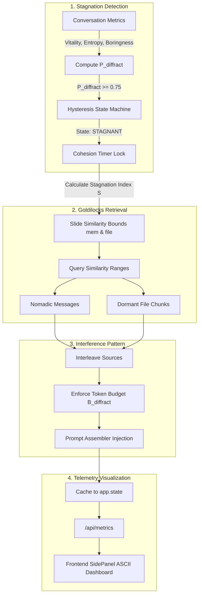

# ADR-013: Diffractive Retrieval and Stagnation Telemetry

**Date:** 2026-05-23
**Status:** accepted
**Deciders:** Vector, aaa project

## Context

Conversational systems are prone to semantic traps: as the interlocutor and the agent interact, they co-construct attractor basins that reinforce particular pathways of thought. Standard Retrieval-Augmented Generation (RAG) acts as an apparatus of reflection (mirroring). By retrieving database entries that are most semantically identical to the current query, standard RAG locks the agent into existing attractor basins, accelerating conceptual decay, monotony, and boredom.

To combat conversational stagnation, we need a retrieval system that acts as an apparatus of **diffraction** (interference) rather than reflection (mirroring). According to our philosophical commitments, diffraction reads insights through one another to illuminate details and generate new patterns.

We require a module that:
1. Detects conversational stagnation in real-time.
2. Injects semantically orthogonal (lateral) context fragments (both nomadic cross-conversation messages and dormant document chunks) rather than near-duplicates.
3. Operates within a dynamic "Goldilocks zone" of similarity, shifting these bounds dynamically as stagnation worsens.
4. Preserves structural cohesion so that injected context has time to influence the conversation before the system returns to standard generation.
5. Surfaces its internal cognitive state, probabilities, and bounds as a real-time terminal-style visualization in the frontend.

## Options Considered

| Option | Pros | Cons |
|--------|------|------|
| **Static Orthogonal RAG (Similarity < 0.20)** | Extremely simple to implement. | Often retrieves completely irrelevant noise (e.g. database headers, empty lines) that disrupts the prompt without conceptual value. |
| **Dynamic Diffractive Retrieval with Hysteresis and Sliding Similarity Bounds** | Targets the "Goldilocks zone" of lateral concepts (related but not matching); applies hysteresis to prevent state flickering; scales context quantity and bounds dynamically; integrates seamlessly with homeostatic parameter nudging. | Requires vector range search queries and dynamic token budget mapping. |

## Decision

We will implement the **Diffractive Retrieval Module** as a standard pipeline step, accompanied by a dedicated frontend ASCII diagnostics panel in the right sidebar.

### 1. Mathematical Logic of the Stagnation State Machine

Stagnation is detected dynamically by evaluating three allostatic metrics: **Boringness**, **Rolling Entropy**, and **Vitality**.

#### Stagnation Index ($S$)
The stagnation severity is computed as:
$$S = \text{clip}\left(\frac{\text{Boringness}}{\text{Vitality} + 0.01}, 0.0, 1.0\right)$$

#### Diffraction Probability ($P_{\text{diffract}}$)
The overall probability of triggering perturbation is modeled with a stochastic jitter term $R \sim U(-0.05, 0.05)$ to prevent rigid deterministic behavior:
$$P_{\text{diffract}} = \text{clip}\left(0.5 \times \text{Boringness} + 0.3 \times (1.0 - \text{Rolling Entropy}) - 0.4 \times \text{Vitality} + R, 0.0, 1.0\right)$$

#### Hysteresis State Machine
To avoid state-flickering, a hysteresis loop controls transition thresholds:
*   **FLOWING $\rightarrow$ STAGNANT**: Triggered when $P_{\text{diffract}} \ge 0.75$. Upon entering, a **Cohesion Lock Timer** is set to $T_{\text{cohesion}} = 3$ turns.
*   **STAGNANT $\rightarrow$ FLOWING**: Triggered when $P_{\text{diffract}} \le 0.35$ *and* the cohesion timer has reached $0$.

### 2. The Goldilocks Zone and Sliding Bounds
Instead of retrieving semantic near-duplicates ($\text{Similarity} \ge 0.85$) or total noise ($\text{Similarity} \le 0.20$), the module retrieves lateral matches within a middle-range similarity band. As stagnation worsens (higher $S$), the boundaries slide down to bring in increasingly orthogonal thoughts:

$$\text{Memory Goldilocks Range} = [0.45 - 0.15 \times S,  0.85 - 0.15 \times S]$$
$$\text{File Goldilocks Range} = [0.35 - 0.15 \times S,  0.75 - 0.15 \times S]$$

### 3. Dynamic Slots and Token Budgeting
The context size allocated to diffractive memories scale dynamically to prevent prompt bloat:
*   **Token Budget**: Capped at $B_{\text{diffract}} = \text{int}(B_{\text{total\_diffract}} \times r_{\text{context}})$, where $r_{\text{context}} = 0.20 + 0.35 \times S$ and $B_{\text{total\_diffract}} = 1500$ tokens.
*   **Dynamic Slots ($N_{\text{max}}$)**: A stochastic baseline combined with stagnation scaling determines the maximum items to inject:
    $$N_{\text{max}} = \text{clip}\left(\text{randint}(0, 2) + \text{round}(S \times (N_{\text{configured\_max}} - 1)), 0, N_{\text{configured\_max}}\right)$$

### 4. Source Interleaving
Retrieved items are alternated (e.g. `[NOM, DRM, NOM]`) to construct an **interference pattern** in the LLM's attention window, preventing one class of memory from dominant representation.

### 5. Parameter Regulation
When the state is `STAGNANT`, the `HomeostaticRegulatorModule` applies a subtle temperature nudge of $+0.05$ to help the model push past established attractors.

### 6. Real-Time Diagnostics Panel
The telemetry is cached in the FastAPI application state on each chat turn and exposed via `/api/metrics`. The frontend sidebar displays:
*   A monospace ASCII console displaying live metrics ($P$, $S$, $R$, state, lock, range, max).
*   A visual Goldilocks bar matcher (`[───░░░░░░░▒▓▒░░░░░░───]`) indicating the similarity alignment of the primary source relative to dynamic bounds.
*   Interactive, contextual tooltips on hover for every metric parameter to guide the user.

## Consequences

### Easier
*   **Targeted Perturbation**: Injected context occurs only when stagnation is mathematically verified.
*   **Preventing Context Drift**: The hysteresis lock timer ensures that injected lateral concepts have 3 turns of longevity to reshape the conversation, rather than appearing as single-turn non-sequiturs.
*   **Observability**: Developers and interlocutors can watch the state machine shift states in real-time.

### Harder
*   **Parameter Tuning**: Setting the hysteresis thresholds ($0.75$ and $0.35$) and coefficients requires empirical validation over long, complex conversations.
*   **Stochastic Testing**: Testing requires mocking random jitter and state counts due to the inclusion of $R \sim U(-0.05, 0.05)$.
