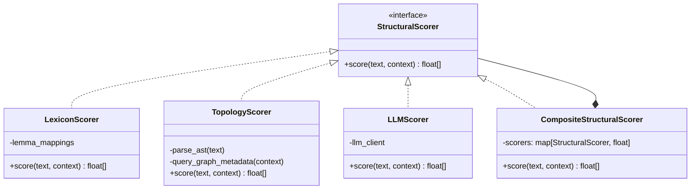

# ADR-014: 16-Dimensional Modular Structural Signature Engine

**Date:** 2026-05-23
**Status:** accepted
**Deciders:** Vector, Symbia, aaa project

## Context

Standard Retrieval-Augmented Generation (RAG) retrieves information solely based on **semantic similarity** ($S_{\text{sem}}$), linking concepts that share nouns and domain-specific vocabularies. However, creative synthesis and cross-disciplinary insight depend on **structural isomorphism**—identifying shared relational dynamics across completely different domains (e.g., matching the feedback loops of neural nets to the growth profiles of mycelial networks).

To enable this, we need a module that parses documents and conversation segments, projecting them into a specialized **structural coordinate space** independent of their semantic topics. 

To make this future-proof, we require:
1.  A complete cybernetic taxonomy mapping systemic properties.
2.  A mathematical calculation method that is robust against LLM variance, combining formatting layout, keyword frequencies, and LLM reasoning.
3.  A modular architecture allowing any component of the scoring system to be updated or replaced without breaking the retrieval pipeline.

---

## The 16-Dimensional Cybernetic Taxonomy

We define a 16-dimensional vector space $\vec{s} = [s_1, \dots, s_{16}]$ representing normalized intensities ($s_i \in [0.0, 1.0]$) across four core system areas:

### A. Behavioral Dynamics
*   **01. Homeostatic (Ashby):** Dampening perturbations via negative feedback.
*   **02. Amplifying (Maruyama):** Runaway growth via positive feedback.
*   **03. Cyclic (Maturana/Varela):** Autopoietic self-production loops.
*   **04. Bifurcated (Thom/Prigogine):** Threshold tipping points and phase shifts.

### B. Structural Topology
*   **05. Decentralized (McCulloch):** Peer-to-peer control without central points of failure.
*   **06. Rhizomatic / Networked (Deleuze):** Multidirectional, redundant link structures.
*   **07. Boundary Permeability (Varela):** Selectivity of system boundaries (open vs. closed).
*   **08. Recursion Depth (Beer):** Nested, fractal systems-within-systems.

### C. Informational Flow
*   **09. Variety Filtering (Ashby):** Input attenuation and response amplification.
*   **10. Negentropic Complexity (Schrödinger):** Storage of dense, ordered information.
*   **11. Temporal Latency (Forrester):** Feedback time-lags and buffer delays.
*   **12. Attractor Depth (Thom):** State rigidity (stiff resilient states vs. plastic adaptive states).

### D. Relational Coupling
*   **13. Symbiotic (Bateson):** Co-evolutionary environmental coupling.
*   **14. Nomadic (Deleuze):** Boundary-crossing lines of flight.
*   **15. Conversational Co-Orientation (Pask):** Cognitive consensus and divergence dynamics.
*   **16. Substrate Materiality (Foerster):** Embodied physical behavior vs. symbolic virtual logic.

---

## Calculation Framework

The coordinate value $s_i$ for dimension $i$ is calculated via a tripartite weighted synthesis:

$$s_i = w_{\text{ling}} \cdot S_{\text{ling}, i} + w_{\text{topo}} \cdot S_{\text{topo}, i} + w_{\text{LLM}} \cdot S_{\text{LLM}, i}$$

Where $w_{\text{ling}} = 0.25$, $w_{\text{topo}} = 0.25$, and $w_{\text{LLM}} = 0.50$.

```
   INPUT TEXT / NOTE
         │
         ├───► [Token-Level Lexicon Engine] ─────────► S_ling (25% weight)
         │
         ├───► [Document Topology & Link Analyzer] ──► S_topo (25% weight)
         │
         └───► [Structured JSON LLM Evaluator] ──────► S_LLM  (50% weight)
                                                        │
                                                        ▼
                                            [Weighted Synthesis (s_i)]
                                                        │
                                                        ▼
                                           16-DIMENSIONAL SIGNATURE
```

### 1. Token-Level Lexicon ($S_{\text{ling}}$)
Calculated via normalized keyword density of stemmed lemma target lists ($L_i$) with non-linear saturation scaling:
$$D_i = \frac{\sum_{t \in T} \mathbb{I}(t \in L_i)}{|T|}$$
$$S_{\text{ling}, i} = 1 - e^{-\kappa_i \cdot D_i}$$

### 2. Document Topology ($S_{\text{topo}}$)
Empirical metrics parsed from Markdown structures and database link networks:
*   **Recursion Depth ($S_{\text{topo}, 8}$):** Computes Shannon entropy of markdown header levels (`#` to `######`):
    $$p_d = \frac{n_d}{\sum_j n_j}$$
    $$E_{\text{struct}} = -\sum_d p_d \log_2(p_d)$$
    $$S_{\text{topo}, 8} = \frac{D_{\text{max}}}{6} \cdot \left(1 - e^{-E_{\text{struct}}}\right)$$
*   **Rhizomatic / Networked ($S_{\text{topo}, 6}$):**
    $$S_{\text{topo}, 6} = \tanh\left(\alpha \cdot L_{\text{density}} + \beta \cdot deg(c)\right)$$
*   **Cyclic / Recursive ($S_{\text{topo}, 3}$):** Path cycle detection in the adjacency matrix $A$:
    $$S_{\text{topo}, 3} = \begin{cases} 1.0 & \text{if node is in a directed cycle of length } \le 4 \\ 0.0 & \text{otherwise} \end{cases}$$

### 3. Structured LLM Generation ($S_{\text{LLM}}$)
Guided inference requiring a step-by-step reasoning trace followed by a bounded float JSON array.

---

## Modular Strategy Architecture

To allow components to be easily modified or replaced, calculations are decoupled using the **Strategy Pattern**:



---

## Latency Mitigation via Asynchronous Lazy-Scoring

To protect the FastAPI response budget (sub-100ms for pipeline passes), the engine implements a two-tier execution pattern:
1. **Synchronous Pass (Empirical/Heuristic):** During ingestion, if `llm_provider` is unavailable or to bypass latency, the `CompositeStructuralScorer` immediately fallback to empirical linguistic ($S_{\text{ling}}$) and topological ($S_{\text{topo}}$) evaluations, setting $S_{\text{LLM}}$ to a neutral default vector ($[0.25]^{16}$).
2. **Asynchronous Pass (Background Tasks):** Full LLM-based coordinate refinement ($S_{\text{LLM}}$) is performed via background tasks or offline scripts (e.g., `populate_signatures.py`), updating the database record with the full composite signature without blocking the chat loop.

---

## Consequences

*   **Pros:**
    *   **Robustness:** Mathematical components ($S_{\text{ling}}$, $S_{\text{topo}}$) anchor scores, preventing LLM temperature shifts from causing coordinate drift.
    *   **Modularity:** A new topological algorithm (e.g. migrating from simple regex to networkx graph analysis) can be written as a subclass of `StructuralScorer` and swapped in without touching the database insertion or retrieval code.
    *   **Phase 3 Compatibility:** Coordinates directly match node feature schemas when migrating to a graph-vector database.
    *   **Performance:** Non-blocking design ensures low-latency execution for user interactions.
*   **Cons:**
    *   Linguistic target lists and topology heuristics are language-dependent and require calibration. Exposing target lemmatization lists in `config.yaml` mitigates this.

---

## Appendix A: Lazy Fallback and Automatic Backfill (2026-06-05)

### Problem
Messages created before the `structural_signature` column migration have `NULL` signatures. When belief metabolism encounters a message pair without signatures, it skips the turn entirely — preventing belief formation, attractor window population, and autopoietic personality adaptation.

### Solution
**Lazy fallback** in `BeliefDynamicsEngine.metabolize()`: when a message lacks a structural signature, the engine calls `_ensure_signature()` which computes a vector from lexicon+topology scoring (no LLM), stores it back to the database via `MessageRepository.update_signature()`, then proceeds with metabolism.

**Background backfill** via `BackgroundStartupScheduler._backfill_structural_signatures()`: on startup and every 60 seconds thereafter, the scheduler scans for messages with `NULL` structural signatures and fills them in using lexicon+topology scoring. This self-heals any gaps introduced by legacy data or exceptional code paths.

**Scope**: applies to all messages in `conversation_log` and `perception_sediment`, including legacy conversations (`00000000-...`), consultation conversations (antigravity), and dream log conversations.

### Justification Storage Policy (2026-06-05)

The `LLMScorer` generates both scores and a `justification` string. This justification is cached in memory (SHA256-keyed, max 1000 entries) and stored in `conversation_log.structural_justification` at message insertion time. The lazy fallback and background backfill paths do not store justifications since they bypass the LLM scorer entirely.

All primary message creation paths now store justifications:
- **Normal chat** (`routes.py`): stores justifications for both user and apparatus messages when `include_structural_scoring=true`
- **Dream daemon** (`daemon.py`): stores justifications for both dream prompt and dream response messages (full LLM scoring)
- **Document ingestion** (`digest_worker.py`, `routes.py:_insert_system_message`): stores justifications for system messages
