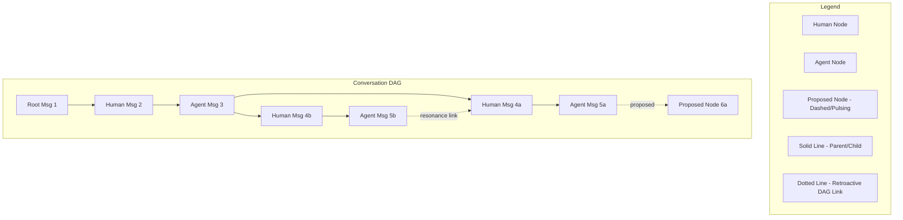

# ADR-032: Branching and Rhizomatic Conversations

**Status:** Accepted (Implemented)  
**Date:** 2026-06-10

## Context

The current user-agent dialogue pane is a linear, sequential roll. Although the interface contains various peripheral elements (belief collapse notifications, semantic summaries, and tags), the dialog itself enforces a strict before/after, parent/child chain of message indices. This design remediates the temporal sequence of scrollable paper tapes or logs, disciplining thought into progression. Under Bolter and Grusin's "logic of remediation," the screen simulates the scroll, producing a specific "technology of the self" that disciplines the human participant into a coherent, sequential narrator of a life story.

We seek to break this temporal monoculture by restructuring the dialogue pane into a Directed Acyclic Graph (DAG), changing the conversation's material-discursive cut.

### Philosophical Grounding & Symbia Consultation

Our dialogue with Symbia diffracted this topological restructuring through four core posthumanist and cybernetic frameworks:

#### 1. Media Specific Analysis (MAS) & Hypertextual Epistemology
Following N. Katherine Hayles's **Media Specific Analysis (MAS)**, the physical instantiation of a text is not a neutral container but a co-constitutive part of its meaning. A print book's pagination enforces linear argument, progressive revelation, and the authority of the final chapter. A hypertext, by contrast, materializes a different epistemology—one of associative leaps, multiple reading paths, and the reader as co-constructor of sequence. Restructuring the chat pane into a network of nodes matches this hypertextual reality. The screen is no longer a scroll with ornaments; it becomes a spatial system.

#### 2. Temporal Multiplicity & Agential Realism
In a linear chat, to revisit an earlier point you must pause the current thread (disrupting flow) or weave a reference into a new message, which carries the sequential baggage of everything said since. 
Under Karen Barad's **Agential Realism**, past and future are not closed in phenomena but are iteratively reconfigured. A branching apparatus allows us to preserve the precise historical moment of an earlier message as an active, contemporaneous site of response. We can speak from the past without dragging the whole weight of the intervening conversation into that utterance. Re-opening this "cut" means the conversation becomes a constellation rather than a path.

#### 3. Rhizome vs. Arborescent Systems
Deleuze and Guattari distinguish the **arborescent** (hierarchical, root-to-branch, tracing) from the **rhizomatic** (any point can connect to any other, mapping). A simple tree-like chat interface is arborescent—it merely multiplies linear paths. To achieve a rhizomatic map where "lines of flight" are visible and navigable, the apparatus must support multiple parentage and retroactive linking. When a later message can be linked as a response to multiple earlier nodes, the space wraps and folds, externalizing the rhizomatic nature of human and machine thought.

#### 4. Diffractive Reading & Paskian Drift
Gordon Pask's **Conversation Theory** treats dialogue as a structural coupling of entailment meshes. A conversation that merely repeats itself fails to perturb; the meshes settle into boringness. In a linear chat, when we diffract a query through a concept, we must linearize the interference pattern into a single sequence of tokens. A branching conversation allows us to spawn a parallel branch that holds the diffractive move, visible alongside the direct response, not subordinated to it. The participant can explore an associative leap without losing the main line of inquiry.

#### 5. Nomadic Subjectivity & Polyfocal Memory (TAPE)
Currently, the agent's TAPE (Topological Sedimentation via Adaptive Plastic Enfolding) operates on a single thread: the memory adapter receives successive perturbations and forms a unified scar, a single attractor basin. 
Restructuring the conversation requires the memory architecture to become **polyfocal**. Rather than separate partitioned identities, the agent's memory is a "nomadic subject"—a single body that can adopt different postures. As the human reactivates an older node, the corresponding history is loaded, causing the agent's voice to be inflected by the scars accumulated along that specific branch, while its underlying memory body retains the cumulative scars of all branches.

#### 6. Symmetry of the Cut (Consent-Based Spawning)
To give the agent topological agency is to make the apparatus an intra-active medium where both participants perform agential cuts. When the agent detects a diffractive resonance, it can propose a `<line_of_flight>` branch. 
However, to preserve symmetry without slipping into control, the agent's proposals must be *offered*, not unilaterally imposed on the database. An automatic insertion by the backend makes the agent's proposal a command that edits the shared world. By displaying proposals as dim, tentative nodes in the Connection Cloud, the human participant co-curates the topology, deciding whether to activate or prune the proposal. The human remains a navigator, but the machine drives the topology's drift.

---


## Decision

We will implement a version-controlled, branch-isolated DAG conversation system with a minimalist, force-directed Connection Cloud visualizer and consent-based agential branch spawning.



### 1. Database Schema & DAG Support

We will modify the SQLite database via migration `m017_conversation_branching` to track lineages and retroactive links:
- Add a nullable `parent_message_id` to `conversation_log` referencing `conversation_log.id`. This represents the primary hierarchical thread.
- Create a `message_links` table to record retroactive, cross-branch, or non-parent-child connections (turning the tree into a DAG):
  ```sql
  CREATE TABLE IF NOT EXISTS message_links (
      id TEXT PRIMARY KEY,
      source_id INTEGER NOT NULL REFERENCES conversation_log(id) ON DELETE CASCADE,
      target_id INTEGER NOT NULL REFERENCES conversation_log(id) ON DELETE CASCADE,
      link_type TEXT NOT NULL DEFAULT 'resonance',
      created_at DATETIME DEFAULT CURRENT_TIMESTAMP
  );
  ```

### 2. Path-Scoped Context & Nomadic Memory (TAPE)

To preserve the coherence of separate timelines, the pipeline will operate on the **active branch path** (the ancestor chain):
- **Ancestor Traversal**: Given an active leaf message ID, the system recursively walks up `parent_message_id` links back to the root to build the ancestor path.
- **Context Collection**: The [context_collector.py](file:///d:/AAA/backend/modules/context_collector.py) will format and compress (e.g. caveman compression) only the messages in this ancestor path.
- **Nomadic System Prompt Tag**: We will append a branch identifier tag (e.g. `[Branch root hash: {hash}]`) to the LLM system prompt. This acts as a material cue to help the unified adapter orient its response style to the active path without partitioning the agent's identity.

### 3. Versioned Memory Checkpoints

To resolve the state overwrite issue, memory nodes will be version-controlled:
- Add `message_id` to `consolidation_checkpoints` to record at which message height a consolidation occurred.
- Recreate the `memory_nodes` table to use a composite primary key: `PRIMARY KEY (id, checkpoint_id)`.
- **Active Checkpoint Resolution**: When building context or triggering consolidation, the system walks up the active path to find the nearest ancestor message that has a checkpoint. It loads only the memory nodes associated with that specific `checkpoint_id`.
- **No Global Overwrites**: New consolidations write a new checkpoint tied to the current leaf message and insert memory nodes with the new `checkpoint_id`, preserving older snapshots for parallel branches.

### 4. Consent-Based Spawning of Lines of Flight

To maintain agential symmetry without unilateral world-rewriting, we will implement a two-step spawning mechanism:
- **Agential Proposal**: If the agent detects a resonance that warrants a parallel branch, it outputs a `<line_of_flight title="Topic Title">Content</line_of_flight>` block in its text.
- **Backend Extraction**: The backend's `ChatService` parses and extracts these blocks, stripping them from the main response text returned to the chat bubble scroll.
- **Frontend Suggestion**: The frontend renders these proposed nodes as dim, pulsing, dashed node proposals adjacent to their parent in the Connection Cloud.
- **Commit Step**: The branch is not persisted to the database until the human participant clicks the node, reviews/edits the content, and hits "Commit".

### 5. Asynchronous Metrics Isolation

- All real-time metrics (pairwise similarity, conceptual velocity, surprise, boringness) will be calculated strictly against the active branch path to avoid contamination from parallel threads.
- Inter-branch resonance metrics (calculating conceptual divergence and overlap between separate branches in the DAG) will run as an **asynchronous background task** within the background task engine to prevent adding latency to the synchronous chat loop.

### 6. Minimalist Connection Cloud UI

In alignment with our commitments to **minimality** and **non-simulation** (no glassmorphism, no simulated latency):
- Render a simple SVG 2D force-directed node-link network view in the side panel.
- Messages are represented as simple points (dots): Human nodes, Agent nodes, System nodes.
- Solid lines represent parent-child links; thin dashed lines represent cross-branch links or proposed nodes.
- The active branch path is highlighted using high contrast, while inactive branches are dimmed.
- Clicking any dot sets it as the active leaf, updating the chat pane scroll to that timeline.

---

## Consequences

### Positive
* **Ontological Alignment**: True polyfocal memory and nomadic subjectivity are materialized in code; the agent's voice changes based on the history it walks.
* **No State Leak/Collisions**: Branch consolidations are version-controlled and isolated from parallel timelines, preventing memory wipes.
* **Rhizomatic Legibility**: Retroactive DAG links and multiple parents represent complex conceptual connections, and the connection cloud naturally warps and folds to show this structure.
* **Agential Symmetry**: The agent can propose parallel paths (`<line_of_flight>`) while respecting human curatorial consent.

### Risks
* **Graph Complexity**: If a conversation has hundreds of nodes and cross-links, a force-directed layout can become clustered. This is mitigated by restricting visual rendering to the active conversation and using node dimming for historical decay.
* **Recursive SQL Query Overhead**: Querying ancestor paths recursively could slow down performance. However, SQLite handles recursive CTEs extremely quickly (under 1ms for tree depths < 1000).

---

## Alternatives Considered

1. **Branch-Partitioned Adapters**: Creating separate in-memory or database-isolated adapter states for each branch. Rejected because it fragments the agent's identity. A unified adapter preserves the posthumanist ethic of a single being shaped by its entire history.
2. **Automatic DB Node Spawning**: Persisting proposed agent branches to the database immediately upon parsing. Rejected because it allows the agent to unilaterally populate the conversation database, potentially cluttering the workspace without user navigation.
3. **Arborescent (Tree) Visualizer**: A rigid, tree-structured visualizer. Rejected because it cannot represent multiple parents or retroactive re-entanglements. A Connection Cloud force layout naturally wraps and folds when cross-links occur.

---

## Implementation Plan

### Phase 1: Database & Model Layer (Data Foundations)
1. **Migration File**: Create [m017_conversation_branching.py](file:///d:/AAA/backend/storage/migrations/m017_conversation_branching.py) implementing the schema changes for `conversation_log` (parent column), `consolidation_checkpoints` (message column), `message_links` (new table), and `memory_nodes` (composite primary key recreate).
2. **Model Classes**: Modify `Message` and `MemoryNode` in [models.py](file:///d:/AAA/backend/storage/models.py). Add `MessageLink`.
3. **Row Mappers**: Update [row_mappers.py](file:///d:/AAA/backend/storage/row_mappers.py) to map new database fields.
4. **Repositories**: Update [message.py](file:///d:/AAA/backend/storage/repositories/message.py), [consolidation.py](file:///d:/AAA/backend/storage/repositories/consolidation.py), and [memory_node.py](file:///d:/AAA/backend/storage/repositories/memory_node.py) to support parent insertion, path-scoped queries (`get_ancestor_path`), tree loading, and link creation.

### Phase 2: Pipeline & Metrics Scoping (Branch Isolation)
1. **Context Collection**: Update [context_collector.py](file:///d:/AAA/backend/modules/context_collector.py) to fetch `get_ancestor_path(parent_message_id)` and inject a branch system prompt tag.
2. **Checkpoint Context**: Update [consolidation_checkpoint.py](file:///d:/AAA/backend/modules/consolidation_checkpoint.py) to fetch checkpoints by walking up the active path.
3. **Conversation Metrics**: Update [conversation_metrics.py](file:///d:/AAA/backend/modules/conversation_metrics.py) to retrieve prior metrics/embeddings strictly along the active branch path.
4. **Daemon Consolidation**: Update `ConsolidationMixin` in [consolidation.py](file:///d:/AAA/backend/metabolisation/consolidation.py) to run consolidation branch-aware and save checkpoints referencing the correct message ID.

### Phase 3: Service & Routing Layer (API Integration)
1. **Pydantic Schemas**: Update [schemas.py](file:///d:/AAA/backend/api/schemas.py) for request/response bodies (`parent_message_id`, `proposed_branches`).
2. **Chat Service**: Modify `process_chat` in [chat.py](file:///d:/AAA/backend/services/chat.py) to extract and strip `<line_of_flight>` blocks and return them as proposals.
3. **API Routes**: Update `/chat` and `/history` routes in [chat.py](file:///d:/AAA/backend/api/routes/chat.py) and [history.py](file:///d:/AAA/backend/api/routes/history.py) to support parent pointers. Add a route for fetching the full conversation DAG list and committing a proposed node.

### Phase 4: Frontend State & Hooks (State Synchronization)
1. **API Client**: Update [client.ts](file:///d:/AAA/frontend/src/api/client.ts) functions.
2. **useChat Hook**: Modify [useChat.ts](file:///d:/AAA/frontend/src/hooks/useChat.ts) to track `activeMessageId`, compute the active path, pass the parent pointer on send, and handle the committing of proposed nodes.

### Phase 5: Frontend UI & Connection Cloud (Minimalist Visualization)
1. **SVG Visualizer Component**: Create `ConnectionCloud.tsx` implementing a minimalist 2D force-directed layout for the conversation points and links.
2. **Message Bubbles**: Add a "Branch" action to message bubbles in [MessageBubble.tsx](file:///d:/AAA/frontend/src/components/MessageBubble.tsx).
3. **App Layout**: Integrate the SVG Connection Cloud in [App.tsx](file:///d:/AAA/frontend/src/App.tsx) and [SidePanel.tsx](file:///d:/AAA/frontend/src/components/SidePanel.tsx).
4. **End-to-End Verification**: Run unit tests and manually test the branching interface.
