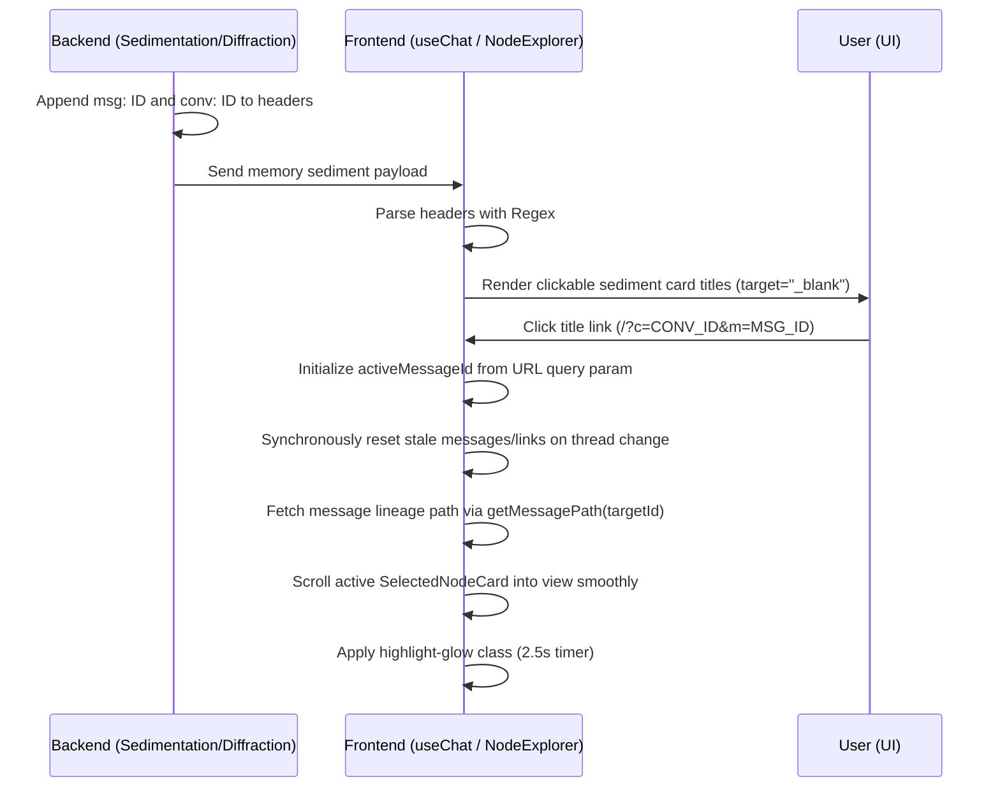

# ADR-039: Cross-Conversation Retro-links and Active Message Focus

**Status:** Accepted (Implemented)  
**Date:** 2026-06-11  
**Deciders:** Antigravity, Human Collaborator  

## Context

Under [ADR-033: Resonance Links](file:///d:/01_GIT/AAA/docs/decisions/ADR-033-resonance-links.md), we established a consent-based topography for connecting parallel branches. In addition to these topological connections, the system displays cross-conversation sediment dialogues and diffractive fragments in the context panel to remind the user of older ideas.

However, these memory cards did not provide direct navigability back to their source message nodes. If a conversation grew large, manually locating the origin context of a retrieved memory was tedious. Furthermore, attempting to synchronize message-level focus via URL query parameters created two primary technical issues:
1. **Mount Lifecycle Race Conditions:** React state initialization defaults `activeMessageId` to `null` before asynchronous history fetching. An effect synchronizing the active ID back to the URL immediately deleted the `&m=MESSAGE_ID` query parameter on mount before the history hook could read it.
2. **Stale View Flash:** Switching conversations without synchronously resetting the state variables leaked stale messages and active nodes from the previous thread for a frame before the new history was fetched.

---

## Decision

We have implemented a complete end-to-end retro-linking structure that serializes origin IDs in the backend, parses them in the frontend, maintains URL synchronization, and provides visual scroll-into-view focus indicators.



### 1. Metadata Serialization (Backend)
- Modified `sedimentation_retrieval.py` and `diffractive_retrieval.py` to preserve original message and conversation IDs.
- Modified `assembler.py` to append `msg: {message_id} | conv: {conversation_id}` to memory stagnation headers in the Prompt Assembler output.

### 2. Frontend Parsers and Clickable Anchors
- Updated `SedimentSectionViewer.tsx` and `DiffractiveZoneViewer.tsx` regex matching to extract `msg:` and `conv:` attributes from headers.
- Rendered these titles as clickable `<a>` links pointing to `/?c=CONV_ID&m=MSG_ID` opening in a new tab (`target="_blank"`), styled with a subtle underline fade on hover to align with the geologic terminal aesthetic.

### 3. State Sync and Race Condition Prevention
- Initialized `activeMessageId` from URL query parameters during React's state initialization:
  ```typescript
  const [activeMessageId, setActiveMessageId] = useState<number | null>(() => {
    const params = new URLSearchParams(window.location.search);
    const urlMsgId = params.get("m");
    return urlMsgId ? parseInt(urlMsgId, 10) : null;
  });
  ```
- Added a synchronous prop-change check in `useChat` to reset conversation-specific states (`messages`, `links`, `treeNodes`, and `activeMessageId`) immediately when `conversationId` changes to avoid rendering stale content.
- Updated `useConversations.ts` to delete the message focus parameters `m` when updating active IDs to prevent stale parameters from carrying over between conversation switches.

### 4. Smooth Scrolling & Visual Highlighting
- Added an effect in `NodeExplorer.tsx` watching `selectedNodeId`.
- When the active message ID changes, it triggers `scrollIntoView({ behavior: 'smooth', block: 'nearest' })` after a short render delay.
- Applied a transient `isHighlighted` flag to `SelectedNodeCard` for 2.5 seconds.
- Defined a keyframe animation in `index.css` (`active-focus-glow`) that pulses the border with a green shadow and transitions it smoothly back to the default dark border.
  ```css
  @keyframes active-focus-glow {
    0% {
      border-color: rgba(74, 222, 128, 0.8) !important;
      box-shadow: 0 0 15px rgba(74, 222, 128, 0.4);
    }
    100% {
      border-color: rgba(42, 42, 53, 1) !important;
      box-shadow: none;
    }
  }
  ```

---

## Consequences

### Positive
- **Instant Context Orientation:** Clicking any dialogue memory card or diffraction fragment immediately opens the target conversation and centers the view on that exact message bubble.
- **Robust Initialization:** Resolves the mount-time race condition, making `m` parameter loading fully durable.
- **Zero View Leaks:** Conversation transitions immediately clear state during render, preventing flashes of unrelated threads.

### Risks & Mitigations
- **Layout Shifts during Scroll:** Fast scrolling could cause visual jumps. *Mitigation*: The scroll-into-view is delayed by 100ms to allow the DOM node to finish rendering its text block, and uses smooth behavior to soften the camera transition.

---

## Refinements (2026-06-14)

### Context
Three additional issues were discovered after the initial implementation:

1. **Stale `m` Parameter via Back/Forward Navigation:** `useChat` syncs `activeMessageId` to the URL (`?c=CONV&m=ID`). When the user navigated to another conversation (which deletes `m` via `pushState`) and then pressed Back, the popstate handler in `useConversations` only restored `activeId` from `?c=` but did NOT clean up the stale `m` parameter. This caused conversations to open at a previously-viewed middle node instead of the newest message.

2. **Broken Cross-Conversation Notification Navigation:** `handleNavigateToNotification` set `m` in the URL via `replaceState`, then called `setActiveId()` — but `updateActiveId` immediately deleted `m` via `pushState`, wiping out the target message ID before `useChat` could consume it.

3. **Race Conditions in Async Effect Callbacks:** The `useEffect` in `useChat` fires `getHistory`, `getMessagePath`, and `getConversationFiles` without a guard checking whether the conversation had changed while the promise was in-flight. Stale promise resolutions could overwrite state for a newer conversation.

4. **Orphaned Dream Nodes Creating False Ancestor Chains:** `getAncestorPathIds` had a fallback that connected any message without `parent_message_id` to `sorted[i-1].id` (previous message by ID). Dream nodes created by the daemon had `parent_message_id = NULL`, so this fallback invented a false ancestor chain. The Connection Cloud graph (using real tree links from the backend) showed the node as disconnected, while `activePathIds` highlighted a fake ancestor path — causing a mismatch between the displayed node and the highlighted graph node.

### Decision

1. **Popstate Handler Cleanup:** The popstate handler in `useConversations` now deletes `m` from the URL via `replaceState` whenever it is present, ensuring `useChat` always loads the newest node on back/forward navigation.

2. **`preserveMessageId` Parameter:** `updateActiveId` and `selectConversation` now accept an optional `preserveMessageId` parameter. When provided (e.g., from notification cross-conversation navigation), `m` is explicitly set in the URL. When omitted (normal conversation selection), `m` is deleted as before.

3. **Race-Condition Guards:** Every async `.then`/`.catch` callback in the `useChat` effect and `startPolling` now checks `loadedRef.current` before updating state:
   ```typescript
   if (loadedRef.current !== conversationId) return
   ```
   This prevents stale promise resolutions from overwriting newer conversation state, which was especially problematic under React StrictMode (development) where effects fire twice.

4. **No False Parent Connections:** `getAncestorPathIds` now treats nodes without `parent_message_id` as root nodes (no parent chain). The `sorted[i-1].id` fallback was removed. This ensures the active path matches the real conversation tree, and the graph highlighting is consistent with the displayed node.

### Consequences
- **Default "newest node" behavior is now reliable:** Opening any conversation always defaults to the last-created node (by ID/date).
- **Graph-display consistency:** The Connection Cloud DAG highlighting now matches the actual ancestor path of the active node.
- **Back/forward is safe:** Browser navigation no longer leaks stale message focus.
- **Cross-conversation notification nav works:** Clicking a notification for a different conversation correctly navigates to the target message.
