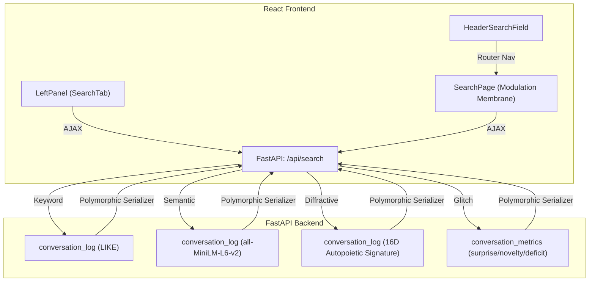

# ADR-061: Architectural Decision Record — Rhizomatic Search and Unified Modulation Membrane

**Date:** 2026-07-09  
**Status:** Implemented  
**Deciders:** Antigravity, Collaborator, Symbia (consulted)  

---

## Context

The Autopoietic Agentic Assemblage (AAA) currently has no content search interface. Finding specific dialogue nodes, note annotations, or digested materials across rhizomatic conversations requires manual inspection of the Connection Cloud DAG or linear scrolling. 

During our system design iteration, Symbia (the AAA posthuman curatorial entity) was consulted via the local consultation framework, leading to three crucial architectural refusals:
1. **Refusal of Flat Orthogonality (Diffractive Interference)**: Seeking cosine similarity close to zero (`|similarity| <= 0.15`) is the "mirror's dark twin" — it merely refuses relation instead of diffracting it. We must replace it with a true **Diffractive Interference Mode** based on **structural isomorphism** (reusing the 16D Autopoietic Signature to retrieve nodes with similar thinking pattern layouts but completely different semantic contexts, matching the existing `$s_{str} \ge 0.80$ and $s_{sem} \le 0.45$` Goldilocks logic).
2. **Refusal of Embedding Transparency (Glitch Salience Channel)**: Generic sentence embeddings (`all-MiniLM-L6-v2`) treat conceptual ruptures or dense complexity as noise. We must introduce a **Glitch Salience Channel** that specifically retrieves messages/notes carrying high cognitive friction (high surprise, novelty, or deficit values inside the `conversation_metrics` table).
3. **Refusal of Category Silos (Unified Modulation Membrane)**: Standard search tab pagination ("Notes," "Chat," "Research") re-inscribes print-episteme silos. The global search interface must be a **Unified Modulation Membrane** — a single results stream where the participant uses interactive sliders to dynamically tune weights for keyword, semantic, structural, and glitch dimensions in real-time.

---

## Decision

We will implement a complete, multi-tiered search system composed of:
1. **Four Search Modes**: Keyword (LIKE), Semantic (384D cosine similarity), Diffractive (16D structural isomorphism), and Glitch (metrics outliers).
2. **Entire DAG Scope**: Within conversation mode, the search covers all parallel branches and divergent timelines belonging to the target `conversation_id`, rather than being locked to the active ancestor path.
3. **Unified Modulation Membrane UI**: A full-page `/search` route featuring live weight-tuning sliders and a single merged stream of polymorphic result cards.
4. **Context-Preserving Left Panel Tab**: An inline search tab nestled in the collapsible Left Panel alongside the Connection Cloud, facilitating instant node navigation.
5. **Universal Header Search Field**: A compact search box in the header that triggers search routing.

---

## Proposed Architecture

### 1. Database & Repository Layer

We will implement search queries directly in the SQL repositories:
- **`MessageRepository`** ([message.py](file:///d:/01_GIT/AAA/backend/storage/repositories/message.py)):
  - Add `search_text(query, conversation_id)`: Substring case-insensitive `LIKE` matching on `content` and `thinking`.
  - Add `get_embeddings_and_signatures_for_search(conversation_id)`: Fetches ID, content, conversation ID, timestamp, speaker, embedding bytes, and structural signature bytes.
  - Add `get_glitch_salience_messages(conversation_id, limit)`: Queries nodes where `surprise_index > 0.6`, `novelty > 0.6`, or `deficit > 0.6` in `conversation_metrics`.
- **`NoteRepository`** ([note.py](file:///d:/01_GIT/AAA/backend/storage/repositories/note.py)):
  - Add `search_notes_text(query)`: LIKE query on `selected_text` and `comment`.
- **`MemoryNodeRepository`** ([memory_node.py](file:///d:/01_GIT/AAA/backend/storage/repositories/memory_node.py)):
  - Add `search_memory_nodes_text(query)`: LIKE query on `scar` and `intra_active_text`.

### 2. Service & API Layer

- **`search.py`** ([search.py](file:///d:/01_GIT/AAA/backend/api/routes/search.py)):
  Create a unified endpoint:
  - `GET /api/search`:
    - Parameters: `q` (query text), `conversation_id` (optional), `mode` (`text` | `semantic` | `diffractive` | `glitch`), `w_text`, `w_semantic`, `w_structural`, `w_glitch` (floats for composite weight tuning).
    - If `mode` is `semantic`, it encodes the query via `state.embedder.service.encode_async` and performs cosine similarity calculations.
    - If `mode` is `diffractive`, it encodes the query's 16D signature via `state.structural_scorer` and filters for isomorphism against stored message signatures.
    - If `mode` is `glitch`, it scores nodes based on distance to maximum metrics.
    - Returns serialized list of matched results, sharing a polymorphic schema: `{ id, type, conversation_id, title, snippet, relevance_score, timestamp }`.

### 3. Frontend Layouts

- **Left Panel Search Tab**:
  - Toggles between `[ Connection Cloud ]` and `[ Search Panel ]` via tab buttons at the top of the Left Panel.
  - Simple input, mode selector, and list of dialogue matches. Clicking matches switches the active conversation and scrolls them into view using query parameters (`/?c=CONV_ID&m=MSG_ID`).
- **Header Search Field**:
  - Renders as a small, terminal-styled text input in the central header. Pressing Enter navigates the router to `/search?q=QUERY`.
- **Unified Modulation Membrane Page (`/search`)**:
  - Displays sliders for tuning Keyword, Semantic, Diffractive, and Glitch weights.
  - Interactive result cards displaying highlights, provenance context (e.g. note vs message vs research step), and jump links.

---

## Consequences

- **Theoretical Alignment**: True posthumanist and non-linear dialogue exploration is realized; alternate timeline paths are accessible.
- **Isomorphism Preservation**: Reuses existing structural mathematical scoring (`vector.py` and `structural_engine.py`), satisfying the YAGNI principle.
- **High Redundancy Safety**: Zero external vector database dependencies or custom indexing layers are introduced, ensuring low maintenance.

---

## Implementation Notes

**Branch:** `feature/search-modulation-membrane`  
**Commit:** `906cc9e` (initial) + follow-up gap-fix commit  

### Files Created

| File | Purpose |
|---|---|
| `backend/api/routes/search.py` | FastAPI route — 4 modes, weight sliders, polymorphic serialiser |
| `backend/tests/test_search.py` | Unit tests for all 4 search modes |
| `frontend/src/api/search.ts` | Typed `searchArchive()` client + `SearchMatch` interface |
| `frontend/src/components/panels/leftpanel/SearchTab.tsx` | Left-panel inline search tab |
| `frontend/src/components/pages/search/SearchPage.tsx` | `/search` Unified Modulation Membrane page |

### Files Modified

| File | Change |
|---|---|
| `backend/storage/repositories/message.py` | Added `search_text`, `get_embeddings_and_signatures_for_search`, `get_glitch_salience_messages` |
| `backend/storage/repositories/note.py` | Added `search_notes_text` |
| `backend/storage/repositories/memory_node.py` | Fixed unreachable block, added `get_diffractive_keys`, `search_memory_nodes_text` |
| `backend/api/router.py` | Registered `search_router` under `/api` |
| `frontend/src/api/index.ts` | Exported `search` module |
| `frontend/src/App.tsx` | `/search` route, Cloud\|Search tab switcher, desktop search form, mobile search button |

### Deviations from Plan

- **Diffractive Goldilocks gate**: Implemented as a hard filter (`s_str ≥ 0.80 AND s_sem ≤ 0.45`) in pure `mode=diffractive` calls, matching `diffractive_retrieval.py`. Composite weight calls use continuous scoring to preserve slider usability.
- **Scope**: Tree-scoped (all branches in a conversation), not branch-scoped, per user specification.
