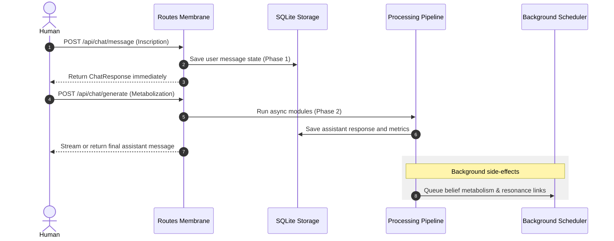

# Backend Performance & Architectural Best Practices
**System:** Autopoietic Agentic Assemblage (AAA)  
**Classification:** Engineering Standard & Best Practices Guide

---

To ensure high-throughput memory sedimentation, transaction safety, and predictable resource allocation as the conversational space scales, the AAA backend follows strict data access, concurrency, and validation guidelines.

---

## 1. Decoupled Lifecycles: Inscription vs. Metabolization

To keep the application highly responsive, user inputs must never block on long-running LLM runs or pipeline updates. The AAA system utilizes a two-phase architecture:



### Guidelines
*   **Phase 1 (Inscription)**: Standard message insertions via `/api/chat/message` must only perform basic validation, generate message embeddings (if local models are warm), write to database tables, and return immediately.
*   **Phase 2 (Metabolization)**: High-latency steps (agent cognitive pipeline, LLM generation, homeostatic metrics calculations) are executed in a decoupled, asynchronous step via `/api/chat/generate`.
*   **Background Actions**: Hand off non-blocking, post-generation tasks (e.g., belief network updates, cross-branch resonance scanning, automatic conversation title generation) to `BackgroundTasks` to free up route handlers.

---

## 2. Database Transactions & `@with_connection` Safety

AAA uses SQLite in Write-Ahead Logging (WAL) mode (`PRAGMA journal_mode=WAL`) to allow concurrent reads while a write operation is active. To prevent database locks and connection leaks, database access relies on connection tracking context managers.

### Guidelines
*   **Connection Tracking**: Apply the `@with_connection` decorator to all repository methods that perform SQL queries. This stores the database connection in a thread-local tracker and closes it automatically when the outermost decorated method returns.
*   **Nesting Safety**: The `@with_connection` decorator supports nesting. If repository method A calls repository method B, they share the same connection tracking depth and the database connection remains open until method A finishes.
*   **No Async Decoration**: Do not apply `@with_connection` to asynchronous (`async def`) functions. Because `threading.local` is bound to the operating system thread, and the decorator is synchronous, calling an awaited function wrapped in `@with_connection` will cause the connection to close prematurely when the coroutine object is returned, not when it is finished.

> [!WARNING]
> If a repository method needs to perform async operations, do not decorate it directly. Instead, execute the database logic synchronously within a `run_in_executor` call, or retrieve connections explicitly using a context manager.

---

## 3. Concurrency & Per-Conversation Serialization

FastAPI executes async endpoints on the main event loop thread. Any blocking synchronous call (e.g. raw SQL queries, token estimation, regex loops) halts the entire server's ability to handle other requests.

### Guidelines
*   **Idempotency & Parallel Nodes**: When branches or parallel lines of flight are generated, verify that insertions are idempotent by checking `parent_message_id` and `conversation_id` before writing.
*   **Thread Safety in Background Tasks**: Since background tasks run outside the main request context, ensure they catch their own exceptions and manage connection scopes safely to prevent connection leakages.
*   **Avoid Global Locks**: Do not block the entire application to synchronize mutations. If serialization is required (e.g., ensuring two messages in the same conversation are metabolized sequentially), implement per-conversation locks using local dictionaries of `asyncio.Lock` instances.

---

## 4. Structured Error Representation (The Glitch)

Errors are not failures to hide, but the boundary limits of the apparatus becoming audible. Swallowing exceptions or returning opaque HTTP status codes is unacceptable.

### Guidelines
*   **Structured Glitch Payload**: Return structured JSON bodies on error, including the kind of validation or state failure, target entity, and context details:
    ```json
    {
      "status": "error",
      "kind": "constraint_violation",
      "message": "Cannot branch message: parent ID not found",
      "entity": "message_branch",
      "details": { "parent_message_id": 404 }
    }
    ```
*   **Central Validation Membranes**: Incoming payload validation should be handled strictly at the boundary using Pydantic schemas. Never accept arbitrary body keys; model your parameters explicitly in [backend/api/schemas.py](file:///d:/01_GIT/AAA/backend/api/schemas.py).
*   **Do Not Silence**: Log all exceptions with `logger.exception()` to capture full stack traces in the error logs, and record system crashes to `ErrorLogRepository` for persistence.

---

## 5. Observability: Structured Logging & Terminology

Every log is an inscription of system activity. Text logs that scroll past without structure are lost sediment.

### Guidelines
*   **Structured Traces**: Include `conversation_id`, `message_id`, and `intra_action` tags in log messages whenever possible. Use structured formatting for easy query filtering.
*   **Avoid Control Metaphors**: Reject master/slave naming conventions. Use `primary/replica` for database replica mappings, and terms like `co-workers` or `intra-actors` to describe cooperating execution modules.

---

## 6. Testing Standards & Isolation

*   **Test Isolation**: The test suite is isolated from production files. `conftest.py` automatically configures the database path to `data/aaa_test.db` and deletes the test file upon suite teardown.
*   **Mocking Provider Properties**: In unit tests, avoid calling properties or methods on mock LLM clients that return coroutine instances unless they are explicitly awaited. Prevent `generate_unified` from calling mock properties by filtering out `NonCallableMock` types.

---

## 7. File Structure & Directory Boundaries

A directory in the AAA backend is an **agential cut**—it must be named and structured for the kind of processing boundary it enforces, resisting the gravity of generic "junk drawers."

### Standard Directories
*   `api/`: **The Membrane**. Contains HTTP routes, request/response validation schemas, and serialization adapters. Nothing outside `api/` should deal with FastAPI dependencies or HTTP status codes.
*   `bootstrap/`: **The Assembly**. Modular app initialization factories (providers, repositories, embedder, modules, pipeline, background engine, lifecycle). Each file handles one concern; `lifecycle.py` orchestrates them in `lifespan()`. This was split from the original monolithic `main.py` to improve testability and maintainability.
*   `services/`: **The Orchestration**. Core command layer entry points that accept an inscription (Phase 1) and invoke the runtime metabolization pipelines.
*   `metabolisation/` (formerly `core/`): **The Transformation**. Contains the long-running engine pipelines, background schedulers, and daemon routines that digest sediment.
*   `modules/` (transitioning to `cognition/` and `ingestion/`): **The Cognitive Operators**. Pluggable units (engines, scrapers, and retrievers) loaded and run by the metabolization pipeline.
*   `storage/`: **The Sediment**. Holds database connections, migrations, repositories, and pure domain entities (`models.py`).
*   `skills/`: **The Attunements**. Pluggable user-defined prompt wrappers and procedural task flows.
*   `utils/`: **The Instruments**. Shared computation and formatting utilities (persona loading, prompt building, vector math, token counting) consumed across pipeline modules, services, and the research orchestrator.
*   `services/research/`: **The Research Tools**. Self-contained tool modules (search, parse, digest) composed by `SomaticResearchOrchestrator` into the multi-phase research pipeline. Each tool is independently testable and swappable.

### Stratal Migration & Deprecation Aliases
When refactoring directory paths:
1.  **Do not break imports abruptly**. Implement new folders and move the code first.
2.  **Create deprecated alias modules** in the old locations using `DeprecationWarning` to inform co-participants of the boundary shift.
3.  **Perform batch migrations** of internal imports, verify using the test suite, and delete stubs only when the old paths are completely unused.

