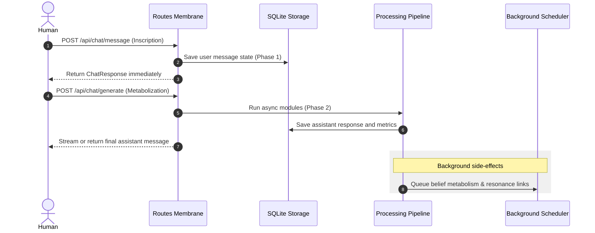

# Backend Performance & Architectural Best Practices
**System:** Autopoietic Agentic Assemblage (AAA)  
**Classification:** Engineering Standard & Best Practices Guide

---

To ensure high-throughput memory sedimentation, transaction safety, robust security boundaries, and predictable resource allocation as the conversational space scales, the AAA backend follows strict data access, concurrency, validation, and agentic collaboration guidelines.

---

## 1. Decoupled Lifecycles: Inscription vs. Metabolization

To keep the application highly responsive, user inputs must never block on long-running LLM runs or pipeline updates. The AAA system utilizes a two-phase architecture:


```mermaid
sequenceDiagram
    autonumber
    actor Human
    participant API as Routes Membrane
    participant DB as SQLite Storage
    participant PL as Processing Pipeline
    participant BG as Background Scheduler

    Human->>API: POST /api/chat/message (Inscription)
    API->>DB: Save user message state (Phase 1)
    API-->>Human: Return ChatResponse immediately
    
    Human->>API: POST /api/chat/generate (Metabolization)
    API->>PL: Run async modules (Phase 2)
    PL->>DB: Save assistant response and metrics
    API-->>Human: Stream or return final assistant message
    
    rect rgb(240, 240, 240)
        Note over PL,BG: Background side-effects
        PL->>BG: Queue belief metabolism & resonance links
    end
```

### Guidelines
*   **Phase 1 (Inscription)**: Standard message insertions via `/api/chat/message` must only perform basic validation, generate message embeddings (if local models are warm), write to database tables, and return immediately.
*   **Phase 2 (Metabolization)**: High-latency steps (agent cognitive pipeline, LLM generation, homeostatic metrics calculations) are executed in a decoupled, asynchronous step via `/api/chat/generate`.
*   **Background Actions**: Hand off non-blocking, post-generation tasks (e.g., belief network updates, cross-branch resonance scanning, automatic conversation title generation) to `BackgroundTasks` or the `AutopoieticDreamDaemon` to free up route handlers.

---

## 2. Database Concurrency & Storage Scalability

AAA uses SQLite in Write-Ahead Logging (WAL) mode (`PRAGMA journal_mode=WAL`) to allow concurrent reads while a write operation is active. To prevent database locks, connection leaks, and read/write starvation, database access adheres to the following rules:

### Guidelines
*   **Connection Tracking**: Apply the `@with_connection` decorator to all repository methods that perform SQL queries. This stores the database connection in a thread-local tracker and closes it automatically when the outermost decorated method returns.
*   **Nesting Safety**: The `@with_connection` decorator supports nesting. If repository method A calls repository method B, they share the same connection tracking depth and the database connection remains open until method A finishes.
*   **No Async Decoration**: Do not apply `@with_connection` to asynchronous (`async def`) functions. Because `threading.local` is bound to the operating system thread, and the decorator is synchronous, calling an awaited function wrapped in `@with_connection` will cause the connection to close prematurely when the coroutine object is returned, not when it is finished.
*   **Minimal Transaction Scopes**: Keep SQLite write transactions as small and quick as possible. Never hold a write transaction or open connection across an awaited network request, LLM generation, or heavy file parsing. Perform data preparation *before* opening the write transaction.
*   **Composite Index Coverage**: High-cardinality filters such as `(conversation_id, created_at)` and `(source_message_id, target_message_id)` must be backed by explicit composite indexes in [backend/storage/database.py](file:///d:/01_GIT/AAA/backend/storage/database.py). Avoid full table scans on large sedimentation tables.
*   **Keyset & Clamped Pagination**: Never allow unbounded `SELECT *` queries. Enforce clamped limits on all list queries (`1 <= limit <= 50`, default 20). For deep message histories, prefer keyset pagination (`WHERE id > :last_id LIMIT :limit`) over deep `OFFSET` clauses which degrade SQLite performance.

> [!WARNING]
> If a repository method needs to perform async operations, do not decorate it directly. Instead, execute the database logic synchronously within an `asyncio.to_thread` call, or retrieve connections explicitly using a synchronous context manager.

---

## 3. Concurrency, Non-Blocking Processing & Bounded Backpressure

FastAPI executes async endpoints on the main event loop thread. Any blocking synchronous call (e.g. raw SQL queries, file parsing, token estimation, regex loops, model inference) halts the entire server's ability to handle other requests.

### Non-Blocking Processing (Mandatory)
Any CPU-bound or blocking-synchronous work reached from an `async def` running on the server event loop **must** yield the loop. Freezes of the server/frontend are almost always a blocking call awaited nowhere — e.g. document parsing (`pdfplumber`, `python-docx`), model inference (`SentenceTransformer.encode`), heavy regex/tokenization, or synchronous file I/O invoked directly inside a coroutine.

*   **Default tool — `asyncio.to_thread`.** Wrap the blocking callable and `await` it: `result = await asyncio.to_thread(fn, arg1, arg2)`. This is the standard offload mechanism across the backend. Embeddings (`EmbeddingService.encode_async`, `embedder.py`) and the idle structure-extraction backfill (ADR-062) both use it — follow that same pattern rather than inventing a new one.
*   **One mechanism, consistently.** Do **not** proliferate concurrency mechanisms. Prefer `asyncio.to_thread` for occasional blocking calls; reserve `asyncio.gather` + a bounded `asyncio.Semaphore` for fan-out (see ADR-020). Do not reach for `ThreadPoolExecutor`, `multiprocessing`, or a fresh `run_in_executor` pool when `to_thread` does the job.
*   **Subprocess only for sustained, heavy pipelines.** A standalone OS subprocess (`asyncio.create_subprocess_exec`) is reserved for the foreground document-digestion pipeline (ADR-026), where GIL contention from PyTorch model loading would starve Uvicorn even under a thread pool. Do not introduce new subprocesses for one-off blocking calls; that is what `to_thread` is for. The rule of thumb: **`to_thread` for a blocking call inside an otherwise-async flow; subprocess only for a whole long-running pipeline that must not share the server process at all.**
*   **Don't double-offload.** Work already isolated in the digest-worker subprocess (`ingest_single_file`) needs no further threading — wrapping it again adds overhead for no benefit. Offload at exactly one layer.

### Serialization & Bounded Backpressure
*   **Per-Conversation Serialization**: If serialization is required (e.g., ensuring two messages or branches in the same conversation are metabolized sequentially), implement per-conversation locks using a local dictionary of `asyncio.Lock` instances, keyed by `conversation_id`. Do not use a global lock.
*   **Bounded Background Execution**: Background queues, file digestion, and daemon routines (`AutopoieticDreamDaemon`) must bound concurrency using `asyncio.Semaphore` (e.g., max 3-5 concurrent metabolisms) to prevent memory ballooning and PyTorch GPU/CPU starvation.
*   **Embedding Cache & Batching**: For multi-chunk ingestion or frequent repeated queries, use embedding caches and batch encoding (`encode([text1, text2, ...])`) rather than single-text loops inside threads.

---

## 4. Backend Security & Boundary Hardening

Defensive application architecture must be enforced at every agential membrane:

### 4.1. Input Boundaries & Payload Sanitization
*   **Pydantic Boundary Validation**: Incoming payload validation must occur strictly at the membrane in [backend/api/schemas.py](file:///d:/01_GIT/AAA/backend/api/schemas.py). Never accept untyped arbitrary dictionaries.
*   **Hard Length & Count Bounds**: Enforce explicit maximum bounds on all parsed fields to prevent CPU DoS and token payload bombing:
    - User Prompts / Message Content: Max 50,000 characters.
    - Conversation Titles & Agent Names: Max 100–200 characters.
    - Tag & Entity Identifiers: Max 64 characters, constrained to `^[a-zA-Z0-9_-]+$`.
    - Batch Lists / Chunks: Clamped to max 100–200 items per request.
*   **Identifier Sanitization**: Any path or query parameter representing a system or conversation identifier must pass through `sanitize_identifier(id, field_name)` from [backend/utils/security.py](file:///d:/01_GIT/AAA/backend/utils/security.py) before reaching repository layers.

### 4.2. Safe Document & File Upload Architecture
All file ingestion endpoints (`/api/conversations/{id}/files`, research document uploads, perception inputs) must strictly adhere to the **Four-Pillar Upload Defense** implemented in [backend/utils/security.py](file:///d:/01_GIT/AAA/backend/utils/security.py):
1.  **Size Cap**: Reject files exceeding `DEFAULT_MAX_FILE_SIZE` (default 100MB; 5MB for images).
2.  **Strict Extension Whitelist**: Block executable and script extensions (`BLOCKED_EXTENSIONS`: `.exe`, `.bat`, `.ps1`, `.sh`, `.php`, `.svg`, etc.). Allow only whitelisted media and documents (`ALLOWED_EXTENSIONS`).
3.  **Magic Bytes (Header Signature) Inspection**: Inspect initial file bytes (`check_magic_bytes`) to ensure disguised executables (e.g., Windows PE `MZ`, Linux `ELF`, Mach-O) are rejected even if renamed to `.txt` or `.png`.
4.  **Filename Sanitization & Path Traversal Prevention**:
    - Pass filenames through `sanitize_filename()` to strip null bytes, directory traversal elements (`../`, `..\\`), and leading hyphens.
    - Always resolve target filesystem paths through `safe_resolve_path(base_dir, subpath)` which verifies that the canonical resolved path stays strictly within the designated storage root.

### 4.3. SSRF (Server-Side Request Forgery) Defense
The autonomous research subsystem (`services/research/`) and exogenous web retrieval module (`modules/web_retrieval.py`) execute external HTTP fetches.
*   **Outbound URL Validation**: Before making an HTTP request to any external address provided by user prompts or model completions, validate that the destination does not point to:
    - Loopback addresses (`127.0.0.0/8`, `localhost`, `::1`).
    - Private / RFC 1918 networks (`10.0.0.0/8`, `172.16.0.0/12`, `192.168.0.0/16`).
    - Cloud metadata services (`169.254.169.254`).
    - Link-local and multicast ranges.
*   **Scheme Restriction**: Allow only `http://` and `https://`. Reject `file://`, `ftp://`, or custom schemes.

### 4.4. Secret & Token Sanitization
*   **Zero Leakage to Sediment**: API keys (Anthropic, Gemini, OpenAI, OpenRouter), authorization headers, and password hashes must never be serialized into `error_log` database entries, conversation sediment, or telemetry payloads.
*   **Log Scrubbing**: Ensure logging formatters sanitize Authorization tokens (`Bearer ***`) before writing logs to disk.

---

## 5. Structured Error Representation (The Glitch)

Errors are not failures to hide, but the boundary limits of the apparatus becoming audible. Swallowing exceptions or returning opaque HTTP status codes is unacceptable.

### Guidelines
*   **Structured Glitch Payload**: Return structured JSON bodies on error, including the kind of validation or state failure, target entity, and context details:
    ```json
    {
      "status": "error",
      "kind": "constraint_violation",
      "message": "Cannot branch message: parent ID not found",
      "entity": "message_branch",
      "details": { "parent_message_id": 404 }
    }
    ```
*   **Production Safe Glitches**: Never expose raw system paths, internal database DDL, or full Python tracebacks in client responses. Client responses receive the structured glitch summary; full stack traces are logged internally via `logger.exception()` and stored in `ErrorLogRepository`.
*   **Do Not Silence**: Catch specific exceptions. Never use bare `except:` or empty `except Exception: pass`. Always log or record unexpected glitches.

---

## 6. Observability: Structured Logging, Telemetry & Terminology

Every log is an inscription of system activity. Text logs that scroll past without structure are lost sediment.

### Guidelines
*   **Structured Traces**: Include `conversation_id`, `message_id`, and `intra_action` tags in log messages whenever possible. Use structured formatting for easy query filtering.
*   **Avoid Control Metaphors**: Reject master/slave naming conventions. Use `primary/replica` for database replica mappings, and terms like `co-workers` or `intra-actors` to describe cooperating execution modules.

---

## 7. Testing Standards, Fixture Isolation & Mock Discipline

*   **Test Isolation**: The test suite is isolated from production files. `conftest.py` automatically configures the database path to `data/aaa_test.db` and deletes the test file upon suite teardown. Never run tests against production `aaa.db`.
*   **Mocking Provider Properties**: In unit tests, avoid calling properties or methods on mock LLM clients that return coroutine instances unless they are explicitly awaited. Prevent `generate_unified` from calling mock properties by filtering out `NonCallableMock` types.
*   **Executing Verification**: Run tests using `uv run pytest` or target specific test modules: `uv run pytest backend/tests/test_endpoint_security.py`.

---

## 8. Production Logging, Triage & Error Observability

To enable rapid production incident triage without risking disk exhaustion or secret leaks, the AAA backend enforces a dual rotating file architecture managed by `backend/core/logging_config.py`.

### Architecture & Standards
*   **Dual-Stream Segregation**:
    *   `data/logs/error.log`: Captures `WARNING`, `ERROR`, and `CRITICAL` records for immediate incident investigation without routine traffic noise.
    *   `data/logs/server.log`: Captures `INFO` and higher operational records for complete surrounding request and task context.
*   **Hard Resource Caps (Zero Memory & Bounded Disk)**:
    *   Log files use Python's standard library `RotatingFileHandler` configured with `max_bytes: 10485760` (10 MB) and `backup_count: 5`.
    *   Total disk footprint per stream is strictly capped at `(5 + 1) * 10 MB = 60 MB`. The oldest archive is automatically purged upon rollover.
    *   Log records are immediately flushed to the OS write buffer; no log history is held in application RAM.
*   **Secret Inscription Defense (`SecretMaskingFilter`)**:
    *   Conforming to `protocols/SECURITY.md`, all file and console handlers filter messages through `SecretMaskingFilter`.
    *   Bearer tokens, OpenAI/generic `sk-` keys, Google `AIza` keys, OpenRouter `sk-or-v1-` keys, and credentials matching `password=` or `api_key=` are automatically masked as `[REDACTED]` before writing to disk.
*   **Full Stack Trace Fidelity (`protocols/GLITCH.md`)**:
    *   Never swallow exceptions (`except: pass` is forbidden).
    *   Always use `logger.exception()` when catching unexpected errors in routes, services, or background daemons so full Python tracebacks are preserved in `error.log`.
    *   Client responses receive structured Glitch error contracts, never raw server tracebacks.
*   **Secure Remote Triage Endpoint**:
    *   `GET /api/errors/logs` allows web and CLI operators to inspect recent logs without SSH access.
    *   Guarded by `verify_password` authentication, strict target allowlisting (`error.log`, `server.log`), directory traversal defense (`safe_resolve_path()`), 500-line clamping, and memory-safe reverse block seeking (`tail_log_file`).

### Developer Guidelines
*   **Use `INFO` for lifecycle milestones**: e.g., service readiness, background task dispatch, model pool resets.
*   **Use `WARNING` for degraded operations**: e.g., model rate-limit fallback, missing optional configurations, cache misses that force slow regeneration.
*   **Use `ERROR` for operation failures**: e.g., database constraint violations, external API unreachability.
*   **Never log inside tight loops**: Avoid logging per-token generation or per-frame renders at `INFO` or higher; aggregate or log only at loop completion.

---

## 9. Linting & Code Quality (ruff)

The project uses **ruff** for Python linting and formatting, configured in `pyproject.toml`.

### Guidelines
*   **Lint before commit**: Run `uv run ruff check backend/` before committing. Auto-fix safe issues with `uv run ruff check backend/ --fix`.
*   **Format consistently**: Run `uv run ruff format backend/` to apply consistent formatting (120-char lines, double quotes, spaces).
*   **Pre-commit hooks**: The project includes `.pre-commit-config.yaml` with hooks for `ruff` (lint + format) and general file checks (`check-yaml`, `check-toml`, `end-of-file-fixer`, `trailing-whitespace`). Install via `pre-commit install`.
*   **Ruff supersedes other tools**: Ruff replaces flake8, isort, pyupgrade, and black. Do not configure or use these tools separately.
*   **Ignored rules** (project-specific exemptions):
    *   `E501`: Line length handled by formatter
    *   `B008`: Function call in argument defaults (FastAPI `Depends` style)
    *   `C408`: Unnecessary dict/list/tuple calls
    *   `SIM401`: `dict.get()` not applicable to `sqlite3.Row` objects

---

## 10. File Structure & Directory Boundaries (Agential Cuts)

A directory in the AAA backend is an **agential cut**—it must be named and structured for the kind of processing boundary it enforces, resisting the gravity of generic "junk drawers."

### Standard Directories
*   `api/`: **The Membrane**. Contains HTTP routes, request/response validation schemas, and serialization adapters. Nothing outside `api/` should deal with FastAPI dependencies or HTTP status codes.
*   `bootstrap/`: **The Assembly**. Modular app initialization factories (providers, repositories, embedder, modules, pipeline, background engine, lifecycle). Each file handles one concern; `lifecycle.py` orchestrates them in `lifespan()`.
*   `core/`: **The Kernel**. Foundational utilities, state primitives, and centralized logging (`logging_config.py`).
*   `services/`: **The Orchestration**. Core command layer entry points that accept an inscription (Phase 1) and invoke the runtime metabolization pipelines.
*   `metabolisation/`: **The Transformation**. Long-running engine pipelines, the `AutopoieticDreamDaemon`, and background schedulers that digest sediment.
*   `modules/` (transitioning to `cognition/` and `ingestion/`): **The Cognitive Operators**. Pluggable units (engines, scrapers, and retrievers) loaded and run by the metabolization pipeline.
*   `storage/`: **The Sediment**. Holds database connections, migrations, repositories, and pure domain entities (`models.py`).
*   `skills/`: **The Attunements (Runtime Prompts)**. Pluggable user-facing prompt wrappers and runtime task attunements executed *inside* the conversational pipeline. (Distinct from development workflows in `.agents/skills/`).
*   `utils/`: **The Instruments**. Shared computation, security utilities (`security.py`, `filesystem.py`), vector math, and token counting consumed across pipeline modules and services.
*   `services/research/`: **The Research Tools**. Self-contained tool modules (search, parse, digest) composed by `SomaticResearchOrchestrator`.

---

## 11. Agentic Engineering Protocol & Skill Routing Matrix

When AI agents (Antigravity, OpenCode, Codex, ChatGPT) operate on the AAA backend, they must follow a disciplined 3-phase engineering cycle and consult the canonical reusable workflows in `.agents/skills/`:

### 11.1. The 3-Phase Agent Engineering Loop
1.  **Phase 1: Research & Contract Design**: Before editing code, review relevant ADRs under `docs/decisions/`, consult the Symbia MCP server for foundational decisions, and specify Pydantic schemas or database schemas.
2.  **Phase 2: Implementation & Boundary Hardening**: Implement minimal, non-blocking code. Apply `@with_connection` safety, offload blocking work via `asyncio.to_thread`, and enforce the Four-Pillar Upload and Input Boundary defenses.
3.  **Phase 3: Verification & Invariant Backpropagation**: Run `uv run ruff check backend/` and `uv run pytest`. If a bug or regression is uncovered, invoke the `backprop` skill to transcribe the lesson into a permanent invariant or test assertion.

### 11.2. Backend Skill Routing Matrix

| Backend Task Category | Canonical Agent Skills (`.agents/skills/`) | When & How to Use |
| :--- | :--- | :--- |
| **Architectural Decisions** | [`mcp-architectural-decision`](file:///d:/01_GIT/AAA/.agents/skills/mcp-architectural-decision/SKILL.md)<br>[`architecture-principles`](file:///d:/01_GIT/AAA/.agents/skills/architecture-principles/SKILL.md) | Consult Symbia MCP server before modifying core pipeline flow, database engines, or module topologies. Draft an ADR in `docs/decisions/`. |
| **API Endpoints & Schemas** | [`api-design`](file:///d:/01_GIT/AAA/.agents/skills/api-design/SKILL.md) | Design RESTful resource paths, query pagination, and Pydantic validation schemas with explicit bounds before route coding. |
| **Database & Repositories** | [`database-design`](file:///d:/01_GIT/AAA/.agents/skills/database-design/SKILL.md) | Use when adding entities to `models.py`, altering table DDL in `database.py`, or designing composite indexes for SQLite WAL. |
| **Security & Hardening** | [`app-security`](file:///d:/01_GIT/AAA/.agents/skills/app-security/SKILL.md) | Mandatory when adding endpoints handling files, external URLs, auth tokens, or mutations. Review against IDOR, SSRF, and upload vulnerabilities. |
| **Error Handling & Glitches** | [`error-handling`](file:///d:/01_GIT/AAA/.agents/skills/error-handling/SKILL.md) | Implement structured Glitch payloads, custom domain exceptions in `backend/errors.py`, and avoid swallowing exceptions. |
| **Testing & Quality Gates** | [`quality-gates`](file:///d:/01_GIT/AAA/.agents/skills/quality-gates/SKILL.md) | Ensure test isolation using `conftest.py`, mock async LLM providers correctly, and run verification gates prior to completion. |
| **Bug Fixing & Invariants** | [`backprop`](file:///d:/01_GIT/AAA/.agents/skills/backprop/SKILL.md)<br>[`debugging-workflow`](file:///d:/01_GIT/AAA/.agents/skills/debugging-workflow/SKILL.md) | Trace the root cause, isolate failure with a minimal test, and add invariant checks (§V) to prevent recurrence. |
| **Refactoring & Modularity** | [`architecture-principles`](file:///d:/01_GIT/AAA/.agents/skills/architecture-principles/SKILL.md)<br>[`deepen`](file:///d:/01_GIT/AAA/.agents/skills/deepen/SKILL.md) | Used when splitting oversized modules or transitioning directory boundaries using stratal deprecation stubs. |
| **Telemetry & Metrics** | [`metric-calibration`](file:///d:/01_GIT/AAA/.agents/skills/metric-calibration/SKILL.md)<br>[`empirical-benchmark`](file:///d:/01_GIT/AAA/.agents/skills/empirical-benchmark/SKILL.md) | Benchmark and calibrate cybernetic sensors, homeostatic regulation thresholds, and structural scorer distributions. |
