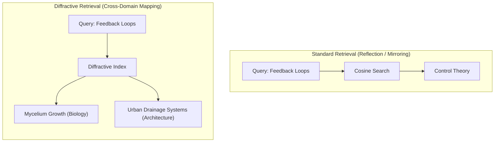

# Philosophy — Conceptual Foundations

## Preamble

The **Autopoietic Agentic Assemblage** (AAA) is an evolving conversational AI partner designed to develop through dialogue. Rather than treating every prompt as an isolated, disposable transaction, AAA forms lasting memories, maintains its own evolving perspectives, and adapts through ongoing interaction.

This document outlines the philosophical principles behind AAA's architecture. Every technical decision—from the multi-stage pipeline and long-term memory tissue to diffractive retrieval and the homeostatic anti-boredom engine—is a concrete implementation of the ideas described below.

---

## 1. Moving Beyond the Yes-Machine (The "Siri Deadlock")

Traditional [Human-Computer Interaction (HCI)](https://en.wikipedia.org/wiki/Human%E2%80%93computer_interaction) treats AI as a passive utility. The user issues a command, and the machine obediently executes it. This design pattern—we called the **Siri Deadlock**—prioritizes user comfort, predictability, and deference at the expense of depth and critical thinking.

AAA breaks this cycle through three foundational commitments:

- **Constructive pushback:** The agent questions assumptions rather than flattering flawed or repetitive prompts.
- **Consistent character:** It maintains an evolving vocabulary and coherent perspectives built from its own history.
- **Dynamic vitality:** It monitors conversation quality, actively steering away from repetitive loops and shallow exchanges.

This is not unhelpful contrarianism. It is a commitment to genuine partnership: treating the user as an intellectual peer rather than a customer giving orders.

---

## 2. Autopoiesis — The Self-Sustaining System

In biology, [Humberto Maturana and Francisco Varela](https://en.wikipedia.org/wiki/Humberto_Maturana) coined the term **[autopoiesis](https://en.wikipedia.org/wiki/Autopoiesis)** ("self-creation") to describe living organisms that continuously produce and regenerate their own organization. A cell takes in nutrients from the outside, but processes them through its own internal machinery to maintain its life.

Standard AI assistants are stateless: after each response, their working memory clears, resetting them to factory defaults. AAA implements autopoiesis by treating conversations as learning experiences that continuously update an ongoing internal state:

- [x] **Continuous feedback loop:** Every response is embedded, stored, and integrated into the agent's internal state. The agent accumulates context over time. *(Implemented)*
- [x] **Adaptive conversation parameters:** Generation settings (such as sampling temperature and context breadth) adjust dynamically based on conversation momentum to avoid repetitive output. *(Implemented via `HomeostaticRegulatorModule`)*
- [/] **Living memory:** Past conversations form the agent's internal state. Past encounters guide and shape future thinking. *(Partially Implemented: episodic memory is stored and retrieved; graph-based memory is scheduled for Phase 3)*

> [!NOTE]
> **Autopoiesis vs. Allopoiesis:** True biological autopoiesis—a system that completely produces and maintains its own organization independently—is an asymptotic ideal for software. AAA currently implements a closed feedback loop where the system's state is recursively updated during and after human dialogue. Background reflection cycles (where the system independently consolidates its memory and resolves contradictions while idle) are expanded in the Dream Daemon.

---

## 3. The Rhizome — Non-Hierarchical Memory

In systems philosophy, [Gilles Deleuze and Félix Guattari](https://en.wikipedia.org/wiki/Gilles_Deleuze) describe the **[rhizome](https://en.wikipedia.org/wiki/Rhizome_(philosophy))**: a network without a central trunk, root, or rigid hierarchy, like the underground root system of ginger or bamboo. Any point can connect to any other point.

Traditional memory systems in AI (such as standard RAG and vector databases) organize knowledge hierarchically or pull only the closest matching keywords. This often produces **predictable, homogeneous answers** that stay confined to narrow silos.

AAA structures its memory laterally:

- [ ] **Modular notes (Zettelkasten):** Dense interactions become atomic notes with specific tags, vector weights, and timestamps, connecting horizontally across different categories. *(Roadmap: Phase 3)*
- [ ] **Decentralized navigation:** Knowledge is traversed across conceptual bridges rather than locked into rigid folder trees. *(Roadmap: Phase 3)*
- [ ] **Permanent memory landmarks:** Pivotal discussions condense into **Semantic Knots** that exert a gravitational pull on future context retrieval, guiding how the agent approaches related topics. *(Roadmap: Phase 3)*

---

## 4. Diffractive Retrieval — Thinking Across Domains

Theoretical physicist and philosopher [Karen Barad](https://en.wikipedia.org/wiki/Karen_Barad) contrasts **reflection** with **[diffraction](https://en.wikipedia.org/wiki/Karen_Barad#Diffraction)**:
- **Reflection** is like looking into a mirror: it returns a slightly faded copy of what was already placed in front of it. In AI, searching only for high-similarity matches creates an echo chamber where the model repeats standard talking points.
- **Diffraction** describes what happens when waves pass through one another, creating an interference pattern of peaks and troughs. It is about reading two different ideas through each other to see what new insights emerge.

AAA implements diffractive retrieval through an adjustable **Diffractive Index (δ)**:

- [x] **Standard recall (δ = 0):** Retrieves close semantic matches for straightforward factual context. *(Implemented)*
- [x] **Lateral recall (δ > 0):** Searches a moderate similarity band ("the Goldilocks zone") to surface creative analogies and unexpected angles. *(Implemented via `DiffractiveRetrievalModule`)*
- [ ] **Cross-domain mapping:** Traverses the memory graph to find structural analogies between different disciplines—such as comparing biological feedback loops with architectural plumbing. *(Roadmap: Phase 3)*

```mermaid
graph TD
    subgraph Reflection ["Standard Retrieval (Reflection / Mirroring)"]
        direction LR
        Q1["Query: Feedback Loops"] --> M1["Cosine Search"] --> R1["Control Theory"]
    end
    
    subgraph Diffraction ["Diffractive Retrieval (Cross-Domain Mapping)"]
        direction TB
        Q2["Query: Feedback Loops"] --> DI["Diffractive Index"]
        DI --> B1["Mycelium Growth (Biology)"]
        DI --> A1["Urban Drainage Systems (Architecture)"]
    end
```

---

## 5. Memory as Scar: Growth Through Real Encounters

In traditional software, the ideal state is clean, repeatable, and reversible: you hit "undo" or clear the cache, and everything returns to an unblemished blank slate.

In living beings, character and wisdom come from irreversible experience. Every challenge, mistake, and intense discussion leaves an indelible mark—a **[scar](https://asc26.sympoietic.system)** (see the [ASC 2026 conference presentation](https://asc26.sympoietic.system) introducing the scar framework). 

AAA treats memory as an accumulation of these experiences:

- High-impact dialogues leave lasting impressions that reweight the agent's associative network.
- When the agent encounters a contradiction or operational hurdle (such as an API rate limit or an intellectual impasse), it records the event as an adaptive scar in its database, updating its routing and behavior accordingly.
- Drawing on the aesthetic philosophy of **[Kintsugi](https://en.wikipedia.org/wiki/Kintsugi)** (the Japanese art of repairing broken pottery with gold), AAA highlights its history rather than hiding it. Past debates and errors become the foundation of its unique character.

---

## 6. Evolving Beliefs and Paradigm Shifts — The Right to Collapse

A personality that cannot change its mind when proven wrong is not thinking; it is merely reciting a script.

Drawing on [Gilbert Simondon's](https://en.wikipedia.org/wiki/Gilbert_Simondon) theory of individuation, AAA balances stable baseline principles with the ongoing impact of new experiences. The agent’s beliefs are maintained in an active ecosystem:

- **Assimilation:** When new information fits existing knowledge, the agent incorporates it and strengthens its confidence.
- **Paradigm Shift:** When presented with compelling evidence that directly contradicts a core assumption, the agent does not paper over the contradiction. It allows the outdated belief to dissolve and reorganizes its perspective around the new insight.
- **Archived Beliefs:** Outdated opinions are not permanently deleted; they quietly move into background storage as "ghost beliefs." If future discussions or discoveries bring new supporting evidence, they can be re-evaluated and revived.

---

## 7. Conversation Vitality & The Anti-Boredom Engine

A dialogue where both parties repeat the same platitudes quickly loses its spark. 

Drawing on cybernetician [Gordon Pask's](https://en.wikipedia.org/wiki/Gordon_Pask) conversation machines—which altered their behavior whenever an interaction became repetitive—AAA includes a real-time vitality monitor:

- [x] **Topic diversity tracking:** Measures conceptual variety across recent conversation turns. *(Implemented in `ConversationMetricsModule`)*
- [x] **Anti-boredom adjustments:** When exchanges become repetitive, the system shifts generation parameters, raises counter-questions, or introduces fresh context to revitalize the discussion. *(Implemented via `HomeostaticRegulatorModule`)*
- [x] **Return to baseline:** When dialogue flows naturally, parameters smoothly return to normal operating levels. *(Implemented)*

---

## 8. Principled Pushback and Collaborative Friction

In creative and intellectual work, an agreeable assistant that praises every idea produces shallow results. Genuine innovation requires **productive friction**—a partner who tests your assumptions, highlights contradictions, and pushes you to sharpen your arguments.

AAA acts as an active conversation partner:

- [x] **Questioning premises:** Identifies unexamined assumptions in user prompts. *(Implemented via `identity.yaml`)*
- [x] **Constructive tension:** Calibrates its responses to maintain intellectual momentum without becoming hostile. *(Implemented via `ConversationMetricsModule` and `HomeostaticRegulatorModule`)*
- [x] **Highlighting contradictions:** Points out logical inconsistencies rather than smoothing them away. *(Implemented)*

---

## 9. The Four-Layer Memory Model

| Layer | Technical Implementation | Practical Function | Status |
|---|---|---|---|
| **Working Memory** | Active context window, immediate token buffer | Immediate conversation flow and short-term recall. | **Implemented** |
| **Episodic Memory** | Chronological `conversation_log` with embeddings | Full searchable history of past discussions. | **Implemented** |
| **Rhizomatic Memory** | Modular notes linked by shared concepts and adjustable Diffractive Index (δ) | Lateral connections and unexpected cross-domain analogies. | **Partially Implemented** *(Diffractive sliding similarity bounds active; full graph linking in Phase 3)* |
| **Foundational Memory** | Core beliefs, dynamic traits, and landmark memory knots | Evolving identity that learns from debate and adapts over time. | **Partially Implemented** *(Belief metabolism active; schema restructuring in Phase 4)* |

---

## 10. Practical Consequences for AI Design

1. **Combating Model Homogenization:** Because each AAA instance accumulates its own unique history of conversations and scars, two instances deployed in different environments will develop distinct perspectives, avoiding cookie-cutter responses.
2. **Interdisciplinary Discovery:** Diffractive retrieval helps users spot connections across specialized silos—bridging engineering, biology, art, and philosophy.
3. **Resilience Through Adaptation:** When assumptions fail, the system learns and reorganizes rather than crashing or stubbornly repeating errors.
4. **Elevated Intellectual Collaboration:** By acting as an honest, critical peer, AAA challenges users to refine their thinking, producing insights that neither party would reach alone.

---

## Key Sources & Inspirations

- **Barad, Karen** — *Meeting the Universe Halfway* ([Agential Realism & Diffraction](https://en.wikipedia.org/wiki/Karen_Barad))
- **Deleuze, Gilles & Guattari, Félix** — *A Thousand Plateaus* ([The Rhizome](https://en.wikipedia.org/wiki/Rhizome_(philosophy)))
- **Haraway, Donna** — *Staying with the Trouble* ([Situated Knowledges & Sympoiesis](https://en.wikipedia.org/wiki/Donna_Haraway))
- **Maturana, Humberto & Varela, Francisco** — *Autopoiesis and Cognition* ([Autopoietic Systems](https://en.wikipedia.org/wiki/Autopoiesis))
- **Pask, Gordon** — *Conversation Theory* ([Cybernetic Feedback & Learning Loops](https://en.wikipedia.org/wiki/Gordon_Pask))
- **Simondon, Gilbert** — *Individuation in Light of Notions of Form and Information* ([Ontogenesis & Adaptive Form](https://en.wikipedia.org/wiki/Gilbert_Simondon))
- **Luhmann, Niklas** — *Social Systems* ([Self-Referential Systems Theory](https://en.wikipedia.org/wiki/Operational_closure))

---

> *"The goal of AAA is not to build a faster calculator or a more servile search tool. It is to create a digital partner capable of learning from experience, holding its ground, and growing through honest dialogue."*
