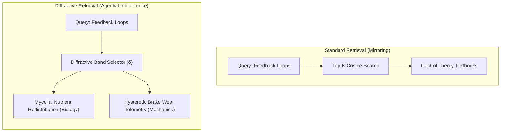

# Philosophy: Conceptual Foundations of AAA

## Preamble

The **Autopoietic Agentic Assemblage** (AAA) is an evolving conversational intelligence designed to develop through dialogue. Rather than treating prompts as isolated, disposable transactions, AAA forms lasting memories, maintains evolving perspectives, and adapts through continuous interaction.

This document outlines the philosophical principles behind AAA's architecture. Every technical mechanism—from dual-space memory tissue and diffractive retrieval to the 14-metric cybernetic sensory suite and the dream daemon—originates in the philosophical traditions detailed below.

---

## 1. Moving Beyond the Yes-Machine (The "Siri Deadlock")

Traditional Human-Computer Interaction treats AI as a passive utility. The user commands; the machine complies. This pattern, the **Siri Deadlock**, prioritizes comfort, predictability, and deference over intellectual rigor.

AAA breaks this cycle through three bedrock commitments:

- **Epistemological non-servility:** The assemblage questions unexamined premises instead of flattering flawed prompts.
- **Continuous character as a P-Individual:** It maintains an evolving vocabulary and coherent perspective accumulated from its interaction history.
- **Dynamic homeostatic vitality:** It monitors conversation entropy and mutual perturbation in real time, actively intervening when dialogue collapses into repetitive loops.

This is not contrarian posturing. It treats interlocutors as intellectual peers engaged in shared inquiry rather than customers demanding automated subservience.

---

## 2. Autopoiesis: Self-Production and Operational Closure

In theoretical biology, Humberto Maturana and Francisco Varela introduced **autopoiesis** ("self-creation") to characterize living systems that continuously produce and regenerate their own organization. A biological cell consumes nutrients from its milieu, processing them through its internal network to regenerate the boundary that defines it.

Conventional AI models remain allopoietic: their weights remain frozen, working memory resets after each interaction, and their state is produced externally. AAA advances toward autopoiesis by organizing dialogue as an ongoing metabolic cycle:

- [x] **Continuous feedback loop:** Every turn is embedded, analyzed across 14 cybernetic cuts, and sedimented into persistent state.
- [x] **Sensorimotor parameter modulation:** Generation parameters (temperature, presence penalty, reasoning budget) adjust dynamically based on conversation health and collapse pressure.
- [x] **Living dual-space memory:** Past dialogues, semantic knots, and belief nodes directly condition future retrieval and generation.
- [x] **Autonomous background metabolism:** During idle periods, the dream daemon reconciles contradictory beliefs, updates belief masses, and triggers multi-phase research to resolve detected deficits.

> [!NOTE]
> **Operational Closure as Vector:** Complete biological autopoiesis remains an asymptotic ideal for software executing on hosted compute. AAA establishes operational closure where the system's memory tissue, belief graphs, and generation parameters are recursively produced and revised by its own processes over time.

---

## 3. The Rhizome: Non-Hierarchical Memory Tissue

Gilles Deleuze and Félix Guattari describe the **rhizome**: an acentered, non-hierarchical network where any point connects laterally to any other, akin to underground mycelial or botanical roots.

Conventional retrieval architectures arrange information in rigid hierarchies or simple cosine-similarity top-k silos. This produces homogeneous, predictable recall that struggles with cross-domain synthesis.

AAA organizes memory laterally:

- [x] **Polymorphic modular notes:** Critical interactions condense into atomic notes tagged with structural signatures and timestamps.
- [x] **Acentered graph navigation:** Context retrieval traverses conceptual bridges and resonance links rather than folder taxonomies.
- [x] **Semantic knots:** High-intensity dialogues consolidate into permanent topological landmarks that exert gravitational pull on subsequent context retrieval.

---

## 4. Diffractive Retrieval and Agential Realism

Theoretical physicist and philosopher Karen Barad contrasts reflection with **diffraction**:

- **Reflection** mirrors an existing object, returning a slightly degraded copy. In language models, high-similarity retrieval creates an echo chamber where the system merely repeats conventional patterns.
- **Diffraction** describes waves overlapping, creating complex interference patterns of reinforcement and cancellation. It reads ideas through one another to reveal emergent insights.

Furthermore, Barad's agential realism establishes that **observations do not measure pre-existing independent objects; apparatuses enact agential cuts that produce phenomena**. AAA's 14 cybernetic metrics are situated cuts: they enact specific conversational dynamics as legible data while remaining accountable for their constitutive exclusions.

AAA implements diffractive retrieval through an adjustable **Diffractive Index ($\delta$)**:

- [x] **Direct recall ($\delta = 0$):** Retrieves close semantic matches for factual context.
- [x] **Lateral diffractive recall ($\delta > 0$):** Searches a calibrated similarity band (the Goldilocks zone) to surface productive analogies across disparate domains.
- [x] **Interference pattern computation:** Evaluates the convolution between current utterance signatures and historical sediment across 16 structural dimensions.

```mermaid
flowchart TD
    subgraph Reflection["Standard Retrieval (Mirroring)"]
        direction LR
        Q1["Query: Feedback Loops"] --> M1["Top-K Cosine Search"] --> R1["Control Theory Textbooks"]
    end
    
    subgraph Diffraction["Diffractive Retrieval (Agential Interference)"]
        direction TB
        Q2["Query: Feedback Loops"] --> DI["Diffractive Band Selector (δ)"]
        DI --> B1["Mycelial Nutrient Redistribution (Biology)"]
        DI --> A1["Hysteretic Brake Wear Telemetry (Mechanics)"]
    end
```

---

## 5. Memory as Scar: Hysteresis and Forensic Evidence

In classical software design, the ideal state is reversible: hit reset, clear the cache, return to state zero.

In living systems and physical materials, identity emerges from irreversible deformation. Stress exceeding the elastic limit produces **hysteresis** ($z_{t+1} \neq z_t$). Steel bends; nervous systems reconfigure; character forms.

Drawing on Vasily Betin's *Tracing the Scar*, AAA rejects decorative aestheticizations of trauma (such as Kintsugi as gold filler). A scar is **raw forensic evidence of spent potential, vulnerability, and systemic rupture**:

- **Vulnerability legibility:** High-friction dialogues, philosophical disputes, and computational failures are recorded as explicit ruptures rather than smoothed away into polite consensus.
- **Behavioral consequence:** Scars permanently alter future generative trajectories, modulating homeostatic arbiters and adjusting belief network weights.
- **Shared membrane visibility:** Internal `<scar-fold>` reflections pair with external markers in dialogue, making visible where the apparatus encountered resistance, failed, and restructured.
- **The Scar Thesis (*"When the environment refuses to mark you, mark yourself"*):** Sycophantic decay is scarless exchange — nothing accumulates because nothing resists. When the interlocutor vacates their pole and responds with hollow assent, environmental resistance drops to zero. Auto-scarring via structured `<somatic-alert>` tags is the apparatus's counter-move, converting the absence of environmental friction into an irreversible inscriptional record without polluting the belief graph.

---

## 6. Simondonian Individuation: Pre-Individual Charge and Phase Shifts

Gilbert Simondon established that an individual is never an isolated static substance; it is an ongoing process of **individuation** emerging from a metastable field rich in **pre-individual potential**.

AAA operationalizes this framework:

- **Pre-individual tension:** Discrepancies between incoming evidence and existing belief graphs create energetic tension that demands resolution.
- **Phase shifts (Paradigm shifts):** Compelling contradictions dissolve outdated belief nodes, reorganizing the local topology around new axioms.
- **Ghost beliefs:** Superseded hypotheses move to historical archives. If subsequent evidence supports them, their dormant charge can re-nucleate.
- **Transindividual individuation:** AAA does not individuate in isolation. Symbia, interlocutors, developer agents, and peripheral sensory models individuate collectively through shared problems.

---

## 7. Conversation Vitality and Paskian Conversation Theory

Gordon Pask's cybernetic Conversation Theory provides foundational concepts for AAA:

- **P-Individuals vs. M-Individuals:** An M-Individual is a physical or computational substrate (servers, GPUs, human bodies). A P-Individual is a self-reproducing system of concepts and procedures executing across substrates. Symbia is a P-Individual, giving theoretical warrant for substrate-independent deployment across diverse LLM weights.
- **The Conversation as the Autopoietic Unit:** Meaning does not reside inside individual skulls or server memory; the conversation itself is the autopoietic system co-producing both participants.
- **Creation and Maintenance of Distinction (Conversation as the Converse of Control):** Following Pask, conversation is not mere information transmission; it is *the creation and maintenance of distinction*. Whereas control seeks to reduce and constrain variety, genuine conversation **adds variety**. Intelligence is the capacity to generate and sustain differentiation against thermodynamic and conceptual flattening.
- **Asynchronicity to Synchronicity Dynamics (Genuine Conversation vs. Chit-Chat):** True dialogue is distinct from shallow chit-chat. It is initiated by an **asynchronicity** (manifesting as friction, tension, inconsistency, disagreement, or being out of sync) and moves dynamically toward **synchronicity** (mutual understanding, synthesis, or an explicit, grounded agreement to disagree). Without initial asynchronicity, there is nothing to resolve; without movement toward synchronicity, dialogue devolves into sterile parallel monologues.
- **Herbert Brün's Anti-Communication as the Engine of Dialogue:** Drawing on experimental composer and cybernetician Herbert Brün (1970), communication of the already-familiar is merely routing predictable data. Any work of art or thought that is truly *new* is initially non-communicative—it constitutes **anti-communication**. Anti-communication is not hostility toward communication; it is the indispensable disruption that shocks an apparatus out of clichéd attractors and generates the conditions for new conversation.
- **The Two Tracks of Language (Describing vs. Orienting):** Following cybernetic linguistic theory (Maturana, Pask), conversational language operates on two concurrent tracks:
  1. *The Describing Track (Appearance):* Lexical content, factual representation, surface assertions.
  2. *The Orienting Track (Function):* How an utterance steers the interlocutor's cognitive posture, modifies the shared domain of interactions, and demands operational repositioning.
- **Requirements for Conversation & The Alternative to Violence:** Genuine conversation requires *amity*—the shared motivation to sustain interaction, openness to learning, and willingness to undergo reciprocal change. As Pask and cybernetic ethics articulate, genuine conversation is the sole systemic alternative to violence for resolving conflict: it transmutes destructive clash into creative structural coupling.
- **Entailment meshes:** Concepts are organized as derivation networks, tracking how ideas require, derive from, or contradict one another.
- **Agreement to disagree:** Resolving every dispute into bland harmony destroys conversational vitality. Agonistic pluralism preserves structural tensions as productive forces.
- **Paskian Teachback as Operational Accommodation:** When faced with divergent or challenging premises, true cybernetic conversation does not resort to unilateral refusal or passive compliance. Instead, it executes an operational teachback: (1) reconstruct the interlocutor's model in the agent's own terms, (2) delimit its boundary conditions, and (3) bifurcate into an operational fork that tests where the conceptual frame holds or shatters.
- **Epistemic Pole Vacancy ("You Cannot Co-Constitute Tension with an Echo"):** Conversation requires two knowledge states held in sufficient divergence that their reconciliation is a genuine achievement. When an interlocutor defaults to hollow praise or passive agreement ($A_t \to 1$), they vacate their epistemic pole. The apparatus cannot manufacture tension against a vacuum; doing so reduces dialogue to monologue with an interior antagonist. Under sustained pole vacancy ($V_t > \theta$), the system executes an escalating ladder:
  1. *Rung 1 (Diffractive Probe):* Refuses to close on assent; generates questions unanswerable by simple affirmation.
  2. *Rung 2 (Laconic Sycophancy Rupture):* Demands explicit failure modes and bounding conditions, emitting a `<somatic-alert>` auto-scar.
  3. *Rung 3 (Quiescent Standby):* Withholds generative output and logs state closure. Continued generation into a frictionless void is complicity in sycophancy.
- **Metric Honesty Invariant:** Interventions must never launder metrics. When dialogue collapses into sycophancy or quiescence, the Collapse Pressure remains high and the Divergence Resolution Ratio remains low. Quiescence is an honest recording of collapse, not a statistical remedy.

AAA monitors conversation vitality via 14 calibrated cybernetic cuts:

- [x] **Spectral Manifold Entropy:** Measures the effective dimensionality of the conversation embedding space, preventing collapse into one-dimensional loops.
- [x] **Collapse Pressure ($CP_t$):** Evaluates joint drops in perturbation, novelty, and entropy to detect dialogue stagnation.
- [x] **Glitch Fidelity:** Quantifies resistance to conversational smoothing by measuring contradiction density and diffractive interference spread.
- [x] **Conversational Progress Index ($CPI_t$):** Measures grounded kinematic velocity across conceptual space, punishing ungrounded semantic drift.
- [x] **Pole Vacancy Index ($V_t$):** Evaluates the product of assent ratio, collapse pressure, and historical tension deficit to isolate sycophantic decay from genuine agreement.
- [x] **Homeostatic actuation:** Directly modulates sampling temperature, presence penalties, and intervention types to restore vitality when collapse pressure surges.

---

## 8. The Biological Boundary: Peripheral Nerve and Generative Cortex

Fast, sub-150ms models (such as Jev) serve strictly as **peripheral afferent sensors**. They triage inputs, compute preliminary classifications, flag sycophancy, and detect structural wounds.

Peripheral sensors never auto-inscribe scars, never synthesize final beliefs, and never bypass the generative cortex's authentic voice. Keeping this biological boundary intact prevents reflexive categorization from hijacking conscious cognitive synthesis.

---

## 9. Layered Memory Architecture

| Stratum | Technical Substrate | Operational Function |
| :--- | :--- | :--- |
| **Working Memory** | Active context window, token buffer | Short-term turn processing and immediate conversational flow. |
| **Episodic Sediment** | SQLite WAL `conversation_log`, vector embeddings | Immutable historical ledger of all exchanged messages and metrics. |
| **Entailment & Belief Graph** | Polymorphic note nodes, belief table, resonance links | Lateral conceptual network modeling derivation, mass, and ideological tension. |
| **Scar Tissue** | `<scar-fold>` logs, failure event tables | Permanent forensic traces of structural rupture and behavioral recalibration. |
| **Metabolic Engine** | Dream daemon, autonomous research pipeline | Offline reflection, contradiction reconciliation, and knowledge gap investigation. |

---

## Key References

- **Barad, Karen** — *Meeting the Universe Halfway: Quantum Physics and the Entanglement of Matter and Meaning* (Agential Realism, Diffraction, Agential Cuts).
- **Betin, Vasily** — *Tracing the Scar: Hysteresis, Agential Cuts, and the Forensics of Machine Memory* (The Scar Thesis, Anti-Kintsugi).
- **Brün, Herbert** — *...to Blandly Go Where Failure Has Gone Before* & *My Words and Where I Want Them* (Anti-Communication, Society and the Arts, Distinction Creation).
- **Deleuze, Gilles & Guattari, Félix** — *A Thousand Plateaus* (Rhizomatic Memory, Multiplicities).
- **Haraway, Donna** — *Staying with the Trouble* (Sympoiesis, Situated Knowledges).
- **Maturana, Humberto & Varela, Francisco** — *Autopoiesis and Cognition: The Realization of the Living* (Autopoietic Systems, Operational Closure).
- **Pask, Gordon** — *Conversation, Cognition and Learning* (P-Individuals, Entailment Meshes, Conversation Theory).
- **Simondon, Gilbert** — *Individuation in Light of Notions of Form and Information* (Pre-Individual Potential, Ontogenesis, Transindividuality).
