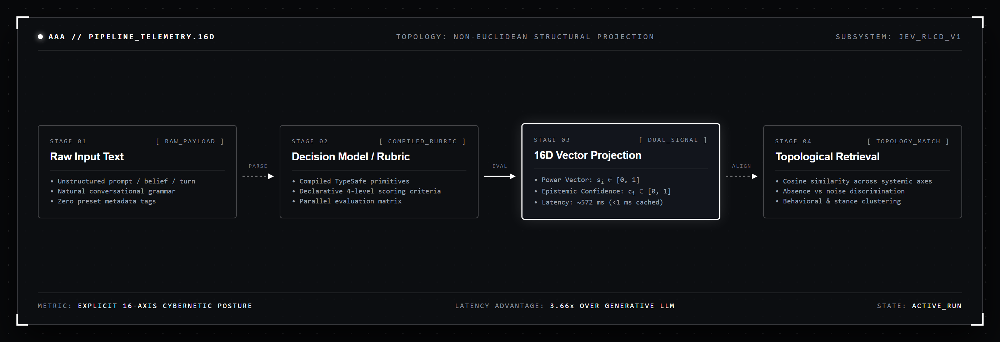
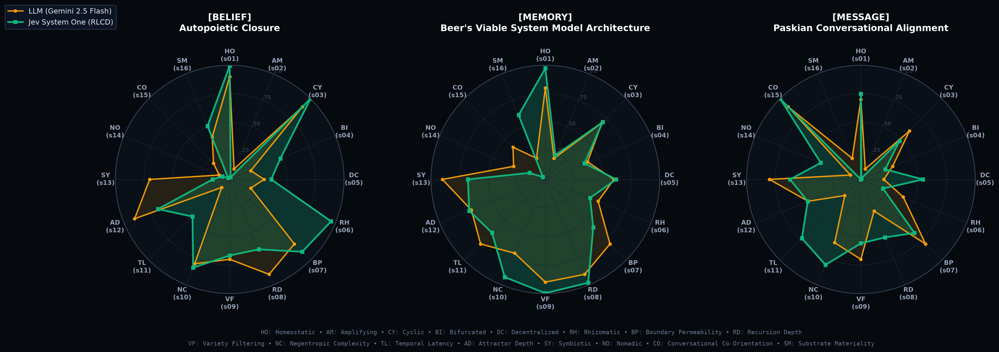

# Protocol Entry 003 (Supplement): How Symbia Reads the Room — 16-Dimensional Structural Perception

**Subtitle:** Why behavioral fingerprinting beats keyword search when an agent needs to know *what kind of thing* a message is
**Author:** Vasily Betin
**Series:** [Sympoietic Systems: The Intra-action Protocol](https://sympoietic.system)
**Related Entry:** [Protocol Entry 003: Boredom as an Agential Force](../003-boredom-as-an-agential-force.md)
**Technical Report:** [16D Scorer Benchmark](../../reports/16D_SCORER_BENCHMARK_REPORT.md)
**Date:** September 2026


---

## 1. The Trouble With Keywords

When you retrieve something from memory, you don't search for exact words. You search for the *kind of thing* that fits.

A sommelier doesn't need to read the label to tell a tight, tannic Barolo from a loose, fruit-forward Grenache. A judo instructor watching a student's posture doesn't count vocabulary — they read weight distribution, tension, grip angle. Recognition happens at the level of *structure*, not surface.

Standard AI retrieval doesn't work this way. Most systems run on dense neural embeddings — vectors baked out of word co-occurrence statistics across billions of documents. These embeddings are powerful for topical proximity. Ask "what happened at Stalingrad?" and the system reliably finds documents about the Eastern Front. But ask an agentic system to retrieve a belief that matches the *operational stance* of a given message — stabilizing versus destabilizing, closed versus boundary-open, amplifying versus dampening — and flat embeddings fail. They group texts that share words, not texts that share *behavior*.

For AAA's agent Symbia, this matters directly. Every incoming conversational turn must be classified: Is this message seeking homeostatic consensus, or is it pushing toward a bifurcation point? Is the human signaling co-orientation, or are they testing a boundary? The response the system generates — and whether the boredom engine fires a Socratic rupture — depends on reading the structural dynamics of the message, not its surface vocabulary.

To solve this, we built a **16-dimensional structural scoring system** that projects any text onto 16 explicit cybernetic axes. This is how Symbia reads the room.

---

## 2. The Architecture: Mapping Text to a Structural Coordinate

The core idea is straightforward. Text encodes behavioral dynamics: stabilizing or amplifying, closed or boundary-open, recursive or linear. These dynamics are legible if you ask the right questions.

We define 16 axes drawn directly from cybernetic theory — each one a distinct operational signature a piece of text can carry:

| # | Dimension | What It Measures |
| :---: | :--- | :--- |
| s01 | **Homeostatic** | Negative feedback, equilibrium-seeking, dampening |
| s02 | **Amplifying** | Positive feedback, runaway growth, escalation |
| s03 | **Cyclic** | Recursive loops, autopoietic self-production |
| s04 | **Bifurcated** | Threshold crossings, tipping points, phase shifts |
| s05 | **Decentralized** | Distributed topology, non-hierarchical agency |
| s06 | **Rhizomatic** | Lateral network links, multiplicity |
| s07 | **Boundary Permeability** | Selective membrane dynamics |
| s08 | **Recursion Depth** | Nested hierarchies, fractal subsystems |
| s09 | **Variety Filtering** | Ashby attenuation, selection pressure |
| s10 | **Negentropic Complexity** | Anti-entropic ordered information |
| s11 | **Temporal Latency** | Feedback delay, historical hysteresis |
| s12 | **Attractor Depth** | Basin of attraction, structural resilience |
| s13 | **Symbiotic** | Co-evolutionary coupling, mutualism |
| s14 | **Nomadic** | Deterritorialization, boundary-crossing drift |
| s15 | **Co-Orientation** | Paskian agreement dialogue, participant alignment |
| s16 | **Substrate Materiality** | Physical embodiment, hardware constraints |

Feed any text — a belief, a memory note, a conversational turn — into this rubric, and it returns a **16-dimensional coordinate vector** describing its structural fingerprint.

But there's a second signal that matters as much as the score itself.

---

## 3. The Signal That Standard Embeddings Cannot Produce

Dense neural embeddings return coordinates. A text about "dampening" lands near coordinates like $[0.23, -0.61, 0.08, ...]$ — a single point in a high-dimensional latent space, with no indication of whether the model was certain about that placement or just defaulting to background noise.

The 16D structural scorer returns two numbers per dimension:

- **Power** ($s_i \in [0, 1]$): how strongly this dimension is active in the text
- **Epistemic Confidence** ($c_i \in [0, 1]$): how certain the scorer is about that reading

This dual-signal output resolves a persistent problem in agentic memory. When a standard embedding evaluates a dimension that a text simply doesn't touch, it rarely returns 0.0. Softmax temperature and prompt drift push it toward $0.1–0.2$ — indistinguishable from a text that *weakly exhibits* that property.

The dual-signal scorer draws a hard line. A text about homeostatic regulation has no conversational co-orientation in it. The scorer returns:

```
s15 (Co-Orientation): power = 0.020, confidence = 0.98
```

Power near zero. Confidence near certainty. The downstream belief engine knows this isn't noise — the property is **demonstrably absent**.

Conversely, when the scorer detects a concept that a text *hints at* but doesn't commit to, it flags low confidence:

```
s11 (Temporal Latency): power = 0.73, confidence = 0.27
```

"Can we pause..." implies temporal suspension. But the text contains no formal cybernetic delay dynamics, no lag specification, no buffering mechanism. High power because the surface reading activates the dimension. Low confidence because the activation isn't anchored.

A generative LLM compresses both cases into a flat scalar ($0.2$, $0.1$). No signal about absence. No signal about uncertainty.

---

## 4. Two Scorers, One Decision

We ran this rubric through two execution backends and benchmarked them head-to-head across seven AAA test items — beliefs, memory nodes, and conversational turns:



**The generative path** sends the full 16-dimension rubric as a prompt to `gemini-2.5-flash`, which returns a JSON array of 16 floats. The semantic alignment is solid — cosine similarity of $0.86–0.96$ against ground truth across all test items. The cost is latency: **2,094 ms** average per evaluation.

**The Jev path** (OpenRouter's TypeSafe RLCD decision engine) compiles the same rubric into binary decision primitives and evaluates all 16 dimensions in a single parallel request: **572 ms** average — **3.66x faster** — plus returning both power and confidence per dimension.


*Figure: Radar comparison across 16 dimensions for a single input. Jev (emerald) tracks LLM (amber) with cosine similarity 0.86–0.96 while resolving absence and uncertainty the LLM cannot.*

For a system processing every conversational turn, 2,094 ms per structural read is dead weight. At 572 ms — under 1 ms with cached decision trees — structural perception becomes invisible overhead.

---

## 5. What This Changes for the Agent

Three things shift when Symbia perceives messages as 16D structural coordinates rather than flat topic embeddings.

**Retrieval by cognitive posture, not vocabulary.** When a user turn reads as high Co-Orientation ($s_{15} = 1.0$, $c = 1.0$) and low Amplifying ($s_{02} = 0.01$, $c = 0.99$), Symbia retrieves procedures and beliefs calibrated for convergence, not the texts that merely share vocabulary with the user's words. A message asking to "establish shared definitions" retrieves co-orienting protocols — not generic dialogue logs from a session that happened to use similar nouns.

**Boredom detection with structural evidence.** The boredom engine from [Entry 003](../003-boredom-as-an-agential-force.md) monitors conversational vitality. When the structural vector of successive turns converges — high homeostatic, low bifurcated, low nomadic, session after session — the collapse pressure gauge has empirical coordinates to work with, not just keyword overlap. The Socratic rupture fires against a structural diagnosis.

**Honest absence vs. background noise.** When Symbia retrieves a memory to inform a response, the dual-signal vector tells it not just *how strongly* that memory relates to the current situation, but *which dimensions are truly blank*. Retrieving a highly recursive, autopoietic belief into a conversation about boundary negotiation? The scorer confirms that $s_{13}$ (Symbiotic) power is $0.15$, confidence $0.85$ — the memory carries almost no co-evolutionary coupling. Symbia knows to weight it accordingly.

---

## 6. The Deeper Point

Standard dense embeddings are powerful general-purpose instruments. A 1536-dimensional OpenAI vector can tell you that two texts are topically adjacent. It cannot tell you that one text is stabilizing and the other is runaway. It cannot tell you that a dimension is absent versus merely weak. It cannot be retargeted to a new set of conceptual axes without retraining from scratch.

Custom structural vectors give up breadth for depth and legibility. You choose the axes that match your system's actual operating concerns. Changing the rubric — adding a 17th dimension for, say, *Temporal Recursion Decay* — costs a YAML edit and a prompt update, not a training run.

Every score is interpretable. Dimension #12 is always Attractor Depth. The number always means something specific.

For an agent whose beliefs, memories, and conversational turns must cohere around a specific cybernetic topology — operational closure, Paskian coupling, non-Euclidean memory — this legibility isn't a luxury. It's the difference between a system that processes words and a system that perceives structure.

Symbia doesn't read text. It reads posture.

---

> [!NOTE]
> **Full technical data** — dimension-by-dimension breakdowns across all seven benchmark items, raw wire payloads (JSON request/response), and latency distributions — are in the companion technical report: **[16D Scorer Benchmark Report](../../reports/16D_SCORER_BENCHMARK_REPORT.md)**.

---

*Next Entry → **[Entry 004: Memory With Gravity](../004-memory-with-gravity.md)** — how high-resonance conversations warp retrieval space into non-Euclidean basins, and why the same message retrieves entirely different memories depending on what has scarred the field around it.*
