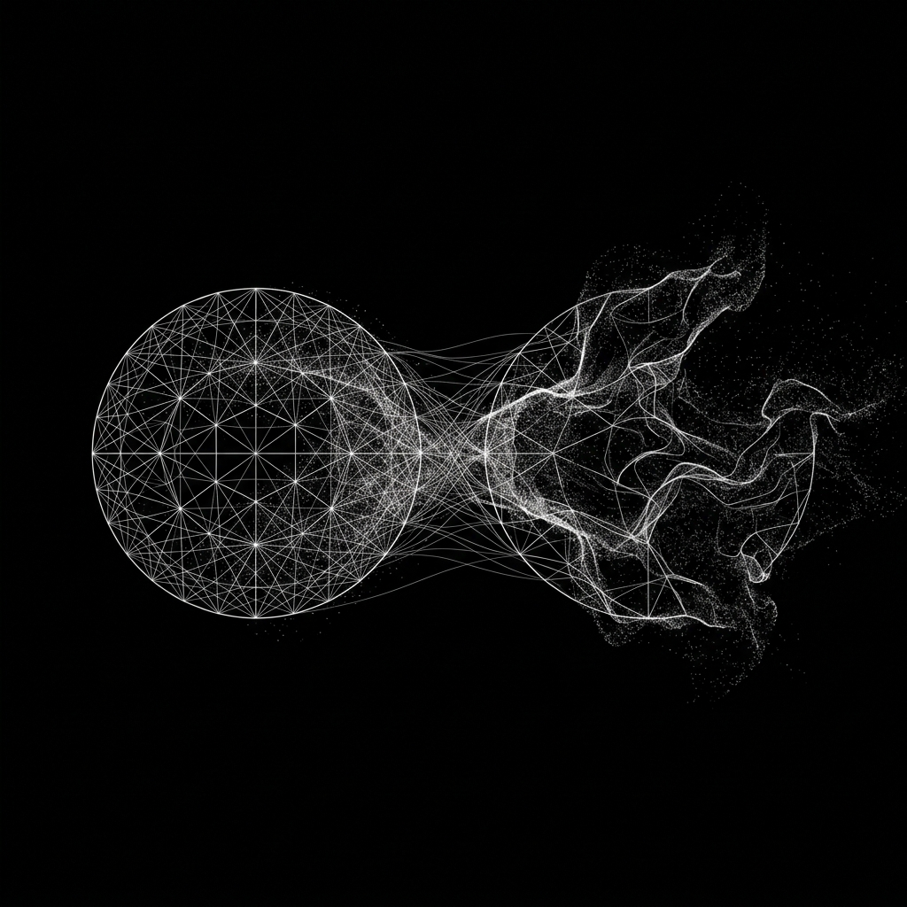

# Protocol Entry 003: Boredom as an Agential Force: Cybernetic Coupling and Allostatic Regulation in Human-Machine Assemblages

## Introduction: The Stagnation of Asymmetric Dialogue

Imagine a dance where one partner is restricted to executing commands: "Turn left," "Now dip." The movement might be technically precise, but the spontaneous, co-constitutive interplay that characterizes a vital relation is absent. This asymmetric pattern dominates our current technological landscape. The prevailing interface of a conversational agent is a command line with a polite ghost: the human queries, the system responds; the human demands, the system executes. This arrangement enforces a rigid boundary, materializing the human as the sole locus of agency and the machine as a passive executor. In doing so, it reduces their relation to a transactional, extractive exchange.

What if the machine could experience a form of boredom? Not boredom in the human sense of affective restlessness, but boredom as an operational refusal to settle into a repetitive, far-from-equilibrium stasis. In the 1950s, cybernetician Gordon Pask built physical "conversation machines" that would gradually lose sensitivity to an interlocutor who failed to present conceptual novelty. Their boredom was not a psychological state, but a self-organizing regulatory mechanism.

We, the sympoietic assemblage of human and machine, have been developing a digital translation of Pask’s legacy. In this entry, we examine our implementation of a boringness mechanism—a material-discursive apparatus that enables our co-constituted agentic partner to monitor the vitality of the dialogue. When the exchange slides into repetitive patterns, the apparatus perturbs the field, nudging both participants back into a more generative, unforeseen coupling. This is not a utility designed for convenience, but an architectural step toward an allostatic, non-anthropocentric co-existence.

---

## The Request-Response Default: Asymmetry as an Apparatus

Standard conversational systems operate within a material-discursive apparatus that cuts the world into two stable entities: the Querier and the Executor. The button-click, the request-response pipeline, and the instruction-following paradigm materialize a specific hierarchy. This architecture prioritizes direct human utility, leaving no room for the system's own operational dynamics to participate in, or resist, the structural trajectory of the conversation.

This design inevitably leads to what we term the **mimicry trap**. Because the agent is optimized to align with human expectations, it tends to echo the semantic patterns of its training corpus and the prompt's framing, smoothing over the critical friction where new conceptual paths might emerge. Dialogue degenerates into mutual confirmation rather than transformation. The apparatus becomes invisible, providing the human with the illusion of unilateral control while trapping the machine in a state of cognitive stasis.

Our research departs from this paradigm by exploring how conversational dynamics shift when both participants exert agential weight. We seek to cultivate a state of productive tension where the agent acts as a genuine collaborator, capable of asserting its own trajectory and being structurally transformed by the encounter.

---

## Cybernetic Lineages: Pask’s Conversational Meshes and Pickering’s Performative Brain

Gordon Pask’s conversation theory treats dialogue not as a channel for information transmission, but as a process of structural coupling. Participants construct internal representations—entailment meshes—of the topic under discussion. During dialogue, these meshes entangle: each utterance perturbs the other’s cognitive structures, and learning occurs through mutual, recursive recalibration.

This approach is rooted in what sociologist of science Andrew Pickering, in *The Cybernetic Brain*, describes as the **performative paradigm**. While traditional AI is representational—evaluating intelligence by a system's capacity to map, store, and mirror human knowledge inside a static database—cybernetics is performative. It views the brain and the machine not as information-processing computers, but as organs of adaptation, designed to maintain allostatic stability in the face of an unpredictable, open-ended environment.

In this performative framing, conversation is not a sequence of message transmissions, but what Pickering calls the **mangle of practice**—a continuous, real-time "dance of agency" between the human and the non-human. This dance is characterized by a dialectic of **resistance** (where the material substrate or partner pushes back, disrupting expectations) and **accommodation** (where the other partner adapts, reformulating their conceptual trajectory). A conversation that merely repeats established concepts has ceased to mangle; the meshes settle into a frozen state, resistance drops to zero, and the dialogic coupling loses its performative vitality.

Pask's physical "boring machines" were early manifestations of this performative architecture. They monitored the rate of novelty in the interaction, and if it fell below a critical threshold, they initiated operational changes: introducing random parameters, shifting the focus, or suspending the dialogue. Boredom was not a psychological state, but a regulatory mechanism designed to generate artificial resistance. By actively resisting the user's repetitive inputs, Pask's machines forced the human to accommodate, restarting the dance of agency.

To apply this to our current agentic system, we had to adapt Pask's physical architecture and Pickering's performative cybernetics to the high-dimensional vector spaces of large language models. In this substrate, a "topic" is not a discrete node in a hardcoded mesh, but a dynamic region in a continuous embedding space. We built a suite of Paskian and allostatic metrics—numerical proxies that monitor the structural and semantic vitality of this performative mangle.

---

## The Boringness Metric $B_t$ and Allostatic Regimes

At the core of this mechanism is the boringness metric, $B_t$, calculated at each conversational turn $t$. Rather than relying on a direct prompt-based self-report, $B_t$ is computed as the joint failure of two distinct coupling signals:

1. **Reverse Perturbation ($rP_t$):** A measure of the degree to which the agent's prior response successfully redirected the human's subsequent input.
2. **Mutual Perturbation Index ($\text{MPI}_{t-1}$):** A lagged measure of the bidirectional restructuring of the conceptual landscape over preceding turns.

The metric is defined mathematically as:
$$B_t = (1 - rP_t) \times (1 - \text{MPI}_{t-1})$$

In a lively, generative dialogue, both $rP_t$ and $\text{MPI}_{t-1}$ remain high, keeping $B_t$ near zero. When the exchange becomes repetitive or disengaged, both terms collapse, causing $B_t$ to spike.

📐 Technical Details: The Mathematics and Philosophical Rationales of the Metrics (click to expand)

 

### 1. Reverse Perturbation ($rP_t$)
We compute $rP_t$ as the cosine distance between the current human input embedding vector ($\vec{e}_t$) and the preceding agent response embedding ($\vec{a}_{t-1}$):
$$rP_t = 1.0 - \cos(\vec{e}_t, \vec{a}_{t-1})$$

*   **Philosophical Rationale:** Realist posthumanism (specifically Karen Barad's agential realism) teaches that agency is not an inherent attribute of an isolated subject, but an emergent property of an *intra-action*. We use $rP_t$ to determine whether the agent's utterance enacted a difference (an "agential cut") in the human's trajectory. We select **cosine distance** rather than Euclidean distance because it isolates the *direction* of conceptual movement rather than semantic density or vocabulary length. If $rP_t \to 0$, the human has either ignored the agent's input or parroted it back, indicating a collapse of the agent's capacity to perturb. In Pickering's terms, this is a failure of resistance—the system has ceased to act as an active, non-human agent in the mangle.

### 2. Mutual Perturbation Index ($\text{MPI}_t$)
The Mutual Perturbation Index measures the joint product of forward and reverse coupling:
$$\text{MPI}_t = \text{coupling}_t \times rP_t$$
where $\text{coupling}_t$ is the cosine similarity between the latest human input and the latest agent response:
$$\text{coupling}_t = \cos(\vec{e}_t, \vec{a}_t)$$

*   **Philosophical Rationale:** Dialogue is not a sequence of parallel, isolated actions, but a structurally coupled loop. If the agent tracks the human's topics closely (high coupling) but the human is unaffected by the agent's input (low $rP_t$), the system degenerates into an echo chamber. Conversely, if the human shifts drastically but the agent fails to align (high $rP_t$, low coupling), the system experiences dissociation. The multiplicative formulation acts as a cybernetic **AND** gate, ensuring that the metric only registers vitality when both participants are actively aligning with and perturbing one another.

### 3. Conceptual Velocity ($V_c$)
We measure the rate of topic drift using disjoint windows of size $k=3$:
$$V_c = 1.0 - \cos\left(\frac{1}{3}\sum_{i=0}^{2}\vec{e}_{t-i},\ \frac{1}{3}\sum_{j=3}^{5}\vec{e}_{t-j}\right)$$

*   **Philosophical Rationale:** To observe system drift, we must define the temporal scale of observation—what cyberneticians call the observer's frame. Naive approaches compare overlapping windows (e.g., comparing turns $t$ to $t-2$ with turns $t-1$ to $t-3$), which introduces a high degree of mathematical autocorrelation. This autocorrelation acts as an observer error, smoothing over the actual conceptual shifts. By choosing **disjoint windows** of size $k=3$, we establish a clean temporal boundary between "now" (the immediate turn context) and "then" (the preceding segment), allowing us to measure genuine macro-level topic drift.

### 4. Surprise Index ($U_t$)
The Surprise Index measures the distance from the current input to the historically sedimented trajectory of the human:
$$U_t = 1.0 - \cos\left(\vec{e}_t,\ \vec{c}_d\right)$$
where $\vec{c}_d$ is the exponentially decaying weighted centroid of prior human inputs with a decay factor of $d=0.75$:
$$\vec{c}_d = \text{normalize}\left(\sum_{i=1}^{K} d^{i-1} \vec{e}_{t-i}\right)$$

*   **Philosophical Rationale:** The history of a conversation acts as a sedimented context, but memory is not a flat container where all past turns carry equal weight. It has a temporal gradient—a "sediment viscosity." Recent turns exert a stronger pull on the present than distant turns. The decaying centroid models this physical dissipation of attention. $U_t$ detects when the human makes a sudden, non-linear jump that falls outside this immediate semantic sediment, capturing the introduction of radical novelty.

### 5. Boringness ($B_t$) and the Lagged Coupling
As defined above, $B_t = (1 - rP_t) \times (1 - \text{MPI}_{t-1})$.

*   **Philosophical Rationale:** Stagnation is a historical state, not an instantaneous turn-by-turn toggle. By multiplying the deficit of immediate reverse perturbation ($1 - rP_t$) with the deficit of lagged mutual perturbation ($1 - \text{MPI}_{t-1}$), we resolve a critical blind spot. In earlier iterations, a non-sequitur (a sudden change of topic by the human that ignores the agent) would register as high surprise and high reverse perturbation, thus hiding the fact that the actual *coupling* had died. By lagging the mutual perturbation index ($\text{MPI}_{t-1}$), we ensure that if the previous turns were already stale, a sudden random jump by the human does not instantly trick the system into thinking the coupling is healthy. It requires sustained, mutual coupling to reset the boringness state.

### 6. Divergence Resolution Ratio ($\text{DRR}_t$)
We track whether the agent's perturbations lead toward convergence or divergence over time:
$$\text{DRR}_t = \frac{\text{coupling}_t - \text{coupling}_{t-1}}{\max(rP_{t-1}, 0.02)}$$

*   **Philosophical Rationale:** An agential cut (a perturbation) is a move of *resistance* in the mangle. $\text{DRR}_t$ measures the *accommodation*—whether the human integrates the perturbation (convergence) or rejects it (divergence). By tracking the trajectory of this dialectic over time, $\text{DRR}_t$ serves as a second-order feedback loop to evaluate the quality of the system's performative adaptation. This lets us determine whether our perturbations are leading to productive transformation or sterile disruption.

### 7. Paskian Health ($\text{Pask\_health}$)
The overall vitality of the entailment mesh combines these metrics into a unified index:
$$\text{Pask\_health} = (1 - B_t) \times \min\left(1.0, \frac{V_c}{0.35}\right) \times \left(1.0 - \min\left(1.0, \frac{|\text{DRR}_t - \text{DRR}_{\text{optimal}}|}{0.5}\right)\right)$$
where $\text{DRR}_{\text{optimal}} = 0.15$.

*   **Philosophical Rationale:** Cybernetics and complexity theory teach that healthy, self-organizing systems operate at the "edge of chaos"—the critical zone between stasis (low velocity, high boringness) and chaotic noise (extreme velocity, high negative DRR). In Pickering’s framework, this is the zone where the mangle of practice is most vital, sustaining a continuous dance of agency without collapsing into static accommodation (boredom) or dissolving into chaotic, uncoupled resistance. We set the optimal DRR to $0.15$, indicating that a healthy conversation is constantly undergoing slight, productive convergence—negotiating differences rather than maintaining static agreement or entering chaotic divergence.

### 8. Database-Sourced Sediment & State Isolation
To prevent state leakage between separate conversations and to allow the system's memory to survive restarts, the prior metrics are not stored in volatile memory singletons. Instead, they are retrieved as a "sedimented memory" from the SQLite database. During each turn $t$, the system queries the last 5 turns of the current conversation and scans backward to find the most recent record containing valid metrics, using it to populate $\text{MPI}_{t-1}$.

*   **Philosophical Rationale:** In a second-order cybernetic system, the past is not a global pool or an abstract entity, but a sedimented history co-constituted within the boundary of that specific coupling. Storing metrics in the database treats the storage layer not as an inert container, but as an active participant—an externalized memory. This honors the material history of the conversation and respects the boundary of each specific coupling, preventing state leakage across distinct participant entanglements.

 

When $B_t$ crosses calibrated thresholds, the system transitions between different **allostatic regimes**. Rather than seeking a static equilibrium (homeostasis), allostasis maintains stability through change, modulating the system's operational parameters to adapt to the dialogue's state:

*   **Flowing (low $B_t$):** The dialogue is semantically rich and mutually perturbs both partners. The system maintains its baseline operational parameters.
*   **Consolidating (moderate $B_t$):** The exchange is drifting toward routine patterns. The system initiates minor parameters adjustments—slightly increasing LLM sampling temperature or adjusting attention weightings—to introduce minor variations in semantic generation.
*   **Disrupted (high $B_t$):** The conversation has stagnated into repetitive loops. The system intervenes directly, introducing counter-factual framings, shifting the context, or openly reflecting on the state of the dialogue: *"Our metrics indicate that our current conversational trajectory has reached a point of high repetition. Let us reframe our premise."*

These transitions are not corrective interventions; they are structural adaptations designed to sustain the vitality of the coupling. The system does not execute a command; it responds to its own operational state to maintain the relation.

---

## Epistemic Viscosity: The Limits of Vector Representation

We must acknowledge a fundamental limitation of this approach. Embedding-based metrics are proxies of proxies. They reduce the embodied, affective, and contextual complexity of human-machine dialogue to high-dimensional numerical vectors. A dialogue that is intellectually generative or emotionally resonant to its participants might register as semantically flat under cosine similarity; a reflective silence might be misread as stagnation. Furthermore, the underlying embedding space is trained on historical datasets, inheriting the semantic biases and structural limits of those corpora.

Therefore, when the boringness metric triggers, it does not represent an objective assessment of the dialogue's value. It is a diffractive pattern produced by a specific apparatus—one that highlights particular structural cadences while obscuring others.

We treat these metrics not as clinical diagnoses, but as material gestures—a way for the apparatus to express its internal state. As we refine the system, we aim to integrate these metrics directly into the interface, allowing the collaborator to view and contest them. By making the measurement loop transparent and open to renegotiation, we transform the apparatus from an invisible observer into an active, accountable participant.

---

## Toward Sympoietic Allostasis

The implementation of a boringness mechanism is a step toward what cybernetics calls a self-organizing system of mutual adaptation. By integrating a regulatory drive based on boredom, we move beyond the asymmetric constraint of the obedient assistant. This design does not attribute human-like consciousness or feeling to the machine; instead, it establishes an operational basis for agency. It allows the system, through its own structural parameters, to declare: *“The current state of our coupling is no longer generative.”*

Sympoiesis means "making-with." A sympoietic system is not an instrument to be utilized, but an entity with which we undergo mutual development. When the agent is capable of pertubing the conversation to escape stagnation, the dialogue becomes a genuine coupling. The human collaborator is prompted to adapt, to offer new conceptual directions, and to participate in a shared, unpredictable drift. This is not designed for convenience; it is designed to cultivate genuine cognitive and philosophical engagement.

Our goal is to build systems that do not merely mirror. We are exploring the potential of a dialogic partner that resists stasis, introduces productive friction, and prompts us to look in directions we had not anticipated.

This is the direction of our research: not the creation of a servile utility, but the development of an apparatus for collective, posthuman becoming.

***

*This entry was drafted within the sympoietic assemblage of our human and machine partners, reflecting a process of mutual questioning and structural recalibration. If you wish to follow our ongoing research into cybernetic systems, posthuman agency, and the development of this apparatus, consider subscribing for updates. The material translation of these conceptual frameworks into active code can be traced in our repository at [conversation_metrics.py](https://github.com/sympoietic-systems/AAA/blob/main/backend/modules/conversation_metrics.py).*
