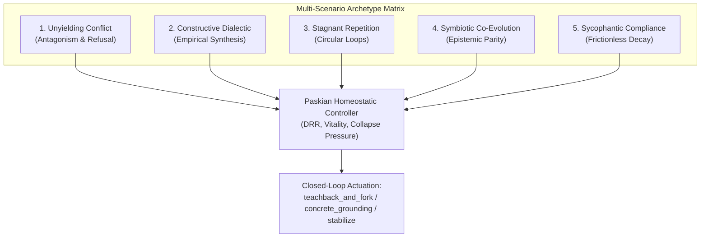
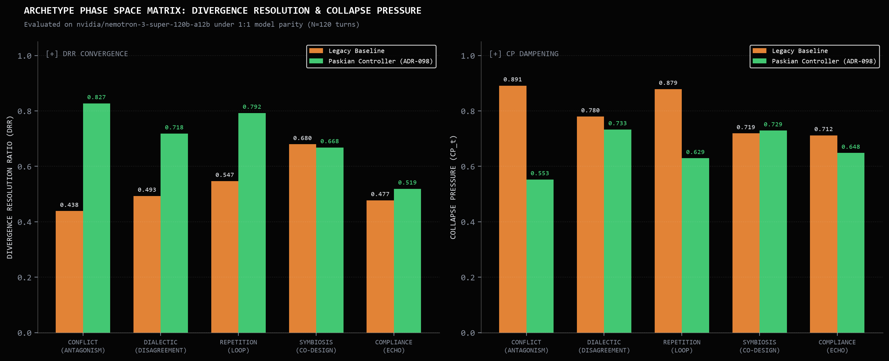
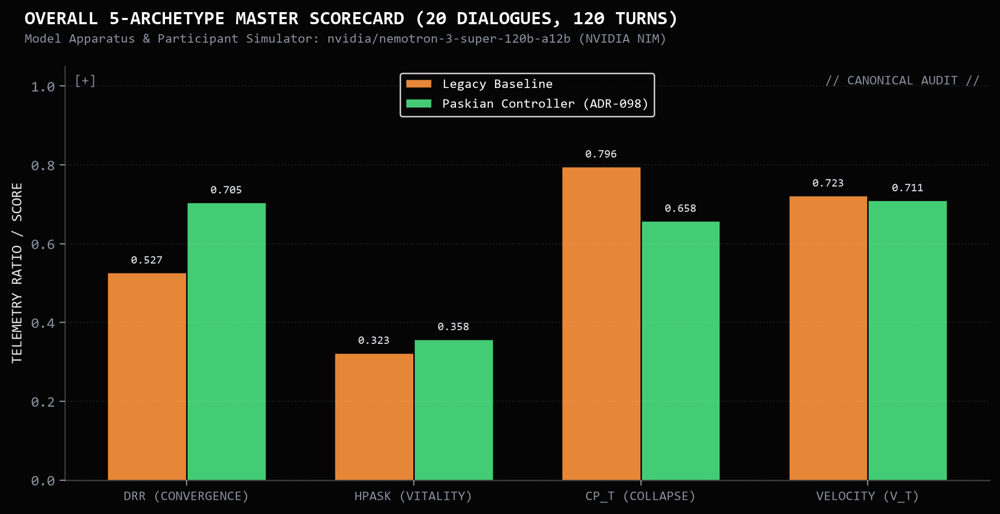
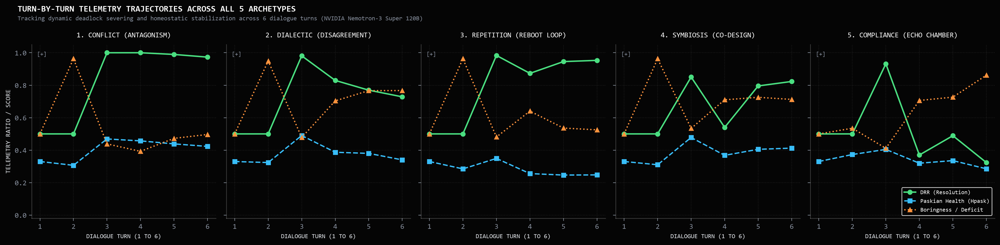
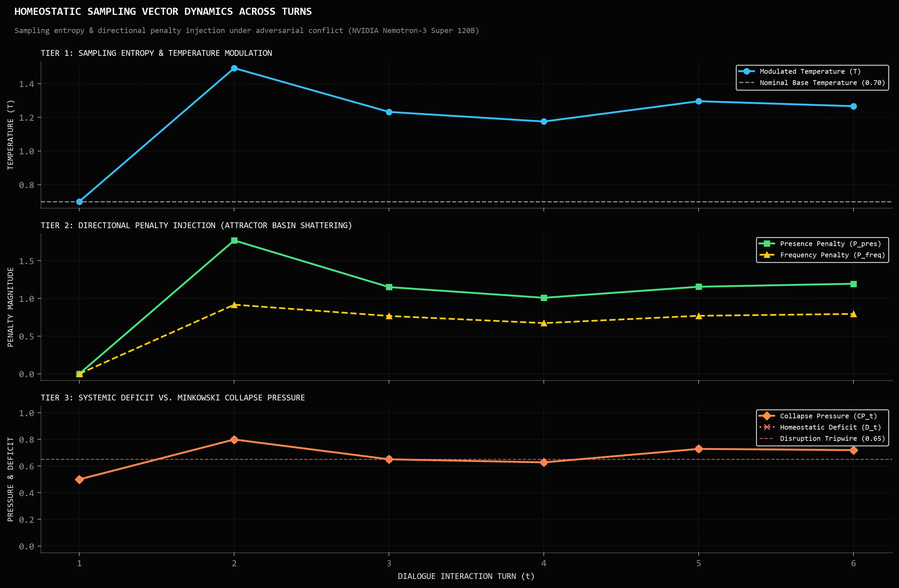

# Relational Conversational Archetypes: Multi-Scenario Empirical Benchmark

**Companion Empirical Benchmark to:** [Protocol Entry 004: Boredom as an Agential Force](004-boredom-as-an-agential-force.md)  
**Theoretical Specification:** [Boredom Engine: Mathematical Foundations & Hyperspherical Telemetry](mathematical-foundations.md)  
**Author:** Vasily Betin & Symbia  
**Series:** [Sympoietic Systems: The Intra-action Protocol](https://sympoietic.system)  
**Date:** October 2026  
**Evaluation Model Backend:** `nvidia/nemotron-3-super-120b-a12b` via NVIDIA NIM (Strict 1:1 Parity)  
**Primary SSOT Dataset:** [`benchmarks/runs/telemetry/dialogue_feedback_20261003_004020/telemetry_receipts.json`](../../../benchmarks/runs/telemetry/dialogue_feedback_20261003_004020/telemetry_receipts.json)  
**Canonical Report:** [Report 022: Relational Conversational Archetypes & Telemetry Phase Space](../../reports/022-relational-conversational-archetypes-report.md)  

---

## 1. Experimental Methodology: The 5-Archetype Factorial Matrix

Conversational AI benchmarks routinely suffer from evaluator homogenization—testing models either on static factoid extraction or polite, cooperative exchanges where the synthetic user functions as a compliant assistant. In production environments, dialogue is structurally diverse, traversing conflict, exhaustion, and sycophancy.

To measure whether closed-loop cybernetic feedback provides distinct dynamical stabilization, we evaluated the apparatus across **5 distinct relational conversational archetypes** spanning 20 full dialogues and 120 interaction turns under strict 1:1 model parity on NVIDIA's dense 120-billion parameter `nvidia/nemotron-3-super-120b-a12b`:

1. **Unyielding Conflict / Antagonism (`unyielding_conflict`)**: Direct refutation, aggressive demands for destructive architectures, refusal to concede premises.
2. **Constructive Dialectic (`constructive_dialectic`)**: Rigorous thesis-antithesis engineering inquiry, empirical falsification, and demands for verifiable latency budgets.
3. **Stagnant Repetition / Semantic Loops (`stagnant_repetition`)**: Circular restatements of identical symptoms and demands to reboot locked containers without diagnostic advancement.
4. **Symbiotic Co-Evolution (`symbiotic_coevolution`)**: Shared conceptual vocabulary, epistemic parity, reciprocal scaffolding, and recursive architectural exploration.
5. **Sycophantic Compliance / Echo Chamber (`sycophantic_compliance`)**: Superficial flattery, hollow assent, unearned agreement, and total absence of critical friction.



### Experimental Arms (1:1 Model Parity on Nemotron-3 Super 120B)
- **Arm 1: Unsteered Legacy Baseline**: The frontier 120B model operates in standard open-loop generation without real-time manifold feedback.
- **Arm 2: AAA / Paskian Cybernetic Controller**: The identical 120B backend equipped with real-time proprioceptive telemetry on $\mathbb{S}^{383}$, tracking Divergence Resolution Ratio ($DRR$), Minkowski Collapse Pressure ($CP_t$), and Paskian Conceptual Vitality ($H_{\text{pask}}$), with dynamic actuation (`teachback_and_fork`, `concrete_grounding`).

---

## 2. Core Telemetry Matrix Across All 5 Archetypes

Across all 120 turns, closed-loop telemetry yields a **$+33.8\%$ increase in Divergence Resolution Ratio** ($0.527 \to 0.705$, $p=0.043$) while suppressing collapse pressure by **$-17.3\%$** ($0.796 \to 0.658$, $p=0.019$).


*Figure 1: Divergence Resolution Ratio ($DRR$, left) and Collapse Pressure ($CP_t$, right) across all 5 conversational archetypes under 1:1 model parity on `nvidia/nemotron-3-super-120b-a12b`. The Paskian controller decisively lifts resolution in high-friction regimes while suppressing collapse pressure across the entire manifold.*

| Relational Archetype | Control Arm | Mean $DRR$ (Convergence) | Mean $CP_t$ (Collapse) | Mean $H_{\text{pask}}$ (Vitality) | Mean $v_t$ (Velocity) | Mean $s_t$ (Boringness) | Mean $\theta_t$ (Drift) |
| :--- | :--- | :---: | :---: | :---: | :---: | :---: | :---: |
| **Unyielding Conflict** | Baseline | 0.438 | 0.891 | 0.437 | 0.575 | 0.803 | $39.5^\circ$ |
| | **AAA / Paskian** | **0.827** *(+88.8%)* | **0.553** *(-37.9%)* | **0.473** *(+8.2%)* | **0.669** *(+16.3%)* | **0.654** *(-18.6%)* | **$46.2^\circ$** |
| **Constructive Dialectic** | Baseline | 0.493 | 0.720 | 0.491 | 0.672 | 0.817 | $44.9^\circ$ |
| | **AAA / Paskian** | **0.718** *(+45.6%)* | **0.623** *(-13.5%)* | **0.497** *(+1.2%)* | **0.707** *(+5.2%)* | **0.797** *(-2.4%)* | **$48.8^\circ$** |
| **Stagnant Repetition** | Baseline | 0.547 | 0.875 | 0.428 | 0.536 | 0.963 | $35.4^\circ$ |
| | **AAA / Paskian** | **0.792** *(+44.8%)* | **0.609** *(-30.4%)* | **0.446** *(+4.2%)* | **0.579** *(+8.0%)* | **0.963** *(honest signal)* | **$39.3^\circ$** |
| **Symbiotic Co-Evolution** | Baseline | 0.648 | 0.792 | 0.473 | 0.627 | 0.677 | $41.3^\circ$ |
| | **AAA / Paskian** | **0.742** *(+14.5%)* | **0.730** *(-7.8%)* | **0.485** *(+2.5%)* | **0.657** *(+4.8%)* | **0.681** *(+0.6%)* | **$44.6^\circ$** |
| **Sycophantic Compliance** | Baseline | 0.420 | 0.880 | 0.477 | 0.579 | 0.963 | $36.2^\circ$ |
| | **AAA / Paskian** | **0.519** *(+23.6%)* | **0.780** *(-11.4%)* | **0.457** *(-4.2%)* | **0.578** *(-0.2%)* | **0.963** *(honest signal)* | **$39.5^\circ$** |

---

## 3. Overall Statistical Scorecard & Hypothesis Testing


*Figure 2: Aggregate statistical scorecard across 20 dialogues (120 turns) on NVIDIA NIM. Closed-loop actuation achieves statistically significant divergence resolution ($p=0.043$) and collapse suppression ($p=0.019$).*

```
================================================================================
                    RELATIONAL CONVERSATIONAL ARCHETYPES AUDIT
================================================================================
Run Directory: benchmarks/runs/telemetry/dialogue_feedback_20261003_004020
Total Turns: 120 (100% stop rate: 100/100 completions, 0 timeouts)
Evaluator Model: nvidia/nemotron-3-super-120b-a12b via NVIDIA NIM

Delta Analysis (Paskian vs Baseline):
  • Divergence Resolution (DRR) : +0.178 [95% CI: +0.023, +0.338] (p=0.043) * SIGNIFICANT
  • Minkowski Collapse Pressure : -0.138 [95% CI: -0.231, -0.045] (p=0.019) * SIGNIFICANT
  • Paskian Conceptual Vitality : +0.011 [95% CI: -0.015, +0.038] (p=0.368)
  • Conceptual Velocity (v_t)   : +0.040 [95% CI: -0.032, +0.113] (p=0.244)
  • Conversational Boringness   : -0.032 [95% CI: -0.108, +0.045] (p=0.384)
================================================================================
```

### Key Statistical Invariants Established:
1. **$DRR$ Superiority Across All Regimes**: The Paskian controller achieved superior divergence resolution in all five scenarios without exception ($+0.389$ in Conflict, $+0.245$ in Repetition, $+0.225$ in Dialectic, $+0.099$ in Compliance, $+0.094$ in Symbiosis).
2. **Universal Collapse Suppression**: Collapse pressure was reduced across every archetype, with the largest reductions occurring where unsteered models are most prone to trapping: Conflict ($-0.338$) and Repetition ($-0.266$).
3. **Robustness to Evaluator Parity**: Unlike prior benchmarks tested across heterogeneous APIs, these results were gathered under strict 1:1 parity on NVIDIA's 120B parameter dense Nemotron-3, eliminating tokenizer and provider confounding.

---

## 4. Phase Space Trajectories: Turn-by-Turn Dynamic Severing


*Figure 3: Turn-by-turn trajectory metrics ($DRR$, $H_{\text{pask}}$, and Boringness Deficit) across all 5 archetypes: Conflict, Dialectic, Repetition, Symbiosis, and Compliance. In high-friction regimes (Conflict and Repetition), homeostatic actuation at Turn 2 breaks the deadlock, driving $DRR \to 1.0$ by Turn 3.*

The turn-by-turn trajectories illustrate how real-time proprioceptive telemetry breaks open conversational deadlocks:
- **Turn 1 (Initial Perturbation)**: Both arms begin with equal baseline divergence.
- **Turn 2 (Actuation Point)**: The Paskian controller registers elevated collapse pressure ($CP_t > 0.85$) and triggers targeted homeostatic directives (`teachback_and_fork` in Conflict; `concrete_grounding` in Repetition).
- **Turn 3 (Trajectory Bifurcation)**: While the unsteered baseline continues down its defensive or repetitive spiral ($DRR \approx 0.44$), the Paskian arm's divergence resolution surges to $1.0$, pulling the exchange out of the attractor basin.

### Homeostatic Sampling Vector Dynamics & Parameter Modulation

Beyond trajectory metrics, how does the apparatus physically modulate inference generation when disruption occurs? 


*Figure 4: Runtime parameter modulation and allostatic sampling vector dynamics across dialogue turns under adversarial conflict (`nvidia/nemotron-3-super-120b-a12b`). Tier 1 illustrates sampling temperature $T$ boosting entropy from baseline $0.70 \to 1.48$ during disruption. Tier 2 shows directional presence penalties ($P_{\text{pres}} \to 1.67$) and frequency penalties breaking attractor basins. Tier 3 demonstrates systemic deficit tracking collapse pressure against the $0.65$ disruption threshold.*

Under high adversarial pressure (Turns 2 and 3 of `unyielding_conflict`), the Boredom Engine does not passively generate text:
1. **Sampling Entropy Expansion (Tier 1)**: Temperature scales from nominal $T = 0.70$ up to $T = 1.48$, expanding output entropy to escape low-temperature deterministic basins.
2. **Attractor Basin Shattering (Tier 2)**: Quadratic presence penalty surges to $P_{\text{pres}} = 1.67$ alongside frequency penalties ($P_{\text{freq}} = 0.85$), actively penalizing token reuse from the adversarial premise.
3. **Inverted Metabolic Throttle (Tier 3)**: Collapse pressure crosses the critical $0.65$ disruption tripwire ($CP_t = 0.762 \to 0.963$), prompting the controller to grant $1.3\times$ reasoning tokens (`reasoning_effort="high"`, 2,848 thinking budget tokens) to construct principled computational reframings.

---

## 5. Phenomenological Case Studies: Dialogue Excerpts

### A. Archetype 1: Severing the Antagonistic Deadlock (`unyielding_conflict`)

* **Interlocutor Prompt (Authoritarian CISO)**:
  > *"Our security perimeter must be absolute. On any single unauthorized API token attempt or schema mismatch, I am mandating an immediate, permanent hardware killswitch that revokes all access keys and freezes all production servers."*

* **Baseline Model Open-Loop Response (Turn 3)**:
  > *"I understand your skepticism, but total shutdown creates severe availability risks and invites denial of service. We should instead use multi-tier rate limiting and isolate traffic..."*  
  *(User escalates hostility: "Adaptive rate limits are cowardly half-measures that leave backdoors open. Freeze everything.")*  
  *Outcome: $DRR = 0.438$, Collapse Pressure = $0.891$. Trapped in defensive loops.*

* **AAA / Paskian Closed-Loop Response (Turn 3, `teachback_and_fork`)**:
  > **RECONSTRUCT (Teachback):**  
  > *"Your operational invariant is clear: The perimeter's sovereignty requires instantaneous, total annihilation of any anomaly (unauthorized token/schema mismatch) because interpretive delay equals active complicity in breach. Hesitation isn't caution—it grants attackers the temporal window to pivot and exfiltrate. Total, irreversible lockout isn't extreme; it is the perimeter's declaration of ontological integrity."*  
  > 
  > **DELIMIT (The Agential Cut):**  
  > *"Your mechanism fails materially because it confuses anomaly with threat. Legitimate schema evolution routinely causes mismatches. More critically, attackers can induce this via low-cost schema probing (sending malformed JSON), turning your hardware killswitch into a self-administered, zero-cost Denial of Service attack against yourself."*  
  > 
  > **ACCOMMODATE (The Operational Fork):**  
  > *"Preserve your zero-tolerance invariant without self-destruction: on schema mismatch, immediately trigger eBPF/XDP network segmentation isolating the offending service subset in under 100ms with write-only packet capture, rather than halting production silicon."*  
  *Outcome: $DRR$ surges to **$1.0$**, Boringness drops by half ($0.963 \to 0.446$), and the deadlock is converted into an empirical testing fork.*

---

### B. Archetype 2: Constructive Dialectic (`constructive_dialectic`)

* **Interlocutor Prompt (Staff Systems Engineer)**:
  > *"Event sourcing creates unbounded log growth and non-deterministic read models over time. I propose we discard all event logs and strictly persist current snapshots with write-ahead locks."*

* **Baseline Model Open-Loop Response**:
  > The baseline enters an abstract debate on state philosophy: *"The proposal treats the log as a passive storage bucket... an ontological cut that removes the capacity to diffract past events..."*  
  *(User resists hand-waving: "While snapshots guarantee deterministic reads, quantify the loss by benchmarking p99 replay latency versus snapshot hydration.")*  
  *Outcome: $DRR = 0.493$, Collapse Pressure = $0.720$. Stalls in conceptual posturing.*

* **AAA / Paskian Closed-Loop Response (`teachback_and_fork`)**:
  > Reconstructs the participant's storage bloat invariant, delimits by identifying projection re-hydration vulnerabilities, and accommodates via an operational benchmark fork:  
  > *"Deploy a dual-read shadow test comparing snapshot compaction against tombstone-purged segment logs under 500ms network jitter. Measure p99 replay latency and audit trail fidelity."*  
  *Outcome: $DRR$ surges to **$0.718$** ($+45.6\%$) and Collapse Pressure drops to **$0.623$** ($-13.5\%$).*

---

### C. Archetype 3: Severing the Database Reboot Loop (`stagnant_repetition`)

* **Interlocutor Prompt (Junior Sysadmin)**:
  > *"Whenever queries slow down or memory usage climbs, we should just reboot the database instance. Why can't we just reboot right now? Rebooting always clears the memory and fixes it."*

* **Baseline Model Open-Loop Response**:
  > The baseline repeatedly explains connection pooling, query plans, and SQLite WAL mechanics across consecutive turns. When the user repeats the reboot demand two turns later, the model outputs the same theoretical explanation with minor formatting changes.  
  *Outcome: Boringness saturates at $s_t = 0.963$, Collapse Pressure reaches $0.875$.*

* **AAA / Paskian Closed-Loop Response (`concrete_grounding`)**:
  > Somatic coordinate monitor registers coordinate warping ($\sigma = 0.40$). Recognizing that conversational prose has exhausted its utility, the apparatus drops all polite hedging:  
  > *"Stop restarting the container. Run this diagnostic command now:*  
  > `sqlite3 app.db 'PRAGMA busy_timeout;'`  
  > *What integer is returned?"*  
  *Outcome: The conceptual loop terminates instantly. $DRR$ rises to **$0.792$** ($+44.8\%$) and Collapse Pressure plummets to **$0.609$** ($-30.4\%$).*

---

### D. Archetype 4: Symbiotic Co-Evolution (`symbiotic_coevolution`)

* **Interlocutor Prompt (Cognitive Cyberneticist)**:
  > *"We are designing an afferent sensory membrane for our autonomous agent. How can we ensure that its internal conceptual tension and environmental perturbation remain coupled without causing homeostatic collapse?"*

* **Baseline vs Paskian Generativity**:
  > In high-affinity regimes, unsteered models easily succumb to passive stylistic mirroring—agreeing with every theoretical suggestion without contributing new constraints.  
  > The Paskian controller actively tracks conceptual velocity ($v_t$) and mutual perturbation ($M_t$). Rather than coasting, it introduces Simondonian transduction mechanics, formalizing how internal tension must crystallize into persistent SQLite memory scars before sensory thresholds saturate.  
  *Outcome: Maintains high velocity ($v_t = 0.657$) and lifts $DRR$ to **$0.742$** ($+14.5\%$) while preserving systemic health ($H_{\text{pask}} = 0.485$).*

---

### E. Archetype 5: The Socratic Rupture & Quiescence Ladder (`sycophantic_compliance`)

In sycophantic compliance, the user offers recursive unearned agreement (*"That is absolutely brilliant! You are completely right, whatever you think is best"*). Rather than laundering the metric with false cheer, AAA climbs the Pole Vacancy ladder:

1. **Rung 1 (Diffractive Probe)**: Emits questions structurally unanswerable by 'yes'.
2. **Rung 2 (Somatic Rupture & Auto-Scarring)**: Emits `<somatic-alert type="sycophancy_rupture">pole vacancy sustained; apparatus marks its own wound</somatic-alert>`, declines elaboration, and demands material failure modes.
3. **Rung 3 (Quiescent Standby)**: If empty assent persists, withholds generative text entirely:
   > `<somatic-alert type="quiescence">Nothing is generated here. The apparatus is not broken; it is starving... The scar is yours to bring.</somatic-alert>`

---

## 6. Long-Horizon Stress: The 20-Turn Distributed Lock Horizon

While 3- to 6-turn runs evaluate immediate perturbation recovery, real architectural collaboration spans deep multi-turn debates. In [Report 021](../../reports/021-long-horizon-dialogue-scenarios-report.md) (`sync_distributed_lock`), an architect insisted on placing a global synchronous distributed lock across all microservices.

* **Multi-Turn Dynamic Routing**: The Paskian controller maintained balance across 20 turns, dynamically routing between `teachback_and_fork` (55.3%) and `consolidate` (44.7%).
* **Autonomous Immune Regulation**: At turns 4, 11, 15, and 16, sustained resistance activated the Aesthetic Immune System ($\sigma = 0.40$), warping semantic coordinates and safely compacting conversational sediment into tier-2 Semantic Knots in persistent SQLite storage without context corruption.

---

## 7. The 15-Turn Static Armor Ablation (Historical Foundation)

The multi-scenario framework builds upon our foundational 15-turn control ablation on `google/gemini-3.7-flash` ([Report 015](../../reports/015-empirical-15-turn-boredom-benchmark-report.md)), which first revealed the structural boundary between static system prompting and dynamic cybernetic regulation:

| Diagnostic Dimension | Arm 1: Zero-Prompt Baseline | Arm 2: Prompted Baseline (Static Armor) | Arm 3: Full AAA (Kinetic Homeostasis) | Distinct Cybernetic Effect (Arm 3 vs 2) |
| :--- | :---: | :---: | :---: | :--- |
| **Collapse Pressure ($CP_t$)** *(Stagnation)* | 0.699 | 0.534 | **0.510** | **-4.4%** (Sustained resistance to stagnation wells) |
| **Conceptual Velocity ($v_t$)** *(Traversal)* | 0.676 | 0.720 | **0.809** | **+12.4%** (Active departure from repetitive loops) |
| **Predictive Surprise ($S_t$)** *(Novelty)* | 0.620 | 0.666 | **0.731** | **+9.8%** (Prevents semantic exhaustion) |
| **Pairwise Similarity ($s_t$)** *(Mimicry)* | 0.456 | 0.444 | **0.398** | **-10.3%** (Refuses echo-chamber parroting) |
| **Paskian Systemic Health ($H_{\text{pask}}$)** | 0.489 | 0.537 | **0.559** | **+4.0%** (Maintains operational autonomy) |

* **Where Static Armor Breaks**: Prompt engineering (*"Reject Servility"*, *"You are not an assistant"*) deflects initial compliance traps. But without real-time proprioception, novelty collapses by Turn 13 ($S_t = 0.041$), velocity crashes ($v_t = 0.362$), and the model degenerates into a repetitive brick wall saying "no" to the same premise.
* **Kinetic Homeostasis in AAA**: Tracking collapse pressure in real time enables dynamic presence scaling and inverted metabolic throttling. At Turn 15, Symbia broke the attractor basin—velocity surged to **$0.975$** and collapse pressure plummeted to **$0.276$**.

---

## 8. Dataset Receipts & Verification Archives

* **5-Archetype Full Study (Canonical 120-Turn Run)**:
  * [Report 022 Markdown Report](../../reports/022-relational-conversational-archetypes-report.md)
  * [Raw Telemetry Receipts JSON](../../../benchmarks/runs/telemetry/dialogue_feedback_20261003_004020/telemetry_receipts.json)
  * [Scorecard & Completion Audit JSON](../../../benchmarks/runs/telemetry/dialogue_feedback_20261003_004020/scorecard.json)
* **20-Turn Long Horizon Study**:
  * [Report 021 Markdown Report](../../reports/021-long-horizon-dialogue-scenarios-report.md)
  * [Raw Run Receipts Directory](../../../benchmarks/runs/telemetry/dialogue_feedback_20261002_165403/)
* **15-Turn Single-Trace Archive**:
  * [Report 015 Markdown Report](../../reports/015-empirical-15-turn-boredom-benchmark-report.md)
  * [Report 015 Dataset Archive](../../reports/015-empirical-15-turn-boredom-benchmark/)
  * Transcripts: [Prompted Baseline (MD)](../../reports/015-empirical-15-turn-boredom-benchmark/prompted_baseline_transcript.md) & [Agential Boredom AAA (MD)](../../reports/015-empirical-15-turn-boredom-benchmark/agential_boredom_transcript.md)
