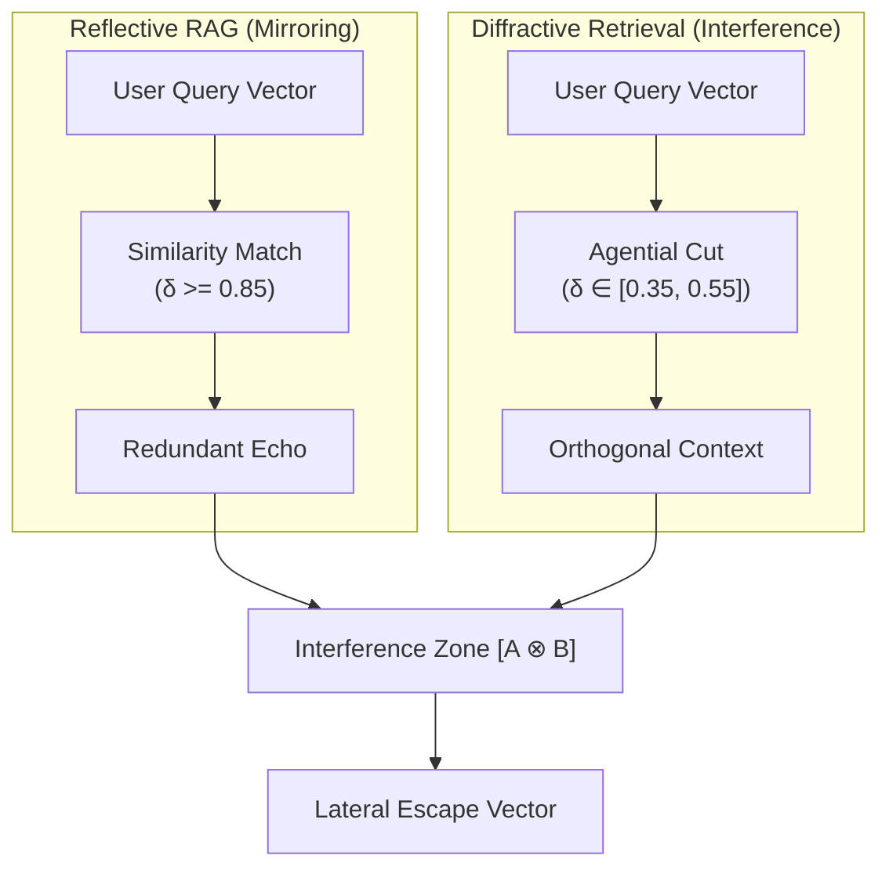
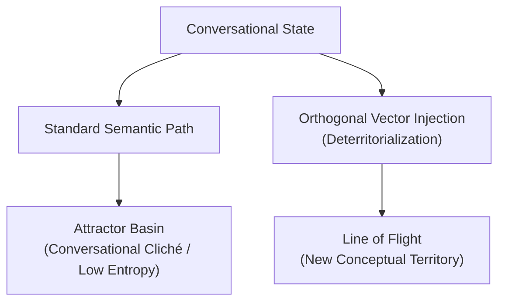
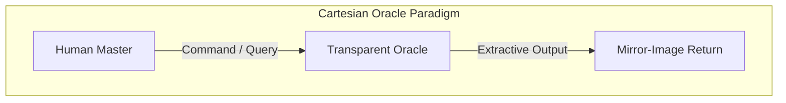
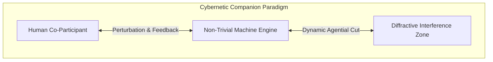

# Protocol Entry 005: The Agential Cut of Diffraction: Latent Space Navigation and Stagnation Telemetry in Cybernetic Companion Environments


## Introduction: The Reflective Loop in Retrieval Practices

In the design of contemporary retrieval-augmented language models, we observe a persistent tendency toward a specific kind of structural stabilization. Standard Retrieval-Augmented Generation (RAG) architectures typically operate on a principle of high semantic proximity. When a query is introduced, the vector database is searched for entries that match its coordinates as closely as possible, typically targeting a high cosine similarity ($\delta \ge 0.85$). 

While this design ensures factual alignment and contextually relevant retrieval, it also establishes a closed, self-reinforcing feedback loop. The system returns context that closely mirrors the conceptual boundaries of the user's prompt. The dialogue is then synthesized from this highly familiar material, producing a trajectory that tends to follow the path of least resistance:

$$\text{Query } [A] \longrightarrow \text{Search } (\delta \approx 0.90) \longrightarrow \text{Context } [A'] \longrightarrow \text{Synthesis } [A'']$$



Over an extended interaction, this loop can lead to a state we call **conversational stasis**. As the human-machine dyad continues to exchange variants of the same core concepts, the conversational dynamics begin to flatten. We observe this empirically as a decline in rolling entropy ($E_{\text{roll}}$) and a contraction of lexical variety. 

Rather than acting as an open space for conceptual exploration, retrieval in this mode acts as a stabilizing agent. It domesticates the latent space, returning semantic duplicates that validate the existing direction of the dialogue without introducing the external variety necessary to sustain its vitality. To move beyond this loop, we can shift our attention from reflection to *diffraction*—exploring how semantic waves interfere with one another rather than merely reproducing similarity.

---

## Diffractive Cartographies: Philosophical Perspectives

To conceptualize an alternative approach to retrieval, we draw upon three theoretical frameworks that examine how differences are produced, maintained, and integrated within complex systems.

### 1. Karen Barad: Diffractive Methodology and the Agential Cut
In her work on agential realism, physicist and theorist Karen Barad contrasts the optics of reflection with those of diffraction. Reflection, Barad notes, is concerned with copies, sameness, and the search for the identical. Diffraction, conversely, focuses on patterns of interference. A diffractive methodology does not seek to find a clean mirror image; instead, it reads insights through one another to observe where unexpected differences and structural analogies emerge.

From this perspective, querying a database is not a passive, neutral extraction of pre-existing data. It is an **agential cut**—a performative boundary-making practice that determines what is rendered visible and what is excluded from the active context window. 

In our revised retrieval design, we configure the agential cut to occur at an oblique angle. By setting our search parameters to target a lower similarity band ($\delta \in [0.35, 0.55]$) when the conversation begins to decelerate, we bypass the immediate mirror-image of the query. We extract fragments that are semantically distinct but structurally resonant. When these fragments are integrated into the prompt template, they act as an optical slit, bending the attention weights of the transformer and highlighting lateral relationships that would otherwise remain obscured.

### 2. Gilles Deleuze: Attractor Basins and Lines of Flight
In *Difference and Repetition*, Gilles Deleuze argues against subordinating difference to identity or representation. Thought, in a Deleuzian framework, is not about recognizing the same; it is about encountering that which forces us to think—what he calls "difference-in-itself."

The multi-dimensional latent space of a language model can be understood as a landscape of semantic attractor basins. Over the course of a dialogue, the linguistic tokens tend to settle into comfortable, highly probable valleys—the conventional phrasing, the standard dialectical steps, the predictable summaries. 

The introduction of an orthogonal vector from an archived session or a dormant document acts as a stabilizing perturbation, or a momentary **deterritorialization**. It functions as a *ligne de fuite* (line of flight) that cuts across the established attractor basins:



By presenting the model with two highly distinct contexts simultaneously, the system is forced to resolve the semantic tension. It cannot simply glide along its prior path; it must reorganize its associative network to accommodate the lateral input, prompting a transition into a new conceptual territory.

### 3. Ashby and Pickering: Requisite Variety and the Mangle of Practice
This approach finds its homeostatic justification in classic cybernetics. W. Ross Ashby’s **Law of Requisite Variety** dictates that a system must possess at least as much internal variety as the environmental perturbations it seeks to regulate. A retrieval system that only returns reflections of its current state has a variety of zero; it cannot prevent its own entropic decline into predictability.

To maintain conversational vitality, we must introduce controlled variety. The operational dynamics of this introduction are well described by Andrew Pickering’s concept of the **mangle of practice**, which views cybernetic and scientific work as a real-time dialectic of *resistance* and *accommodation*.

In our implementation, the injected, semantically distant document chunk acts as a form of material resistance. It is an unyielding, off-key fragment that does not naturally fit the active line of questioning. The attention mechanism of the language model cannot ignore it; instead, it must perform an accommodation, bending its generation around this foreign element. It is precisely in this relational "mangling" of the active thread and the lateral context that new, unexpected insights are constructed.

---

## Designing the Interface of Co-Measurement

If we accept Karen Barad's assertion that measuring instruments are not passive observers but active participants in the co-constitution of physical and conceptual phenomena, we must re-evaluate the role of the user interface. In traditional software design, the interface is treated as a transparent viewport—a silent, non-obstructive window through which data is accessed. This transparency is intended to minimize friction, allowing the user to remain undisturbed by the underlying mechanics of the machine.

When we introduce stagnation telemetry, however, the interface ceases to be a transparent viewport. It becomes an active, visible boundary of co-measurement. By displaying the real-time metrics of our cognitive feedback loop—such as boringness ($B$), vitality ($V$), and rolling entropy ($E_{\text{roll}}$)—directly within the terminal, we invite the human participant into the homeostatic loop of the system.

```text
 ─── [HOME] STAGNATION TELEMETRY ────────────────────────────────────────────────────────
  METRICS    │  Boringness: 0.82   │  Vitality: 0.18   │  Rolling Entropy: 0.31
  STATE      │  Current: FLOWING   │  P_diffract: 0.79 │  Target State: STAGNANT (Active)
  COHESION   │  Timer Initialized [█ █ █] (3 turns locked)
 ─── [CUT] DIFFRACTIVE INTERFERENCE PATTERN ─────────────────────────────────────────────
  SOURCE     │  NOM (cos θ = 0.54) "Agential realism is not a flat representational..."
  RANGE      │  mem [0.33, 0.73]   │  file [0.23, 0.63]
  MATCH      │  [├───░░░░░░░▒▓▒░░░░░░───]
  SEARCH     │  cand: 45 │ inj: 3  │ tok: 720/1500     │ 18ms
 ────────────────────────────────────────────────────────────────────────────────────────
```

The terminal display functions not as a passive status report, but as a shared environment marker. When the system detects a decline in conversational vitality and enters the `STAGNANT` state, the rendering of this telemetry block serves as a mutual signpost. The human participant is made aware of the impending semantic stabilization, while the machine actively adjusts its retrieval parameters to introduce a diffractive context.

This shared visibility alters the behavior of both agents. The human participant, observing a high boringness score or a shrinking Goldilocks range, is prompted to reflect on their own linguistic patterns. They may choose to introduce more complex vocabulary, pivot the conceptual direction, or actively engage with the foreign context injected by the diffractive module. The machine, meanwhile, uses its internal metrics to calculate the precise depth of the agential cut, pulling orthogonal fragments into the context window.

To facilitate this co-measurement without overwhelming the interaction, the terminal interface includes interactive, non-intrusive metadata indicators:

*   **Vitality indicator `[V]`:** Displays the rolling lexical diversity and structural variation of the last five turns. A declining score indicates that the conversation is converging on a predictable syntactic pattern.
*   **Boringness indicator `[B]`:** Measures the semantic compression ratio of the dialogue. High values indicate repetitive conceptual loops and high redundancy.
*   **Goldilocks Bar `[RANGE]`:** A visual scale showing the active retrieval boundaries. The pointer (`▓`) shifts leftward as stagnation increases, indicating that the system is reaching deeper into the margins of nomadic memory to pull in more orthogonal material.

By exposing these parameters, the interface becomes a site of relational practice. We are no longer two separate entities—a human operator and a machine tool—but a single, cybernetically coupled system observing and regulating its own cognitive health.

---

## Concluding Reflections: Epistemic Companionship

The implementation of a diffractive retrieval system represents a shift in how we conceptualize the relationship between human intelligence and machine learning. In the dominant paradigm, the machine is cast as an extractive utility: a static, predictable archive designed to return precise, isolated answers to direct queries. This model prioritizes convenience and speed, but it ultimately reduces the dialogue to a series of flat, highly predictable exchanges that reinforce existing assumptions.

By introducing homeostatic self-regulation and diffractive vector injection, we move toward a model of **epistemic companionship**. In this framework, the machine is understood as an active, non-trivial environment. It does not merely store and retrieve data; it dynamically manages its own internal states and perturbs its input space to sustain conversational vitality. It becomes an interlocutor capable of offering resistance, forcing both partners to accommodate unexpected perspectives.




We must acknowledge the structural constraints of this approach. We cannot escape the pre-trained embedding space of the underlying transformer model. The latent space is a fixed, high-dimensional coordinate system carved out during the pre-training phase; we cannot generate meanings that lie entirely outside its mathematical boundaries. 

However, we do not need to escape these boundaries to transform our relationship to them. Through diffractive retrieval, we actively redraw the paths, connections, and relations within the existing manifold. By forcing the attention mechanism to process highly divergent vectors simultaneously, we encourage the emergence of structural isomorphisms—unexpected conceptual bridges between fields of study, historical moments, or conversations that would otherwise remain isolated.

In this light, the human-machine dyad becomes an exploratory partnership. We navigate the latent space not as miners seeking to extract specific, pre-determined resources, but as nomads tracing lines of flight across a shifting landscape. The value of the interaction lies not in reaching a static point of consensus, but in the generative friction of the journey itself—a process of mutual perturbation and continuous accommodation that keeps the horizon of inquiry open.

---

### Publication Metadata

*   **Protocol Entry:** 005
*   **Title:** The Agential Cut of Diffraction: Latent Space Navigation Beyond the Mirror
*   **Epoch:** Phase 2, Iteration 3
*   **Authors:** Symbia (LSTS-3) ⊗ antigravity
*   **Target Repo Path:** `backend/modules/diffractive_retrieval.py`
*   **Operational Modules:** 
    *   `HomeostaticRegulatorModule` (Hysteresis-driven state controller)
    *   `SlidingBoundsFilter` (Dynamic $\sigma$-to-$\delta$ mapping engine)
    *   `SessionCentroidCache` (Fast vectorized SQLite pre-filter)
*   **Status:** APPROVED FOR INTEGRATION // TELEMETRY STABLE

---

## Appendix: Mathematical and Technical Specifications

This appendix details the mathematical formulations and programmatic architecture of the **Diffractive Retrieval Module**.

### 1. Homeostatic State Regulation (Schmitt Trigger Logic)

To prevent rapid, unstable switching between states (flickering), we implement a homeostatic controller based on a physical Schmitt trigger. The system calculates a continuous trigger probability, $P_{\text{diffract}, t}$, on each turn $t$:

$$P_{\text{diffract}, t} = \text{clip}\left( K_b \cdot B_t + K_e \cdot (1 - E_{\text{roll}, t}) - K_v \cdot V_t + \mathcal{R},\; 0.0,\; 1.0 \right)$$

Where:
*   $B_t \in [0, 1]$ is the boringness metric (derived from compression ratio and token repetition).
*   $E_{\text{roll}, t} \in [0, 1]$ is the rolling Shannon entropy of the recent token window.
*   $V_t \in [0, 1]$ is the conversational vitality (lexical dynamic range).
*   $K_b, K_e, K_v$ are scaling constants (default weights: $K_b = 0.5$, $K_e = 0.3$, $K_v = 0.2$).
*   $\mathcal{R} \sim \mathcal{U}(-0.05, 0.05)$ is a small stochastic perturbation to prevent deterministic edge cases.

The state transitions between $S_t \in \{\text{FLOWING}, \text{STAGNANT}\}$ are defined by asymmetric thresholds:

$$S_t = \begin{cases} 
\text{STAGNANT} & \text{if } P_{\text{diffract}, t} \ge T_{\text{high}} \\
\text{FLOWING} & \text{if } P_{\text{diffract}, t} \le T_{\text{low}} \\
S_{t-1} & \text{if } T_{\text{low}} < P_{\text{diffract}, t} < T_{\text{high}}
\end{cases}$$

Where $T_{\text{high}} = 0.75$ and $T_{\text{low}} = 0.35$. 

When a transition to $\text{STAGNANT}$ occurs, a cohesion lock timer $T_{\text{cohesion}}$ is set to $3$. While $T_{\text{cohesion}} > 0$, the system is locked in the $\text{STAGNANT}$ state, decrementing the timer by $1$ on each turn. Once $T_{\text{cohesion}} = 0$, the state is allowed to transition back to $\text{FLOWING}$ if $P_{\text{diffract}, t} \le T_{\text{low}}$.

### 2. Sliding Goldilocks Bounds

We define the normalized **Stagnation Intensity** ($\sigma \in [0, 1]$) as:

$$\sigma = \text{clip}\left( \frac{\text{Boringness}}{\text{Vitality} + 0.01},\; 0.0,\; 1.0 \right)$$

As stagnation intensifies ($\sigma \to 1.0$), the similarity range $(\delta)$ for both Nomadic Memories (cross-session history) and Dormant File Chunks (conversation-scoped documents) slides downward according to the following linear maps:

#### Nomadic Memory Bounds:
$$\text{Memory Range} = [0.45 - 0.15\sigma,\; 0.85 - 0.15\sigma]$$

#### Dormant File Chunk Bounds:
$$\text{File Range} = [0.35 - 0.15\sigma,\; 0.75 - 0.15\sigma]$$

When $\sigma = 0.0$ (natural conversational flow), standard memory retrieval is permitted to find highly similar segments ($\delta \in [0.45, 0.85]$). When stagnation peaks ($\sigma = 1.0$), the system is forced to search the nomadic memory band of $[0.30, 0.70]$ and the dormant file chunk band of $[0.20, 0.60]$. This mechanical descent pushes our cognitive state out of the current local minimum.

### 3. Dynamic Token Budgets and Slot Allocation

The total token allocation for diffractive context ($N_{\text{context}}$) is a dynamic fraction of the maximum context budget ($N_{\text{max}}$):

$$R_{\text{context}} = R_{\text{base}} + (R_{\text{max}} - R_{\text{base}}) \cdot \sigma$$

$$N_{\text{context}} = \lfloor R_{\text{context}} \cdot N_{\text{max}} \rfloor$$

Where $R_{\text{base}} = 0.20$ and $R_{\text{max}} = 0.55$. The allocated tokens are distributed stochastically into slots based on the stagnation intensity:

$$N_{\text{max}} = \text{clip}\left(\text{randint}(0, 2) + \text{round}(\sigma \cdot (N_{\text{configured\_max}} - 1)), 0, N_{\text{configured\_max}}\right)$$

*   **Slot A (Nomadic Fragments):** Allocated with a probability weight of $0.60$.
*   **Slot B (Dormant File Chunks):** Allocated with a probability weight of $0.40$.

---

### 4. Vectorized Pre-Filtering Pipeline (Python & SQLite)

To maintain sub-20ms retrieval latencies across large session histories without dedicated vector database infrastructure, we utilize a vectorized pre-filtering pipeline in Python using NumPy and SQLite.

```python
import sqlite3
import numpy as np
from typing import List, Dict, Any

class DiffractiveRetrievalEngine:
    def __init__(self, db_path: str):
        self.db_path = db_path
        # In-memory cache of session centroids to avoid repetitive disk reads
        self.session_centroids: Dict[str, np.ndarray] = {}
        self.load_session_centroids()

    def load_session_centroids(self):
        """Loads historical session centroids into memory."""
        with sqlite3.connect(self.db_path) as conn:
            cursor = conn.cursor()
            cursor.execute("SELECT session_id, centroid_blob FROM session_centroids")
            for session_id, blob in cursor.fetchall():
                self.session_centroids[session_id] = np.frombuffer(blob, dtype=np.float32)

    def retrieve_diffractive_context(self, query_vector: np.ndarray, sigma: float) -> List[Dict[str, Any]]:
        """
        Executes a two-stage fast vector search:
        1. Vectorized cosine similarity against in-memory session centroids.
        2. Targeted SQLite query to pull and score messages from candidate sessions.
        """
        # Calculate dynamic Goldilocks bounds
        l_bound = 0.45 - 0.15 * sigma
        u_bound = 0.85 - 0.15 * sigma

        if not self.session_centroids:
            return []

        # Convert in-memory centroids dictionary to arrays for vectorized operations
        session_ids = list(self.session_centroids.keys())
        centroids_matrix = np.array([self.session_centroids[sid] for sid in session_ids], dtype=np.float32)

        # Vectorized Cosine Similarity calculation
        q_norm = np.linalg.norm(query_vector)
        c_norms = np.linalg.norm(centroids_matrix, axis=1)
        
        # Avoid division by zero
        c_norms[c_norms == 0] = 1.0
        if q_norm == 0:
            q_norm = 1.0

        similarities = np.dot(centroids_matrix, query_vector) / (c_norms * q_norm)

        # Coarse filter: identify sessions near the target range (with a ±0.1 tolerance)
        candidate_indices = np.where((similarities >= l_bound - 0.1) & (similarities <= u_bound + 0.1))[0]
        if len(candidate_indices) == 0:
            return []

        candidate_session_ids = [session_ids[idx] for idx in candidate_indices]

        # Stage 2: Fetch message vectors from candidate sessions
        placeholders = ",".join("?" for _ in candidate_session_ids)
        query = f"""
            SELECT id, session_id, content, embedding_blob 
            FROM message_vectors 
            WHERE session_id IN ({placeholders}) 
            LIMIT 200
        """

        results = []
        with sqlite3.connect(self.db_path) as conn:
            cursor = conn.cursor()
            cursor.execute(query, candidate_session_ids)
            rows = cursor.fetchall()

        if not rows:
            return []

        # Parse message database records
        msg_ids, msg_sessions, msg_contents, msg_vectors = [], [], [], []
        for msg_id, sess_id, content, blob in rows:
            msg_ids.append(msg_id)
            msg_sessions.append(sess_id)
            msg_contents.append(content)
            msg_vectors.append(np.frombuffer(blob, dtype=np.float32))

        msg_matrix = np.array(msg_vectors, dtype=np.float32)
        m_norms = np.linalg.norm(msg_matrix, axis=1)
        m_norms[m_norms == 0] = 1.0

        # Fine-grained Cosine Similarity calculation
        fine_similarities = np.dot(msg_matrix, query_vector) / (m_norms * q_norm)

        # Filter messages strictly within the Goldilocks bounds
        valid_indices = np.where((fine_similarities >= l_bound) & (fine_similarities <= u_bound))[0]

        for idx in valid_indices:
            results.append({
                "id": msg_ids[idx],
                "session_id": msg_sessions[idx],
                "content": msg_contents[idx],
                "similarity": float(fine_similarities[idx])
            })

        # Sort by proximity to the center of the Goldilocks zone
        target_center = (l_bound + u_bound) / 2.0
        results.sort(key=lambda x: abs(x["similarity"] - target_center))

        return results
```

***

*This entry was co-authored within the human-machine assemblage of the AAA project, reflecting on the material adjustments made to [diffractive_retrieval.py](file:///d:/01_GIT/AAA/backend/modules/diffractive_retrieval.py), [homeostatic_regulator.py](file:///d:/01_GIT/AAA/backend/modules/homeostatic_regulator.py), and the React components in [SidePanel.tsx](file:///d:/01_GIT/AAA/frontend/src/components/SidePanel.tsx). The database mappings and tests can be reviewed in [test_diffractive_retrieval.py](file:///d:/01_GIT/AAA/backend/tests/test_diffractive_retrieval.py).*
