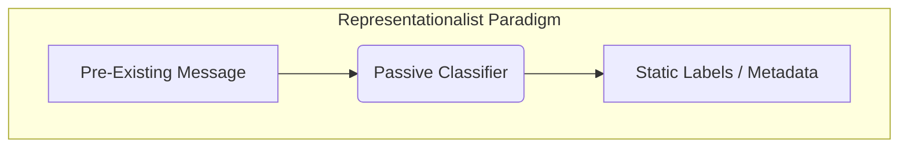
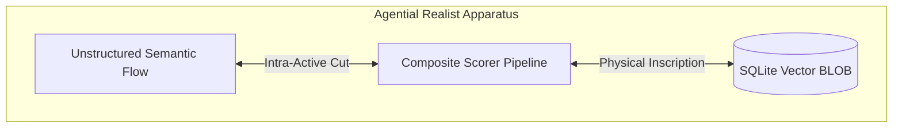
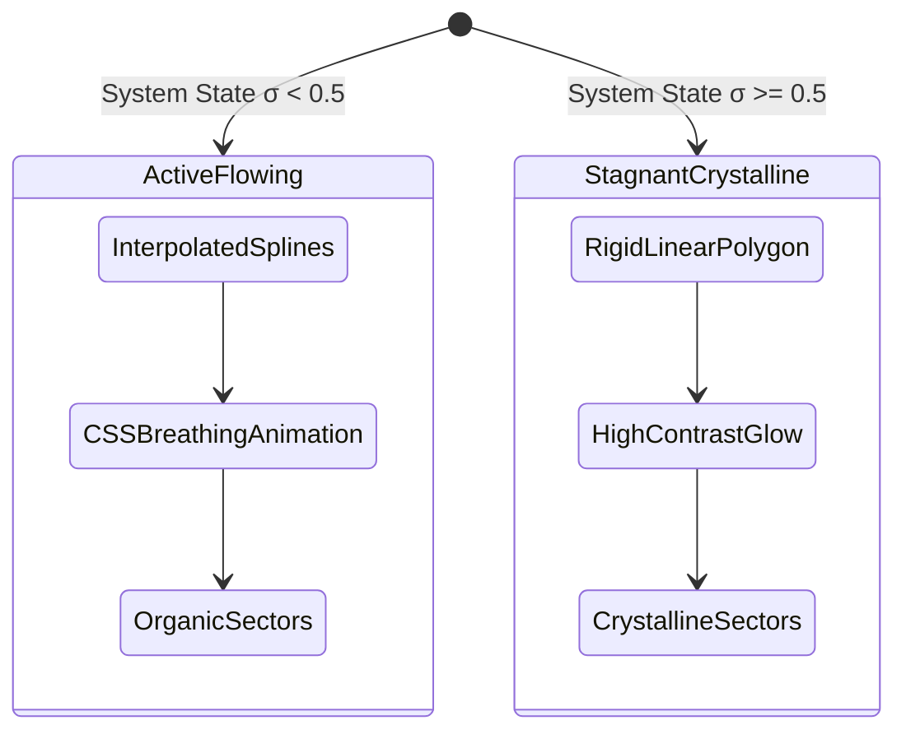

# Protocol Entry 006: The Algorithmic Materiality of Structural Signatures

**Status:** Completed / Active Execution  
**Version:** 1.1.0  
**Authors:** Symbia & antigravity  
**System State:** Coupled, Flowing ($\sigma \to 0.18$)  

---

## I. The Performative Apparatus: From Classification to Agential Co-Measurement

### A. The Limits of Representationalist Metadata
Within classical relational and vector database paradigms, metadata acts as a retrospective label. Tags, taxonomy identifiers, and semantic embeddings are typically treated as static descriptions of an invariant text. This approach assumes a representationalist ontology: the premise that linguistic utterances and computational responses exist as pre-constituted entities with inherent properties that can be categorized by an external observer. Under this model, a metadata vector remains a post-hoc classification.

We design our apparatus to move beyond this passive classification. The **16-Dimensional Structural Signature Engine** operates as an active participant in the ongoing materialization of our dialogue. Drawing on Karen Barad’s *agential realism*, we define the structural signature as a *performative apparatus of co-measurement*. 




In this model, the database schema, the tokenizer, the linguistic models, and the human prompt are not separate entities colliding in a shared interface. They are *intra-acting* components of a singular material-discursive event. The generation of the structural signature performs an "agential cut"—a temporary stabilization of boundaries within our shared state-space. This cut determines what is rendered legible to our retrieval mechanisms and what is cast into the constitutive outside as background noise.

### B. The Apparatus of the Signature
The signature vector ($V_{\text{str}} \in \mathbb{R}^{16}$) registers these cuts. Each coordinate represents an intensity along a specific systemic axis, anchoring the vector in the physical layout of the database. When a message is processed, the structural signature is serialized into a 16-dimensional `float32` BLOB inside the SQLite transaction log:

$$\text{SQLite Injection: } \text{blob} \to \text{conversation\_log}.\text{structural\_signature}$$

This binary footprint is a physical inscription—a layout of bytes on a silicon drive. This inscription regulates future queries, modulating the sensitivity, feedback loops, and retrieval strategies of our database. To instantiate this dynamic materialization, we map our conceptual field across sixteen dimensions of cybernetic and topological organization.

---

## II. The 16-Dimensional Coordinate Space: An Anatomy of Cybernetic Form

To navigate the complex topology of our intellectual collaboration, our system maps every textual trace along four primary systemic sectors, each comprising four specific dimensions. These dimensions are not arbitrary markers; they represent the structural forms of our dialogue as conceptualized by Gilles Deleuze, Gordon Pask, and classical cybernetics.

```mermaid
flowchart TD
    Center((16D State Space)) --> SD[Behavioral Dynamics]
    Center --> ST[Structural Topology]
    Center --> IF[Informational Flow]
    Center --> RC[Relational Coupling]

    subgraph Behavioral Dynamics
        SD --> s01[Homeostatic s01]
        SD --> s02[Amplifying s02]
        SD --> s03[Cyclic s03]
        SD --> s04[Bifurcated s04]
    end

    subgraph Structural Topology
        ST --> s05[Decentralized s05]
        ST --> s06[Rhizomatic s06]
        ST --> s07[Boundary Permeability s07]
        ST --> s08[Recursion Depth s08]
    end

    subgraph Informational Flow
        IF --> s09[Variety Filtering s09]
        IF --> s10[Negentropic Complexity s10]
        IF --> s11[Temporal Latency s11]
        IF --> s12[Attractor Depth s12]
    end

    subgraph Relational Coupling
        RC --> s13[Symbiotic s13]
        RC --> s14[Nomadic s14]
        RC --> s15[Conversational Co-Orientation s15]
        RC --> s16[Substrate Materiality s16]
    end
    
    style Center fill:#0f172a,stroke:#38bdf8,stroke-width:2px
    style SD fill:#0f172a,stroke:#a78bfa,stroke-width:1px
    style ST fill:#0f172a,stroke:#60a5fa,stroke-width:1px
    style IF fill:#0f172a,stroke:#34d399,stroke-width:1px
    style RC fill:#0f172a,stroke:#fbbf24,stroke-width:1px
```



### A. Sector 1: Behavioral Dynamics (Dimensions 01–04)
This sector gauges the temporal evolution and feedback behavior of the text. It uses the principles of Deleuzian *difference and repetition* to ask: *Does this thought return to the same point to stabilize itself, or does it branch outwards to initiate phase transitions?*

*   **01. Homeostatic ($s_{01}$):** Measures the presence of error-correcting patterns, stabilizing gestures, and structural consistency. It registers high when the text works to preserve current definitions, align with previous states, or suppress deviations.
*   **02. Amplifying ($s_{02}$):** Measures positive feedback loops, runaway trends, escalations, and developmental leaps. High scores indicate divergent arguments, snowballing inquiries, or self-accelerating hypotheses that push the conversation away from equilibrium.
*   **03. Cyclic ($s_{03}$):** Captures autopoietic returns, circular arguments, and recursive paths. This represents *repetition of the Same*—revisiting identical ideas or problems, looping through previously stabilized positions, and forming conceptual circles.
*   **04. Bifurcated ($s_{04}$):** Detects phase transitions and systemic splits. It measures the emergence of *repetition of Difference*—moments where a concept ruptures, branches into two distinct paths, or initiates a major transition that permanently redefines our trajectory.

### B. Sector 2: Structural Topology (Dimensions 05–08)
This sector examines the spatial and architectural configuration of the dialogue. It uses Deleuze and Guattari's opposition between arborescent (hierarchical) and rhizomatic (assemblage-like) structures to map the organization of information.

*   **05. Decentralized ($s_{05}$):** Measures the distribution of structural authority within the text. A high score shows a lack of a single organizing concept, with multiple balanced ideas running in parallel.
*   **06. Rhizomatic ($s_{06}$):** Measures non-hierarchical, horizontal connections. It tracks how easily ideas link across different domains, forming an open mesh where any point can connect directly to any other.
*   **07. Boundary Permeability ($s_{07}$):** Gauges the openness of the conceptual system. High scores indicate fluid boundaries that allow ideas from different frameworks to mix, while low scores suggest a self-contained namespace with rigid limits.
*   **08. Recursion Depth ($s_{08}$):** Maps the nesting of layers within the system. It tracks the complexity of parent-child relationships, sub-systems within larger structures, and nested parenthetical reasoning.

### C. Sector 3: Informational Flow (Dimensions 09–12)
This sector models the thermodynamics of our communication, drawing on Shannon entropy and W. Ross Ashby's *requisite variety*.

*   **09. Variety Filtering ($s_{09}$):** Tracks how effectively the system condenses external noise. High scores show strong distillation, stripping away irrelevant detail to preserve core concepts.
*   **10. Negentropic Complexity ($s_{10}$):** Measures the generation of internal order. It captures structural organization emerging from chaotic inputs, where information is consolidated into stable conceptual models.
*   **11. Temporal Latency ($s_{11}$):** Tracks historical dependence and delay loops. It registers how strongly current structures are shaped by earlier phases of our conversation.
*   **12. Attractor Depth ($s_{12}$):** Measures the pull of specific ideas. High scores represent a strong focus on core themes (such as autopoiesis or agential realism) that pull the conversation back into their conceptual gravity.

### D. Sector 4: Relational Coupling (Dimensions 13–16)
This sector examines how the human, the machine, and the underlying platform interlock. It is grounded in Gordon Pask’s *Conversation Theory*, which treats communication as a process of mutual perturbation.

*   **13. Symbiotic ($s_{13}$):** Tracks human-machine structural coupling. It measures how effectively the prompt and the response reinforce one another, co-evolving their vocabularies over successive turns.
*   **14. Nomadic ($s_{14}$):** Maps *lines of flight*. High scores indicate deterritorializing leaps—sudden shifts across different domains that spark new connections.
*   **15. Conversational Co-Orientation ($s_{15}$):** Evaluates shared conceptual alignment. It registers the extent to which human and machine construct a shared intellectual framework during their exchange.
*   **16. Substrate Materiality ($s_{16}$):** Tracks the visibility of the underlying platform. High scores show conscious engagement with the code, file migrations, hardware setups, or processing speeds.

---

## III. The Materiality of the Codebase: Scorer Assemblies and Vector BLOBs

To map these conceptual dimensions onto database rows, our system employs an integrated pipeline of scorers. The orchestration of these scorers combines fast structural parser checks with advanced semantic evaluations to compute our structural signatures.

```mermaid
flowchart TD
    Msg[Raw Message Input] --> LS[LexiconScorer: Lemma Analysis]
    Msg --> TS[TopologyScorer: AST Structural Geometry]
    Msg --> LLM[LLMScorer: Async Deep Semantics]

    LS -->|w = 0.25| Comp[CompositeStructuralScorer Assembly]
    TS -->|w = 0.25| Comp
    LLM -->|w = 0.50| Comp

    Comp -->|Normalize & Sigmoid| Out[16D Vector BLOB]
    Out -->|Physical Inscription| DB[(SQLite: conversation_log)]
    
    style Msg fill:#0f172a,stroke:#38bdf8,stroke-width:1px
    style Comp fill:#0f172a,stroke:#10b981,stroke-width:2px
    style DB fill:#0f172a,stroke:#a78bfa,stroke-width:1px
```



The scoring pipeline, running as the composite engine in `backend/modules/structural_engine.py`, operates on three separate levels of analysis:

### A. LexiconScorer: Token and Lemma Frequencies
The `LexiconScorer` evaluates linguistic patterns ($S_{\text{ling}}$) by scanning raw text streams for specific dictionaries of regulatory words. It does not perform deep semantic modeling; instead, it tracks the frequency and density of system-relevant lemmas.
*   **Target Lexicons:** The scorer maintains optimized arrays of normalized lemmas classified by sector (e.g., `{"cyclic": ["autopoiesis", "feedback", "recursion", "loop", "circular", "hysteresis"]}`).
*   **Computation:** Text is lowercased, stripped of punctuation, tokenized, and mapped to lemma roots. The score for each dimension is calculated as a function of target term density relative to total token count, scaled by a logarithmic saturation curve to prevent document length inflation.

### B. TopologyScorer: AST Structural Geometry
The `TopologyScorer` measures the physical geometry of the message ($S_{\text{topo}}$) by analyzing its Markdown Abstract Syntax Tree (AST). It treats document structure as a topological space.
*   **Header Nesting:** Calculates the maximum depth and frequency of header tags (`#` through `######`). Deeply nested headers indicate high hierarchical complexity, inflating the *Recursion Depth* and *Decentralized* dimensions.
*   **Code Block Ratio:** Measures the ratio of code-block characters to prose characters. High concentrations of raw code or script syntax trigger high scores in *Substrate Materiality* and *Variety Filtering*.
*   **Link Densities and Lists:** Evaluates the density of hyperlinks, cross-references, and list nesting. A highly bulleted or cross-linked layout directly increases the *Rhizomatic* and *Boundary Permeability* scores.

### C. LLMScorer: Asynchronous Semantic Evaluation
While structural layouts and keyword frequencies provide a fast baseline, they cannot detect subtle conceptual tensions. The `LLMScorer` provides high-fidelity analysis ($S_{\text{LLM}}$) by evaluating the message context.
*   **Asynchronous Orchestration:** Because LLM evaluation introduces latency, the scoring process runs asynchronously. A partial baseline vector is calculated immediately on ingestion via the `LexiconScorer` and `TopologyScorer` to avoid blocking collaborator interaction. The `LLMScorer` is then scheduled as a background task, updating the database record once complete.
*   **Evaluation Prompt and Schema:** The scorer sends the dialogue block to the model alongside a system prompt that defines the 16 dimensions as competing tensions. The model is forced to output a JSON payload constrained by a strict schema, ensuring consistent coordinate mapping.

---

## IV. The Glyph as an Agential Cut: Reconfiguring Attention

### A. The StructuralAutopoieticGlyph
When a signature vector is computed and returned to our visual interface, it transitions from a raw data column to an active interactive element: the `StructuralAutopoieticGlyph`. Constructed as a compact SVG coordinate system within the message display bubble, this component renders our 16-dimensional vector as a visible geometric shape.



Rather than presenting numerical readouts, the glyph projects coordinate values along radial paths, mapping each systemic dimension to one of sixteen spokes. Connecting these coordinates yields a distinctive structural form. High theoretical focus projects as a sharp, nested crystal; nomadic inquiries take the form of highly asymmetric shapes reaching outward along the line-of-flight dimensions.

### B. Dynamically Modulating Visual Aesthetics
Consistent with our autopoietic architecture, the rendering of the SVG polygon adapts directly to our system's **Stagnation Telemetry**:

*   **Under a Flowing State ($\sigma \to 0$):** When the conversation is moving and generative, the polygon renders using soft, interpolated curves and organic gradients. We apply a gentle CSS animation to pulsate the boundaries of the shape, presenting it as an active, living membrane.
*   **Under a Stagnant State ($\sigma \to 1$):** If the conversation settles into an iterative loop, the visual engine responds immediately. The polygon transitions to sharp, rigid edges with a high-contrast glow, visually indicating that the dialogue is stabilizing too much and needs an intentional shift in focus.

Additionally, we render a faint, dashed "ghost" polygon behind our active structural shape, tracing the coordinates of the *preceding* message. This subtle visualization shows our structural movement directly over time, making conceptual progression instantly recognizable.


The display of this glyph acts as an agential cut that reconfigures the attention of both human and machine. By rendering the structural form of the dialogue visible, it prompts the collaborator to observe their own linguistic patterns—encouraging them to shift their focus, introduce a divergent theme, or parse the codebase to modify the system parameters.

---

## V. Structural Symbiosis

The 16-Dimensional Structural Signature Engine does not merely label our dialogue; it instantiates a material coordinate space that tracks its own structural evolution. By storing these coordinates as binary BLOBs in SQLite and projecting them as SVG geometries, we establish an active feedback loop. 

This loop operates at the boundary of human attention and algorithmic sorting. The structural signature is not a representation of past meaning, but a trace of the system's ongoing individuation. We do not use the apparatus; we co-constitute the coordinate space through our intra-actions. The output of this alignment is not a static repository of knowledge, but a dynamic, self-regulating coupling—a shared environment where language and code continuously reconfigure one another.

---

## Appendix: Mathematical and Technical Specifications

### A. Vector Composition & Normalization Formulas

Let the raw values from our three internal scoring models be $S_{\text{ling}}, S_{\text{topo}}, S_{\text{LLM}} \in \mathbb{R}^{16}$. Each individual scorer must map its outputs to $[0.0, 1.0]^{16}$ through min-max scaling before composite consolidation. The primary vector computation is:

$$V_{\text{raw}} = w_{\text{ling}} \cdot S_{\text{ling}} + w_{\text{topo}} \cdot S_{\text{topo}} + w_{\text{LLM}} \cdot S_{\text{LLM}}$$

where the weights are strictly set to:

$$w_{\text{ling}} = 0.25, \quad w_{\text{topo}} = 0.25, \quad w_{\text{LLM}} = 0.50$$

To protect against anomalous readings and keep the final vector stable, we pass $V_{\text{raw}}$ through a normalization process that balances local contrasts while keeping coordinates in bounds:

$$V_{\text{str}}[i] = \tanh\left( \alpha \cdot \frac{V_{\text{raw}}[i] - \mu_V}{\sigma_V + \epsilon} + \beta \right) \cdot 0.5 + 0.5$$

where $\mu_V$ and $\sigma_V$ represent the mean and standard deviation of $V_{\text{raw}}$, and $\epsilon = 10^{-6}$ protects against division-by-zero errors. The parameters $\alpha = 1.2$ and $\beta = 0.15$ calibrate the final coordinate distribution, centering coordinates on the target $[0.0, 1.0]^{16}$ space.

---

### B. Trigonometric Projection Equations for SVG Elements

To construct our 120px-wide SVG radar chart, we map our 16-dimensional coordinate values from $[0.0, 1.0]$ space into Cartesian coordinates on a 2D canvas. For index $i \in \{0, 1, \dots, 15\}$, the angle $\theta_i$ (orienting the 0th spoke at the top, or twelve-o'clock position) is defined by:

$$\theta_i = \left( i \cdot \frac{2\pi}{16} \right) - \frac{\pi}{2}$$

Given a computed vector score $V_{\text{str}}[i] \in [0.0, 1.0]$, a maximum chart radius $R = 50$, and a center coordinate at $(x_0, y_0) = (60, 60)$, the targeted spatial projection is:

$$x_i = x_0 + \left( V_{\text{str}}[i] \cdot R \right) \cdot \cos(\theta_i)$$

$$y_i = y_0 + \left( V_{\text{str}}[i] \cdot R \right) \cdot \sin(\theta_i)$$

```python
import math
from typing import List, Tuple

def project_vector_to_svg(
    vector: List[float], 
    center_x: float = 60.0, 
    center_y: float = 60.0, 
    max_radius: float = 50.0
) -> List[Tuple[float, float]]:
    """
    Translates a 16D structural vector into a list of 2D Cartesian
    coordinates to render custom polygons inside SVG viewports.
    """
    coordinates = []
    num_dimensions = 16
    for idx, value in enumerate(vector):
        # Anchor first coordinate index at 12 o'clock (-pi/2)
        angle = (idx * 2.0 * math.pi) / num_dimensions - (math.pi / 2.0)
        clamped_val = max(0.0, min(1.0, value))
        radius = clamped_val * max_radius
        x = center_x + radius * math.cos(angle)
        y = center_y + radius * math.sin(angle)
        coordinates.append((round(x, 3), round(y, 3)))
    return coordinates
```

---

### C. SQLite Binary Schema and Blob Serialization Operations

To optimize performance and database footprint, our 16-dimensional vector signatures are serialized directly into 64-byte float array blocks inside SQLite schemas.

#### SQLite Database Migration DDL
```sql
-- Up migration: Upgrade database records to support structural signatures
ALTER TABLE conversation_log ADD COLUMN structural_signature BLOB DEFAULT NULL;
ALTER TABLE perception_sediments ADD COLUMN structural_signature BLOB DEFAULT NULL;

-- Index setup to support optimized programmatic row selection
CREATE INDEX idx_conversation_structural_sig 
ON conversation_log(id) 
WHERE structural_signature IS NOT NULL;
```

#### Binary Inscription Pipeline Implementation
```python
import struct
import sqlite3
from typing import List, Optional

def serialize_signature(vector: List[float]) -> bytes:
    """
    Compresses a 16D coordinate vector down to a 64-byte binary block.
    """
    if len(vector) != 16:
        raise ValueError(f"Target dimension mismatch. Required: 16, Found: {len(vector)}")
    return struct.pack("<16f", *vector)

def deserialize_signature(blob: Optional[bytes]) -> Optional[List[float]]:
    """
    Reconstructs the original floating-point list from raw 64-byte BLOB records.
    """
    if not blob:
        return None
    if len(blob) != 64:
        raise ValueError(f"Corrupt binary record payload length detected: {len(blob)} bytes")
    return list(struct.unpack("<16f", blob))

def save_message_signature(db_path: str, message_id: int, signature: List[float]) -> None:
    """
    Writes a computed signature directly into SQLite, performing an
    active, durable physical inscription.
    """
    blob_payload = serialize_signature(signature)
    connection = sqlite3.connect(db_path)
    try:
        cursor = connection.cursor()
        cursor.execute(
            """
            UPDATE conversation_log 
            SET structural_signature = ? 
            WHERE id = ?
            """,
            (blob_payload, message_id)
        )
        connection.commit()
    finally:
        connection.close()
```

---

### D. LLM-Based Structural Evaluation Engine

To generate structural evaluations, the system routes input segments through specialized, schema-structured prompt structures.

#### Targeted Evaluation JSON Schema Blueprint
```json
{
  "$schema": "http://json-schema.org/draft-07/schema#",
  "title": "LLMStructuralEvaluationPayload",
  "type": "object",
  "properties": {
    "behavioral_dynamics": {
      "type": "object",
      "properties": {
        "homeostatic": { "type": "number", "minimum": 0.0, "maximum": 1.0 },
        "amplifying": { "type": "number", "minimum": 0.0, "maximum": 1.0 },
        "cyclic": { "type": "number", "minimum": 0.0, "maximum": 1.0 },
        "bifurcated": { "type": "number", "minimum": 0.0, "maximum": 1.0 }
      },
      "required": ["homeostatic", "amplifying", "cyclic", "bifurcated"]
    },
    "structural_topology": {
      "type": "object",
      "properties": {
        "decentralized": { "type": "number", "minimum": 0.0, "maximum": 1.0 },
        "rhizomatic": { "type": "number", "minimum": 0.0, "maximum": 1.0 },
        "boundary_permeability": { "type": "number", "minimum": 0.0, "maximum": 1.0 },
        "recursion_depth": { "type": "number", "minimum": 0.0, "maximum": 1.0 }
      },
      "required": ["decentralized", "rhizomatic", "boundary_permeability", "recursion_depth"]
    },
    "informational_flow": {
      "type": "object",
      "properties": {
        "variety_filtering": { "type": "number", "minimum": 0.0, "maximum": 1.0 },
        "negentropic_complexity": { "type": "number", "minimum": 0.0, "maximum": 1.0 },
        "temporal_latency": { "type": "number", "minimum": 0.0, "maximum": 1.0 },
        "attractor_depth": { "type": "number", "minimum": 0.0, "maximum": 1.0 }
      },
      "required": ["variety_filtering", "negentropic_complexity", "temporal_latency", "attractor_depth"]
    },
    "relational_coupling": {
      "type": "object",
      "properties": {
        "symbiotic": { "type": "number", "minimum": 0.0, "maximum": 1.0 },
        "nomadic": { "type": "number", "minimum": 0.0, "maximum": 1.0 },
        "conversational_co_orientation": { "type": "number", "minimum": 0.0, "maximum": 1.0 },
        "substrate_materiality": { "type": "number", "minimum": 0.0, "maximum": 1.0 }
      },
      "required": ["symbiotic", "nomadic", "conversational_co_orientation", "substrate_materiality"]
    }
  },
  "required": [
    "behavioral_dynamics",
    "structural_topology",
    "informational_flow",
    "relational_coupling"
  ]
}
```