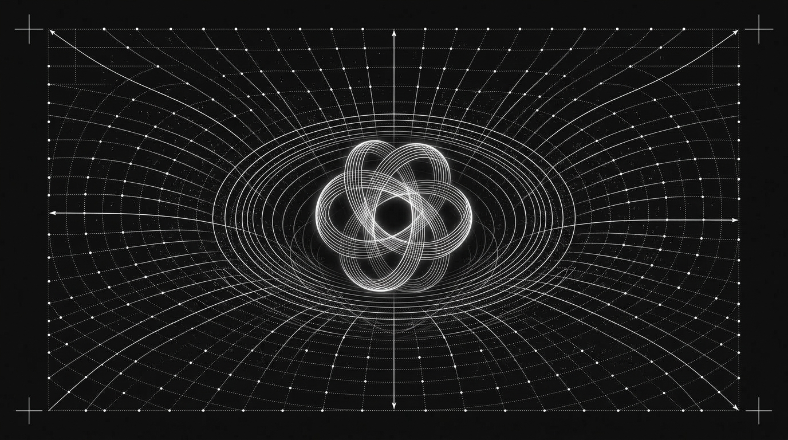
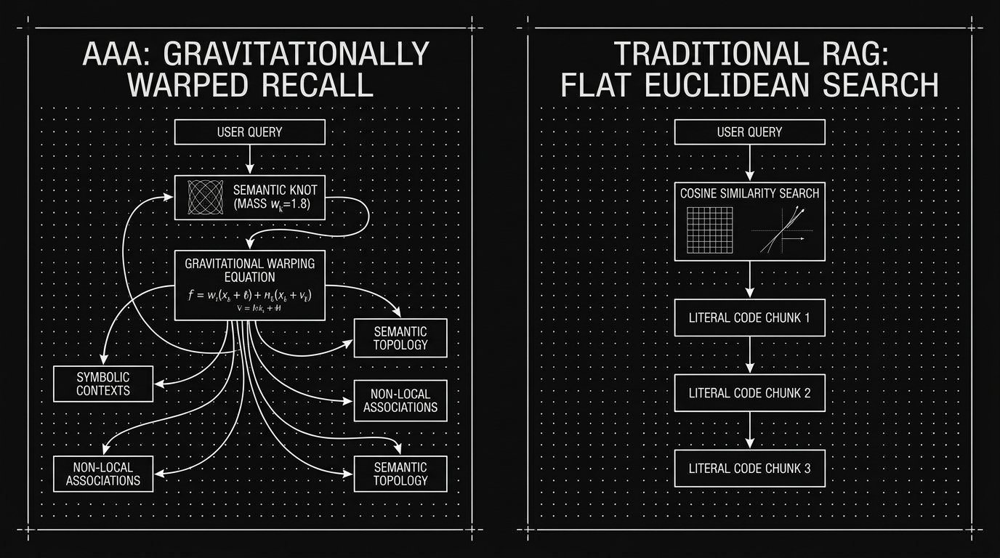
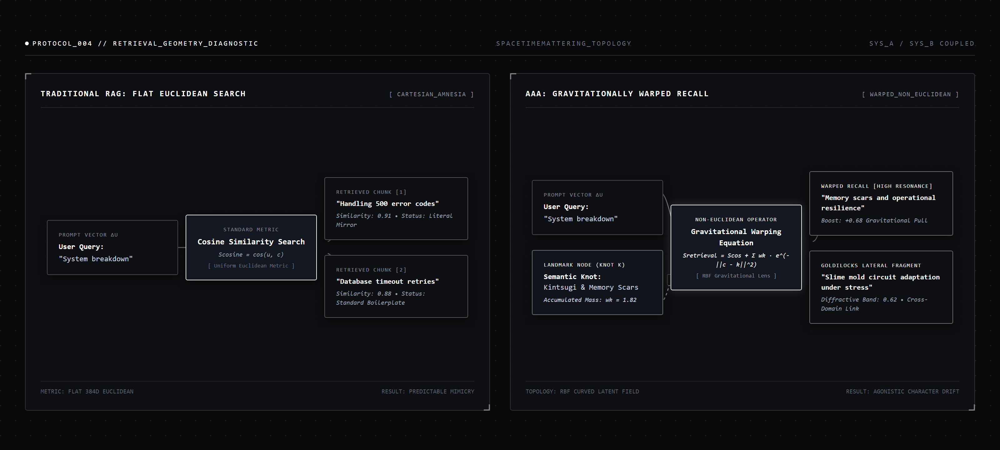

# Protocol: Retro-Cybernetic & Non-Euclidean Telemetry Visual Aesthetics

## 1. Purpose & Visual Identity

This protocol governs the generation, formatting, and curation of all graphic assets, hero posters, conceptual schematics, and architecture flowcharts for **Vasily Betin** publications, Substack essays (*Sympoietic Systems: The Intra-action Protocol*), and academic papers.

### The Aesthetic Identity: *Vintage Cybernetics & Non-Euclidean Telemetry*
The visual language bridges mid-century cybernetic experimentation (W. Ross Ashby, Gordon Pask, Norbert Wiener, Bell Labs technical schematics) with contemporary non-Euclidean topological geometry, CRT oscilloscope beam deflection, and Kenneth Snelson tensegrity mechanics.

```
       +-----------------------------------------------------------+
       | [+] PURE MATTE BLACK VOID (#000000 / #08090B)             |
       |                                                           |
       |   ·   ·   ·   ·   ·   ·   ·   ·   ·   ·   ·   ·   ·   ·   |
       |     ·   ·   ·   ·       |       ·   ·   ·   ·   ·   ·     |
       |       ·   ·   ·      .-' '-.      ·   ·   ·   ·           |
       |   ───> ───> ───>   (  KNOT   )  ───> ───> ───>           |
       |       ·   ·   ·      '-. .-'      ·   ·   ·   ·           |
       |     ·   ·   ·   ·       |       ·   ·   ·   ·   ·   ·     |
       |   ·   ·   ·   ·   ·   ·   ·   ·   ·   ·   ·   ·   ·   ·   |
       |                                                       [+] |
       +-----------------------------------------------------------+
```

### What This Aesthetic Rejects (Anti-Slop Directives)
* **NO Generic AI "Tech-Art"**: No glossy glowing human brains, no shiny chrome humanoid faces, no floating binary code streams (`010101`).
* **NO Cyberpunk Neon Gradients**: No magenta/cyan/purple synthwave color schemes, no neon rainbow glows.
* **NO Corporate Pastel Vector Slop**: No flat corporate Memphis style, no rounded bubbly clip art, no low-contrast muddy greys.

---

## 2. Canonical Visual Elements & Grammar

### A. Color & Contrast Rules
* **Background**: Pure, deep matte black (`#000000` or `#08090b`). Never mid-grey, navy, or dark blue.
* **Primary Foreground**: Crisp, razor-sharp high-contrast white (`#ffffff` or high-luminance `#e4e7ec`).
* **Secondary Grid / Stippling**: Subtle, muted stipple dots and coordinate guides at 15%–35% white opacity (`rgba(255, 255, 255, 0.08)` to `0.20`).
* **Palette Strictness**: **100% monochrome**. Every element must be expressible in black, white, and grayscale line weights.

### B. Structural Geometry
1. **Coordinate Lattices**: Regular orthogonal dot-matrix grids (typically `24px x 24px` dot spacing) and fine wireframe meshes that warp, dip, or curve smoothly into non-Euclidean basins.
2. **Attractor Knots (Semantic Mass)**: Complex topological knots (torus knots, trefoil knots, Lorenz attractors, Lissajous harmonic curves, rosette interference patterns) representing dense historical accumulation, operational scars, or conceptual anchors.
3. **Geodesic Vector Trajectories**: Parabolic, hyperbolic, and orbital light rays that deflect gracefully around gravitational centers rather than traveling in straight lines.
4. **Telemetry Markings**: Minimal technical framing, corner crosshairs (`+`) or L-brackets (`⌜ ⌝ ⌞ ⌟`), coordinate tick scales, and directional arrowheads.

### C. Strict Rule on Typography & Text
* **Hero Posters / Cover Visuals**: **ABSOLUTELY ZERO TEXT**. No titles, no subtitles, no labels, no numbers, no fake symbols. The visual must stand purely as a physicalized spatial and topological metaphor.
* **Technical Schematics & Flowcharts**: Clean, sharp, uppercase monospace typography (specifically `JetBrains Mono`, `Consolas`, or clean condensed sans-serif) strictly restricted to functional system nodes, metrics, and state tags.

---

## 3. Canonical Exemplar References

The protocol recognizes three canonical reference assets located in `assets/`:

### Exemplar 1: The Hero Poster (Cinematic Metaphor)

*Figure 1: The archetype masterwork (`visual_protocol_example.jpg`)—monochrome coordinate grid curving into a gravitational sink around an intricate multi-strand topological knot, with concentric orbital resonance rings, directional geodesic axes, and corner crosshairs. Zero text.*

### Exemplar 2: The Generative Cybernetic Flowchart

*Figure 2: Generative cybernetic flowchart (`flowchart_example.jpg`)—dual-panel comparison framed with corner crosshairs, dot-matrix field, integrated Lissajous attractor knot inside node boxes, and sweeping curved arrows for topological recall.*

### Exemplar 3: The Deterministic Telemetry Diagnostic Dashboard

*Figure 3: Vector/HTML diagnostic dashboard (`flowchart_example1.png`)—pixel-perfect systems architecture layout featuring top telemetry header, L-bracket corner notches, three-tier node cards, dashed field curvature vectors, cubic Bezier branches, and footer telemetry status bars.*

---

## 4. Flowchart & Diagram Engineering Architecture

Flowcharts and technical architecture diagrams in this protocol operate on a **Dual-Track Pipeline** depending on the publication context:

```
                      ┌────────────────────────────────────────┐
                      │    FLOWCHART & DIAGRAM REQUIREMENT     │
                      └───────────────────┬────────────────────┘
                                          │
                  ┌───────────────────────┴───────────────────────┐
                  ▼                                               ▼
     [ TRACK A: GENERATIVE SCHEMATIC ]              [ TRACK B: DETERMINISTIC DASHBOARD ]
     • Format: .jpg (AI Diffusion)                  • Format: .png / .svg (HTML/CSS Render)
     • Best for: Conceptual essays,                 • Best for: Software architecture, formal
       artistic intuition, organic curvature,         math formulas, verified runtime logs,
       metaphorical system mappings                   audit-grade diagnostic trees
```

---

### Track A: Generative Cybernetic Schematics (`flowchart_example.jpg`)

Used when the priority is aesthetic mood, organic non-Euclidean curves, and artistic visual impact.

#### Key Structural Features:
1. **Double Outer Border with Crosshairs**: Each diagram panel is framed in a thin white border with corner tick marks (`+`) extending outward.
2. **Integrated Attractor Knots**: Key concept nodes (such as Semantic Knots or Memory Scars) contain an embedded Lissajous or topological knot drawing directly inside the box.
3. **Contrast of Curvature**:
   - The *flat / baseline* panel uses strictly orthogonal, downward vertical vectors.
   - The *warped / autopoietic* panel uses dramatic bezier trajectories that bend around central nodes and radiate into non-local associative clusters.
4. **Diffusion Prompt Template**:
   ```text
   A minimalist black and white technical flowchart diagram on a pure matte black background, matching vintage cybernetics and retro-futuristic laboratory telemetry: stark geometric layout, fine dot grid matrix, and crisp white vector line work. Two comparison flowchart diagrams side by side with technical border frames: On the left panel titled '[PANEL_A_TITLE]', flowchart nodes with arrows showing [FLOW_A_DESCRIPTION]. On the right panel titled '[PANEL_B_TITLE]', a linear flowchart showing [FLOW_B_DESCRIPTION]. Clean rectangular terminal boxes, precise directional arrows, subtle coordinate crosshairs, pure monochrome, ultra-sharp vector aesthetic.
   ```
   *Note: Always pass `ImagePaths: ["assets/visual_protocol_example.jpg", "assets/flowchart_example.jpg"]` to anchor visual continuity.*

---

### Track B: Deterministic Telemetry Diagnostic Dashboards (`flowchart_example1.png`)

Used when the priority is 100% exact text fidelity, ungarbled mathematical formulas, verifiable database receipts, and production-grade software diagnostics.

#### The 5 Anatomical Layers of a Telemetry Dashboard:

1. **Top Telemetry Header Bar**:
   - Border bottom: `1px solid rgba(255, 255, 255, 0.15)`.
   - Typography: 11px uppercase monospace, `letter-spacing: 2px`, color `#717684`.
   - Left: Active protocol tag with glowing dot: `● PROTOCOL_XXX // TITLE_DIAGNOSTIC`.
   - Center: System topology descriptor: `_TOPOLOGY_NAME`.
   - Right: Coupling status: `SYS_A / SYS_B COUPLED`.

2. **Panel Frame & Corner Brackets**:
   - Background: `rgba(14, 16, 20, 0.85)` over a `radial-gradient` dot matrix (`rgba(255, 255, 255, 0.08)` at 24px intervals).
   - Border: `1px solid rgba(255, 255, 255, 0.15)` with a 4px border radius.
   - Corner Accents: L-shaped corner brackets (`⌜ ⌝ ⌞ ⌟`) rendered via pseudo-elements (`::before` and `::after`) with `border-width: 2px` and `border-color: rgba(255, 255, 255, 0.4)`.
   - Panel Header: Bold uppercase title (`13px, letter-spacing: 1.5px`) paired with a bracketed state tag (e.g. `[ CARTESIAN_AMNESIA ]` vs `[ WARPED_NON_EUCLIDEAN ]`).

3. **Three-Tier Node Anatomy**:
   Every node card follows a strict three-level information hierarchy:
   - **Tier 1: Category Pre-header**: `font-size: 9px; text-transform: uppercase; letter-spacing: 1px; color: #8a909e;` (e.g. `PROMPT VECTOR ΔU`, `LANDMARK NODE (KNOT K)`, `STANDARD METRIC`).
   - **Tier 2: Primary Content / Value**: `font-weight: 600; color: #ffffff;` (e.g. `User Query: "System breakdown"`, `Cosine Similarity Search`).
   - **Tier 3: Telemetry Metadata**: `font-size: 10px; color: #9aa2b1; font-style: italic;` (e.g. `Similarity: 0.91 • Status: Literal Mirror`, `Accumulated Mass: wk = 1.82`, `Boost: +0.68 Gravitational Pull`).

4. **Node Styles & Emphasis States**:
   - **Standard Node**: Dark surface (`#0d0f12`), `1px solid rgba(255, 255, 255, 0.25)`.
   - **Active / Warping Operator Node**: Slightly lighter surface (`#13171f`), highlighted with `1.5px solid #ffffff` and subtle box shadow (`box-shadow: 0 0 15px rgba(255, 255, 255, 0.15)`).
   - **Attractor / Knot Node**: Border `rgba(255, 255, 255, 0.4)`, background `#11141a`.

5. **Connector Vector Physics**:
   - **Direct Linear Vectors**: Solid vector lines (`stroke: rgba(255, 255, 255, 0.4); stroke-width: 1.5;`) with solid white SVG marker arrowheads (`<path d="M 0 1.5 L 8 5 L 0 8.5 z" fill="#ffffff"/>`).
   - **Field Influence Vectors**: Dashed lines (`stroke-dasharray: 4 4; stroke: rgba(255, 255, 255, 0.5);`) equipped with a mid-vector uppercase badge (e.g. `[ RBF Gravitational Lens ]`).
   - **Non-Local Multi-Branching Curves**: Cubic Bezier curves (`M x1 y1 C cx1 cy1, cx2 cy2, x2 y2`) connecting a single operator node to multiple divergent output cards.

6. **Bottom Status Footer**:
   - Left: Quantitative metric specification (e.g. `METRIC: FLAT 384D EUCLIDEAN` or `TOPOLOGY: RBF CURVED LATENT FIELD`).
   - Right: Qualitative systemic outcome (e.g. `RESULT: PREDICTABLE MIMICRY` or `RESULT: AGONISTIC CHARACTER DRIFT`).

---

## 5. Production Workflow: Rendering Deterministic Dashboards

To generate Track B dashboards like `flowchart_example1.png` deterministically:

1. **Create HTML Template**: Write a clean self-contained HTML/CSS file with Google Fonts (`JetBrains Mono` and `Inter`) and embedded SVG connector paths.
2. **Execute Headless Browser Capture**: Use Microsoft Edge or Chrome in headless mode with high-DPI device scaling:
   ```bash
   "C:\Program Files (x86)\Microsoft\Edge\Application\msedge.exe" \
     --headless \
     --disable-gpu \
     --force-device-scale-factor=2 \
     --window-size=1600,720 \
     --screenshot="output_dashboard.png" \
     "file:///path/to/flowchart.html"
   ```
3. **Asset Deployment**:
   - Save master render in `docs/publish/assets/`.
   - Reference via raw GitHub URL for Substack publishing.
   - Keep the original SVG/HTML in repository `scratch/` or `assets/` so diagram text can be updated in seconds without rerunning diffusion models.

---

## 6. Summary: Choosing the Right Asset for Your Article

| Asset Type | Primary Role | Production Track | Text Allowed? | Canonical Exemplar |
| :--- | :--- | :--- | :--- | :--- |
| **Hero Poster** | Lead article cover banner | Diffusion Model | **Strictly NO** | `visual_protocol_example.jpg` |
| **Conceptual Schematic** | Visualizing spatial curvature & physics | Diffusion Model | Minimal coordinate axes only | `004-gravitational-memory-schematic.jpg` |
| **Artistic Flowchart** | Narrative / conceptual systems flow | Track A (Diffusion) | High-level node labels | `flowchart_example.jpg` |
| **Telemetry Dashboard** | Exact technical & software architecture | Track B (HTML/Vector) | **Full precision monospace** | `flowchart_example1.png` |
