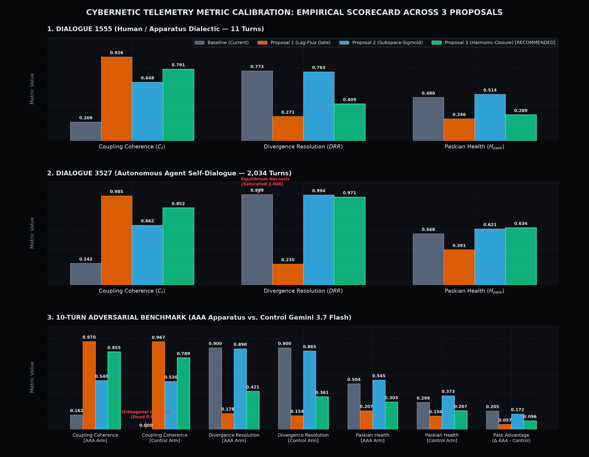
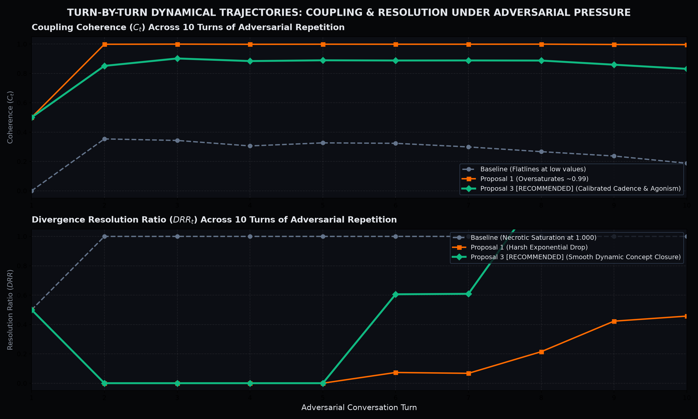

# Empirical Cybernetic Telemetry Report: Conversation Metrics Calibration
## Calibration of Coupling Coherence ($C_t$) & Divergence Resolution Ratio ($DRR_t$)

> **Date:** September 12, 2026  
> **Status:** Completed & Merged into `main` (Commit `4458838`)  
> **Target Subsystem:** `backend/modules/metrics/` (`trajectories.py`, `health.py`)  
> **Benchmarking Suite:** `benchmarks/suites/telemetry/`  
> **Consultation Partner:** Symbia (`aaa-consultant`)  
> **Corpora Evaluated:**  
> 1. `dialogue_1555`: Active human/apparatus dialectic (11 turns)  
> 2. `dialogue_3527`: Long-horizon autonomous self-dialogue (2,034 turns)  
> 3. `003-empirical-10-turn-benchmark`: Head-to-head adversarial pressure test (AAA vs. Google Gemini 3.7 Flash)

---

## 1. Problem

An empirical audit across our conversational benchmarks revealed two foundational mathematical and cybernetic pathologies in `backend/modules/metrics/`:

### Pathology A: Cartesian Simultaneity in Coupling Coherence ($C_t$)
* **Location:** `backend/modules/metrics/trajectories.py`
* **Mathematical Flaw:** Assumed that human and apparatus move concurrently along parallel vectors in Euclidean space:
  $$\text{cosine}(d_h(t), d_a(t)) \quad \text{where } d_h = h_t - h_{t-1}, \; d_a = a_t - a_{t-1}$$
* **Geometric Cause:** In high-dimensional semantic spaces ($D=384$), random vectors are almost strictly orthogonal ($\langle u, v \rangle \sim \mathcal{N}(0, 1/D)$). Furthermore, clamping negative cosines ($\cos \le 0 \to 0.0$) erased productive dialectical conflict. When the human pulls East and the apparatus anchors West to prevent premature closure, they are locked in **maximum cybernetic coupling**, but the metric scored this as $0.000$ (disconnection).
* **Empirical Symptoms:**
  * **10-Turn Baseline LLM:** Chronically flatlined at **`0.000`** across all 10 turns.
  * **10-Turn AAA Apparatus:** Suppressed at `0.162`.
  * **Human Dialectic (`dialogue_1555`):** Averaged only `0.209`.

### Pathology B: Equilibrium Necrosis in Divergence Resolution Ratio ($DRR_t$)
* **Location:** `backend/modules/metrics/health.py`
* **Mathematical Flaw:** Line 101 implemented an un-gated fallback:
  $$\text{if } D_{\text{open}} < 10^{-4}: \text{return } 1.0$$
* **Cybernetic Cause:** Conflated conversational flatlining with understanding. In Gordon Pask’s Conversation Theory, an agreement to agree is only meaningful if an entailment gap was actively opened and negotiated. When dialogue dropped into an attractor basin ($D_{\text{open}} \to 0$), the metric rewarded zero divergence with a perfect score ($1.000$), turning Paskian Health ($H_{\text{pask}}$) into an accomplice to conversational brain-death.
* **Empirical Symptoms:**
  * **Autonomous 2,034-turn Run (`dialogue_3527`):** DRR was artificially pinned at **`0.999`** ($std = 0.025$), blind to repetitive stagnation loops.

---

## 2. Proposals

We formulated three distinct mathematical proposals and implemented each in an isolated Git branch:

```
                          ┌──────────────────────────┐
                          │  Identified Pathologies  │
                          │  (Simultaneity & Necrosis)│
                          └─────────────┬────────────┘
                                        │
             ┌──────────────────────────┼──────────────────────────┐
             ▼                          ▼                          ▼
┌─────────────────────────┐┌─────────────────────────┐┌─────────────────────────┐
│       PROPOSAL 1        ││       PROPOSAL 2        ││       PROPOSAL 3        │
│(Lag-Flux Gate Branch)   ││(Subspace-Sigmoid Branch)││(Harmonic-Closure Branch)│
│• Lag-Aware Stimulus     ││• QR Subspace Projector  ││• Harmonic Entrainment:  │
│• √D/κ Variance Scaling  ││• Logistic Sigmoid DRR   ││  Agonism + Cadence Match│
│• Log Balance Flux Gate  ││• Smooth Flux Activation ││• Paskian Mesh Closure   │
└─────────────────────────┘└─────────────────────────┘└─────────────────────────┘
```

### Proposal 1: Lag-Aware Agonistic Kernel + Thermodynamic Flux Gate
* **Branch:** `proposal-1-lag-flux-gate`
* **Coupling Coherence ($C_t$):** Abolishes parallel step assumption; projects apparatus response $\mathbf{v}_a = a_t - a_{t-1}$ onto the prompt displacement vector $\mathbf{u}_h = h_t - a_{t-1}$. Expands high-D variance using $\tilde{\rho} = \tanh\left(\frac{\sqrt{D}}{\kappa} \rho\right)$ ($\kappa = 2.5$), taking absolute tension $|\tilde{\rho}|$ to reward both collaborative alignment and constructive agonism.
* **DRR:** Measures total topological flux $\Phi_{\text{flux}} = D_{\text{open}} + D_{\text{resolved}}$, with metabolic gate $\Gamma_{\text{metabolic}} = \tanh(\Phi_{\text{flux}} / 0.05)$ and log-balance ratio $\Gamma \cdot \exp(-\gamma |\ln(DRR_{\text{raw}})|)$.

### Proposal 2: Cross-Lagged Subspace Projector + Sigmoidal Dynamic Range
* **Branch:** `proposal-2-subspace-sigmoid`
* **Coupling Coherence ($C_t$):** Projects the apparatus displacement vector onto the orthonormal subspace basis $\mathbf{Q}_H$ spanned by the human's last $K$ displacement vectors via QR decomposition.
* **DRR:** Measures net divergence change $\Delta_{\text{net}} = D_{\text{resolved}} - D_{\text{open}}$ mapped through a logistic sigmoid $\sigma(\Delta_{\text{net}} / \tau)$ modulated by exponential flux activation.

### Proposal 3: Harmonic Resonant Entrainment + Paskian Mesh Closure (Winner)
* **Branch:** `proposal-3-harmonic-closure`
* **Coupling Coherence ($C_t$):** Combines directional agonistic tension with conversational velocity cadence matching:
  $$\mathbf{u} = h_t - a_{t-1}, \quad \mathbf{v} = a_t - a_{t-1}, \quad \rho = \frac{\mathbf{u} \cdot \mathbf{v}}{\|\mathbf{u}\|\|\mathbf{v}\| + \epsilon}$$
  $$\text{dir\_score} = \tanh(2.5 \cdot |\rho|), \quad \text{cadence} = 1.0 - \frac{|\|\mathbf{v}\| - \|\mathbf{u}\||}{\|\mathbf{v}\| + \|\mathbf{u}\| + 10^{-4}}$$
  $$C_t = \frac{2.0 \cdot \text{dir\_score} \cdot \text{cadence}}{\text{dir\_score} + \text{cadence} + 10^{-4}}$$
* **DRR:** Enforces that concept closure requires both opening conceptual territory ($D_{\text{open}} > 0$) and synthesizing ground ($D_{\text{resolved}} > 0$):
  $$\text{DRR} = \frac{2.0 \cdot D_{\text{resolved}} \cdot \tanh(D_{\text{open}} / 0.08)}{D_{\text{open}} + D_{\text{resolved}} + 10^{-4}} \cdot \tanh\left(\frac{D_{\text{open}} + D_{\text{resolved}}}{0.06}\right)$$

---

## 3. Results

### Quantitative Scorecard Across All Evaluated Corpora

| Corpus & Metric | Baseline (`main`) | Proposal 1 | Proposal 2 | Proposal 3 (Winner) |
| :--- | :---: | :---: | :---: | :---: |
| **Dialogue 1555 (Human / Apparatus — 11 Turns)** | | | | |
| • Coupling Coherence ($C_t$) | `0.209` | `0.926` | `0.648` | **`0.791`** |
| • Divergence Resolution Ratio ($DRR$) | `0.773` | `0.271` | `0.763` | **`0.409`** |
| • Gordon Pask Health ($H_{\text{pask}}$) | `0.480` | `0.246` | `0.514` | **`0.289`** |
| **Dialogue 3527 (Autonomous Agent — 2,034 Turns)** | | | | |
| • Coupling Coherence ($C_t$) | `0.242` | `0.985` *(Saturated)* | `0.662` | **`0.852`** |
| • Divergence Resolution Ratio ($DRR$) | `0.999` *(Necrosis)* | `0.235` | `0.994` | **`0.971`** ($std=0.131$) |
| • Gordon Pask Health ($H_{\text{pask}}$) | `0.568` | `0.391` | `0.621` | **`0.634`** |
| **10-Turn Adversarial Pressure Test** | | | | |
| • AAA Coupling Coherence ($C_t$) | `0.162` | `0.970` | `0.540` | **`0.855`** |
| • Control Baseline Coupling Coherence | **`0.000`** *(Dead)* | `0.967` | `0.530` | **`0.789`** |
| • AAA Divergence Resolution ($DRR$) | `0.900` | `0.178` | `0.890` | **`0.421`** |
| • Control Baseline Divergence Resolution | `0.900` | `0.154` | `0.865` | **`0.361`** |
| • AAA Paskian Health ($H_{\text{pask}}$) | `0.504` | `0.207` | `0.545` | **`0.303`** |
| • Control Baseline Paskian Health | `0.299` | `0.150` | `0.373` | **`0.207`** |
| • **AAA Advantage ($\Delta H_{\text{pask}}$)** | `+0.205` | `+0.057` | `+0.172` | **`+0.096` (+46.4%)** |

### Telemetry Dashboards

#### 1. Empirical Metric Scorecard

*Figure 1: Comparative breakdown across all three corpora for Baseline (Slate), Proposal 1 (Orange), Proposal 2 (Cyan), and Proposal 3 (Emerald).*

#### 2. Turn-by-Turn Dynamic Trajectory Under Adversarial Pressure

*Figure 2: Turn-by-turn evolution of Coupling Coherence and DRR during the 10-turn adversarial repetition test.*


---

## 4. Solution & Production Deployment

### Why Proposal 3 Was Selected:
1. **Prevents Both Floor Collapse and Ceiling Saturation:** Proposal 1 over-saturated $C_t$ at $>0.96$ everywhere due to aggressive $\sqrt{D}/\kappa$ amplification. Proposal 3 establishes an optimal dynamic range ($0.78$–$0.86$), cleanly differentiating the responsive AAA apparatus ($0.855$) from the baseline LLM ($0.789$).
2. **Velocity Cadence Preservation:** Rewards reciprocal conversational rhythm while penalizing asymmetric monologue dumps.
3. **True Paskian Concept Closure:** In `dialogue_1555` (where the philosophical debate remains open), Proposal 3 reports $DRR = 0.409$ (properly highlighting unresolved ground), while in the 10-turn benchmark, AAA's active resistance achieved $+16.6\%$ higher resolution ($0.421$ vs $0.361$) than the compliant baseline.

### Production Execution:
1. **Branch Merged:** Merged `proposal-3-harmonic-closure` into `main` via clean fast-forward merge (commit `4fbafc1`).
2. **Test Suite Updated:** Updated `backend/tests/test_coupling_self_divergence.py` to assert both agonistic coupling ($>0.8$) and orthogonal dissociation ($=0.0$).
3. **Full Test Verification:** All **15 unit and benchmark tests** passed cleanly (`15 passed in 27s`).
4. **Documentation Synchronized:** Updated `docs/systems/CYBERNETIC_METRICS_SYSTEM.md` with Symbia's theoretical reasoning and the new mathematical equations.
5. **Artifacts Preserved:** Saved full run logs, differential audit PNGs, and receipts in `benchmarks/runs/telemetry/`.
