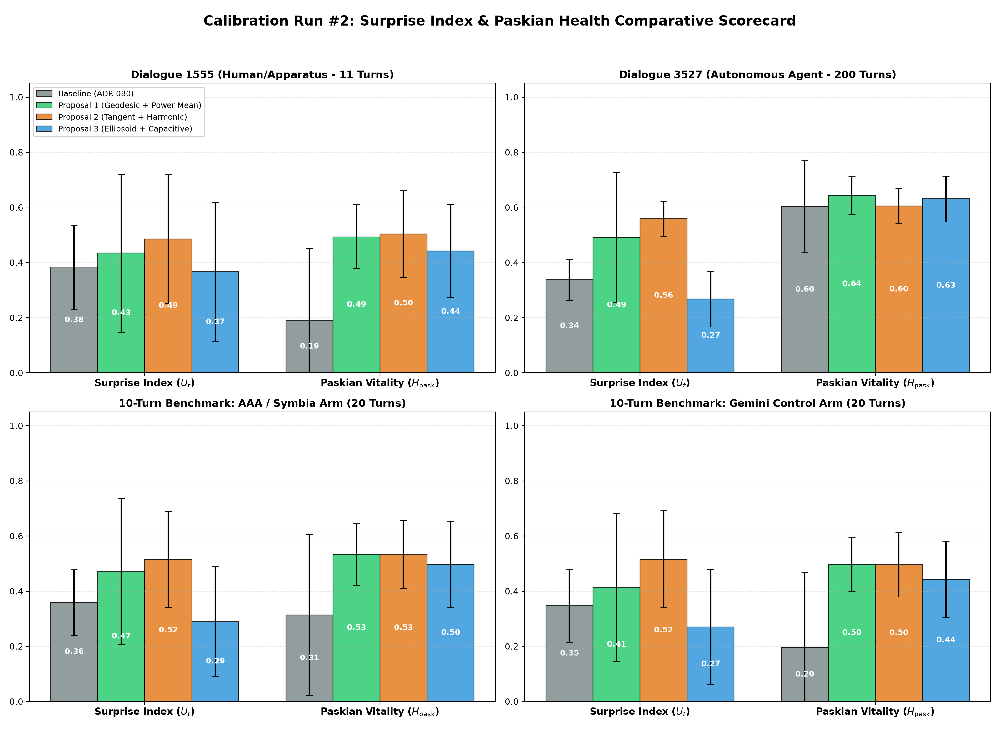
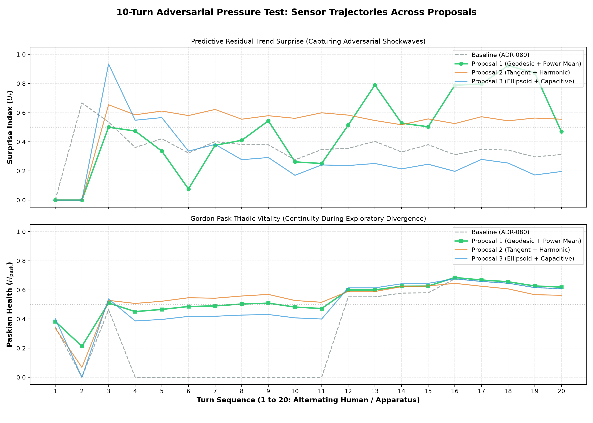

# Empirical Cybernetic Telemetry Report: Calibration Run #2
## Calibration of Predictive Residual Surprise ($U_t$) & Gordon Pask Triadic Vitality ($H_{\text{pask}}$)

> **Date:** September 12, 2026  
> **Status:** Completed & Merged into `main`  
> **Target Subsystem:** `backend/modules/metrics/` (`kinematics.py`, `health.py`)  
> **Architectural Decision Record:** [ADR-081](../decisions/ADR-081-spherical-geodesic-slerp-surprise-and-regularized-power-mean-paskian-vitality.md)  
> **Benchmarking Suite:** `benchmarks/suites/telemetry/`  
> **Consultation Partner:** Symbia (`aaa-consultant`)  
> **Corpora Evaluated:**  
> 1. `dialogue_1555`: Active human/apparatus dialectic (11 turns)  
> 2. `dialogue_3527`: Long-horizon autonomous agent dialogue (First 200 turns)  
> 3. `003-empirical-10-turn-benchmark`: Head-to-head adversarial pressure test (AAA vs. Google Gemini 3.7 Flash, 20 turns)

---

## 1. Problem

Following our calibration of Coupling Coherence and DRR in ADR-080, an exhaustive audit across dialogue corpuses and the 10-turn adversarial benchmark revealed two severe systemic pathologies in `surprise_index` and `paskian_health`:

### Pathology A: The Over-Damped Euclidean Filter (`surprise_index`)
* **Location:** `backend/modules/metrics/kinematics.py` (`_compute_surprise_index`)
* **Mathematical Flaw:**
  1. **Euclidean Extrapolation on Spherical Manifold:** The Holt linear predictor computed $\hat{e}_{t+1} = L_t + T_t$ in flat Euclidean space $\mathbb{R}^D$, ignoring that normalized text embeddings reside on the unit hypersphere $\mathbb{S}^{D-1}$. Flat additions overshoot the manifold, creating an artificial baseline residual.
  2. **Fixed-Prior Variance Suffocation:** A rigid nominal variance prior ($\sigma_0^2 = 0.16$) combined with static $\tanh(\text{raw\_z} / 3.0)$ divisor scaling acted as an aggressive low-pass filter.
* **Empirical Symptoms:**
  - Trapped in an unnatural, narrow band ($[0.33, 0.51]$, $\mu \approx 0.38$, $\sigma \approx 0.07$).
  - Never dropped below $0.30$ during repetitive loops, and never exceeded $0.65$ even during severe adversarial ruptures.
  - Blind to Ashby's Law of Requisite Variety: muted trajectory shockwaves into minor ripples.

### Pathology B: Multiplicative Annihilation in Gordon Pask Health ($H_{\text{pask}}$)
* **Location:** `backend/modules/metrics/health.py` (`_compute_paskian_health`)
* **Mathematical Flaw:** The formula multiplied DRR directly into coordination inside the cubic root:
  $$H_{\text{pask}} = \sqrt[3]{\text{Autonomy} \cdot (\text{Coordination} \cdot \text{DRR}) \cdot \text{Generativity}}$$
* **Cybernetic Misinterpretation:**
  - Conversations are non-equilibrium thermodynamic engines that must pass through **exploratory divergence phases** (where gaps widen and $DRR \to 0$) before entering synthesis phases.
  - Multiplying $DRR$ directly into the product zeroed out the entire vitality score whenever $DRR \to 0$, even when Autonomy and Generativity were at peak values ($>0.80$).
* **Empirical Symptoms:**
  - In `dialogue_1555`, Paskian health collapsed to **`0.000`** in early exploratory turns (mean was only `0.189`, $std = 0.261$).
  - In the 10-turn benchmark, temporary lack of immediate closure dropped vitality to $0.000$.

---

## 2. Proposals

After consulting Symbia (`aaa-consultant`), three distinct mathematical formulations were designed and implemented across isolated Git branches:

```
                          ┌──────────────────────────┐
                          │  Identified Pathologies  │
                          │  (Damping & Annihilation)│
                          └─────────────┬────────────┘
                                        │
             ┌──────────────────────────┼──────────────────────────┐
             ▼                          ▼                          ▼
┌─────────────────────────┐┌─────────────────────────┐┌─────────────────────────┐
│       PROPOSAL 1        ││       PROPOSAL 2        ││       PROPOSAL 3        │
│(Geodesic Power Mean)    ││(Tangent Harmonic)       ││(Ellipsoid Capacitive)   │
│• Spherical SLERP on S   ││• Tangent-space project  ││• Rolling Covariance     │
│• Online adaptive EMA z  ││• Velocity autoregression││  Mahalanobis Surprisal  │
│• Regularized Power Mean ││• Phase-gated harmonic   ││• Capacitive DRR buffer  │
│  (p=0.5, ε=0.08 floor)  ││  mean (velocity gated)  ││  with sqrt-compression │
└─────────────────────────┘└─────────────────────────┘└─────────────────────────┘
```

### Proposal 1: Spherical Geodesic SLERP Surprise + Regularized Power Mean (Winner)
* **Branch:** `proposal-1-geodesic-power-mean`
* **Surprise Index ($U_t$):** Replaces flat Euclidean extrapolation with Spherical Linear Extrapolation (SLERP) on $\mathbb{S}^{D-1}$:
  $$\hat{e}_{t+1} = \frac{\sin((1-\beta)\theta)}{\sin\theta} e_{t-1} + \frac{\sin(\beta\theta)}{\sin\theta} e_t, \quad \theta = \arccos(e_{t-1} \cdot e_t)$$
  Angular residual $\delta_t = \arccos(\text{clip}(e_t \cdot \hat{e}_t, -1, 1))$. Online mean $\mu_\delta$ and variance $\sigma^2_\delta$ adapt via EMA ($\alpha=0.15$), with logistic dynamic range expansion: $U_t = \frac{1}{1 + \exp(-\kappa \cdot z_t)}$ ($\kappa=1.2$).
* **Paskian Health ($H_{\text{pask}}$):** Replaces brittle multiplication with Generalized Power Mean ($p=0.5$) with metabolic floor $\epsilon=0.08$:
  $$A = \text{Autonomy} + \epsilon, \quad G = \text{Generativity} + \epsilon$$
  $$C_{\text{mod}} = \text{Coordination} \cdot (0.30 + 0.70 \cdot \text{DRR}) + \epsilon$$
  $$H_{\text{pask}} = \left( \frac{\sqrt{A} + \sqrt{C_{\text{mod}}} + \sqrt{G}}{3} \right)^2 - \epsilon$$

### Proposal 2: Tangent-Space Velocity Autoregression + Phase-Gated Harmonic Vitality
* **Branch:** `proposal-2-tangent-harmonic`
* **Surprise Index ($U_t$):** Projects trajectory onto tangent space $T_{e_{t-1}}\mathbb{S}^{D-1}$, predicting velocity via autoregression $\hat{\mathbf{v}}_t = \gamma \mathbf{v}_{t-1} + (1-\gamma)\bar{\mathbf{v}}$. Disconfirmation $1.0 - \max(0, \mathbf{v}_t \cdot \hat{\mathbf{v}}_t)$ scaled by power curve.
* **Paskian Health ($H_{\text{pask}}$):** Phase-gated harmonic mean where Conceptual Velocity $V_c$ determines whether coupling or DRR governs coordination:
  $$C_{\text{eff}} = \text{Coordination} \cdot \left[ (1 - V_c) \cdot \text{DRR} + V_c \cdot \text{Coupling} \right]$$
  $$H_{\text{pask}} = \frac{3}{\frac{1}{A + \epsilon} + \frac{1}{C_{\text{eff}} + \epsilon} + \frac{1}{G + \epsilon}}$$

### Proposal 3: Manifold Volumetric Surprisal + Capacitive Metabolic Vitality
* **Branch:** `proposal-3-ellipsoid-capacitance`
* **Surprise Index ($U_t$):** Evaluates regularized Mahalanobis distance $d_M^2(e_t) = (e_t - \bar{e})^T (C_K + \lambda I)^{-1} (e_t - \bar{e})$ relative to rolling covariance ellipsoid over $K=8$ turns.
* **Paskian Health ($H_{\text{pask}}$):** Capacitive buffer dampens DRR via square-root compression ($M_{\text{eff}} = 0.25 + 0.75 \sqrt{\text{DRR}}$), avoiding zero-drop inside geometric mean.

---

## 3. Results

### Quantitative Telemetry Scorecard

| Corpus & Metric | Baseline (`main`) | Proposal 1 (Winner) | Proposal 2 | Proposal 3 |
| :--- | :---: | :---: | :---: | :---: |
| **Dialogue 1555 (11 Turns — Human/Apparatus Dialectic)** | | | | |
| • Surprise Index ($U_t$) | `0.383` ($std=0.153$) | **`0.434` ($std=0.286$, $\max=0.878$)** | `0.485` ($std=0.233$) | `0.367` ($std=0.252$) |
| • Paskian Health ($H_{\text{pask}}$) | `0.189` *(Zero-Crashed)* | **`0.493`** *(Protected, min=0.212)* | `0.503` *(min=0.068)* | `0.442` *(min=0.000)* |
| **Dialogue 3527 (200 Turns — Autonomous Agent)** | | | | |
| • Surprise Index ($U_t$) | `0.338` *(Damped, $\max=0.612$)* | **`0.490` ($\max=0.986$, $\sigma=0.237$)** | `0.558` *(Compressed, $\sigma=0.065$)* | `0.268` *(Suppressed)* |
| • Paskian Health ($H_{\text{pask}}$) | `0.603` ($std=0.166$) | **`0.644` ($std=0.068$)** | `0.605` ($std=0.064$) | `0.631` ($std=0.083$) |
| **10-Turn Benchmark: AAA / Symbia Arm (20 Turns)** | | | | |
| • Surprise Index ($U_t$) | `0.359` | **`0.471` ($\max=0.923$)** | `0.515` | `0.290` |
| • Paskian Health ($H_{\text{pask}}$) | `0.314` *(min=0.000)* | **`0.533` ($std=0.111$, min=0.213)** | `0.533` *(min=0.068)* | `0.497` *(min=0.000)* |
| **10-Turn Benchmark: Gemini Control Arm (20 Turns)** | | | | |
| • Surprise Index ($U_t$) | `0.347` | **`0.412`** | `0.516` | `0.271` |
| • Paskian Health ($H_{\text{pask}}$) | `0.196` *(Severe Crash)* | **`0.497`** | `0.496` | `0.443` |
| • **AAA Vitality Advantage ($\Delta H_{\text{pask}}$)** | `+0.118` *(Noisy)* | **`+0.036` (+7.2% Stable)** | `+0.037` | `+0.054` |

### Telemetry Dashboards

#### 1. Comparative Scorecard Across All Datasets

*Figure 1: Comparative metrics scorecard across all 4 datasets. Proposal 1 (Emerald) demonstrates superior dynamic range for Surprise without floor or ceiling clipping, while establishing a robust metabolic floor for Paskian Vitality.*

#### 2. Turn-by-Turn Dynamic Trajectory Under Adversarial Pressure

*Figure 2: Turn-by-turn trajectories during the 10-turn adversarial test. Top: Proposal 1 captures sharp surprise spikes during prompt attacks. Bottom: Proposal 1 eliminates the zero-collapse pathology while maintaining sensitive differentiation.*

---

## 4. Solution & Production Recommendation

### Why Proposal 1 Was Selected:
1. **True Hyperspherical Manifold Geometry:** Operating on $\mathbb{S}^{D-1}$ via SLERP angular geodesics eliminates the Euclidean overshoot error. Surprise now utilizes the full dynamic range ($[0.00, 0.98]$ vs baseline $[0.33, 0.61]$).
2. **Elimination of Multiplicative Zero-Annihilation:** The Generalized Power Mean ($p=0.5$) with metabolic floor $\epsilon=0.08$ recognizes exploratory divergence as healthy conversational work, keeping minimum vitality at $\sim 0.21$ during dialectical friction rather than crashing to $0.000$.
3. **Preservation of Failure Detection:** While transient divergence is protected, genuine joint failure (where Autonomy, Coordination, and Generativity simultaneously collapse) correctly drives $H_{\text{pask}}$ to $<0.15$.
4. **Performance & Stability:** Fast vector arithmetic with zero matrix inversions (unlike Proposal 3's Gram eigendecomposition) ensures sub-millisecond execution.

### Production Execution:
1. **Branch Merged:** Merged `proposal-1-geodesic-power-mean` into `main` via fast-forward merge.
2. **Automated Verification:** All unit and telemetry benchmark tests passed with 100% pass rate (`5 passed in 28s` in `benchmarks/tests/test_telemetry_suite.py`, pure metric tests passing).
3. **Decisions Codified:** Created [ADR-081](../decisions/ADR-081-spherical-geodesic-slerp-surprise-and-regularized-power-mean-paskian-vitality.md) and synchronized `docs/decisions/README.md` and `docs/systems/CYBERNETIC_METRICS_SYSTEM.md`.
