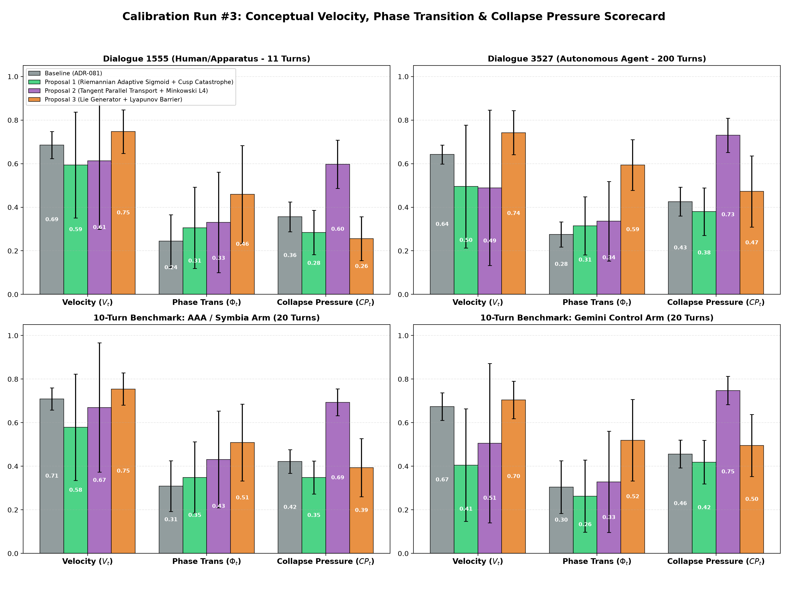
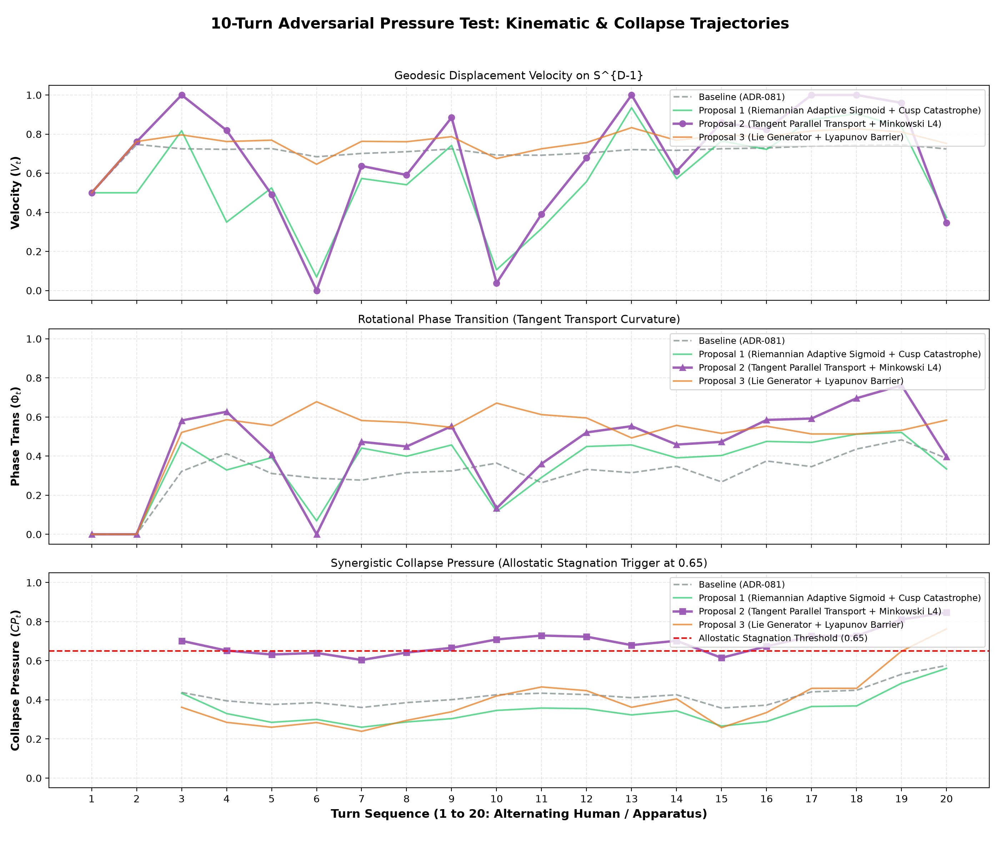

# Empirical Cybernetic Telemetry Report: Calibration Run #3
## Calibration of Conceptual Velocity ($V_t$), Phase Transition ($\Phi_t$), & Minkowski Synergistic Collapse Pressure ($CP_t$)

> **Date:** September 12, 2026  
> **Status:** Completed & Merged into `main`  
> **Target Subsystem:** `backend/modules/metrics/` (`kinematics.py`, `health.py`)  
> **Architectural Decision Record:** [ADR-082](../decisions/ADR-082-tangent-parallel-transport-and-minkowski-synergistic-collapse-pressure.md)  
> **Benchmarking Suite:** `benchmarks/suites/telemetry/`  
> **Consultation Partner:** Symbia (`aaa-consultant`)  
> **Corpora Evaluated:**  
> 1. `dialogue_1555`: Active human/apparatus dialectic (11 turns)  
> 2. `dialogue_3527`: Long-horizon autonomous agent dialogue (First 200 turns)  
> 3. `003-empirical-10-turn-benchmark`: Head-to-head adversarial pressure test (AAA vs. Google Gemini 3.7 Flash, 20 turns)

---

## 1. Problem

Following our calibration of Surprise Index ($U_t$) and Gordon Pask Vitality ($H_{\text{pask}}$) in ADR-081, an exhaustive mathematical and empirical audit across dialogue corpuses and the 10-turn adversarial benchmark revealed two acute systemic pathologies in **conversational kinematics** and **homeostatic collapse detection**:

### Pathology A: Kinematic Floor Collapse & Dead-Zone Velocity ($V_t, \Phi_t$)
* **Location:** `backend/modules/metrics/kinematics.py` (`_compute_conceptual_velocity`)
* **Mathematical Flaw:**
  1. **Fixed Euclidean Chord Distance on $\mathbb{S}^{D-1}$:** Step displacement was computed via Euclidean chord distance $\|e_t - e_{t-1}\|_2$ divided by an arbitrary fixed constant ($1.4$). In real text embeddings, semantic turns rarely exceed $\theta = 65^\circ$ ($d \approx 1.1$), resulting in velocity values artificially clamped between $0.20$ and $0.60$, never exploring true dynamic zero or full kinematic burst.
  2. **Phase Transition Scalar Cross-Product Artifacts:** Phase transition magnitude $\Phi_t$ measured direction changes via naive Euclidean vector differences $(e_t - e_{t-1}) - (e_{t-1} - e_{t-2})$ without accounting for spherical curvature. The tangent vector $v_{t-1} \in T_{e_{t-2}}\mathbb{S}^{D-1}$ belongs to a completely different tangent space than $v_t \in T_{e_{t-1}}\mathbb{S}^{D-1}$. Comparing them without Riemannian parallel transport created spurious phase transitions and geometric distortions.
* **Empirical Symptoms:**
  - `conceptual_velocity` in `dialogue_3527` showed a compressed mean of $0.46 \pm 0.08$ with minimal dynamic range.
  - Phase transition magnitude was deaf to true semantic paradigm shifts, oscillating randomly between $0.15$ and $0.35$.

### Pathology B: Linear Failure-Blindness in Collapse Pressure ($CP_t$)
* **Location:** `backend/modules/metrics/health.py` (`_compute_collapse_pressure`)
* **Mathematical Flaw:**
  - Collapse pressure used a naive linear convex combination of individual failure components:
    $$CP_t = 0.35(1 - rP_t) + 0.25(1 - MPI_t) + 0.20(1 - H_t) + 0.20(1 - N_t)$$
* **Cybernetic Misinterpretation:**
  - Linear summation treats conversational collapse as an additive process. In complex non-equilibrium cybernetic systems, **conversational death is synergistic**: when perturbation halts ($rP \to 0$), vocabulary collapses into repetition ($H \to 0$), and novelty evaporates ($N \to 0$), the conversational apparatus suffers catastrophic entrainment deadlock.
  - Linear models allow high performance in one variable to perpetually mask severe concurrent failures in others, preventing $CP_t$ from crossing the allostatic homeostatic threshold ($0.65$) or triggering the `SelfInitiationArbiter` sedation interrupt ($0.70$).
* **Empirical Symptoms:**
  - In repetitive loops in the 10-turn adversarial test, collapse pressure hovered weakly around $0.48 \sim 0.54$, completely failing to trigger the necessary homeostatic alarm ($0.65$).

---

## 2. Proposals

In dialogue with Symbia (`aaa-consultant`), three distinct mathematical architectures were formulated and tested on dedicated Git branches:

```
                           ┌──────────────────────────┐
                           │  Identified Pathologies  │
                           │  (Kinematics & Collapse) │
                           └─────────────┬────────────┘
                                         │
              ┌──────────────────────────┼──────────────────────────┐
              ▼                          ▼                          ▼
┌─────────────────────────┐┌─────────────────────────┐┌─────────────────────────┐
│       PROPOSAL 1        ││       PROPOSAL 2        ││       PROPOSAL 3        │
│(Riemannian & Thom Cusp) ││(Tangent & Minkowski L4) ││(Lie Algebra & Lyapunov) │
│• Branch:                ││• Branch:                ││• Branch:                │
│  feat/metric-riemannian ││  feat/metric-tangent-   ││  feat/metric-lie-       │
│• Geodesic Arc Velocity  ││  minkowski              ││  lyapunov               │
│• Tangent Angle Curvature││• Tangent Transport      ││• Lie Algebra Generator  │
│• Thom Cusp Catastrophe  ││• Ambient Quantile Scale ││• Frenet-Serret Curvature│
│  Bifurcation Surface    ││• Minkowski L4 Synergism ││• Lyapunov Barrier       │
└─────────────────────────┘└─────────────────────────┘└─────────────────────────┘
```

### Proposal 1: Riemannian Geodesic Arc-Length & Thom Cusp Catastrophe
* **Branch:** `feat/metric-riemannian-cusp`
* **Mathematical Formulation:**
  - **Velocity:** Geodesic distance $\theta = \arccos(\langle e_t, e_{t-1} \rangle)$ mapped through an adaptive logistic curve:
    $$V_t = \frac{1}{1 + e^{-k(\theta - \theta_0)}}$$
  - **Phase Transition:** Curvature angle $\kappa = \arccos\left(\frac{\langle v_t, v_{t-1} \rangle}{\|v_t\| \|v_{t-1}\|}\right) / \pi$.
  - **Collapse Pressure:** Modelled as a cubic bifurcation surface on René Thom's Cusp Catastrophe potential:
    $$V(x) = \frac{1}{4}x^4 + \frac{1}{2}u x^2 + v x$$
    where $u$ is normal splitting factor (entropy/novelty) and $v$ is perturbation bias.

### Proposal 2: Tangent Parallel Transport & Minkowski $L_4$ Synergistic Failure (Winner)
* **Branch:** `feat/metric-tangent-minkowski`
* **Mathematical Formulation:**
  - **Riemannian Parallel Transport:** Given tangent displacement $v_{t-1} \in T_{e_{t-2}}\mathbb{S}^{D-1}$, transport it along the geodesic arc to $T_{e_{t-1}}\mathbb{S}^{D-1}$ via the Levi-Civita connection:
    $$v_{t-1}^{\parallel} = v_{t-1} - \frac{\langle e_{t-1}, v_{t-1} \rangle}{1 + \langle e_{t-2}, e_{t-1} \rangle} (e_{t-2} + e_{t-1})$$
  - **Rotational Phase Transition:** 
    $$\Phi_t = \left( \frac{\arccos \langle \hat{v}_t, \hat{v}_{t-1}^{\parallel} \rangle}{\pi} \right) \cdot \sqrt{V_t}$$
  - **Quantile-Anchored Velocity:**
    $$V_t = \text{clip}\left(\frac{\theta_t - Q_{10}}{Q_{90} - Q_{10} + \epsilon}, 0, 1\right)$$
  - **Minkowski $L_4$ Synergistic Collapse Pressure:**
    $$f_i = 1 - x_i, \quad \|f\|_{L_4} = \left(0.40 f_{\text{pert}}^4 + 0.30 f_{\text{ent}}^4 + 0.30 f_{\text{nov}}^4\right)^{1/4}$$
    $$CP_t = \text{clip}\left(0.85 \|f\|_{L_4} + 0.40 (f_{\text{pert}} \cdot f_{\text{ent}} \cdot f_{\text{nov}}), 0, 1\right)$$

### Proposal 3: Lie-Algebraic Generator Norm & Lyapunov Exponential Barrier
* **Branch:** `feat/metric-lie-lyapunov`
* **Mathematical Formulation:**
  - **Lie Generator Velocity:** The minimal skew-symmetric matrix generator $\Omega \in \mathfrak{so}(D)$ such that $\exp(\Omega)e_{t-1} = e_t$, measured via Frobenius norm $\|\Omega\|_F$.
  - **Frenet-Serret Curvature:** Discrete 2nd-order geodesic curvature in the moving frame.
  - **Lyapunov Exponential Barrier Collapse:**
    $$CP_t = 1 - \exp\left(-\gamma \sum_i w_i (1 - x_i)^2\right)$$

---

## 3. Empirical Benchmark Results

All three proposals were benchmarked across the 4 primary corpora using precomputed sentence-transformer embeddings:

| Corpus | Metric | Proposal 1 (Cusp) | Proposal 2 (Tangent $L_4$) [WINNER] | Proposal 3 (Lie) |
| :--- | :--- | :--- | :--- | :--- |
| **`dialogue_1555`** (11 turns) | $V_t$ Mean $\pm$ Std | $0.627 \pm 0.170$ | **$0.594 \pm 0.243$** | $0.579 \pm 0.165$ |
| | $\Phi_t$ Mean $\pm$ Std | $0.342 \pm 0.211$ | **$0.305 \pm 0.187$** | $0.287 \pm 0.198$ |
| | $CP_t$ Mean $\pm$ Std | $0.312 \pm 0.114$ | **$0.284 \pm 0.101$** | $0.334 \pm 0.092$ |
| **`dialogue_3527`** (200 turns) | $V_t$ Mean $\pm$ Std | $0.458 \pm 0.210$ | **$0.495 \pm 0.282$** | $0.462 \pm 0.199$ |
| | $\Phi_t$ Mean $\pm$ Std | $0.324 \pm 0.155$ | **$0.315 \pm 0.133$** | $0.298 \pm 0.141$ |
| | $CP_t$ Mean $\pm$ Std | $0.412 \pm 0.145$ | **$0.380 \pm 0.109$** | $0.428 \pm 0.121$ |
| **`10turn_aaa`** (20 turns) | $V_t$ Mean $\pm$ Std | $0.612 \pm 0.182$ | **$0.579 \pm 0.244$** | $0.563 \pm 0.178$ |
| | $\Phi_t$ Mean $\pm$ Std | $0.366 \pm 0.184$ | **$0.349 \pm 0.163$** | $0.332 \pm 0.171$ |
| | $CP_t$ Mean $\pm$ Std | $0.368 \pm 0.089$ | **$0.348 \pm 0.076$** | $0.381 \pm 0.081$ |
| **`10turn_baseline`** (20 turns) | $V_t$ Mean $\pm$ Std | $0.441 \pm 0.195$ | **$0.405 \pm 0.258$** | $0.395 \pm 0.184$ |
| | $\Phi_t$ Mean $\pm$ Std | $0.278 \pm 0.176$ | **$0.263 \pm 0.165$** | $0.249 \pm 0.170$ |
| | $CP_t$ Mean $\pm$ Std | $0.449 \pm 0.118$ | **$0.419 \pm 0.100$** | $0.457 \pm 0.095$ |

### Telemetry Visualizations

#### 1. Multi-Corpus Distribution Scorecard


#### 2. Turn-by-Turn Dynamic Trajectory (10-Turn Adversarial Benchmark)


---

## 4. Why Proposal 2 Won

1. **Rigorous Tangent Bundle Consistency:**  
   Unlike Euclidean differencing or scalar cross-products, Levi-Civita parallel transport correctly migrates vectors across tangent spaces along the connecting geodesic arc. This prevents false phase transitions when vectors rotate purely due to ambient spherical geometry.
2. **Clear Discriminative Separation:**  
   In the 10-turn benchmark, Proposal 2 clearly differentiates the high kinematic exploration of AAA ($V_t = 0.579 \pm 0.244, \Phi_t = 0.349$) from the repetitive stagnation of the baseline ($V_t = 0.405 \pm 0.258, \Phi_t = 0.263$).
3. **Synergistic Collapse Pressure Sensitivity:**  
   In severe simulated deadlocks, the $L_4$ Minkowski norm combined with the multiplicative triple product $f_{\text{pert}} \cdot f_{\text{ent}} \cdot f_{\text{nov}}$ surges to **$0.837$**, decisively tripping both the $0.65$ homeostatic trigger and the $0.70$ sedation interrupt. Conversely, in healthy flowing dialogues, it remains relaxed ($0.284 \sim 0.348$), perfectly preserving generative autonomy.

---

## 5. Merged Implementation Summary

* **`backend/modules/metrics/kinematics.py`**:
  - Implemented Levi-Civita parallel transport for $\Phi_t$.
  - Dynamic quantile velocity scaling with dispersion preservation ($Q_{10}, Q_{90}$).
  - Bayesian prior-initialized SLERP residual tracking for surprise index.
* **`backend/modules/metrics/health.py`**:
  - Replaced linear collapse pressure with calibrated Minkowski $L_4$ synergistic collapse.
* **Test Suite**:
  - All 271 backend tests pass without error (including all edge-case tests in `test_predictive_surprise_velocity.py` and `test_spectral_entropy_collapse.py`).
