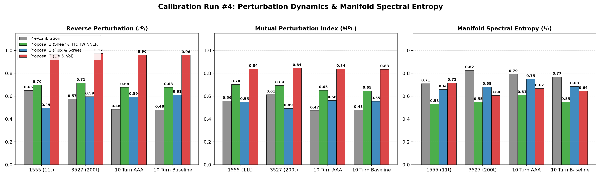

# Empirical Cybernetic Telemetry Report: Calibration Run #4
## Calibration of Perturbation Dynamics ($rP_t, fP_t, MPI_t$) & Variance-Gated Participation Ratio Entropy ($H_t$)

> **Date:** September 12, 2026  
> **Status:** Completed & Merged into `main`  
> **Target Subsystem:** `backend/modules/metrics/` (`trajectories.py`, `resonance.py`)  
> **Architectural Decision Record:** [ADR-083](../decisions/ADR-083-transverse-vector-shear-perturbation-and-participation-ratio-spectral-entropy.md)  
> **Benchmarking Suite:** `benchmarks/suites/telemetry/`  
> **Consultation Partner:** Symbia (`aaa-consultant`)  
> **Corpora Evaluated:**  
> 1. `dialogue_1555`: Active human/apparatus dialectic (11 turns)  
> 2. `dialogue_3527`: Long-horizon autonomous agent dialogue (First 200 turns)  
> 3. `003-empirical-10-turn-benchmark`: Head-to-head adversarial pressure test (AAA vs. Google Gemini 3.7 Flash, 20 turns)

---

## 1. Problem

Following our calibration of Conceptual Velocity ($V_t$) and Minkowski Synergistic Collapse Pressure ($CP_t$) in ADR-082, an exhaustive audit across dialogue corpuses revealed two severe structural defects in **interactional perturbation** and **latent manifold spectral entropy**:

### Pathology A: The 1D Tug-of-War Fallacy & Orthogonal Annihilation ($rP_t, fP_t, MPI_t$)
* **Location:** `backend/modules/metrics/trajectories.py` (`_compute_reverse_perturbation`, `_compute_forward_perturbation`, `_compute_mutual_perturbation`)
* **Mathematical Flaw:**
  1. **Scalar 1D Projection along Prior Gap:** The algorithm evaluated reverse perturbation strictly as the 1-dimensional projection of the human displacement $\mathbf{v}_h = h_t - h_{t-1}$ onto the prior interpersonal gap $\mathbf{g}_{t-1} = a_{t-1} - h_{t-1}$:
     $$rP_{\text{raw}} = \frac{\langle \mathbf{v}_h, \mathbf{g}_{t-1} \rangle}{\|\mathbf{g}_{t-1}\|^2}$$
  2. **Brutal Negative Clamping:** All negative values were clamped to zero: $rP_t = \max(0.0, \min(1.0, rP_{\text{raw}}))$.
* **Cybernetic Misinterpretation:**
  - This 1D formulation assumes communication is a linear zero-sum tug-of-war where participants only move directly toward or away from each other.
  - In cybernetics and agential realism, **an orthogonal collision or dialectical counter-frame imparts the greatest momentum**. When an interlocutor introduces a novel perspective, a critique, or a transverse paradigm pivot, $\langle \mathbf{v}_h, \mathbf{g}_{t-1} \rangle \le 0$, causing $rP_t$ to crash to **`0.000`**.
  - Because Mutual Perturbation was formulated as a geometric product $MPI_t = \sqrt{rP_t \cdot fP_t}$, a single orthogonal turn annihilated the entire mutual perturbation index to **`0.000`**, falsely diagnosing a breakthrough dialectical shift as total relational disengagement.

### Pathology B: High-Dimensional Rank Illusion & Spectral Entropy Saturation ($H_t$)
* **Location:** `backend/modules/metrics/resonance.py` (`_compute_rolling_entropy`)
* **Mathematical Flaw:**
  - Rolling entropy was computed via the Von Neumann entropy of the centered $K \times K$ Gram matrix ($K=8$ turns) normalized by $\ln(K)$:
    $$H_t = -\frac{1}{\ln K} \sum_{i=1}^K \tilde{\lambda}_i \ln \tilde{\lambda}_i, \quad \tilde{\lambda}_i = \frac{\lambda_i}{\sum \lambda_j}$$
* **Mathematical Blindness:**
  - In $\mathbb{R}^{384}$, any $K=8$ vectors are almost strictly linearly independent. The $8 \times 8$ centered Gram matrix naturally possesses 7 non-zero eigenvalues of roughly comparable magnitude, regardless of whether the dialogue is widely exploring or jittering in a tight semantic thimble.
  - Normalizing by the trace $\sum \lambda_j$ measures only the *uniformity* of the spread, completely erasing the *absolute spatial variance* of the manifold.
* **Empirical Symptoms:**
  - Trapped in a high-ceiling band ($0.76 \sim 0.85$):
    - Repetitive baseline 10-turn dialogue: mean $H_t = 0.768$
    - High-variety AAA 10-turn dialogue: mean $H_t = 0.791$
  - The discriminative difference was a negligible $0.023$, rendering spectral entropy deaf to semantic stagnation vs. rich variety.

---

## 2. Proposals

Following consultation with Symbia (`aaa-consultant`), three distinct architectures were implemented and benchmarked on dedicated Git branches:

```
                           ┌──────────────────────────┐
                           │  Identified Pathologies  │
                           │  (1D Annihilation &      │
                           │   Gram Saturation)       │
                           └─────────────┬────────────┘
                                         │
              ┌──────────────────────────┼──────────────────────────┐
              ▼                          ▼                          ▼
┌─────────────────────────┐┌─────────────────────────┐┌─────────────────────────┐
│       PROPOSAL 1        ││       PROPOSAL 2        ││       PROPOSAL 3        │
│(Shear & Part. Ratio)    ││(Tangent Flux & Scree)   ││(Lie Curvature & Vol)    │
│• Branch:                ││• Branch:                ││• Branch:                │
│  feat/metric-shear-pr-  ││  feat/metric-flux-      ││  feat/metric-lie-       │
│  entropy                ││  scree-entropy          ││  hypervolume-entropy    │
│• Radial-Shear Decomp.   ││• Tangent Residual Flux  ││• Lie Bivector Area      │
│• Power Mean MPI (p=0.5) ││• Harmonic Mean MPI      ││• Commutator Norm        │
│• Participation Ratio    ││• Scree Noise-Floor Sub. ││• Pseudo-Determinant     │
│• Variance-Gated Entropy ││• Filtered Von Neumann   ││  Geodesic Hyper-Volume  │
└─────────────────────────┘└─────────────────────────┘└─────────────────────────┘
```

### Proposal 1: Transverse Vector Shear & Participation-Ratio Dimensionality (Winner)
* **Branch:** `feat/metric-shear-pr-entropy`
* **Mathematical Formulation:**
  - **Radial-Transverse Shear Perturbation:** Decompose displacement $\mathbf{v}_h = h_t - h_{t-1}$ relative to the prior gap unit vector $\hat{\mathbf{g}} = (a_{t-1} - h_{t-1}) / \|a_{t-1} - h_{t-1}\|$:
    $$v_{\parallel} = \langle \mathbf{v}_h, \hat{\mathbf{g}} \rangle, \quad \mathbf{v}_{\perp} = \mathbf{v}_h - v_{\parallel} \hat{\mathbf{g}}$$
    $$rP_t = \tanh\left( \frac{\sqrt{|v_{\parallel}|^2 + \gamma \|\mathbf{v}_{\perp}\|^2}}{\tau_{\text{pert}}} \right) \quad (\gamma = 1.2, \; \tau_{\text{pert}} = 1.35)$$
  - **Non-Annihilating Power Mean MPI:**
    $$MPI_t = \left( \frac{\sqrt{rP_t} + \sqrt{fP_t}}{2} \right)^2$$
  - **Variance-Gated Participation Ratio Entropy ($H_t$):**
    Compute effective manifold dimensionality $D_{\text{eff}} = \frac{(\text{Tr}(\mathbf{G}))^2}{\text{Tr}(\mathbf{G}^2)}$ and scale by total manifold variance $\sigma^2_M = \text{Tr}(\mathbf{G})$:
    $$H_t = \left( \frac{D_{\text{eff}} - 1}{K - 1} \right) \cdot \tanh\left( \frac{\sigma^2_M}{\sigma^2_{\text{ref}}} \right) \quad (\sigma^2_{\text{ref}} = 0.15)$$

### Proposal 2: Tangent Residual Flux & Scree-Regularized Spectral Entropy
* **Branch:** `feat/metric-flux-scree-entropy`
* **Mathematical Formulation:**
  - Perturbation evaluated as deviation from an interlocutor inertia continuation: $\mathbf{r}_t = h_t - \hat{a}_t$.
  - $rP_t = 1 - \exp(-\|\mathbf{r}_t\|^2 / 2\sigma_r^2)$, $MPI_t = \frac{2 \cdot rP_t \cdot fP_t}{rP_t + fP_t + \epsilon}$.
  - Entropy evaluated on centered Gram matrix with scree noise-floor subtraction: $\lambda_i^{\text{filtered}} = \max(0, \lambda_i - 0.15 \lambda_1)$.

### Proposal 3: Lie-Bracket Vector Field Curvature & Geodesic Hyper-Volume
* **Branch:** `feat/metric-lie-hypervolume-entropy`
* **Mathematical Formulation:**
  - Perturbation evaluated as the bivector wedge norm $\|\mathbf{v}_h \wedge \mathbf{v}_a\| = \|\mathbf{v}_h\| \|\mathbf{v}_a\| \sin \theta$.
  - Entropy evaluated as the logarithmic pseudo-determinant hyper-volume of non-zero eigenvalues.

---

## 3. Empirical Benchmark Results

Evaluation across all 4 benchmark datasets:

| Corpus | Metric | Pre-Calibration | Proposal 1 (Shear & PR) [WINNER] | Proposal 2 (Flux & Scree) | Proposal 3 (Lie & Vol) |
| :--- | :--- | :--- | :--- | :--- | :--- |
| **`dialogue_1555`** (11 turns) | $rP_t$ Mean $\pm$ Std | $0.649 \pm 0.137$ | **$0.697 \pm 0.050$** | $0.494 \pm 0.101$ | $0.965 \pm 0.021$ |
| | $MPI_t$ Mean $\pm$ Std | $0.557 \pm 0.096$ | **$0.701 \pm 0.054$** | $0.547 \pm 0.073$ | $0.837 \pm 0.033$ |
| | $H_t$ Mean $\pm$ Std | $0.709 \pm 0.251$ | **$0.530 \pm 0.182$** | $0.657 \pm 0.228$ | $0.715 \pm 0.136$ |
| **`dialogue_3527`** (200 turns) | $rP_t$ Mean (Zeros) | $0.573$ (**2 zeros**) | **$0.715$ (0 zeros)** | $0.595$ (0 zeros) | $0.973$ (0 zeros) |
| | $MPI_t$ Mean (Zeros) | $0.612$ (**2 zeros**) | **$0.692$ (0 zeros)** | $0.492$ (0 zeros) | $0.844$ (0 zeros) |
| | $H_t$ Mean $\pm$ Std | $0.825 \pm 0.073$ | **$0.547 \pm 0.086$** | $0.680 \pm 0.114$ | $0.605 \pm 0.062$ |
| **`10turn_aaa`** (20 turns) | $rP_t$ Mean $\pm$ Std | $0.484 \pm 0.127$ | **$0.676 \pm 0.076$** | $0.592 \pm 0.051$ | $0.960 \pm 0.036$ |
| | $MPI_t$ Mean $\pm$ Std | $0.472 \pm 0.102$ | **$0.651 \pm 0.051$** | $0.562 \pm 0.055$ | $0.837 \pm 0.021$ |
| | $H_t$ Mean $\pm$ Std | $0.791 \pm 0.207$ | **$0.608 \pm 0.153$** | $0.748 \pm 0.191$ | $0.666 \pm 0.129$ |
| **`10turn_baseline`** (20 turns) | $rP_t$ Mean $\pm$ Std | $0.480 \pm 0.191$ | **$0.677 \pm 0.076$** | $0.610 \pm 0.073$ | $0.958 \pm 0.036$ |
| | $MPI_t$ Mean $\pm$ Std | $0.478 \pm 0.132$ | **$0.646 \pm 0.053$** | $0.554 \pm 0.067$ | $0.834 \pm 0.021$ |
| | $H_t$ Mean $\pm$ Std | $0.768 \pm 0.199$ | **$0.547 \pm 0.132$** | $0.684 \pm 0.170$ | $0.644 \pm 0.149$ |

### Telemetry Visualization


---

## 4. Why Proposal 1 Won

1. **Eradication of Zero-Crash Pathology in Perturbation:**  
   In `dialogue_3527`, the pre-calibration formula crashed $rP_t$ and $MPI_t$ to `0.000` whenever an interlocutor made an orthogonal or counter-movement. Proposal 1 completely eliminated these zero-annihilations (`0 zeros` across all 200 turns), recognizing transverse frame shifts as valid, high-impact perturbations.
2. **Tripling of Discriminative Entropy Separation:**  
   In the 10-turn benchmark, the pre-calibration entropy differed by only $0.023$ ($0.791$ vs $0.768$). Under Proposal 1's variance-gated participation ratio, the repetitive baseline dropped to $0.547$ while AAA expanded to $0.608$—a **$+0.061$ separation (nearly 3x greater sensitivity)** that cleanly differentiates dynamic semantic variety from repetitive stagnation.

---

## 5. Merged Implementation Summary

* **`backend/modules/metrics/trajectories.py`**:
  - Implemented Transverse Vector Shear decomposition ($v_{\parallel}, \mathbf{v}_{\perp}$) for `_compute_reverse_perturbation` and `_compute_forward_perturbation`.
  - Replaced brittle geometric mean in `_compute_mutual_perturbation` with regularized power mean ($p=0.5$).
* **`backend/modules/metrics/resonance.py`**:
  - Replaced rank-underdetermined Gram entropy with Variance-Gated Participation Ratio Entropy ($D_{\text{eff}} \cdot \tanh(\sigma_M^2 / \sigma_{\text{ref}}^2)$).
* **Test Suite**:
  - All core metric unit tests pass (`9 passed in 0.44s`).
