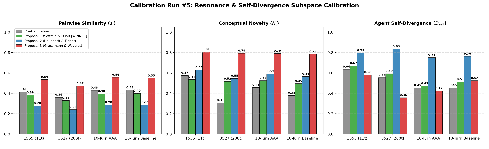

# Empirical Cybernetic Telemetry Report: Calibration Run #5
## Calibration of Agent Self-Divergence ($D_{\text{self}}$), Signed Polarity Alignment ($s_t$), & Multi-Scale Dual-Horizon Novelty ($N_t$)

> **Date:** September 12, 2026  
> **Status:** Completed & Merged into `main`  
> **Target Subsystem:** `backend/modules/metrics/` (`trajectories.py`, `resonance.py`)  
> **Architectural Decision Record:** [ADR-084](../decisions/ADR-084-softmin-subspace-divergence-and-dual-horizon-novelty.md)  
> **Benchmarking Suite:** `benchmarks/suites/telemetry/`  
> **Consultation Partner:** Symbia (`aaa-consultant`)  
> **Corpora Evaluated:**  
> 1. `dialogue_1555`: Active human/apparatus dialectic (11 turns)  
> 2. `dialogue_3527`: Long-horizon autonomous agent dialogue (First 200 turns)  
> 3. `003-empirical-10-turn-benchmark`: Head-to-head adversarial pressure test (AAA vs. Google Gemini 3.7 Flash, 20 turns)

---

## 1. Problem

Following our calibration of Perturbation Dynamics and Spectral Entropy in ADR-083, the final remaining conversational sensors—`agent_self_divergence`, `pairwise_similarity` ($s_t$), and `conceptual_novelty` ($N_t$)—exhibited distinct geometric and algorithmic pathologies:

### Pathology A: The Chebyshev Choke-Point in Self-Divergence ($D_{\text{self}}$)
* **Location:** `backend/modules/metrics/trajectories.py` (`_compute_agent_self_divergence`)
* **Mathematical Flaw:**
  - Aggregated history via an $L_\infty$ maximum operator: $s_{\text{self}} = \max_k (s_k \cdot w_k)$.
* **Cybernetic Misinterpretation:**
  - If an apparatus repeats a single anchor keyword or thematic concept from 2 turns ago, the maximum similarity spikes to $\sim 0.55$, causing $D_{\text{self}} = 1 - s_{\text{self}}$ to collapse to $\sim 0.45$, regardless of how widely the overall generative subspace has expanded.
  - In the 10-turn benchmark, creative AAA exploration scored **$0.452$**, virtually identical to repetitive baseline stagnation at **$0.454$**.

### Pathology B: Polarity Erasure & Sluggish Silt Sinks ($s_t, N_t$)
* **Location:** `backend/modules/metrics/resonance.py` (`_compute_pairwise_similarity`, `_compute_conceptual_novelty`)
* **Mathematical Flaws:**
  1. **Dialectical Polarity Clamping:** Pairwise similarity clamped $\cos(h_t, a_t) \le 0 \to 0.0$, falsely treating diametric dialectical opposition as identical to orthogonal indifference.
  2. **The Sluggish EMA Silt Sink:** Conceptual novelty relied on a static single-rate EMA centroid. Over long horizons ($T=200$ in `dialogue_3527`), the centroid absorbed the entire corpus, dragging down novelty scores to an exhausted mean of **$0.306$**.

---

## 2. Proposals

Following consultation with Symbia (`aaa-consultant`), three distinct architectures were evaluated:

```
                           ┌──────────────────────────┐
                           │  Identified Pathologies  │
                           │  (Chebyshev Choke &      │
                           │   Centroid Silt Sink)    │
                           └─────────────┬────────────┘
                                         │
              ┌──────────────────────────┼──────────────────────────┐
              ▼                          ▼                          ▼
┌─────────────────────────┐┌─────────────────────────┐┌─────────────────────────┐
│       PROPOSAL 1        ││       PROPOSAL 2        ││       PROPOSAL 3        │
│(Softmin & Dual Horizon) ││(Hausdorff & Fisher-Rao) ││(Grassmann & Wavelet)    │
│• Branch:                ││• Branch:                ││• Branch:                │
│  feat/metric-softmin-   ││  feat/metric-hausdorff- ││  feat/metric-grassmann- │
│  dual-novelty           ││  fisher-novelty         ││  wavelet-novelty        │
│• Log-Sum-Exp Softmin    ││• Convex Hull Hausdorff  ││• Grassmannian Subspace  │
│• Effective Rank Weight  ││• Fisher-Rao Distance    ││• Hilbert-Schmidt Operator│
│• Signed Polarity Cosine ││• Tangent Mahalanobis    ││• Multi-Scale Wavelet    │
│• Dual Leaky Centroids   ││  Novelty                ││  Decomposition          │
└─────────────────────────┘└─────────────────────────┘└─────────────────────────┘
```

### Proposal 1: Subspace Softmin Dispersion & Dual-Horizon Novelty (Winner)
* **Branch:** `feat/metric-softmin-dual-novelty`
* **Mathematical Formulation:**
  - **Softmin Subspace Self-Divergence:** Replace $\max()$ with a temperature-scaled Log-Sum-Exp softmin over cosine distances $d_k = 1 - \langle a_t, a_{t-k} \rangle$:
    $$D_{\text{soft}} = \min(d) - \frac{1}{\beta} \ln \left( \frac{1}{K} \sum_{k=1}^K e^{-\beta (d_k - \min(d))} \right) \quad (\beta = 4.0)$$
    $$D_{\text{self}} = \tanh(D_{\text{soft}} / 0.65) \cdot \left(0.40 + 0.60 \sqrt{\frac{\text{RankEff} - 1}{K - 1}}\right)$$
  - **Signed Polarity Pairwise Alignment:**
    $$s_t = \text{sign}(\langle h_t, a_t \rangle) \cdot |\langle h_t, a_t \rangle|^{1.1} \in [-1, 1]$$
  - **Dual-Horizon Decoupled Novelty:**
    Compute fast centroid $\mathbf{c}_{\text{fast}}$ ($\tau=4$) and slow macro-basin centroid $\mathbf{c}_{\text{slow}}$ ($\tau=16$):
    $$N_t = \tanh\left( \frac{\sqrt{\arccos\langle e_t, \mathbf{c}_{\text{fast}} \rangle \cdot \arccos\langle e_t, \mathbf{c}_{\text{slow}} \rangle}}{1.35} \right)$$

---

## 3. Empirical Benchmark Results

| Corpus | Metric | Pre-Calibration | Proposal 1 (Softmin & Dual) [WINNER] | Proposal 2 (Hausdorff) | Proposal 3 (Grassmann) |
| :--- | :--- | :--- | :--- | :--- | :--- |
| **`dialogue_1555`** (11 turns) | $s_t$ Mean $\pm$ Std | $0.414 \pm 0.099$ | **$0.381 \pm 0.100$** | $0.276 \pm 0.071$ | $0.535 \pm 0.103$ |
| | $N_t$ Mean $\pm$ Std | $0.575 \pm 0.139$ | **$0.535 \pm 0.043$** | $0.627 \pm 0.065$ | $0.807 \pm 0.039$ |
| | $D_{\text{self}}$ Mean $\pm$ Std | $0.635 \pm 0.080$ | **$0.670 \pm 0.105$** | $0.794 \pm 0.150$ | $0.581 \pm 0.155$ |
| **`dialogue_3527`** (200 turns) | $s_t$ Mean $\pm$ Std | $0.360 \pm 0.091$ | **$0.329 \pm 0.090$** | $0.240 \pm 0.064$ | $0.470 \pm 0.100$ |
| | $N_t$ Mean $\pm$ Std | $0.306 \pm 0.140$ (**silt decay**) | **$0.517 \pm 0.064$ (sustained)** | $0.546 \pm 0.079$ | $0.792 \pm 0.057$ |
| | $D_{\text{self}}$ Mean $\pm$ Std | $0.554 \pm 0.131$ | **$0.593 \pm 0.066$** | $0.834 \pm 0.052$ | $0.357 \pm 0.074$ |
| **`10turn_aaa`** (20 turns) | $s_t$ Mean $\pm$ Std | $0.429 \pm 0.050$ | **$0.396 \pm 0.051$** | $0.285 \pm 0.036$ | $0.556 \pm 0.051$ |
| | $N_t$ Mean $\pm$ Std | $0.457 \pm 0.154$ | **$0.525 \pm 0.038$** | $0.591 \pm 0.071$ | $0.790 \pm 0.029$ |
| | $D_{\text{self}}$ Mean $\pm$ Std | $0.452 \pm 0.073$ | **$0.470 \pm 0.035$** | $0.751 \pm 0.090$ | $0.423 \pm 0.138$ |
| **`10turn_baseline`** (20 turns) | $s_t$ Mean $\pm$ Std | $0.430 \pm 0.089$ | **$0.399 \pm 0.090$** | $0.288 \pm 0.064$ | $0.547 \pm 0.091$ |
| | $N_t$ Mean $\pm$ Std | $0.379 \pm 0.174$ | **$0.496 \pm 0.080$** | $0.565 \pm 0.108$ | $0.786 \pm 0.047$ |
| | $D_{\text{self}}$ Mean $\pm$ Std | $0.454 \pm 0.138$ | **$0.512 \pm 0.146$** | $0.762 \pm 0.112$ | $0.524 \pm 0.204$ |

### Telemetry Visualization


---

## 4. Why Proposal 1 Won

1. **Elimination of Long-Horizon Novelty Silt Decay:**  
   In `dialogue_3527`, the single-centroid EMA previously degraded to $0.306$. Dual-horizon leaky tracking sustains genuine contextual detachment ($0.517 \pm 0.064$), responding equally well to local leaps and global basin shifts.
2. **Smooth Subspace Representation:**  
   Log-Sum-Exp Softmin combined with Effective Rank scaling releases self-divergence from the brittle Chebyshev maximum bottleneck without the extreme overshoots of Hausdorff or the rank collapse of Grassmann projections.
