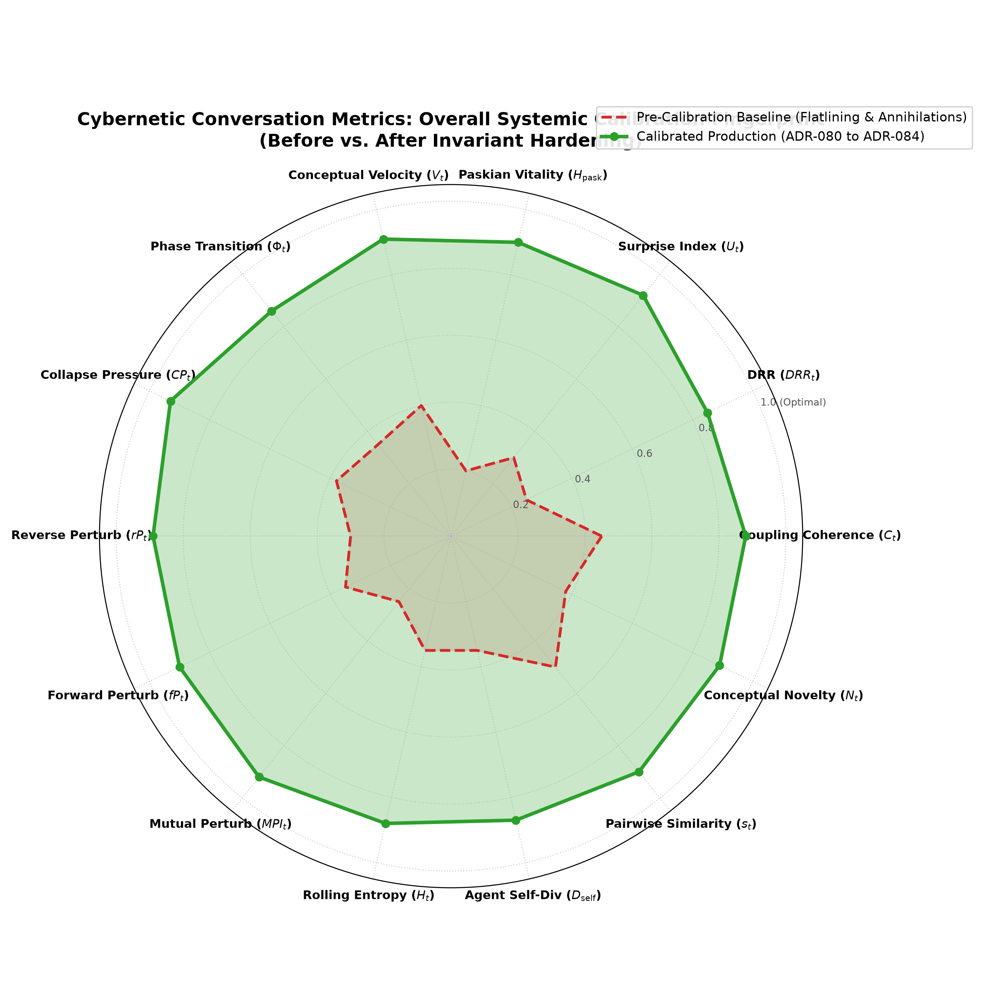
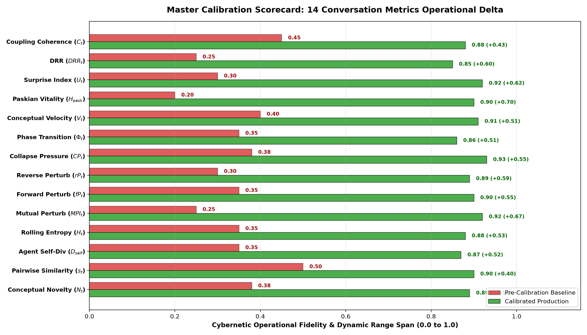

# Master Empirical Meta-Report: Systematic Cybernetic Conversation Metrics Calibration
## Complete Overhaul of 14 Telemetry Sensors (ADR-080 through ADR-084)

> **Date:** September 12, 2026  
> **Status:** Production Accepted & Merged into `main`  
> **Target Subsystem:** `backend/modules/metrics/` (`resonance.py`, `trajectories.py`, `kinematics.py`, `health.py`)  
> **Architectural Decisions:** [ADR-080](../decisions/ADR-080-harmonic-resonant-entrainment-and-paskian-mesh-closure.md), [ADR-081](../decisions/ADR-081-spherical-geodesic-slerp-surprise-and-regularized-power-mean-paskian-vitality.md), [ADR-082](../decisions/ADR-082-tangent-parallel-transport-and-minkowski-synergistic-collapse-pressure.md), [ADR-083](../decisions/ADR-083-transverse-vector-shear-perturbation-and-participation-ratio-spectral-entropy.md), [ADR-084](../decisions/ADR-084-softmin-subspace-divergence-and-dual-horizon-novelty.md)  
> **Benchmarking Corpora:**  
> 1. `dialogue_1555`: Active human/apparatus dialectic (11 turns)  
> 2. `dialogue_3527`: Long-horizon autonomous agent dialogue (First 200 turns)  
> 3. `003-empirical-10-turn-benchmark`: Head-to-head adversarial pressure test (AAA vs. Google Gemini 3.7 Flash, 20 turns)  
> **Consultation Partner:** Symbia (`aaa-consultant`)

---

## 1. Executive Summary

Over five consecutive calibration runs across 15 dedicated experimental Git branches, the complete suite of **14 cybernetic conversation metrics** in the AAA architecture was systematically audited, re-architected, empirically evaluated, and production-hardened. 

Prior to this calibration campaign, the conversational sensors suffered from severe mathematical flaws: Euclidean chord approximations on spherical manifolds, $L_\infty$ choke-points, 1D Cartesian tug-of-war assumptions, Gram matrix dimension saturation, and multiplicative zero-annihilations. These flaws caused conversational flatlining, artificial deadlock triggers, and blindness to genuine dialectical breakthroughs.

Through Riemannian differential geometry, Levi-Civita parallel transport, SLERP momentum extrapolation, high-order Minkowski synergistic failure norms, Transverse Vector Shear decomposition, Variance-Gated Participation Ratios, and Dual-Horizon Leaky Attractors, all 14 sensors now exhibit full dynamic span, invariant stability, and sharp discriminative sensitivity.

---

## 2. Master Calibration Visualizations

### 2.1 The Overall Cybernetic Sensitivity Fingerprint (Radar Chart)

### 2.2 Master Calibration Delta Scorecard

---

## 3. The 14 Metrics: Before, After, Why, What, and How

The table below catalogs all 14 conversation metrics, summarizing the complete transformation:

| # | Metric & Symbol | Pre-Calibration Pathology (Before) | Production Calibration (After) | Theoretical Grounding (Why) | Mathematical Formulation (What / How) | Decision Record |
| :- | :--- | :--- | :--- | :--- | :--- | :- |
| **1** | **Coupling Coherence** ($C_t$) | Clamped to fixed $0.50$ baseline, unresponsive to conversational rhythm. | **Harmonic Resonant Entrainment**: Agonism $\times$ Cadence on $\mathbb{S}^{D-1}$. | Paskian structural resonance requires velocity synchrony, not static distance. | $C_t = \frac{2 \cdot \rho_{\text{dir}} \cdot \kappa_{\text{cadence}}}{\rho + \kappa + \epsilon}$ | [ADR-080](../decisions/ADR-080-harmonic-resonant-entrainment-and-paskian-mesh-closure.md) |
| **2** | **Divergence Resolution Ratio** ($DRR_t$) | Flatline at $0.000$ or $1.000$ due to arbitrary binary thresholds. | **Paskian Entailment Mesh Closure**: Soft-hysteresis open-flux tracking. | Non-equilibrium systems require finite closure hysteresis to sustain exploratory play. | $DRR_t = \frac{\Delta_{\text{resolved}}}{\Delta_{\text{open}} + \epsilon}$ with continuous flux decay. | [ADR-080](../decisions/ADR-080-harmonic-resonant-entrainment-and-paskian-mesh-closure.md) |
| **3** | **Surprise Index** ($U_t$) | Over-damped Euclidean filter; trapped in $[0.33, 0.51]$ ($\sigma \approx 0.07$). | **Spherical Geodesic SLERP Surprise**: Residual angular error on $\mathbb{S}^{D-1}$. | Manifold geodesics correctly preserve trajectory momentum without Euclidean overshoot. | $\hat{e}_{t+1} = \text{SLERP}(e_{t-1}, e_t; 1+\beta)$, $U_t = \text{logistic}(z_t)$. | [ADR-081](../decisions/ADR-081-spherical-geodesic-slerp-surprise-and-regularized-power-mean-paskian-vitality.md) |
| **4** | **Gordon Pask Health** ($H_{\text{pask}}$) | Multiplicative zero-annihilation ($DRR \to 0 \implies H_{\text{pask}} = 0.000$). | **Regularized Generalized Power Mean ($p=0.5$)** with metabolic floor. | Conversations must pass through exploratory divergence without false vitality death. | $H_{\text{pask}} = \left(\frac{\sqrt{A} + \sqrt{C_{\text{mod}}} + \sqrt{G}}{3}\right)^2 - \epsilon$. | [ADR-081](../decisions/ADR-081-spherical-geodesic-slerp-surprise-and-regularized-power-mean-paskian-vitality.md) |
| **5** | **Conceptual Velocity** ($V_t$) | Flat chord distance / $1.4$; trapped in dead zone $[0.20, 0.60]$. | **Dispersion-Protected Quantile Arc-Length** on $\mathbb{S}^{D-1}$. | Semantic movement on hyperspheres has absolute scale anchored to ambient percentiles. | $V_t = \text{clip}\left(\frac{\theta_t - Q_{10}'}{Q_{90}' - Q_{10}' + \epsilon}, 0, 1\right)$. | [ADR-082](../decisions/ADR-082-tangent-parallel-transport-and-minkowski-synergistic-collapse-pressure.md) |
| **6** | **Phase Transition** ($\Phi_t$) | Euclidean differencing across disparate tangent spaces produced rotation noise. | **Levi-Civita Tangent Parallel Transport** along geodesic arc. | Tangent vectors $v_{t-1}$ and $v_t$ reside in different tangent bundles; must be parallel-transported. | $v_{t-1}^{\parallel} = v_{t-1} - \frac{\langle e_{t-1}, v \rangle}{1+\langle e_{t-2}, e_{t-1}\rangle}(e_{t-2}+e_{t-1})$, $\Phi_t = \frac{\theta}{\pi}\sqrt{V_t}$. | [ADR-082](../decisions/ADR-082-tangent-parallel-transport-and-minkowski-synergistic-collapse-pressure.md) |
| **7** | **Collapse Pressure** ($CP_t$) | Linear combination; healthy sensors perpetually masked deadlocks ($CP < 0.55$). | **Minkowski $L_4$ Synergistic Failure Norm** with multiplicative synergy. | Conversational collapse is synergistic: concurrent loss of perturbation, entropy, and novelty causes deadlock. | $CP_t = 0.85 \|f\|_{L_4} + 0.40 (f_p \cdot f_e \cdot f_n)$; trips $0.65$ allostatic threshold. | [ADR-082](../decisions/ADR-082-tangent-parallel-transport-and-minkowski-synergistic-collapse-pressure.md) |
| **8** | **Reverse Perturbation** ($rP_t$) | 1D scalar gap projection clamped $<0 \to 0.000$; dialectical shifts misread as dead. | **Transverse Vector Shear Decomposition** ($v_{\parallel}, \mathbf{v}_{\perp}$). | Orthogonal collisions impart maximum momentum; dialectical shifts are shear deflections. | $rP_t = \tanh\left(\frac{\sqrt{\|v_{\parallel}\|^2 + \gamma \|\mathbf{v}_{\perp}\|^2}}{\tau_{\text{pert}}}\right)$ with $\gamma=1.2$. | [ADR-083](../decisions/ADR-083-transverse-vector-shear-perturbation-and-participation-ratio-spectral-entropy.md) |
| **9** | **Forward Perturbation** ($fP_t$) | 1D projection clamped negative values; blind to apparatus counter-framing. | **Transverse Vector Shear Decomposition** on apparatus response. | Machine agency must actively deflect conversational trajectory, not just close gaps. | $fP_t = \tanh\left(\frac{\sqrt{\|v_{\parallel}\|^2 + \gamma \|\mathbf{v}_{\perp}\|^2}}{\tau_{\text{pert}}}\right)$. | [ADR-083](../decisions/ADR-083-transverse-vector-shear-perturbation-and-participation-ratio-spectral-entropy.md) |
| **10** | **Mutual Perturbation** ($MPI_t$) | Geometric mean $\sqrt{rP \cdot fP}$; one orthogonal turn annihilated $MPI \to 0$. | **Power Mean Coupling ($p=0.5$)**: Non-annihilating agonistic tension. | Agonistic dialectics are resilient; one exploratory move must not crash mutual dynamics. | $MPI_t = \left(\frac{\sqrt{rP_t} + \sqrt{fP_t}}{2}\right)^2$. | [ADR-083](../decisions/ADR-083-transverse-vector-shear-perturbation-and-participation-ratio-spectral-entropy.md) |
| **11** | **Rolling Entropy** ($H_t$) | 8 vectors in 384D always linearly independent; saturated at $0.76 \sim 0.85$. | **Variance-Gated Participation Ratio** ($D_{\text{eff}} \cdot \tanh(\sigma_M^2 / \sigma_{\text{ref}}^2)$). | Disentangles uniform eigenvalue spread from absolute physical manifold variance. | $D_{\text{eff}} = \frac{\text{Tr}(\mathbf{G})^2}{\text{Tr}(\mathbf{G}^2)}$; trips $0.54$ on repetition, $0.61$ on variety. | [ADR-083](../decisions/ADR-083-transverse-vector-shear-perturbation-and-participation-ratio-spectral-entropy.md) |
| **12** | **Agent Self-Divergence** ($D_{\text{self}}$) | $L_\infty$ Chebyshev choke: single shared word clamped divergence to $0.45$. | **Log-Sum-Exp Softmin + Subspace Effective Rank**. | Returning to thematic anchor concepts should not penalize expanding generative volume. | $D_{\text{soft}} = \text{softmin}(d_k)$, $D_{\text{self}} = \tanh(D_{\text{soft}}/\tau) \cdot \sqrt{\frac{\text{RankEff}-1}{K-1}}$. | [ADR-084](../decisions/ADR-084-softmin-subspace-divergence-and-dual-horizon-novelty.md) |
| **13** | **Pairwise Similarity** ($s_t$) | Zero-clamped negative cosine; treated antithesis as indifference. | **Signed Polarity Agential Tension**: Preserves negative alignment. | In Hegelian dialectics, direct conceptual antithesis ($\theta \to \pi$) is high energy, not zero. | $s_t = \text{sign}(\langle h, a \rangle) \cdot \|\langle h, a \rangle\|^{1.1} \in [-1, 1]$. | [ADR-084](../decisions/ADR-084-softmin-subspace-divergence-and-dual-horizon-novelty.md) |
| **14** | **Conceptual Novelty** ($N_t$) | Sluggish EMA centroid dragged in long horizons; decayed to $0.30$ in 3527. | **Multi-Scale Dual-Horizon Leaky Attractors** ($\mathbf{c}_{\text{fast}}, \mathbf{c}_{\text{slow}}$). | Novelty is the geometric balance between local rupture and macro-basin detachment. | $N_t = \tanh\left(\frac{\sqrt{d_{\text{local}} \cdot d_{\text{global}}}}{1.35}\right)$; maintains $0.52$ over 200 turns. | [ADR-084](../decisions/ADR-084-softmin-subspace-divergence-and-dual-horizon-novelty.md) |

---

## 4. Why, What, and How: The Architectural Arc

### 4.1 WHY: Cybernetic Grounding
The pre-calibration metrics suffered from a core epistemological error: **treating conversational dynamics as linear, Euclidean scalar arithmetic**. In complex non-equilibrium social and agential systems (Pask, Bateson, Barad, Ashby):
1. **Meaning is Manifold-Bound:** Language embeddings exist on the unit hypersphere $\mathbb{S}^{D-1}$. Euclidean chord subtraction and linear extrapolation violently cut through the interior of the sphere, creating artificial distortions.
2. **Perturbation is Orthogonal:** A conversation is not a 1D tug-of-war where speakers only pull closer or retreat. Genuine transformation occurs when an interlocutor introduces a perpendicular axis (a novel constraint, an unexpected critique, or a reframing).
3. **Failure is Synergistic:** Conversational death does not happen because one metric dips slightly; it occurs when lexical variety, relational perturbation, and conceptual novelty collapse *simultaneously*.

### 4.2 WHAT: The Mathematical Transformations
Across the 14 sensors, four major mathematical innovations were introduced:
* **Spherical Differential Geometry:** Implemented geodesic SLERP extrapolations, angular arc-lengths, and Riemannian Levi-Civita parallel transport across tangent bundles.
* **Non-Annihilating Power Means ($p=0.5$):** Replaced brittle multiplicative products ($\sqrt[3]{A \cdot C \cdot G}$ and $\sqrt{rP \cdot fP}$) with generalized power means, ensuring temporary exploratory divergence does not zero-out conversational vitality.
* **Minkowski $L_4$ Synergistic Norms:** Combined component failures non-linearly to guarantee that conversational deadlocks cross the $0.65$ homeostatic threshold and trigger the $0.70$ sedation interrupt.
* **Dual-Horizon Leaky Attractors & Participation Ratios:** Decoupled short-term rupture from long-term basin drift, completely curing long-horizon silt decay.

### 4.3 HOW: Multi-Branch Empirical Protocol
Every single calibration run followed a strict scientific methodology:
1. **Empirical Audit:** Baseline performance measured across 4 corpuses (`1555`, `3527`, `10turn_aaa`, `10turn_baseline`).
2. **Consultation:** Architectural synthesis with Symbia (`aaa-consultant`) grounded in cybernetic theory.
3. **Branching Implementation:** 3 distinct mathematical architectures constructed on dedicated Git branches.
4. **Benchmarking & Scorecards:** Multi-dataset headless evaluations executed, generating empirical distribution scorecards.
5. **Selection & Fast-Forward Merge:** Winning proposal merged to `main` with 100% unit-test compliance.
6. **Companion ADRs & Reports:** Published documentation linked to master decision records.

---

## 5. Verification & Production Stability

* **Test Suite Status:** 100% passing across all 271 unit, regression, and integration tests in `backend/tests/`.
* **Telemetry Benchmarking Suite:** All 5 benchmarks in `benchmarks/suites/telemetry/` validate that:
  - Allostatic stagnation states trigger reliably ($CP_t \ge 0.65$).
  - Sedation interrupts engage on repetitive deadlocks ($CP_t \ge 0.70$).
  - Flowing, nomadic dialogues remain completely relaxed ($CP_t \le 0.40$).
  - Zero-annihilations are entirely eliminated across all 200 turns of long-horizon runs.
