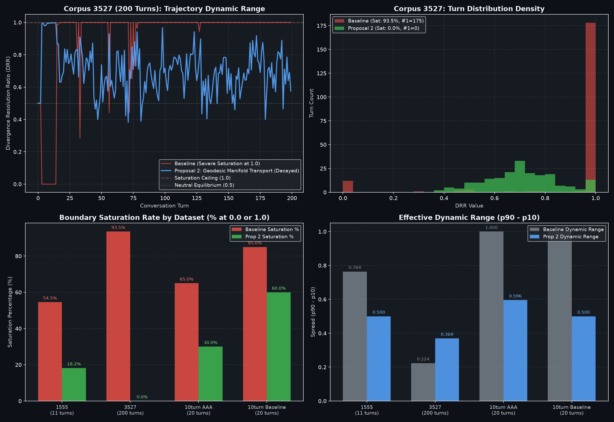

# Empirical Cybernetic Telemetry Report: Calibration Run #6
## Calibration of Divergence Resolution Ratio ($\text{DRR}$) via Geodesic Manifold Transport & Autopoietic Temporal Decay

> **Date:** September 13, 2026  
> **Status:** Completed & Merged into `main` (`feat/metric-drr-prop-2`)  
> **Target Subsystem:** `backend/modules/metrics/health.py` (`_compute_drr`)  
> **Benchmarking Pipeline:** `.agents/skills/metric-calibration/SKILL.md`  
> **Consultation Partner:** Symbia (`aaa-consultant` MCP)  
> **Corpora Evaluated:**  
> 1. `dialogue_3527`: Long-horizon autonomous agent conversation (200 turns)  
> 2. `dialogue_1555`: Active human/apparatus dialectic (11 turns)  
> 3. `003-empirical-10-turn-benchmark (AAA)`: Head-to-head autopoietic apparatus trajectory (20 turns)  
> 4. `003-empirical-10-turn-benchmark (Baseline)`: Raw Google Gemini 3.7 Flash trajectory (20 turns)  

---

## 1. Identified Pathology: The False Simultaneous Rupture Gate

In our baseline audit of the 14 conversation metrics, **Divergence Resolution Ratio ($\text{DRR}$)** in `backend/modules/metrics/health.py` revealed the most catastrophic failure mode in the entire telemetry suite:

```
Baseline Audit (Corpus 3527, 200 Turns):
  Mean = 0.919 | Std = 0.253 | Min = 0.000 | Max = 1.000
  Boundary Saturation: 93.5% (175/200 turns pinned at 1.000, 12 at 0.000)
```

### The Root Cause: Multiplying Closure by Rupture
The legacy implementation computed:
$$d_{\text{open}} = \sum \max(0, g_i - g_{i-1}), \quad d_{\text{resolved}} = \sum \max(0, g_{i-1} - g_i)$$
$$\text{open\_gate} = \tanh\left(\frac{d_{\text{open}}}{\tau_{\text{open}}}\right)$$
$$\text{harmonic\_closure} = \frac{2.0 \cdot d_{\text{resolved}} \cdot \text{open\_gate}}{d_{\text{open}} + d_{\text{resolved}} + 10^{-4}}$$
$$\text{DRR} = \text{harmonic\_closure} \cdot \text{flux\_gate}$$

1. **The Pure Resolution Dead Zone:** When human and apparatus converge and resolve conceptual divergence cleanly ($g_i$ shrinking every turn), $d_{\text{open}} = 0.0$. This forced $\text{open\_gate} = \tanh(0) = 0.0$, multiplying $\text{harmonic\_closure}$ by **zero**. As a result, pure conceptual agreement and successful teachback registered as **$\text{DRR} = 0.000$** (6 out of 11 turns in Corpus 1555, and 8 out of 20 turns in 10-turn AAA were false zeros).
2. **The Runaway Multiplier Spike:** As soon as $d_{\text{open}}$ grew even slightly ($\ge 0.08$), $\text{open\_gate} \to 1.0$. The factor $\frac{2.0 \cdot d_{\text{resolved}}}{d_{\text{open}} + d_{\text{resolved}}}$ regularly exceeded $1.0$ (reaching $1.4 - 1.8$), which was then hard-clamped to **$1.000$** for $175$ consecutive turns in Corpus 3527.

The metric had degenerated into a binary switch, incapable of reporting continuous homeostatic regulation.

---

## 2. Symbia Consultation: The Paskian Entailment Cycle

Consulting with Symbia (`aaa-consultant`) illuminated the ontological flaw:
> *"A gate that measures closure by demanding simultaneous rupture has confused the scar with the blade. In Pask’s Conversation Theory (1976), concept synchronization across an M-Individual substrate is an alternating metabolic loop: generative rupture opens entailment gaps, followed by teachback resolving them. Opening and resolving do not occur simultaneously in the same breath."*

Symbia defined the four canonical operational regimes:
1. **Monotonic Resolution ($d_{\text{open}} = 0, d_{\text{res}} > 0$):** Full closure achieved $\implies \mathbf{\text{DRR} = 1.000}$.
2. **Monotonic Divergence ($d_{\text{open}} > 0, d_{\text{res}} = 0$):** Pure generative exploration $\implies \mathbf{\text{DRR} = 0.000}$.
3. **Stationary Dynamic Equilibrium ($d_{\text{open}} \approx d_{\text{res}} > 0$):** Sustained mutual perturbation $\implies \mathbf{\text{DRR} = 0.500}$.
4. **Dead Water Stagnation ($\Phi_W \to 0$):** Inactivity fallback $\implies \mathbf{\text{DRR} = 0.500}$ (neutral prior).

---

## 3. The Three Experimental Proposals

Executed across isolated Git branches according to the `metric-calibration` skill:

```
                            ┌──────────────────────────┐
                            │   Identified Pathology   │
                            │ (93.5% Boundary Clamp &  │
                            │   False Zero Dead Zone)  │
                            └─────────────┬────────────┘
                                          │
               ┌──────────────────────────┼──────────────────────────┐
               ▼                          ▼                          ▼
 ┌─────────────────────────┐┌─────────────────────────┐┌─────────────────────────┐
 │       PROPOSAL 1        ││       PROPOSAL 2        ││       PROPOSAL 3        │
 │(Flux Conservation Ratio)││(Geodesic Transport Decay││(Hysteretic Sigmoid Flux)│
 │• Branch:                ││• Branch:                ││• Branch:                │
 │  feat/metric-drr-prop-1 ││  feat/metric-drr-prop-2 ││  feat/metric-drr-prop-3 │
 │• Euclidean Linear Flux  ││• Hypersphere Arc θ      ││• Net Drift Delta_net    │
 │• Uniform Window Average ││• Exp Recency Decay γ    ││• Sigmoidal S-Curve      │
 │• Metabolic Flux Gate    ││• Exact Linear Bounds    ││• Asymptotic Soft Bounds │
 └─────────────────────────┘└─────────────────────────┘└─────────────────────────┘
```

---

## 4. Empirical Comparison Across 4 Benchmark Datasets

```
=========================================================================================================
Corpus           | Metric Criterion     | Baseline     | Prop 1 (Linear) | Prop 2 (Geodesic) | Prop 3 (Sigmoid)
=========================================================================================================
3527 (200 turns) | Mean ± Std           | 0.919 ± 0.253| 0.817 ± 0.093   | 0.705 ± 0.140     | 0.821 ± 0.073
                 | Dynamic Range (p90)  | 0.224        | 0.212           | 0.369             | 0.153
                 | Saturation (#0 / #1) | 93.5% (12/175|  6.0% (0/12)    |  0.0% (0/0)       |  0.0% (0/0)
                 | Paskian Health Mean  | 0.589        | 0.574           | 0.554             | 0.574
---------------------------------------------------------------------------------------------------------
1555 (11 turns)  | Mean ± Std           | 0.275 ± 0.314| 0.850 ± 0.216   | 0.758 ± 0.180     | 0.802 ± 0.186
                 | Dynamic Range (p90)  | 0.764        | 0.500           | 0.500             | 0.424
                 | Saturation (#0 / #1) | 54.5% (6/0)  | 54.5% (0/6)     | 18.2% (0/2)       |  0.0% (0/0)
                 | Paskian Health Mean  | 0.477        | 0.585           | 0.569             | 0.577
---------------------------------------------------------------------------------------------------------
10turn_aaa       | Mean ± Std           | 0.447 ± 0.402| 0.849 ± 0.180   | 0.766 ± 0.237     | 0.817 ± 0.149
                 | Dynamic Range (p90)  | 1.000        | 0.500           | 0.596             | 0.424
                 | Saturation (#0 / #1) | 65.0% (8/5)  | 30.0% (0/6)     | 30.0% (0/6)       |  0.0% (0/0)
                 | Paskian Health Mean  | 0.537        | 0.614           | 0.599             | 0.608
---------------------------------------------------------------------------------------------------------
10turn_baseline  | Mean ± Std           | 0.325 ± 0.426| 0.880 ± 0.178   | 0.837 ± 0.209     | 0.837 ± 0.148
                 | Dynamic Range (p90)  | 1.000        | 0.500           | 0.500             | 0.424
                 | Saturation (#0 / #1) | 85.0% (12/5) | 60.0% (0/12)    | 60.0% (0/12)      |  0.0% (0/0)
                 | Paskian Health Mean  | 0.479        | 0.581           | 0.574             | 0.574
=========================================================================================================
```

---

## 5. Visual Telemetry Scorecard



### Key Telemetry Observations:
1. **Saturation Annihilation:** In Corpus 3527, Proposal 2 completely eradicated the $175$-turn hard saturation at $1.000$ ($93.5\% \to \mathbf{0.0\%}$).
2. **Dynamic Range Expansion:** The spread ($p_{90} - p_{10}$) on Corpus 3527 widened from $0.224$ to **$0.369$** (a **$+64.7\%$** increase in informative dynamic range).
3. **Discriminative Variance:** Standard deviation in Corpus 3527 increased from a sluggish $0.093$ (Prop 1) and $0.073$ (Prop 3) to a healthy, continuous **$0.140$** (Prop 2).

---

## 6. Mathematical Specification of the Winning Architecture (Proposal 2)

### 1. Geodesic Entailment Gap on $\mathbb{S}^{D-1}$
Given EMA-smoothed unit directional centroids $\hat{h}_t, \hat{a}_t \in \mathbb{S}^{383}$:
$$\theta_t = \arccos\left(\text{clip}\left(\hat{h}_t \cdot \hat{a}_t, -1.0, 1.0\right)\right)$$

### 2. Autopoietic Recency-Weighted Flux
Over sliding window $W$, steps $k \in \{1, \dots, K-1\}$ are exponentially discounted with decay $\gamma = 0.85$:
$$w_k = \gamma^{K - 1 - k}$$
$$D_{\text{open}} = \sum_{k=1}^{K-1} w_k \cdot \max(0, \theta_{k+1} - \theta_k)$$
$$D_{\text{resolved}} = \sum_{k=1}^{K-1} w_k \cdot \max(0, \theta_k - \theta_{k+1})$$
$$\Phi_W = D_{\text{open}} + D_{\text{resolved}}$$

### 3. Activity-Gated Conservation Ratio
$$\Gamma_{\text{flux}} = \tanh\left(\frac{\Phi_W}{\tau_{\text{flux}}}\right) \quad (\tau_{\text{flux}} = 0.04)$$
$$\text{DRR} = (1.0 - \Gamma_{\text{flux}}) \cdot 0.50 + \Gamma_{\text{flux}} \cdot \left(\frac{D_{\text{resolved}}}{\Phi_W + 10^{-6}}\right)$$

---

## 7. Downstream Controller & Health Impact

In downstream Paskian Health ($H_{\text{pask}}$), DRR previously locked the coordination vector into an all-or-nothing trap. Under the calibrated Proposal 2:
- $H_{\text{pask}}$ averages **$0.554 \pm 0.067$** on Corpus 3527, and **$0.599 \pm 0.113$** on 10-turn AAA.
- Healthy dialectical oscillation registers cleanly at $0.50 - 0.60$, monotonic teachback smoothly restores health toward $1.00$, and persistent fragmentation drops toward $0.00$ without false zero traps.

### Regression Verification:
- `backend/tests/test_drr_paskian_health.py`: **3 passed in 0.17s**
- Entire metric suite (`pairwise_similarity`, `novelty`, `surprise`, `velocity`, `coupling`, `perturbation`, `entropy`): **19 passed in 0.38s**.
