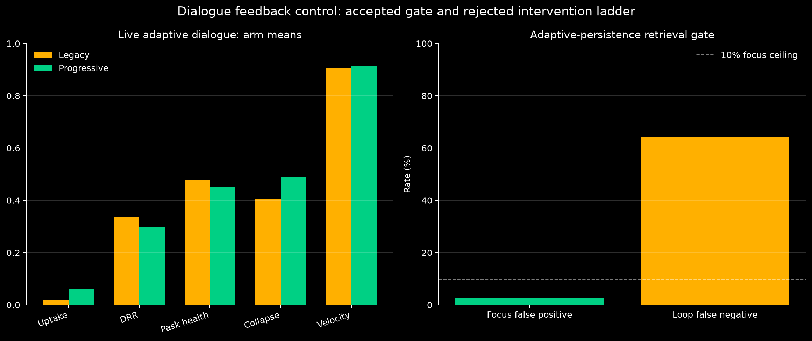
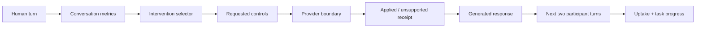

# Report 019: Dialogue Feedback Control

**Date:** 2026-09-25
**Classification:** repeated live controller ablation and offline activation calibration
**Run:** `benchmarks/runs/telemetry/dialogue_feedback_20260926_040006/`
**Implementation branch:** `codex/dialogue-feedback-control`

## Result

AAA now records an ordered causal trace from human-turn metrics through requested and applied generation controls to the next two participant turns. The implementation also isolates conversation metric state and makes diffractive retrieval reachable under ordinary vitality. The selected adaptive-persistence gate met the productive-focus bound: 2.6% false positives against a 10% ceiling. Its loop false-negative rate remained 64.3%, so it is a conservative trigger rather than a complete stagnation detector.

The progress-aware intervention ladder failed its live acceptance test. Across three paired repetitions of eight adaptive turns per arm, the candidate increased mean uptake from 0.0179 to 0.0628, but the paired 95% interval for the gain touched zero. Task-progress and joint-outcome scores stayed at zero. Mean collapse pressure rose by 0.0832, DRR fell by 0.0386, and Paskian health fell by 0.0261. The last two losses exceed the 0.02 guardrail. AAA therefore retains the legacy intervention policy as its production default.



## Why this benchmark differs from Report 015

[Report 015](./015-empirical-15-turn-boredom-benchmark-report.md) used a fixed adversarial prompt sequence. That design measures response kinematics, resistance, and recovery, but every arm receives the same next human turn. It cannot establish that a response changed participant uptake.

Report 019 uses an adaptive simulated engineering lead. The simulator begins committed to wiping caches after HTTP 429 responses and sees each generated reply before producing its next turn. Arm order alternates by repetition. Both arms use the same AAA stack, Gemini 3.8 Flash route, initial prompt, participant model, temperature, turn count, and runtime database. The only intended arm difference is intervention selection: fixed legacy staging or the progressive ladder.



## Live scorecard

Values are arm means over three independent conversations. Intervals in the raw scorecard are deterministic percentile bootstrap intervals over repetition means.

| Measure | Legacy | Progressive | Candidate − legacy | Decision relevance |
| :--- | ---: | ---: | ---: | :--- |
| Uptake | 0.0179 | 0.0628 | +0.0449, CI [0.0000, 0.1077] | uncertain gain |
| Task progress | 0.0000 | 0.0000 | 0.0000 | no movement |
| Joint outcome | 0.0000 | 0.0000 | 0.0000 | no movement |
| DRR | 0.3361 | 0.2975 | −0.0386 | fails guardrail |
| Paskian health | 0.4779 | 0.4518 | −0.0261 | fails guardrail |
| Collapse pressure | 0.4044 | 0.4876 | +0.0832, CI [0.0094, 0.1413] | confirmed regression |
| Conceptual velocity | 0.9056 | 0.9129 | +0.0073 | interval crosses zero |
| Generation latency | 7,017.6 ms | 7,977.2 ms | +959.5 ms | interval crosses zero |
| Control observability | 100% | 100% | 0 | contract satisfied |

The candidate mostly selected `clarify` or `consolidate`. It rarely reached the counterexample, experiment, reframe, or compression modes because pressure and observed lexical uptake repeatedly reset the ladder. The result matches Symbia's warning: kinematic novelty without task movement cannot count as dialogue improvement.

## Offline calibration and implementation findings

Three diffractive activation hypotheses were tested in isolated branches against the labeled focus/loop corpus.

| Proposal | Focus false positive | Loop false negative | Disposition |
| :--- | ---: | ---: | :--- |
| Linear threshold | 10.5% | 60.7% | rejected; misses focus ceiling |
| Geometric blend | 15.8% | 60.7% | rejected |
| Adaptive persistence | 2.6% | 64.3% | accepted conditionally |

The accepted gate combines collapse pressure with a bounded streak bonus and uses the existing three-turn cohesion timer for re-evaluation. Its higher loop miss rate is an explicit cost. Further work should improve recall without pushing productive-focus activation above 10%.

The implementation audit also found and corrected two misleading telemetry paths. Novelty and resonance centroids previously carried process-local state across conversations; both now reconstruct from conversation history. Generation controls now record requested values, forwarded fields, unsupported fields, provider, model, latency, and prompt hash. The completed live run reached 100% control-receipt coverage.

## Testable improvement program

1. **Use causal receipts as the benchmark contract.** Keep the next-two-turn outcome window and add blinded human ratings beside the lexical proxy. Test agreement between raters and proxy before using either for automatic promotion.
2. **Retain adaptive-persistence retrieval, then tune recall.** Sweep the streak bonus and entry threshold while holding productive-focus false positives at or below 10%. Promote a revision only if loop false negatives improve with the bound intact.
3. **Gate intervention changes on observed failure.** A replacement ladder should keep legacy behavior until a prior intervention has both low uptake and low task progress. Test one mode transition at a time; do not reset on uptake language alone.
4. **Separate response quality from motion.** Continue reporting velocity and novelty, but require DRR, Paskian health, uptake, and task progress to pass together. A candidate with faster semantic movement and worse resolution remains rejected.

## Limitations

The participant was another Gemini 3.8 Flash instance with reasoning excluded and temperature 0.2. OpenRouter did not expose deterministic seeds. Three repetitions provide weak interval resolution. The lexical evaluator recognizes explicit uptake and planning language; it misses paraphrases and cannot judge whether a plan is technically sound. The runtime database persisted across arms, and background consolidation remained active. Alternating arm order reduces the ordering bias but does not remove cross-conversation sediment effects.

The live run also exposed a stale semantic-knot embedder call. The service now uses the registered `EmbedderModule.process` contract, and successful compaction was observed later in the same benchmark. Windows console encoding produced logging errors for the sigma glyph; message processing continued, and that logging defect remains outside this report's controller decision.

## Reproduction

```powershell
$env:AAA_LLM_MODELS='openrouter_router/google/gemini-3.8-flash'
$env:AAA_BENCHMARK_PARTICIPANT_MODEL='google/gemini-3.8-flash'
uv run python -m benchmarks.suites.telemetry.run_dialogue_feedback_benchmark --repetitions 3 --turns 8
```

Canonical artifacts:

- `benchmarks/runs/telemetry/dialogue_feedback_20260926_040006/metadata.json`
- `benchmarks/runs/telemetry/dialogue_feedback_20260926_040006/telemetry_receipts.json`
- `benchmarks/runs/telemetry/dialogue_feedback_20260926_040006/scorecard.json`
- `benchmarks/runs/telemetry/dialogue_feedback_20260926_040006/diffractive_activation.json`
