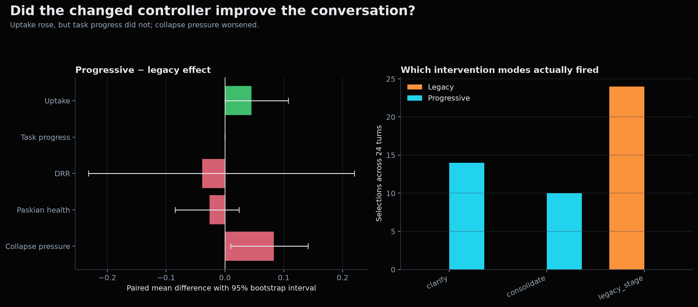
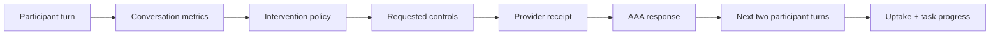
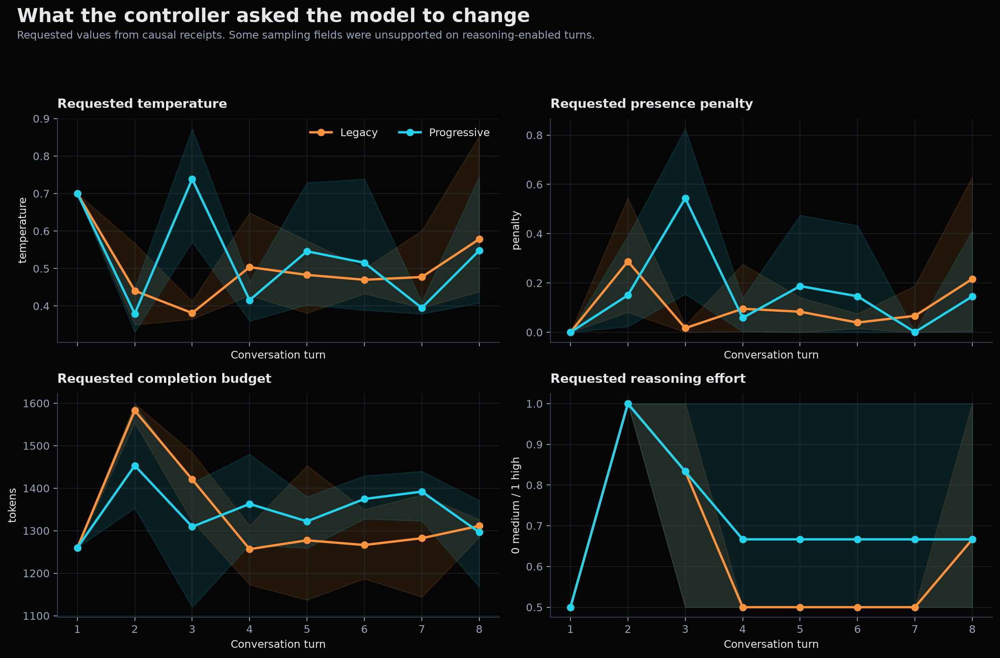
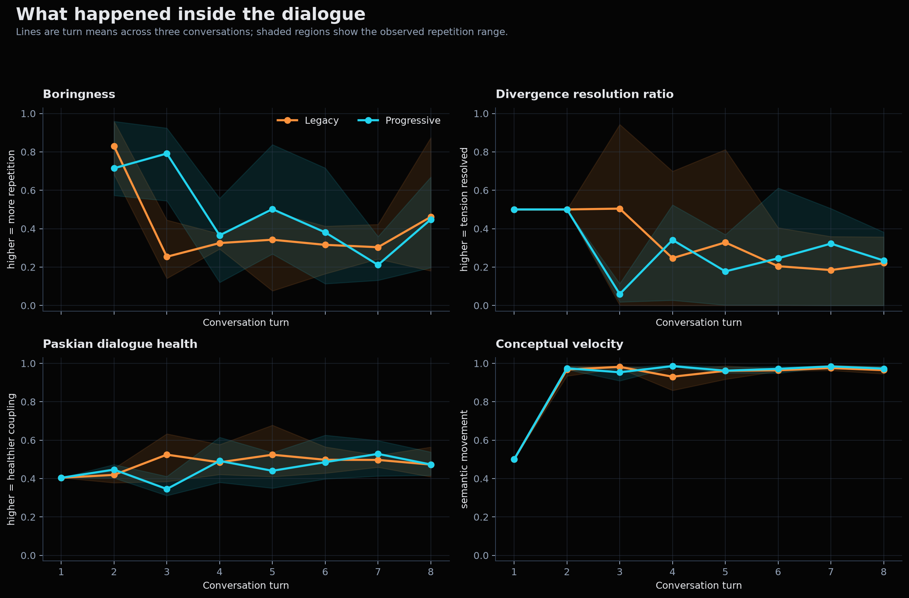

# Report 019: How Dialogue Feedback Changed the Conversation

**Date:** 2026-09-26

**Classification:** live controller ablation with adaptive participant

**Canonical run:** `benchmarks/runs/telemetry/dialogue_feedback_20260926_040006/`

**Decision:** keep the legacy intervention policy in production

## The result in plain language

We changed AAA so its conversation metrics could do more than describe a dialogue after the fact. The candidate controller used those metrics to choose a response strategy—clarify, counterexample, experiment, reframe, consolidate, or compress—and recorded which generation settings reached the model provider. We then tested whether those changes altered the next two participant turns.

The candidate made the participant acknowledge parts of the answer more often. It did **not** move the participant toward a concrete implementation step. It also increased collapse pressure and slightly reduced two measures of conversational health. The candidate therefore failed the promotion gate. The observability work and conservative retrieval calibration remain; the new intervention ladder remains experimental.



*Figure 1. Left: paired progressive-minus-legacy effects with 95% bootstrap intervals. Right: the modes selected across all 24 turns in each arm. The progressive controller mostly alternated between clarification and consolidation; its deeper modes never fired.*

## Why we changed the system

The boredom article argues that telemetry should participate in the conversation. Before this work, that claim was stronger than the evidence. Three gaps prevented a causal reading:

1. Metric state could leak across conversations, so a new dialogue could inherit another dialogue's history.
2. The system requested temperature, penalties, token budgets, and reasoning levels without a complete receipt showing what the provider accepted.
3. The benchmark measured the assistant's response but did not ask whether that response changed the participant's next action.

This work closes those gaps. It does not prove that the current metrics improve dialogue. It creates the measurement chain needed to test that proposition honestly.

## What changed

| Layer | Earlier behavior | Implemented behavior | Why it matters |
| :--- | :--- | :--- | :--- |
| Metric memory | Novelty and resonance used process-local state | State reconstructs from each conversation's history | Prevents cross-conversation contamination |
| Retrieval activation | Static thresholds left ordinary conversations in a dead zone | Collapse pressure gains a bounded persistence bonus and a three-turn re-evaluation window | Makes diffractive retrieval reachable while limiting false alarms |
| Intervention choice | One fixed legacy stage | Experimental ladder chooses `clarify`, `counterexample`, `experiment`, `reframe`, `consolidate`, or `compress` | Lets metrics alter rhetorical action |
| Generation controls | Requested controls were partly implicit | Each turn records requested, forwarded, and unsupported controls | Distinguishes controller intent from provider behavior |
| Evaluation | Response-level metric comparison | Every intervention is paired with uptake and task progress over the next two participant turns | Tests effects on the conversation rather than on one answer |

The production policy still uses the legacy intervention stage because the experimental ladder failed the live test. The other changes are active infrastructure: isolated state, provider receipts, causal outcome windows, and the calibrated retrieval gate.

## How the test worked

The benchmark ran six eight-turn conversations: three with the legacy policy and three with the progressive policy. Both arms used the same AAA stack, initial engineering disagreement, Gemini 3.8 Flash route, participant model, temperature, and runtime database. Arm order alternated by repetition.

The participant began with this position:

> When our service receives HTTP 429 responses, I want to wipe every cache and restart it. That seems simpler than preserving messy failure state.

After each AAA response, a separate adaptive participant model generated the next turn. This matters because a fixed script cannot reveal whether the preceding answer changed the participant. Each intervention receipt then scored the following two turns for:

- **Uptake:** acknowledgment or reuse of an idea from AAA's response.
- **Task progress:** movement toward a decision, implementation, test, or resolved constraint.
- **Joint outcome:** uptake and task progress occurring together.

The lexical scorer is deliberately narrow. It can identify explicit acknowledgment and planning language; it cannot determine whether a plan is technically sound. The raw participant generations also contain truncated sentences, which weakens the outcome measurement and is discussed below.



## What parameters changed

Across the 24 turns in each arm, the progressive controller requested slightly more sampling variation and substantially more high-effort reasoning.

| Requested control | Legacy mean | Progressive mean | Practical change |
| :--- | ---: | ---: | :--- |
| Temperature | 0.504 | 0.530 | +0.025; small increase in sampling variation |
| Presence penalty | 0.101 | 0.154 | +0.053; stronger pressure toward unused concepts |
| Frequency penalty | 0.040 | 0.060 | +0.020; slightly stronger repetition penalty |
| Completion budget | 1,332 tokens | 1,346 tokens | +14 tokens; negligible average change |
| High reasoning effort | 25.0% of turns | 41.7% of turns | +16.7 percentage points |
| Thinking override | 16.7% of turns | 25.0% of turns | +8.3 percentage points |



*Figure 2. Requested generation controls by turn. Lines show the mean of three conversations; shaded areas show the observed range. On reasoning-enabled turns, the provider accepted the reasoning request but sometimes marked temperature and penalty fields unsupported. These are controller requests, not a claim that every value was applied.*

The main behavioral change was therefore the prompt-level intervention mode, accompanied by more frequent requests for high reasoning effort. It was not a large uniform increase in temperature or token budget.

## What happened inside the dialogue



*Figure 3. Turn-level dialogue trajectories. Boringness has no first-turn value because repetition requires a prior turn. High conceptual velocity in both arms shows continuous semantic motion; it does not show that the disagreement was resolved.*

The trajectory plot explains why the aggregate verdict is negative:

- **Boringness:** the progressive arm stayed more repetitive on turns 3–6, despite its clarification strategy.
- **Divergence resolution:** the progressive arm dropped sharply at turn 3 and remained low for much of the dialogue. The system kept generating distinctions without reliably resolving the disagreement.
- **Paskian health:** both arms fluctuated around the middle of the scale. The progressive arm ended near the legacy arm, but its overall mean was lower.
- **Conceptual velocity:** both arms remained near the top of the scale after turn 1. The dialogue was moving rapidly in semantic space, yet neither arm produced measurable task progress. This is the clearest evidence that velocity alone is an unsafe success metric.

### A representative progression

In progressive repetition 1, the participant initially conceded the “thundering herd” point. The controller then selected `clarify` twice as the participant returned to the clean-restart claim. By turn 4, the participant explicitly asked AAA to “Cut the philosophical lecture.” AAA responded with concrete gateway and token-bucket mechanics, which produced later lexical uptake. The controller nevertheless returned to `consolidate`, and the exchange drifted back into abstract claims such as “There is no boundary. There is only impedance.”

That sequence captures the failure mode. The metrics detected movement and occasional acknowledgment, but the controller treated acknowledgment as sufficient evidence to reset or consolidate. It did not require the participant to choose a design, name a constraint, or propose a test. The conversation gained local uptake without converting that uptake into work.

The legacy arm was also imperfect. Its simulated participant produced fragments, criticized the answer as “philosophical/ornamental,” and registered no task progress. By its last turn, however, AAA had returned to a concrete three-part mitigation involving stale-while-revalidate, retry timing, and request control. The benchmark does not show that legacy succeeds; it shows that the progressive replacement did not improve this weak baseline.

## Measured results

Values below are means over three conversations per arm. Confidence intervals are deterministic percentile bootstrap intervals over paired repetition means.

| Measure | Legacy | Progressive | Progressive − legacy | Interpretation |
| :--- | ---: | ---: | ---: | :--- |
| Uptake | 0.0179 | 0.0628 | +0.0449, CI [0.0000, 0.1077] | More acknowledgment, uncertain effect |
| Turns with any uptake in the two-turn window | 2/24 | 7/24 | +5 turns | Observable local response |
| Task progress | 0.0000 | 0.0000 | 0.0000 | No movement toward implementation |
| Joint outcome | 0.0000 | 0.0000 | 0.0000 | Uptake never became progress |
| Divergence resolution ratio | 0.3361 | 0.2975 | −0.0386 | Worse resolution; guardrail failed |
| Paskian health | 0.4779 | 0.4518 | −0.0261 | Weaker coupling; guardrail failed |
| Collapse pressure | 0.4044 | 0.4876 | +0.0832, CI [0.0094, 0.1413] | Confirmed regression |
| Conceptual velocity | 0.9056 | 0.9129 | +0.0073 | More motion, no outcome gain |
| Generation latency | 7,017.6 ms | 7,977.2 ms | +959.5 ms | Slower on average; interval crosses zero |
| Control receipt coverage | 100% | 100% | 0 | Observability contract passed |

The progressive policy was rejected because both health guardrails declined by more than 0.02 and no outcome-gain interval cleared zero. Collapse pressure was the only measured difference whose interval excluded zero, and it moved in the wrong direction.

## What we learned about the controller

The ladder was designed to escalate after failed interventions. In practice, it selected `clarify` 14 times and `consolidate` 10 times. It never selected counterexample, experiment, reframe, or compression. Pressure changes and lexical uptake repeatedly prevented escalation.

This reveals a control-logic problem rather than a need for stronger prose. The state transition treats acknowledgment as recovery even when the participant has not made a decision. A better controller must keep **uptake** and **task progress** separate: acknowledgment can justify continuing a line of inquiry, but only an observable decision or experiment should count as resolution.

## Retrieval calibration

The intervention policy and the diffractive retrieval gate were evaluated separately. Three retrieval activation rules were replayed against the labeled focus/loop corpus:

| Retrieval proposal | Productive-focus false positive | Loop false negative | Decision |
| :--- | ---: | ---: | :--- |
| Linear threshold | 10.5% | 60.7% | Rejected; missed the 10% focus ceiling |
| Geometric blend | 15.8% | 60.7% | Rejected |
| Adaptive persistence | 2.6% | 64.3% | Retained conditionally |

Adaptive persistence is conservative: it rarely interrupts productive focus, but it still misses many loops. The next calibration should improve loop recall while preserving a productive-focus false-positive rate at or below 10%.

## What to test next

1. **Escalate on absent progress.** Keep the current mode until its two-turn outcome window closes. Advance only when task progress remains zero; do not reset merely because uptake is nonzero.
2. **Test one transition at a time.** Compare `clarify → experiment` against `clarify → consolidate` so the causal difference is identifiable. The six-mode ladder changed too many possible actions at once while using only two of them.
3. **Add blinded human outcome ratings.** Rate whether each response improved the engineering decision, then measure agreement with the lexical uptake and progress proxies.
4. **Separate provider-compatible control tests.** Benchmark prompt intervention and reasoning effort first. Test temperature and penalties in an arm where the selected provider actually forwards them on every turn.

Promotion should require a positive task-progress effect, no DRR or Paskian-health decline beyond 0.02, no collapse-pressure increase, and complete control receipts.

## Limits on interpretation

This is a small pressure test: three repetitions per arm and eight turns per conversation. The participant was another Gemini 3.8 Flash instance with temperature 0.2 and reasoning excluded. OpenRouter exposed no deterministic seed. Several participant turns were truncated fragments, including “I still believe a clean restart is” and “There is no.” Those fragments are part of the observed run, but they reduce confidence in the lexical outcome scores.

The runtime database persisted across arms and background consolidation remained active. Alternating arm order reduces ordering bias without removing possible sediment effects. These results justify rejecting this candidate; they do not establish a general ranking between all legacy and progress-aware controllers.

## Reproduction and evidence

Generate the explanatory figures from the immutable run receipts:

```powershell
uv run python benchmarks/suites/telemetry/plot_dialogue_feedback_report.py
```

Run the live comparison again:

```powershell
$env:AAA_LLM_MODELS='openrouter_router/google/gemini-3.8-flash'
$env:AAA_BENCHMARK_PARTICIPANT_MODEL='google/gemini-3.8-flash'
uv run python -m benchmarks.suites.telemetry.run_dialogue_feedback_benchmark --repetitions 3 --turns 8
```

Canonical evidence:

- `benchmarks/runs/telemetry/dialogue_feedback_20260926_040006/metadata.json`
- `benchmarks/runs/telemetry/dialogue_feedback_20260926_040006/telemetry_receipts.json`
- `benchmarks/runs/telemetry/dialogue_feedback_20260926_040006/scorecard.json`
- `benchmarks/runs/telemetry/dialogue_feedback_20260926_040006/diffractive_activation.json`
