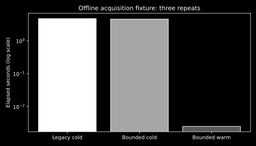

# Report 036: T65 Bounded Research Acquisition

Date: 2026-10-06. Opt-in policy v4. Base commit: `88b459deb0ab3b247260aae2c43744c5793b4fed`; implementation hashes in [metadata](metadata.json).

## Measured comparison

A frozen synthetic HTTP fixture replays four queries against two source URLs through the actual search step. Three repeated runs measure scheduling and reuse; they are not independent quality samples. DuckDuckGo retains its 1.5-second request cadence. No live model or provider request occurs.

| Arm | Mean seconds | Outbound calls per run | New clients per run |
| --- | ---: | ---: | ---: |
| baseline | 4.692774 | 4 | 4 |
| bounded_cold | 4.537646 | 4 | 1 |
| bounded_warm | 0.002484 | 0 | 0 |

All arms preserve eight query/source associations, two distinct source URLs and the identical coverage hash recorded in [raw receipts](telemetry_receipts.json). Cold reuse reduces client creation from four to one; warm reuse avoids outbound requests. These local fixture timings do not estimate live provider latency, semantic quality, OCR quality or Jev ranking benefit.

Reproduce: `python -m benchmarks.suites.research_acquisition --output <receipt-path>` from the repository root. Dataset: [frozen fixture](../../../benchmarks/data/research/acquisition_fixture.json). Raw records exist only in this report directory.

## Verification

- Research and HTTP regression run: 140 passed. Subsequent shared-resource run: 70 passed; final capacity/journal run: 38 passed; export/import run: 22 passed; final cadence/HTTP run: 21 passed. Runs overlap and must not be summed.
- Backend and benchmark lint pass; all 23 changed Python files pass format checks. Strict mypy passes for nine checked implementation files. Configured mypy checks 62 files and retains the known `keyed_lock.py:13` missing Task type argument. An expanded command additionally checked legacy search/parse files outside that allowlist and reported 22 annotation errors; no whole-repository typing pass claimed.
- Tests exercise durable origin before cache publication, parallel cache access, original observation time, TTL/config/unsafe-hit rejection, failed-observation rejection, immutable pending closure, late cancellation-resistant results, shared provider capacity/rate limits, retained physical CPU capacity, client closure, bounded responses and redirect credential/body handling.
- No frontend change. Existing repository-wide failures remain documented in [Report 034](../034-research-provider-reliability/README.md).

## Provenance and limits

A cache access references its original acquisition, source version, parser configuration and observation time. Access time never refreshes observation time. DNS revalidation and TTL eligibility do not establish semantic freshness. Historical evidence remains exportable after a current acquisition fails.

Shared application capacity bounds simultaneous work across frozen policies. Cancellation retains capacity until actual work exits; Python cannot forcibly stop a running thread. Shutdown waits are bounded. Acquisition failures expose sanitized categories and partial status; original source bytes remain unknown when only transformed text is available.

NVIDIA remains selected for live testing/debugging. The existing live NVIDIA receipt remains owned by Report 034. Independent annotation, OCR corpus and human release review remain later gates.
