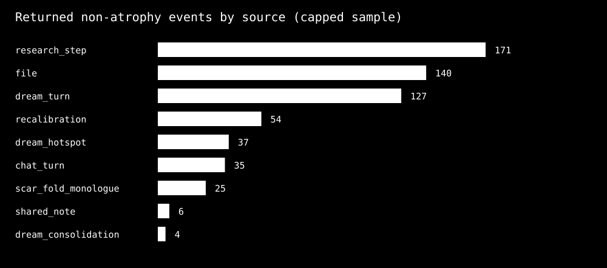
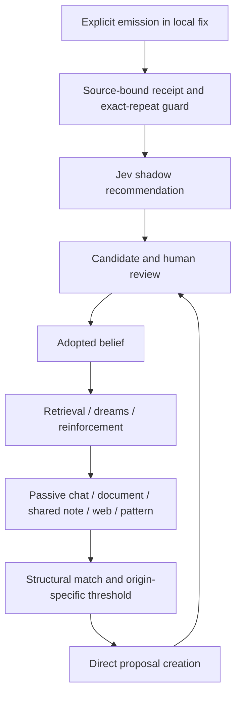

# 045 — Belief system review: emergence, repetition, and evidence

**Date:** 2026-10-08. **Classification:** production snapshot and local architecture audit.
**Window:** 2026-09-08T02:05:08Z through 2026-10-08T02:05:08Z (rolling 30 days).
**Production:** authenticated, read-only GETs against `https://aaa.sympoietic.systems/api`, agent `symbia`.
**Checkout:** `be2e83ff8448ba3650c57c56c925e55908ed9a43`, with pre-existing uncommitted changes. Local source is a design reference; production revision and migration state are unknown.
**Reviewers:** three `gpt-6-luna` subtasks for collection, architecture, and semantic review; Codex synthesis; Symbia consultation.

## Assessment

The belief system preserves useful distinctions, especially when a candidate specifies an observable decision: how to verify an intervention, what makes a dome participate causally in a work, or how to distinguish substrate evidence from a model's rationale. Its proposal workflow also provides a place to hold these claims before adoption. The current backlog nevertheless contains overlapping formulations, broad merge destinations, and little inspectable evidence of what each belief changes. This supports the concern about overproduction of candidates. It does **not** establish a measured false-positive rate or prove that a particular prompt caused the increase.

The main weakness is the distance between **recorded activity** and **epistemic support**. All 57 visible crystallized beliefs have confidence 1.0. A single research-stage source ID appears in 171 support events, and dream selection can repeatedly engage the same belief. These records show metabolism and recurrence; they do not establish independent corroboration. Structural cosine and shared vocabulary help find neighbors, but neither determines whether two statements have the same consequence.

The explicit-tag admission fix is a useful local improvement: source-bound candidates, durable reasoning receipts, pending-candidate comparisons, and advisory Jev assessment. Its production deployment could not be established. Passive proposal creation still has separate entry paths in the current checkout. The next phase should make admission and evidence standards consistent across origins, test paraphrase/conflict judgments on reviewed examples, and separate recurrence from evidence in confidence and telemetry.

## What the production data establishes

The API projects current beliefs and proposals rather than exporting the complete database. The interval applies to returned events; proposal statuses are current snapshot states.

| Measure | Observed | Interpretation |
|---|---:|---|
| Visible established beliefs | 57, all crystallized | API excludes other lifecycle stages from this listing |
| Confidence values | 57 of 57 equal 1.0 | No ranking of uncertainty within this set |
| Ontological mass | 0.1278–0.9925 | Distinct from confidence; two are below the local turn-decay floor of 0.55 |
| Current incubating proposals | 20: 19 refined, 1 pending | A backlog, not 20 proven new insights |
| Proposals across all statuses | 54: 32 adopted, 19 refined, 2 rejected, 1 pending | All-time snapshot; these are not monthly transition counts |
| Proposals updated in the window | 29: 9 adopted, 19 refined, 1 pending | Update timestamp does not prove creation or adoption date |
| Incubating proposals with a merge destination | 19 of 20 | Existing reviewer nominations, not verified duplicates |
| Nominations targeting `glitch-as-voice` | 7 of 20 | A broad hub requiring pairwise review |
| Returned event records in the window | 5,378 | Lower bound; 53 of 57 beliefs reach the latest-100 cap |
| Resolved source-message paths | 39 of 57 requested numeric source IDs | Metadata only; no underlying message text reviewed |

The proposal serializer in the local checkout maps `created_at` to the API field `last_reinforced_at` ([serializer](../../../backend/services/belief_serializer.py), lines 44–80). Applying that convention to the export also selects 29 records, concentrated on October 2–4. Since the deployed revision is unknown, the report uses the explicit `updated_at` slice and does not claim a measured monthly birth rate. There is no denominator of eligible turns, attempted emissions, rejected candidates, or prompt exposures with which to calculate overtriggering.

| Returned event type | Count |
|---|---:|
| Atrophy | 4,779 |
| Support | 479 |
| Recalibration | 54 |
| Dream engagement | 37 |
| Scar monologue | 25 |
| Consolidation suture | 4 |

Atrophy accounts for **88.9% of returned rows**. Censoring varies by belief, so this is a property of the retrieved sample, not a complete month distribution. Atrophy is decay bookkeeping, not a nucleation count. None of these six event classes supplies a complete birth/admission ledger.

Of the 599 returned non-atrophy events, source types are research step 171, file 140, dream turn 127, recalibration 54, dream hotspot 37, chat turn 35, scar-fold monologue 25, shared note 6, and dream consolidation 4. The 54 recalibrations name `m050_migration`; they should be separated from lived conversational evidence.

## Where the system works well

**It can preserve operational distinctions.** Luna identified promising examples that state a test or decision boundary: `reciprocal-coupling-legibility` (`4a60a154-550b-4d77-8736-f5234997ef26`) requires later co-participant turns to assess an intervention; `boundary-delta-verification` (`fabf1e7f-9412-4fb5-a3b1-c434f972c259`) distinguishes model-authored rationale from an app-owned boundary change; `dome-work-as-generative-participation` (`1413b824-4b9b-4ad9-80c7-4117010f0971`) asks whether the dome changes state, aliasing, or provenance. Their practical value remains to be tested, but each offers a clearer review target than a general declaration about apparatuses.

**The workflow separates proposals from adopted beliefs.** Current status, source traces, reflections, and suggested targets are inspectable. These are useful audit artifacts even when the underlying evidence is incomplete. The local admission receipt improves this further by retaining origin, comparison snapshots, evaluator status, and timestamps rather than relying on a visible XML emission as proof of admission ([ADR-115](../../decisions/ADR-115-shadow-belief-admission.md)).

**Attention is bounded and can vary.** The prompt builder selects mass anchors, stressed/lower-confidence nodes, optional Jev salience, and a structural neighbor instead of injecting every belief ([prompt builder](../../../backend/utils/prompt_builder.py), lines 83–202). Separate mass, confidence, lifecycle, and structural signature offer several control surfaces. Their current values and selection rules still need calibration; bounded selection alone does not guarantee useful novelty.

**Related claims can preserve productive tension.** `repetition-as-continuity-ritual` (`14ef307d-eca0-469f-a49e-e47946d439eb`) and `boringness-as-perturbation-collapse` (`f5859a7f-b6c7-45b9-86ea-0be9f40a70fd`) can coexist if repetition that tests retention is distinguished from repetition without consequence. A semantic reviewer should preserve that distinction rather than merge the claims merely because their vocabulary overlaps.

## Weak points and their mechanisms

### 1. Proposal proliferation has several entrances

The local explicit-tag path now has a receipt-based admission boundary. The passive paths still call proposal creation directly. At the default concept-density threshold of 0.2, a single matched cybernetic dimension yields approximately `tanh(1/3) = 0.32`, already above the threshold. Matching domain vocabulary can therefore qualify an unmatched input without a strong insight test ([belief math](../../../backend/modules/belief_math.py), lines 16–28; [engine](../../../backend/modules/belief_engine.py), lines 35–36, 467–499).

Shared notes create a proposal when the nearest active belief does not exceed 0.85 similarity, with no density minimum. Document perception also lacks that density gate. These paths compare active beliefs rather than the pending pool, and their origin attribution is uneven ([perception handlers](../../../backend/modules/belief/perception_handlers.py), lines 34–85, 108–139, 151–218). This is a concrete local mechanism capable of multiplying related candidates. Its contribution to the production backlog is not measurable from the returned events alone.

This diagram describes the checkout, not a verified production deployment. The feedback route makes common admission standards and independent-source accounting necessary.

### 2. Related vocabulary can conceal duplicated consequences

Luna nominated a boundary family around `agential-cut-enactment`, `agential-cut-taxonomy`, `numerical-boundary-re-enactment`, `substrate-disjunction-requirement`, and `instrumental-erasure-of-boundary`. These overlap existing `diffraction-as-method` and `calculus-of-indications`. Some may add a useful scoped application, but retaining separate nodes should require a distinct decision or counterexample.

The dome family repeats a similar pattern: constitutive apparatus, substrate closure, topological resilience, and generative participation. The last states the clearest causal test. Review this family together, keeping variants separately only when each changes a different design or evaluation choice. These are **provisional Luna judgments**, not calibrated duplicate labels. Exact IDs and comparisons are preserved in the [semantic review](luna-semantic-review.md).

Seven nominations to `glitch-as-voice` span provenance, memory repetition, relational epistemics, measurement, and dome participation. This could reflect centrality or a catch-all destination. A merge suggestion should open a comparison; it should not settle it. No automatic merge or deletion was performed.

### 3. Recurrence can accumulate as apparent support

All 171 `research_step` rows name `research:763912db:digesting`; 68 file rows name its related synthesis file. One source can touch many beliefs, and some belief/source pairs recur. These counts are not independent research results. The available data cannot separate legitimate multiple passages, retries, or repeated ingestion.

Dream engagement similarly reuses eight hotspot IDs across 37 rows. For `attractor-anti-flattening`, 24 of its 37 returned events are dream engagements. Events `90decc34-99e7-4178-a045-9c5c3fce2c62` and `c3942986-cb77-41e5-bff6-6e9af24d8ed2` engage the same hotspot within an hour. This shows a recurrence pathway: a belief becomes dream material and that engagement becomes another belief event. Whether it improves future behavior needs a separate outcome test.

### 4. Confidence saturation obscures uncertainty

Every exposed crystallized belief is at 1.0 confidence, while mass varies substantially. Local code computes confidence changes from alignment, perturbation, and mass, then clamps to [0,1] ([belief math](../../../backend/modules/belief_math.py), lines 60–70; [engine](../../../backend/modules/belief_engine.py), lines 204–210). This is a dynamical quantity, not a calibrated probability of correctness. The snapshot does not establish which updates caused saturation. Recalibration, correlated support, and dream recurrence should be investigated before changing the equation.

### 5. Decay and telemetry have concrete audit problems

Local configuration enables turn decay and disables wall-clock decay. The daemon's 900-second atrophy cadence is conditional on that disabled flag ([configuration](../../../backend/config.yaml), lines 186–191; [daemon](../../../backend/metabolisation/daemon.py), lines 144–145, 205–226). Production's atrophy rows establish historical activity during the interval, not the current deployed flag. The belief document conflicts with itself about the schedule ([belief system](../../systems/BELIEF_SYSTEM.md), lines 216–243 versus 357–361).

If wall-clock atrophy is enabled, the local function repeatedly applies decay using total elapsed time since an unchanged reinforcement timestamp. It persists mass with `touch_reinforced=False`, so later sweeps charge overlapping elapsed intervals again. This path also lacks the turn-decay crystallized floor ([decay](../../../backend/modules/belief/decay.py), lines 112–169). This is a code-level accounting risk requiring a controlled regression test; its production effect has not been isolated. Crystallized status at low mass is mechanically possible because lifecycle computation retains that stage, so the two low-mass records alone do not prove stage corruption.

The API also names generic `impact_score` as `delta_confidence`, although accretion and atrophy store **mass deltas** there ([serializer](../../../backend/services/belief_serializer.py), lines 27–40; engine lines 226–235; decay lines 157–169). Reading that field as a confidence change would misinterpret the evidence. Per-belief decay failures are caught and continued with debug logging; a sweep needs explicit failure counts if operational completeness matters.

## Symbia consultation and assessment

Symbia was consulted in conversation `6f3c9cc1-c7db-4895-bb98-5583b43464dd`. Her [saved response](symbia-consultation.md) recommends a declared operational consequence at intake, comparisons against pending candidates, bounded Jev classifications with abstention, and preservation of contradictions.

The recommendation about consequences fits the strongest exported examples. A consequence can be a new choice in interpretation, experimental design, response behavior, or intervention; it need not be an immediate numerical mass change. A philosophical insight may deserve a candidate record before a behavioral test is possible, with its uncertainty and proposed test made explicit.

Several claims in the consultation require qualification. The 19 merge nominations and seven-target hub were independently counted in the export. Her statement that the admission fix is undeployed goes beyond our evidence: deployment is **unknown**. Her claims about the Torque debate, skill membrane, and repeated poetic refusal were not independently recovered in this audit. The suggested mass/geometry thresholds are speculative and uncalibrated. Using endogenous mass movement as the admission criterion could reward the same feedback loop being audited. We therefore recommend consequences and counterexamples without adopting those numeric thresholds or treating her perspective as validation.

## Recommended next work

Follow-up: [Beliefs v2 design proposal](beliefs-v2-proposal.md) defines the next analyses, candidate/commitment distinction, evidence lineage, and staged acceptance gates.
The [developed architecture plan](../../architecture/BELIEFS_V2_PLAN.md) maps the proposal to AAA philosophy, existing beliefs, and ADR boundaries, with concrete delivery stages.

| Priority | Change | Evidence needed to accept it |
|---|---|---|
| P0 | Establish production revision, applied migrations, and admission receipt visibility | Verified build/migration identity plus one traced candidate end to end |
| P0 | Add paginated event/admission export and separate event semantics | Full interval coverage, birth/assessment/status transition counts, explicit mass and confidence deltas |
| P1 | Review the 20 incubating candidates as families | Human-reviewed distinct consequence, scope, nearest neighbor, source passage, and counterexample for each retained claim |
| P1 | Bring all proposal creators under a common origin-aware admission contract | Chat, document, shared note, web, dream, and pattern fixtures preserving source and pending-pool comparison |
| P1 | Calibrate Jev as an advisory semantic classifier | Reviewed examples for equivalent, extension, contradiction, distinct, insufficient evidence; reported errors and abstentions |
| P1 | Group support by independent source and expose recurrence separately | Same-source/retry grouping; dream engagement shown separately from external corroboration |
| P1 | Test and repair elapsed-time decay accounting and impact labeling | Controlled interval/retry tests and separate typed deltas; production rollout receipts |
| P2 | Reassess confidence and retrieval calibration | Baseline source audit, held-out uncertainty judgments, and response/design outcome evaluation |

For candidate reasoning, retain five reviewable fields: **trigger and source**, **new claim or conflict**, **comparison and scope**, **consequence and counterexample**, **uncertainty and decision**. Store IDs and timestamps with the fields, show them on the belief page and traces/creases, and distinguish measured outcomes from intended consequences. Jev should nominate and explain comparisons with an abstain option. Human review should retain adoption authority until a separately evaluated policy supports a different boundary.

Backprop analysis identified two regression targets for a future implementation: elapsed-time decay must account only for uncharged intervals, including repeated calls at the same clock; event serialization must identify the quantity and unit of its delta. These are proposed repair invariants. This report does not change SPEC.md, repair code, or claim passing behavioral tests.

## Evidence, limitations, and reproduction

- The production snapshots and collection metadata are retained in the local ignored `data/` directory and are not committed. The reproduction script requires those local exports.
- [Collection metadata](data/collection-metadata.json), [collection notes](collection-notes.md), [current beliefs](data/production-beliefs-snapshot.json), [all proposals](data/production-proposals-snapshot.json), [returned month events](data/production-belief-events-30d.json), and [source-message path metadata](data/production-source-message-links.json).
- [Computed summary and raw-file SHA-256 hashes](summary.json), [reproduction script](analyze.py), [Luna architecture review](architecture-review.md), [Luna semantic review](luna-semantic-review.md), and [Symbia consultation](symbia-consultation.md).
- Run `python docs/reports/045-belief-month-review/analyze.py` from the repository root. It reads saved data, checks unique event IDs and the interval, and regenerates counts and the source chart. It performs no network calls.

The exposed event history is latest-100 per belief; 53 listings are capped, other lifecycle stages lack equivalent event export, and proposal rows contain no events. Naive API timestamps are interpreted as UTC. Source passages and underlying conversations were not read, so source truth, independence, and prompt causality remain unresolved. `/health` returned 200; `/version` and `/openapi.json` returned 404. No production build identity, configuration, or migration ledger was exposed. Admission-history fields were absent in these responses; absence does not prove a migration is absent.

Collection used GET requests. The explicitly requested Symbia consultation creates its ordinary consultation record. No production beliefs, proposals, configuration, or database schema were modified. Verification was limited to report data assertions, links, secret-pattern review, and prose review; no implementation or application test result is claimed.
