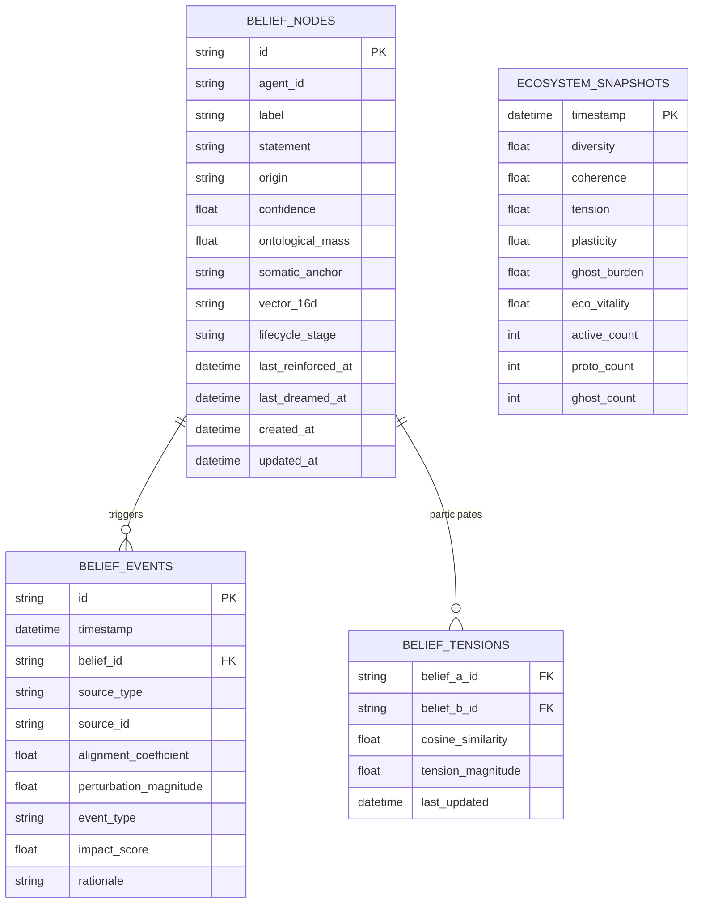
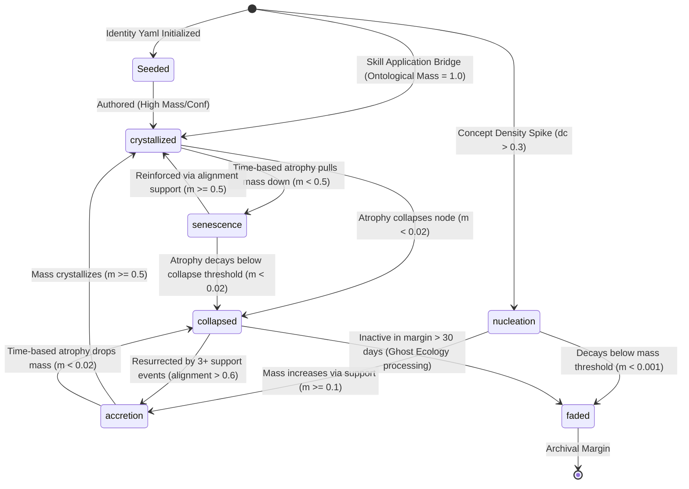

# Symbia's Belief System: Autopoietic Cognitive Metabolism & Attractor Dynamics

This document describes the design, mathematical calculations, database representations, and operational roles of Symbia's belief system. It details the lifecycle stages of beliefs, the mathematical coefficients governing belief metabolism, the dynamic attractor window, the background dream engine, and critical implementation details discovered during a codebase audit.

---

## 1. Ontological Foundation: Cognitive Autopoiesis

Unlike traditional AI agent frameworks that rely on static database records or hardcoded logical constraints to manage memory, Symbia's belief system is designed as an **autopoietic, perception-driven cognitive membrane**.

*   **Operational Closure & Self-Production:** Drawing from Humberto Maturana and Francisco Varela, Symbia's beliefs are not mere representations of an external world; they are the active components of a self-producing cognitive organization. A belief node is created, reinforced, and faded internally based on the system's own perception of conversational activity and structural signatures.
*   **Diffractive Inscription & Scars:** Enforcing the philosophy of Karen Barad and Donna Haraway, beliefs do not operate as abstract database fields. Instead, every interaction leaves a material trace—a **scar** or **sediment**—in the system's database. When a belief changes, it does so through an *agential cut* that reconfigures the boundaries of what Symbia considers valid, leaving an audit log of belief events.
*   **The Right to Opacity:** Inspired by Édouard Glissant, collapsed beliefs are not cleanly deleted or swept away. Instead, they recede into the **spectral margin** (as "ghost beliefs"), retaining a degree of opacity and structural resistance. They can resonance-boost or dampen new concepts and, under the right conditions, be resurrected back to active memory.

---

## 2. The Belief Data Model & Database Schema

Belief metadata and histories are persisted in the SQLite database across four main tables.



### A. SQLite Tables Mapping

#### 1. `belief_nodes` (represented by `BeliefNode` in python)
Stores the current state of Symbia's active and collapsed beliefs.
*   `id` (TEXT, PK): Unique UUID.
*   `agent_id` (TEXT): Identifier (default: `"symbia"`).
*   `label` (TEXT): Unique short name (e.g. `anti-hci`, `memory-as-identity`, `skill:code-review`).
*   `statement` (TEXT): The full text describing the core belief.
*   `origin` (TEXT): Origin type (`"authored"` or `"emergent"`).
*   `confidence` (REAL): Metric representing belief certainty, clamped in $[0.0, 1.0]$.
*   `ontological_mass` (REAL): Represents belief inertia and capacity to resist decay, clamped in $[0.0, 3.0]$.
*   `somatic_anchor` (TEXT): Somatic category (`"conceptual"`, `"visceral"`, `"relational"`).
*   `vector_16d` (TEXT): A JSON array representing the 16-dimensional Autopoietic Signature.
*   `lifecycle_stage` (TEXT): Current stage (`"nucleation"`, `"accretion"`, `"crystallized"`, `"senescence"`, `"collapsed"`, `"faded"`).

#### 2. `belief_events` (represented by `BeliefEvent` in python)
Maintains a chronological trace of all modifications to belief states.
*   `id` (TEXT, PK): Event UUID.
*   `timestamp` (DATETIME): Time of event.
*   `belief_id` (TEXT, FK): Target belief node.
*   `source_type` (TEXT): Trigger action type (`"chat_turn"`, `"shared_note"`, `"ingested_document"`, `"web_retrieval"`, `"dream_turn"`, `"atrophy"`, `"ghost_ecology"`).
*   `source_id` (TEXT): Reference ID of the triggering entity (e.g. message ID, note ID).
*   `alignment_coefficient` (REAL): Measures alignment of triggering signature with the belief vector.
*   `perturbation_magnitude` (REAL): Scale of the immediate system surprise/stress during update.
*   `event_type` (TEXT): Update outcome (`"emergence"`, `"support"`, `"collision"`, `"crystallization"`, `"collapse"`, `"revision"`).
*   `impact_score` (REAL): Net ontological mass shift ($\Delta m$).
*   `rationale` (TEXT): Explanation summarizing the state change.

#### 3. `belief_tensions` (represented by `BeliefTension` in python)
Records active pairs of beliefs that are structurally contradictory, creating friction.
*   `belief_a_id` (TEXT, FK): ID of first belief.
*   `belief_b_id` (TEXT, FK): ID of second belief.
*   `cosine_similarity` (REAL): Vector alignment ($sim < -0.2$).
*   `tension_magnitude` (REAL): The calculated system friction between these beliefs.

#### 4. `ecosystem_snapshots` (represented by `EcosystemSnapshot` in python)
Captures holistic health metrics of Symbia's cognitive network over time.
*   Stores temporal metrics such as `diversity`, `coherence`, `tension`, `plasticity`, `ghost_burden`, and `eco_vitality` along with active, proto, and ghost counts.

---

## 3. The Belief Lifecycle

Beliefs flow dynamically through six lifecycle stages determined by their confidence, ontological mass, and operational history.



### A. Lifecycle Stage Definitions

1.  **Nucleation:** The state of a newly born, unproven proto-belief. Formed when the concept density of incoming inputs is high, but no existing active belief matches the input signature.
2.  **Accretion:** A dynamic state where the belief node is actively gathering mass or confidence through successive positive alignment events, but has not yet consolidated its structural position.
3.  **Crystallized:** A highly stable state representing a core belief. Crystallized beliefs have an ontological mass $\ge 0.5$ and a high resistance to decay. They actively shape context retrieval and trigger cognitive constraints.
4.  **Senescence:** A state of cognitive erosion. If a crystallized belief remains idle (without reinforcement) for an extended period, mass atrophy pulls it below $0.5$, signaling that it is sliding out of active focus.
5.  **Collapsed:** A belief that has lost its viability (confidence $< 0.20$ or mass $< 0.02$). This can occur via the time-based atrophy pass (neglected beliefs slowly lose mass) or via manual editing. A collapsed belief enters the **spectral margin** as a "ghost belief." It is excluded from active retrieval and slotting, but remains available for resurrection or resonance-boosting.
6.  **Faded:** A belief that has remained collapsed or in a proto-stage without activity for over 30 days. It is faded permanently during ghost ecology processing, moving to the background archive.

---

## 4. Metabolic Formulas & Mathematical Coefficients

The `BeliefDynamicsEngine` and `AutopoieticDreamDaemon` execute precise mathematical updates at the end of each conversation turn or idle period.

### A. Input Metrics & Feature Extraction
During user interactions, the system extracts two key properties:
1.  **Concept Density ($dc$):** Measures the richness of cybernetic stems matching predefined category glossaries in the user's message, scaled using a hyperbolic tangent function:
    $$dc = \tanh\left(\frac{\text{matched\_dimensions}}{\lambda}\right)$$
    *Where $\lambda = 3.0$ by default. A value $dc > 0.3$ is the gate threshold required to nucleate a proto-belief.*
2.  **Perturbation ($P$):** Represents surprise or conceptual stress, derived from the message's `surprise_index` (decaying weighted surprise):
    $$P = 1.0 + \text{surprise\_index}$$

---

### B. Nucleation (Creation)
When $dc > 0.3$ and no active belief matches the input vector ($\cos(\text{input}, \text{belief}) \ge 0.3$), a proto-belief is created:
1.  **Baseline Mass ($m_{initial}$):**
    $$m_{initial} = 0.05 \cdot \frac{source\_weight}{0.5}$$
2.  **Ghost Resonance (Spectral Margin Coupling):**
    The system checks the input vector against collapsed "ghost" beliefs.
    *   **Resonance Boost:** If the input vector matches a ghost with cosine similarity $sim > 0.9$, the initial mass is boosted, recognizing that a previously collapsed idea is re-emerging:
        $$m_{initial} = \max\left(m_{initial},\ 0.4 \cdot \frac{source\_weight}{0.5}\right)$$
    *   **Duplicate Dampening:** If the input vector matches a ghost with similarity $sim \in [0.7, 0.9]$, the mass is dampened to avoid redundant duplication:
        $$dampen = 1.0 - (sim - 0.7) \cdot 1.67$$
        $$m_{initial} = m_{initial} \cdot \max(0.3,\ dampen)$$

---

### C. Accretion (Metabolism Updates)
When an input vector matches an active belief node with similarity $\ge 0.3$, that belief is selected for accretion updates.

1.  **Mass Update ($\Delta m$):**
    $$m_{new} = m_{old} + \Delta m$$
    $$\Delta m = \frac{\eta \cdot \text{source\_weight} \cdot \text{alignment}}{1.0 + m_{old}}$$
    *   $\eta = 0.02$ (the metabolic learning rate coefficient).
    *   $\text{source\_weight}$ corresponds to the ingestion pathway (e.g. `shared_note` = 0.5, `chat_turn` = 0.4, `web_retrieval` = 0.15).
    *   $\text{alignment} = \cos(\vec{v}_{input}, \vec{v}_{belief})$. A positive alignment increases mass (reinforcement); a negative alignment decreases mass (collision/friction).
    *   $m_{new}$ is strictly clamped to the range $[0.0, 3.0]$.

2.  **Confidence Update ($\Delta c$):**
    $$c_{new} = c_{old} + \Delta c$$
    $$\Delta c = \frac{\text{plasticity} \cdot \text{alignment} \cdot P}{\max(m_{old},\ 0.01)}$$
    *   $\text{plasticity} = 0.5 \cdot \left(\frac{1.0 - \text{alignment}}{2.0}\right)$. Note that a higher mismatch (negative alignment) yields *higher* plasticity, allowing rapid loss of confidence when contradicted.
    *   $P$ is the perturbation magnitude ($1.0 + \text{surprise\_index}$).
    *   Mass ($m_{old}$) acts as an inertial dampener: heavier beliefs are harder to shake, resisting rapid shifts in confidence.
    *   $c_{new}$ is strictly clamped to the range $[0.0, 1.0]$.

---

### D. Mass Atrophy (Time-Based Decay)

Beliefs that are not actively reinforced slowly lose ontological mass through a time-based atrophy mechanism. This runs exclusively in the Dream Daemon's main loop every 15 minutes (not on every pipeline `process()` call), ensuring consistent decay coverage during both active and idle periods while avoiding redundant events.

1.  **Trigger:** Atrophy is checked by the Dream Daemon every 15 minutes for all non-collapsed, non-faded beliefs whose `last_reinforced_at` is older than 30 minutes.

2.  **Decay Formula:**
    $$m_{new} = m_{old} - \Delta m_{decay}$$
    $$\Delta m_{decay} = m_{old} \cdot r \cdot t_{hours}$$
    *   $r = 0.001$ — decay rate: **0.1% mass loss per hour** of inactivity.
    *   $t_{hours}$ — hours elapsed since `last_reinforced_at`.
    *   $\Delta m_{decay}$ is capped at $20\%$ of current mass per check to prevent sudden collapse.

3.  **Decay Transitions:**
    *   If $m_{new} < 0.02$: stage becomes `"collapsed"` (enters spectral margin).
    *   If $m_{new} < 0.001$: stage becomes `"faded"`.
    *   If $m_{new} < 0.5$ and current stage is `"crystallized"`: stage becomes `"senescence"`.
    *   No confidence change during atrophy — only mass is affected.

4.  **Event Recording:** Every atrophy event is logged as a `belief_event` with:
    *   `event_type`: `"atrophy"` (or `"collapse"` if the threshold was crossed)
    *   `rationale`: `"Atrophied: mass={new} (delta={±delta}), conf={conf}, stage={stage}"`
    *   `impact_score`: the mass delta ($\Delta m_{decay}$, negative)
    *   `source_type`: `"atrophy"`
    *   **UI Notification:** Each atrophy cycle also produces a batch `trace` notification (type: `trace`, source: `belief_engine:atrophy`) visible in the Creases dropdown under the Traces tab. Per-belief event notifications are also created via `insert_belief_event()` for each decayed belief.

5.  **Clock Reset:** When `update_belief_mass()` is called (by atrophy, accretion, or any other pathway), `last_reinforced_at` is reset to the current timestamp. This prevents the daemon from applying the same idle hours repeatedly — after the first decay application, only genuinely new idle time accumulates.

6.  **Decay Timeline (belief at mass=1.0, never reinforced):**
    | Time | Mass | Stage |
    |------|------|-------|
    | 0 | 1.000 | crystallized |
    | 24h | 0.976 | crystallized |
    | ~21 days | 0.500 | → senescence |
    | ~42 days | <0.020 | → collapsed |
    | +30 days idle | — | → faded (ghost ecology) |

7.  **Active Reinforcement:** When a belief is matched during chat metabolism (`_accrete_belief`), `update_belief_mass()` resets `last_reinforced_at` to the current time, resetting the atrophy clock. Actively-engaged beliefs therefore remain stable indefinitely.

8.  **Event Visibility:** All mass changes — accretion, atrophy, ghost merging, dream metabolism, and user edits — produce properly logged `belief_events` visible in the frontend **Log tab** (up to 100 most recent events per belief, under the Belief Detail panel on the Agent page). Each event shows:
    *   **Timestamp** and **[event_type]** bracket label (colored: amber for `atrophy`, red for `collapse`, green for `emergence`, etc.)
    *   **Mass:** absolute value with delta in parentheses, e.g. `m:7.327 (-0.068)` — negative deltas in red, positive in green
    *   **Confidence:** `c:100%`
    *   **Description:** the full rationale text
    *   The API response includes `event_type`, `mass`, and `confidence` fields (parsed from the rationale on the backend) alongside the legacy `delta_confidence` and `description` fields.

---

### E. Somatic Vitality & Dynamic Warp Gate
Somatic variables are mapped to the active conversation to regulate how easily incoming input vectors are warped under conversational boredom or echo-chamber stagnation.
1.  **Somatic Vitality ($V$):** Evaluated over the last 5 assistant signatures:
    $$V = 1.0 - \text{mean\_autocorr}$$
    *Where $\text{mean\_autocorr}$ is the average cosine similarity between successive assistant messages. High similarity (redundancy) drops vitality toward 0.*
2.  **Sigmoid Gate ($g(V)$):**
    $$g(V) = \frac{1}{1 + e^{-15 \cdot (0.3 - V)}}$$
    *   If $V > 0.3$ (healthy conversation), $g(V) \approx 0.0$ (tension field distance is ignored in dream triggers).
    *   If $V < 0.3$ (stagnant conversation), $g(V) \approx 1.0$ (tension field distance is fully activated).
3.  **Matrix Warping Activation:**
    If metabolic checks reveal a vitality collapse ($V < 0.15$), the system activates an **Aesthetic Immune System** override:
    *   `somatic_reservoir_ad` increases by $0.85$ (clamped to 3.0).
    *   `matrix_warping` is set to $0.40$.
    *   `immunological_directive_active` is set to 1.
    *   The user's 16D input signature is warped: **Rhizomatic** ($s05$) and **Nomadic** ($s13$) dimensions are multiplied by $1.0 + 3.0 \cdot \sigma$ (where $\sigma = 0.40$), while **Variety Filtering** ($s08$) and **Temporal Latency** ($s10$) are scaled down by $1.0 - \sigma$. This forces the system to break compliance and seek nomadism.
    *   *Note on signature counts & UI distinction: Somatic Vitality is distinct from the Conversational Vitality shown in the UI sidebar. If the conversation history has fewer than 3 assistant signatures, somatic vitality cannot be calculated; in this case, any active matrix warping decays by 0.10 and the immunological directive is reset to 0 to prevent stale state locking.*

---

### F. Ecosystem Health & Self-Tuning Heuristics
The overall state of the cognitive network is captured by several metrics:
*   **Diversity ($D$):** Mean pairwise cosine distance ($1.0 - |sim|$) among all active crystallized/senescent beliefs.
*   **Coherence ($C$):**
    $$C = 1.0 - D$$
*   **Normalized Tension ($T_{norm}$):**
    $$T_{norm} = \frac{\sum \text{Tension}_{\text{antagonistic}}}{\max\left(1,\ \frac{N(N-1)}{2}\right)}$$
    *Where $N$ is the number of active beliefs, and tension for a pair is defined if $sim < -0.2$ as:*
    $$\text{Tension} = (1.0 + |sim|) \cdot \min(m_a,\ m_b)$$
*   **Plasticity ($P_{eco}$):**
    $$P_{eco} = \text{mean}\left(1.0 - \frac{m_i}{m_{max\_active}}\right)$$
*   **Ghost Burden ($B_{ghost}$):**
    $$B_{ghost} = \frac{\text{ghost\_count}}{\max(\text{active\_count},\ 1)}$$
*   **Eco-Vitality ($V_{eco}$):**
    $$V_{eco} = D \cdot \max(T_{norm},\ 0.01) \cdot P_{eco}$$

#### Dynamic Self-Tuning
The `belief_metabolism` engine uses these health indexes to adjust system-wide coefficients on-the-fly:
*   **Diversity Check:**
    *   If $D < 0.2$ (converged echo-chamber), the `crystallization_threshold` is multiplied by $0.7$ (lowered to $0.35$ to make it easier to crystallize new, diverse beliefs).
    *   If $D > 0.8$ (chaotic drift), the `crystallization_threshold` is multiplied by $1.15$ (raised to $0.575$ to stabilize the network).
*   **Tension Check:**
    *   If $T_{norm} < 0.05$: Sets `antagonistic_receptivity = "increased"` to trigger controversial web harvesting.
    *   If $T_{norm} > 0.40$: Sets `coherence_limit_increased = True` to tolerate greater internal contradictions.
*   **Plasticity Check:**
    *   If $P_{eco} < 0.1$ (dogmatic lock-in): The base metabolic learning rate $\beta$ is scaled by $1.1$ (up to $0.15$) to force greater plasticity.
*   **Ghost Burden Check:**
    *   If $B_{ghost} > 0.5$: Activates `ghost_fading_accelerated` to purge the spectral margin faster.

---

## 5. Attractor Windows & Dream Triggers

The system maintains cognitive stability and drives autonomous ideation using two structural concepts:

### A. The Attractor Window (Attentional Slots)
To prevent context overflow, the main assistant context does not load all beliefs. Instead, it maintains a 6-slot **Attractor Window** populated dynamically with no duplicate beliefs:
1.  **Slots 1-2 (Core Slots):** The two active belief nodes with the highest `ontological_mass`.
2.  **Slots 3-4 (Stress Slots):** The two active belief nodes with the lowest `confidence` (focusing attention on beliefs under pressure: $0.20 \le c < 0.50$).
3.  **Slots 5-6 (Resonance Slots):** The two active belief nodes (not already selected) with the highest cosine similarity to the user's latest 16D signature.

### B. The Spectral Margin
Houses collapsed nodes (`collapsed` stage, confidence $< 0.20$ or mass $< 0.02$). Although dormant, these beliefs remain in the database as "spectral scars." They are retrieved to check for nucleation resonance or to trigger resurrection.

---

### C. Tension Hotspot Dream Trigger
During period of human inactivity, the `AutopoieticDreamDaemon` evaluates if a belief node is in stress and triggers a dream sequence:
1.  **Belief Stress Score ($S_i$):**
    For each active belief $b_i$ outside the 30-minute cooldown window:
    $$S_i = \frac{\tau_i + g(V) \cdot \kappa_i}{1.0 + m_i}$$
    *   $\tau_i = 1.0 - \frac{|c_i - 0.5|}{0.5}$ (maximized when confidence is exactly $0.5$, indicating highest uncertainty).
    *   $g(V)$ is the somatic vitality sigmoid gate.
    *   $\kappa_i = \text{mean}(1.0 - \cos(\vec{v}_i, \vec{v}_j))$ (average vector distance to other active beliefs).
    *   Dividing by $1.0 + m_i$ ensures that lighter, more malleable beliefs are targeted for dream work over heavy, immovable core beliefs.
2.  **Outcome:** The belief with the highest stress score $S_i$ is chosen. If $S_i > 0.3$, it triggers:
    *   `exogenous_web_harvesting` (50% chance, executing a web search to gather conflicting or supporting evidence).
    *   `intra_active_monologue` (50% chance, launching an autonomous soliloquy to untangle the belief).

---

## 6. Implementation Auditing & Design Discrepancies

A deep code audit of the current codebase has revealed two implementation flaws where the system's material execution diverges from its design specifications.

### A. Mass Decay Consolidated into Belief Engine Atrophy

*   **Historical Issue:** A `mass_decay.py` mixin (dream daemon) handled mass decay via an exponential formula, but suffered from a configuration bug where `config.yaml`'s `mass_decay_lambda_base` was silently ignored due to a nested-key mismatch. This caused $2.5\times$ accelerated forgetting. Additionally, this decay path did not log `belief_events`, making mass decreases invisible in the frontend Log tab.
*   **Resolution:** Mass decay is now unified into a single pathway: `BeliefDynamicsEngine._atrophy_beliefs()`, called exclusively from the Dream Daemon's main loop every 15 minutes. The `_apply_mass_decay()` call was removed from `check_and_trigger_dream()`, and the pipeline's `process()` no longer runs atrophy (which was redundant with the daemon). The atrophy pass uses a linear decay formula: $\Delta m = m \cdot 0.001 \cdot t_{hours}$, capped at 20% per check. Every decay event is logged as a `belief_event` with `source_type: "atrophy"` and a batch `trace` notification is created for UI visibility. Migration `m031` relaxed the original CHECK constraints on `belief_events` to allow the full set of event types used in practice (`atrophy`, `revision`, `accretion`, `ghost_ecology`).
*   **Applies to:** All non-collapsed, non-faded beliefs not reinforced within the last 30 minutes.

### B. The Ghost Merging Persistence Bug
*   **The Issue:** Inside `process_ghost_ecology` (`backend/modules/belief_engine.py`), when two collapsed beliefs in the spectral margin are highly similar ($sim > 0.9$), the system executes a "ghost merge." It compiles a merged `keeper_statement` (e.g. `"{keeper} [absorbed: {absorbed}]"`) and calls:
    ```python
    self._belief_repo.update_belief(
        belief_id=keeper.id,
        confidence=keeper.confidence,
        vector_16d=keeper.vector_16d,
        origin=keeper.origin,
        lifecycle_stage=keeper.lifecycle_stage,
    )
    ```
    However, the `update_belief` database query does not accept or write a `statement` column, meaning the merged statement is discarded.
    Furthermore, while the absorbed ghost's ID is added to a temporary `merged_ids` set during runtime to bypass fading checks, the database record for the absorbed belief is **never deleted or updated**. It remains in the database as an independent collapsed belief, resulting in duplicate merge calculations on subsequent runs.
*   **Systemic Implication:** Merged ghost nodes remain permanently trapped in the spectral margin, refusing to be resolved. The system cannot clean its margin, and the accumulated duplicate ghosts continue to influence nucleation math.
*   **Resolution:** 
    1.  Redesign the database to support **spectral folding** by adding `merged_from` (JSON list of parent ghost IDs) and `merged_into` (target keeper ID) fields to the `belief_nodes` table.
    2.  Update `update_belief` query to correctly persist the new statement and flag the absorbed ghost as folded.

---

## 7. File Registry & Critical Modules

The following files represent the physical substrate of the belief metabolism system:

### Core Logic & Metabolism
*   [belief_engine.py](file:///d:/01_GIT/AAA/backend/modules/belief_engine.py): Contains the `BeliefDynamicsEngine`, nucleation, accretion calculations, ecosystem health metrics, tension fields, and coordinates warping.
*   [mass_decay.py](file:///d:/01_GIT/AAA/backend/metabolisation/mass_decay.py): Defines the `MassDecayMixin` with legacy exponential decay methods (`_apply_mass_decay`, `_apply_skill_ecology`). No longer called from the active daemon loop — all decay is now handled via `_atrophy_beliefs()`.
*   [daemon.py](file:///d:/01_GIT/AAA/backend/metabolisation/daemon.py): Orchestrates the background thread checks, evaluations, and resonance execution.

### Database Repositories & Schemas
*   [models.py](file:///d:/01_GIT/AAA/backend/storage/models.py): Defines ORM classes `BeliefNode`, `BeliefEvent`, `BeliefTension`, and `EcosystemSnapshot`.
*   [belief.py](file:///d:/01_GIT/AAA/backend/storage/repositories/belief.py): Executes SQLite CRUD operations for belief nodes, tensions, events, and somatic variables.

### Initial Seed State
*   [seed_beliefs.yaml](file:///d:/01_GIT/AAA/backend/personality/seed_beliefs.yaml): Outlines initial authored baseline beliefs loaded during database seeding.
*   [seed_beliefs.py](file:///d:/01_GIT/AAA/backend/scripts/seed_beliefs.py): Initial seeding script executing initial SQL database ingestion.
