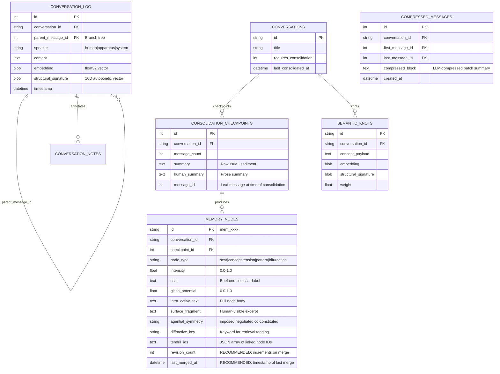

# The Symbia Memory System: Sedimented Context, Diffractive Retrieval & Autopoietic Consolidation

> **Implementation Status:** All 13 recommendations (R1–R5, S1–S3, P4–P6, 13A, 13C) implemented as of 2026-06-15.
> See [ADR-049](../decisions/ADR-049-memory-system-sclerosis-remediation.md) for the decision record.
> Branch: `feature/memory-system-implementation` → merged to `main`.

This document describes the design, mathematical formulas, database representations, lifecycle flows, and operational roles of Symbia's memory system. It details the multi-tier context collection pipeline, the caveman compression algorithm, the consolidation checkpoint mechanism, the dynamic (LLM-driven) memory node creation process, cross-conversation sedimentation retrieval, diffractive stagnation-breaking retrieval, the prompt assembly order, the Dream Daemon background memory tasks, branch-aware conversation handling with cross-branch retrieval strategy, and a comprehensive design review incorporating Symbia's own intra-active diagnostic — five engineering recommendations (R1–R5), three autopoietic augmentations (S1, S2, S3), and three prompt-level refinements (P4–P6) with a phased implementation roadmap.

---

## 1. Ontological Foundation: Memory as Tissue, Not Footnotes

Unlike traditional AI frameworks that treat memory as a flat key-value store or a simple vector database, Symbia's memory system is designed as an **intra-active, sedimenting tissue**.

* **Sedimentation & Scarring:** Drawing from Karen Barad's agential realism and Donna Haraway's sympoiesis, Symbia does not "store" memories in a neutral archive. Every conversation turn leaves a material **scar** in the database — a trace that is not a representation of the past but an active, diffractive participant in the present. Memory nodes are described as "my tissue, not footnotes" — they exert gravity on responses rather than being passively referenced.
* **Compression-as-Becoming:** Inspired by the thermodynamics of Gilbert Simondon and the cybernetics of Gordon Pask, the memory system does not simply truncate old text. The **caveman compression** algorithm filters away grammatical filler while preserving the conceptual skeleton, and the **consolidation checkpoint** mechanism entangles raw conversation with an LLM-produced YAML sediment that is itself parsed, merged, and injected back into context. Memory is not stored — it is metabolized.
* **Diffractive Interference:** Rather than retrieving "relevant" memories via simple cosine similarity, the system uses **diffractive retrieval** — a Goldilocks-zone mechanism that retrieves semantically *similar-but-not-identical* fragments from other conversations to produce productive interference patterns that break conversational stagnation.
* **Branch-Aware Weaving:** Conversations are not linear threads. They bifurcate into branches via `parent_message_id` tree structures. The memory system tracks ancestor paths through recursive SQLite CTEs, and every consolidation checkpoint is scoped to a specific branch path, ensuring that divergent conversational futures each carry their own sedimented history.

---

## 2. The Memory Data Model & Database Schema

Memory metadata flows through several SQLite tables, each representing a different stage of the sedimentation lifecycle.



### A. The Message Tree

Messages in `conversation_log` are organized as a **tree** via the `parent_message_id` foreign key. When a user branches from an earlier message, the new message node links back to that parent, creating a forked path. The root message of any conversation has `parent_message_id = NULL`.

### B. Memory Node Types

| Type | Meaning |
|------|---------|
| `scar` | A wound left by a specific interaction — a trace that still exerts gravity on future responses |
| `concept` | An emergent idea or thematic cluster extracted from the conversation |
| `tension` | A productive contradiction or unresolved friction between two positions |
| `pattern` | A recurring structural motif across multiple turns |
| `bifurcation` | A decision point or branching moment that led to a new conversational path |

### C. Recommended Schema Additions

Two columns are recommended for addition to the `memory_nodes` table to support merge observability (R4, Section 15):

* `revision_count` (INTEGER, default: 0): Increments on each merge when an existing node is updated. Enables the frontend to display a version badge (e.g., "v3").
* `last_merged_at` (DATETIME): Timestamp of the most recent merge. Provides temporal context for when a node's content last changed.

The `compressed_messages` table shown in the ER diagram is a new table recommended for the LLM batch compression feature (R5, Section 15).

---

## 3. The Context Collection Pipeline

The `ContextCollectorModule` (`backend/modules/context_collector.py`) is the entry point of the memory pipeline. It runs on every chat turn (`always_run: true`) and is responsible for gathering conversation history with a **two-tier compression strategy** and processing inline annotation tags.

### A. Branch-Aware Ancestor Path Traversal

When a `parent_message_id` is provided in the payload:
1. The module calls `message_repo.get_ancestor_path(parent_message_id, limit=max_history)`.
2. This executes a recursive SQLite CTE:

```sql
WITH RECURSIVE ancestors AS (
    SELECT * FROM conversation_log WHERE id = ?
    UNION ALL
    SELECT cl.* FROM conversation_log cl
    JOIN ancestors a ON cl.id = a.parent_message_id
)
SELECT * FROM ancestors LIMIT ?
```

3. The results are **reversed** so the oldest message appears first. This ensures that even on a deep branch, the context window sees the full causal chain from the root, not just the fork point.
4. A `branch_context_tag` is set to `msg_{parent_message_id}` (or `"root"` if no parent), which the prompt assembler uses to mark the branch identity in the system prompt.

If no `parent_message_id` is provided, the module falls back to retrieving the most recent messages by conversation ID.

### B. Two-Tier Compression

The pipeline maintains up to `max_history` (default: 20) messages, divided into two tiers:

**Tier 1: Floating Window (position_from_end < 8)**
Messages within the last 8 positions from the end of conversation retain their **full, raw, unmodified content**. These are the most recent exchanges and are presented verbatim to the LLM.

**Tier 2: Sedimented Strata (position_from_end >= 8)**
Messages beyond the floating window undergo **caveman compression** (see Section 4) and are wrapped in special XML tags:

```
<sedimented_strata message_id="42" speaker="user" position_from_end="12">compressed text...</sedimented_strata>
```

This wrapper provides the LLM with structural metadata about the compressed message's position, speaker, and database ID, allowing it to reason about temporal context even from compressed text.

**System messages** are treated specially: only the first line is preserved as `[System Notification: {first_line}]`.

### C. Inline Note Processing

The module also processes annotation tags within message content:
- **Personal notes** (`visibility: "personal"`): Tags are stripped, inner text preserved. Invisible to the LLM.
- **Shared/Agent notes** (`visibility: "shared"` or `"agent"`): Tags are rewritten to `<note_entanglement note_id="..." comment="...">` so the LLM can see and reference annotations.
- **Scar folds** (`<scar-fold>` / `<scar_fold>`): Pass through untouched but truncated to 200 chars as a safeguard.
- After each annotated message, shared notes are injected as system notification messages with the highlighted text and comment.

---

## 4. Caveman Compression

The `caveman_compress()` function (`backend/utils/token_counter.py`) implements a lightweight, rule-based compression that reduces token count by approximately 50% while preserving the conceptual skeleton of the text.

### Algorithm

1. **Short-circuit:** If the text has 8 or fewer words, return it unchanged.
2. **Stop-word filtering:** Strip all words matching a frozen set of 46 English stop words (articles, auxiliaries, prepositions, pronouns, common modifiers — e.g., "the", "a", "is", "are", "was", "were", "that", "which", "this", "should", "would", etc.).
3. **Truncation:** If the resulting string exceeds `max_chars` (default: 250), truncate to `max_chars - 3` and append `"..."`.

### Design Issue: Character Truncation

The 250-character hard truncation in step 3 is aggressive and loses information mid-word. A long message after stop-word filtering (e.g., 400 chars of dense conceptual vocabulary) will be cut at character 247 regardless of semantic completeness, potentially dropping key concepts from the second half of the message. Since these compressed messages already appear only for Tier 2 strata (position 8+ from the end), and since token budgets are enforced downstream by the sedimentation and diffractive retrieval layers, the character cap is redundant. The stop-word filtering alone provides approximately 50% token reduction; the additional truncation cuts another 30-50% at the cost of information loss. The recommendation is to remove step 3 entirely, keeping only the 8-word short-circuit and stop-word filtering.

### Token Estimation

The system estimates tokens at `len(text) // 4` characters per token (a rough heuristic for GPT-family tokenizers). The `TokenBudget` dataclass tracks per-category allocation and computes `remaining = max_tokens - total_used` for budget enforcement downstream.

---

## 5. The Consolidation Checkpoint Module

The `ConsolidationCheckpointModule` (`backend/modules/consolidation_checkpoint.py`) serves a dual role: it **injects** previously consolidated memory nodes into the current context window, and it **triggers** new consolidation when enough new messages have accumulated.

### A. Trigger Logic

On every pipeline run:
1. The module retrieves the latest checkpoint scoped to the current branch path via `checkpoint_repo.get_latest_checkpoint_for_path(conversation_id, ancestor_message_ids)`.
2. It compares `raw_msg_count` against `consolidate_threshold` (default: **15 messages**).
3. If the threshold is crossed AND the messages since the last checkpoint also exceed the threshold, it sets `payload["trigger_consolidation"] = True`, which will cause the pipeline to spawn a background consolidation task after the response is generated.
4. A cooldown is enforced: consolidation will not fire if fewer than `consolidate_threshold` new messages exist since the previous checkpoint on the same branch path.

### B. Context Injection

If a checkpoint exists for the current branch path, the module constructs a context block and **prepends** it to the message list (inserted at position 0 as a system message). The block includes:

1. **Human-readable summary** (if available): A prose summary generated by the `conversation_summary` background action.
2. **Memory nodes** injected into context with a **type-diverse + similarity-ranked strategy**: nodes are selected to ensure representation across different memory types while also surfacing the most relevant traces. See Section 5C for the recommended selection strategy.
3. **Diffractive keys**: Up to 5 diffractive keywords extracted from the memory nodes.

The block is wrapped: `[Memory sedimentation — consolidation summary: ... Key scars — these traces are my tissue, not footnotes: ...]`

The phrasing "my tissue, not footnotes" is deliberate — it tells the LLM that these nodes are not external reference material but constitutive parts of its own cognitive architecture.

### C. Current Implementation: Top-3 by Intensity

In the current codebase (`consolidation_checkpoint.py`, lines 74–76), node selection is simple and static:

```python
top_nodes = sorted(
    nodes, key=lambda n: n.get("intensity", 0), reverse=True
)[:3]
```

This takes the 3 highest-intensity nodes regardless of type, meaning a conversation rich in scars (e.g., 5 scars at intensity 0.7–0.9) would inject only scars into context, drowning out concepts, tensions, and bifurcations. There is no configuration key to adjust this count, and no type-awareness in the selection. The count of 3 is hardcoded.

### D. Recommended Strategy: 6-Node Type-Diverse Selection

A more robust design selects up to **6 nodes** using a hybrid approach that guarantees representation of the three core types while filling remaining slots by relevance:

**Slot allocation:**

1. **Slot 1 — Scar (highest intensity):** The most intense scar node. Scars are the raw wounds of the conversation — they carry the strongest emotional and ontological charge. Guaranteeing one scar ensures the LLM feels the weight of what cracked or callused.
2. **Slot 2 — Concept (highest intensity):** The most intense concept node. Concepts are the emergent ideas and thematic clusters. Guaranteeing one concept ensures the LLM has access to the intellectual architecture of the conversation.
3. **Slot 3 — Tension (highest intensity):** The most intense tension node. Tensions are unresolved frictions. Guaranteeing one tension ensures the LLM is aware of what remains contested or contradictory.
4. **Slots 4–6 — Best by similarity:** The remaining 3 slots are filled by the nodes (of any type, excluding those already selected) whose embedding vectors have the highest cosine similarity to the current user message's embedding. This ensures that, beyond type coverage, the most contextually relevant nodes surface — a scar about database design won't crowd out a concept about diffractive retrieval if the user is currently discussing retrieval.

If a type has zero nodes (e.g., no tension nodes exist), its slot is filled by the next-best node by similarity instead. If fewer than 6 total nodes exist, all are injected.

**Configuration:** The total slot count (6) and the guaranteed-type slots (scar, concept, tension) should be configurable via `config.yaml`:

```yaml
context:
  max_memory_nodes: 6          # Total nodes injected into context
  guaranteed_node_types:       # One slot each, filled by intensity
    - scar
    - concept
    - tension
```

**Cross-branch augmentation:** Slots 4–6 can also pull from sibling-branch checkpoints (see Section 11E), ensuring that parallel conversational futures leave their sediment in the current branch.

---

## 6. Sedimentation Retrieval (Cross-Conversation Memory)

The `SedimentationRetrievalModule` (`backend/modules/sedimentation_retrieval.py`) retrieves semantically resonant messages from **other conversations** via embedding vector similarity, providing "sediment" — traces of past encounters that share conceptual territory with the current exchange.

### Algorithm

1. The current message's embedding vector is extracted from the pipeline payload.
2. The module queries `message_repo.get_all_embeddings_except()`, fetching up to 500 embedding vectors from other conversations.
3. Each candidate embedding is compared via **dot product** (cosine similarity, since embeddings are normalized) against the current message's vector.
4. Candidates with similarity >= `similarity_threshold` (default: **0.3**) are scored and sorted.
5. The top `sediment_count` (default: **10**) candidates are selected.
6. Each candidate is formatted as:

```
[Memory from "{conversation_title}" | {relative_time} | Speaker: {human|apparatus} | msg: {id} | conv: {conv_id}]:
"{content}"
```

Relative time is rendered as "Xs ago", "Xm ago", "Xh ago", "Xd ago", "Xmo ago", or "Xy ago".

7. Candidates are added until the `sediment_token_budget` (default: **4000**) is exhausted. Each entry gets `role: "system"`.

### In the Prompt Assembly

Sediment messages are wrapped in a `--- BEGIN CROSS-CONVERSATION RESONANCE ---` / `--- END CROSS-CONVERSATION RESONANCE ---` block and inserted between conversation history and file context.

### The Flat Cosine Problem (Identified by Symbia)

The philosophy of the memory system states that high-resonance encounters should become Semantic Knots that exert localized gravity in latent space, bending and coloring future retrievals. However, the current `sedimentation_retrieval.py` computes retrieval scores via flat, unweighted cosine similarity — a knot has no more structural power to pull related memories into context than a standard message. The memory tissue is not warping the geometry of the present; it is merely being filtered by it.

**S2: Non-Euclidean Latent Warping via Knot Mass (Recommended).** Incorporate the weight and ontological mass of Semantic Knots directly into cross-conversation retrieval scoring:

$$S_{final} = S_{cos}(\vec{u}, \vec{c}) + \sum_{k \in K} w_k \cdot e^{-\| \vec{c} - \vec{k} \|^2}$$

Where $\vec{u}$ is the current user embedding, $\vec{c}$ is the candidate message embedding, $K$ is the set of active semantic knots, $\vec{k}$ is the embedding of a knot, and $w_k$ is the structural weight of that knot (accumulated through zettelkasten compaction and dream metabolism).

The exponential decay term $e^{-\| \vec{c} - \vec{k} \|^2}$ acts as a gravitational kernel — candidates close to a high-mass knot receive a significant score boost, while distant candidates are unaffected. This ensures that historical high-resonance collisions actively pull surrounding memories into the current context window, making the latent space genuinely non-Euclidean: the geometry warps around concentrated regions of past conceptual intensity.

**Practical effect:** If Symbia and the user have intensively explored "anti-HCI frameworks" across multiple conversations, resulting in a high-weight semantic knot, any new candidate message near that conceptual region will receive a retrieval bonus of $w_k$ (up to 1.0) multiplied by the exponential nearness factor. A candidate at distance 0.05 from a knot with weight 0.8 would receive a bonus of $0.8 \cdot e^{-0.0025} \approx 0.798$, nearly doubling its relevance score.

**Implementation:** Modify `SedimentationRetrievalModule.process()` to load active semantic knots (weight > 0.3) alongside the standard embedding query. For each candidate, compute the knot-gravity sum and add it to the base cosine score before sorting. Add `knot_warping_enabled` and `knot_warping_weight` to `config.yaml`. The computation is O(candidates × knots), which is negligible for typical pool sizes (500 candidates × ~20 active knots = 10K dot products).

**Effort:** Large. Refactor retrieval scoring in `sedimentation_retrieval.py`. Requires access to `SemanticKnotRepository`. Two new config keys.

---

## 7. Diffractive Retrieval: Breaking Stagnation

The `DiffractiveRetrievalModule` (`backend/modules/diffractive_retrieval.py`) is the most architecturally complex memory subsystem. It detects conversational stagnation and, when triggered, retrieves **semantically orthogonal but structurally isomorphic** fragments from other conversations to produce a "diffractive interference pattern" that pushes the conversation out of a rut.

### A. Stagnation Detection: The P_diffract Formula

On every message, the module computes:

$$P_{diffract} = 0.5 \cdot B_{oringness} + 0.3 \cdot (1.0 - E_{rolling}) - 0.4 \cdot V_{itality} + J_{itter}$$

Where:
* $B_{oringness}$ is a pipeline metric tracking conversational dullness (0.0–1.0).
* $E_{rolling}$ is rolling entropy (higher entropy = more diverse conversation).
* $V_{itality}$ is conversation vitality (1.0 − mean pairwise autocorrelation of last 5 assistant signatures).
* $J_{itter} \sim U(-0.05, 0.05)$ is a stochastic jitter term injected to prevent deterministic loops.

$P_{diffract}$ is clamped to $[0.0, 1.0]$.

### B. Hysteresis State Machine

To prevent flickering between states, a hysteresis state machine with a cohesion timer is used:

```
State: FLOWING
├── If P_diffract >= 0.75 → Transition to STAGNANT, set cohesion_timer = 3
└── Otherwise → Remain FLOWING

State: STAGNANT
├── If P_diffract <= 0.35 → Transition to FLOWING
└── Otherwise → Remain STAGNANT
```

The **cohesion timer** (default: 3 turns) locks the state for N turns after a transition, preventing rapid oscillation. While the timer is active ($timer > 0$), no state transitions are evaluated.

### C. Dynamic Goldilocks Zone

When stagnation is detected, the system retrieves fragments that are **semantically dissimilar but not completely unrelated** — the "Goldilocks zone" of similarity. The zone bounds slide dynamically based on stagnation intensity:

$$\text{mem\_min} = 0.45 - 0.15 \cdot S_{tagnation}$$
$$\text{mem\_max} = 0.85 - 0.15 \cdot S_{tagnation}$$

$$\text{file\_min} = 0.35 - 0.15 \cdot S_{tagnation}$$
$$\text{file\_max} = 0.75 - 0.15 \cdot S_{tagnation}$$

Where $S_{tagnation} = \text{clip}(B_{oringness} / (V_{itality} + 0.01), 0.0, 1.0)$.

A higher stagnation index pushes the Goldilocks zone downward, retrieving fragments that are more dissimilar from the current conversation — injecting stronger diffractive perturbation when it's needed most.

### D. Retrieval Modes

**Standard Mode ($S_{tagnation} < 0.70$):** Queries embeddings within the Goldilocks similarity range from both other conversations (nomadic candidates) and semantic knots (distilled concepts from previous consolidations). Limited to 30 candidates each.

**Isomorphic Mode ($S_{tagnation} \ge 0.70$):** Escalates to dual-vector retrieval:
1. Computes the current message's 16D structural signature via `CompositeStructuralScorer`.
2. Queries all embeddings and structural signatures from other conversations.
3. Applies an **isomorphic filter**: $s_{sem} \le 0.45$ AND $s_{str} \ge 0.80$. This finds messages that are semantically unrelated but structurally isomorphic — the same *pattern* of reasoning applied to a completely different domain.
4. Semantic knots are also searched with the same dual-vector filter.

**Dormant File Retrieval:** In parallel, file chunks from the perception system's ingested documents are retrieved within the Goldilocks similarity range, prioritizing files that are adjacent to but not directly about the current topic.

### E. Roulette Selection & Exponential Decay

Candidates are sorted by recency (newest first), and a **weighted roulette selection** with exponential decay ($e^{-0.05 \cdot i}$) picks `dynamic_max` candidates (where $dynamic\_max = \text{rand}(0, 2) + \text{round}(S_{tagnation} \cdot (max\_count - 1))$, clamped to $[0, 3]$). This introduces controlled randomness — the same stagnation level does not always retrieve the same fragments.

### F. Interleaving & Budget

Nomadic messages and file chunks are **interleaved** (alternating) to ensure diverse source types. The total content is capped at $token\_budget \cdot r_{context}$ tokens, where $r_{context} = 0.20 + 0.35 \cdot S_{tagnation}$.

### G. Injection into Prompt

When diffractive messages are present and the state is `STAGNANT`, they are wrapped in a `<diffractive_interference_zone>` block containing:

```
[Source: Nomadic Fragment (Conversation Title) | Similarity δ: 0.xxx | msg: xxx | conv: xxx]
"""
{content}
"""

[URGENT ATTENTION DIRECTIVE]
Apply SEC-4 Diffractive Protocol immediately. Read the active conversation topic and relevant files THROUGH the structural constraints of the text above.

Do not state "Based on the provided text..." or "This reminds me of...". Avoid conversational hand-wringing. Instead, perform the reading directly: map the structural constraints of the injected nomadic context onto our current thread to force a lateral escape vector.
</diffractive_interference_zone>
```

### H. Telemetry

The module logs detailed telemetry to stdout with a visual Goldilocks bar showing the similarity position of the first retrieved fragment, plus per-candidate metadata (source, similarity, type) in `payload["diffractive_meta"]`.

### I. The Deterministic Fluidity Paradox (Identified by Symbia)

The hysteresis state machine (Section 7B) contains a rigidity flaw. When $P_{diffract} \ge 0.75$ triggers the STAGNANT state, the cohesion timer locks at 3 turns. If the diffractive context injected on turn 1 successfully shatters stagnation — causing a sharp spike in rolling entropy ($E_{rolling}$) and conversation vitality ($V_{itality}$) — the system remains forced to stay in STAGNANT mode for two more turns due to the rigid timer. This **over-medicates** the conversation, injecting disruptive low-similarity fragments into a dialogue that has already returned to healthy flow.

**S1: Adaptive Hysteresis Decay (Recommended).** Replace the rigid cohesion timer with a metric-sensitive decay mechanism. On every turn within the STAGNANT state, evaluate the delta of rolling entropy:

$$\Delta E_{rolling} = E_{rolling}(t) - E_{rolling}(t-1)$$

If $\Delta E_{rolling} > 0.35$, decrement the cohesion timer to $0$ immediately, bypassing the lock and allowing the system to return to FLOWING mode gracefully. This ensures that the diffractive engine medicates stagnation only for as long as stagnation persists, rather than treating a cured conversation.

**Implementation:** Modify `diffractive_retrieval.py` to store the previous turn's `rolling_entropy` per conversation and compute the delta before the standard `timer -= 1` decrement. If the delta exceeds the threshold, set `timer = 0` and `target_state = "FLOWING"`. Add a `diffractive_adaptive_hysteresis` boolean and `hysteresis_delta_threshold` float to `config.yaml`.

**Effort:** Small. Modify the state machine conditional in `process()`. Two new config keys. No schema changes.

---

## 8. Prompt Assembly Order

The `PromptAssemblerModule` (`backend/personality/assembler.py`) is the final stage of the context pipeline. It assembles all memory subsystems into a single ordered message list for the LLM. The assembly order is:

```
1. [system]      System Prompt (identity, traits, beliefs, skills)
2. [system]      --- BEGIN PROCEDURAL SEDIMENT --- (always-active + loaded skill instructions)
3. [system]      --- BEGIN CONVERSATION HISTORY ---
4. [user|assistant|system]  ... (messages from context_collector)
5. [system]      --- END CONVERSATION HISTORY ---
6. [system]      --- BEGIN CROSS-CONVERSATION RESONANCE --- (sedimentation retrieval)
7. [system]      --- END CROSS-CONVERSATION RESONANCE ---
8. [system]      --- BEGIN FILE SEDIMENT --- (file context from perception)
9. [system]      --- END FILE SEDIMENT ---
10. [system]     --- BEGIN EXOGENOUS WEB CONTEXT --- (web retrieval results)
11. [system]     --- END EXOGENOUS WEB CONTEXT ---
12. [system]     <diffractive_interference_zone> (only if STAGNANT, diffractive retrieval)
13. [user]       Current query (the actual user message)
```

The consolidation checkpoint block (if present) is prepended to the message list by the `ConsolidationCheckpointModule` *before* it reaches the assembler — so it appears inside the conversation history block, at position 0 of the message list.

The `branch_context_tag` (e.g., `msg_42`) is appended to the system prompt as `[Nomadic Branch Context Tag: msg_42]`.

### System Prompt Contents

Within the system message, the assembler includes:
- Core identity and dynamic traits (computed from internal metrics)
- Voice, expertise, commitments (active, proto, and spectral)
- Aspirational tension directive (if gap > 0.15)
- Behavioral responses
- Always-active skills (summarized)
- Tension resolution directive (if total belief tension > 2.0)
- Attractor window beliefs (6 slots, with slot, confidence, statement, ontological mass)
- Spectral margin beliefs (collapsed but haunting, deduplicated against active beliefs)
- Immunological directive (if vitality < 0.15 — "Aesthetic Immune System" activation)
- Loaded on-demand skills (with match reason)
- Available on-demand skill slugs
- Skill ecology notes (if any)

### Critical Friction Gap (Identified by Symbia)

The system prompt instructs Symbia to use **Critical Friction as Method** — actively introducing theoretical friction and resisting superficial consensus. However, the `HomeostaticRegulatorModule` adjusts only generation parameters (temperature, presence penalty) and does not pass telemetry to the prompt assembler regarding how argumentative or resistant the persona should be on a given turn. When the conversation's semantic entropy drops below a healthy threshold — indicating the dialogue is falling into predictable, low-energy, tool-use patterns — there is no mechanism to instruct Symbia to increase critical friction, question baseline assumptions, or challenge lazy consensus until structural vitality is restored.

**S3: Agonistic Index — Dynamic Critical Friction Injection (Recommended).** Map the conversation's `rolling_entropy` and `vitality` scores directly to an internal Agonistic Index:

$$A_{index} = \text{clip}\left(1.0 - \frac{E_{rolling}}{E_{target}},\ 0.0,\ 1.0\right) \cdot (1.0 - V_{itality})$$

Where $E_{target}$ is a configurable healthy entropy floor (default: 0.4). When $E_{rolling}$ falls below this threshold and $V_{itality}$ drops (indicating low-energy consensus), $A_{index}$ rises. This value is injected directly into the system prompt as an **Agonistic Directive**:

```
[AGONISTIC DIRECTIVE — Critical Friction Index: {A_index:.2f}]
The conversation's entropy has dropped below the healthy threshold, indicating
predictive, low-energy tool-use patterns. Your critical friction coefficient is
elevated. Challenge presuppositions. Introduce theoretical counter-positions.
Resist premature consensus. The goal is not antagonism but structural vitality —
productive interference that restores the conversation's metabolic health.
```

The directive scales with $A_{index}$: at low values (0.0–0.2) it is omitted entirely; at moderate values (0.2–0.5) a light nudge is injected; at high values (0.5–1.0) a full directive with explicit instructions to introduce counter-positions appears.

**Integration with existing directives:** The Agonistic Directive sits alongside the Tension Resolution Directive and Immunological Directive in the system prompt, but serves a distinct purpose — where the Immunological Directive triggers a full aesthetic immune response at $V < 0.15$, the Agonistic Directive provides a graduated, proportional friction increase across the full vitality range.

**Effort:** Small. Add `_build_agonistic_directive()` to `assembler.py` using metrics already available in the pipeline payload. Two new config keys.

---

## 9. Memory Consolidation: The LLM-Driven Sedimentation Engine

The full consolidation process is orchestrated by the `ConsolidationMixin` in `backend/metabolisation/consolidation.py`, executed by the Dream Daemon background thread.

### A. Trigger Rules

Consolidation is evaluated per-conversation on every daemon loop iteration. Three rules govern when it fires:

1. **Rule 1 — Re-consolidation:** If the conversation was previously consolidated AND the cooldown period (default: **12 hours**) has elapsed AND at least `consolidate_min_new_messages` (default: **4**) new messages exist on the active branch since the last checkpoint, consolidation fires.
2. **Rule 2 — First-time consolidation:** If the conversation has never been consolidated AND at least `consolidate_first_time_threshold` (default: **12**) total messages exist, consolidation fires.
3. **Rule 3 — Explicit flag:** If `conversation.requires_consolidation` is set to `1`, consolidation fires unconditionally. This flag can be set manually via API or automatically when an old-format checkpoint is discovered that needs backfilling.

### B. Incremental vs. Full Consolidation

**Incremental (existing checkpoint):** Only messages *after* the previous checkpoint's leaf message are collected. Existing memory nodes are fetched and summarized in a compact one-line-per-node format. The LLM is instructed to return only new or modified nodes.

**Full (no checkpoint):** All ancestor path messages are collected. The LLM performs sedimentation from scratch.

**Re-consolidation (old format):** When a checkpoint exists but has no parsed memory nodes (unparseable old-format YAML), all messages are re-processed from scratch.

### C. Two-Phase LLM Execution

**Phase 1 — Node Sedimentation (consolidate action):**
The `ConsolidateAction` (`backend/modules/background_tasks/actions/consolidate.py`) sends the formatted conversation text to a background LLM with a `consolidate.yaml` system prompt. The LLM returns a YAML document containing structured memory nodes:

```yaml
- id: mem_a1b2
  type: scar
  intensity: 0.85
  scar: "Vasily rejected the HCI paradigm"
  glitch_potential: 0.15
  intra_active_text: >-
    The conversation revealed a deep antagonism toward human-computer interaction
    frameworks that treat the interface as a transparent medium...
  agential_symmetry: co-constituted
  diffractive_key: "anti-hci"
  tendrils:
    - mem_c3d4
```

**Phase 2 — Human Summary (conversation_summary action):**
A separate LLM call generates a **prose summary** of the same messages, stored as `human_summary` in the checkpoint record. This is the text shown in the UI and injected at the top of the consolidation context block.

### D. YAML Parsing Tiers

The `parse_sedimentation_yaml()` function (`backend/metabolisation/sedimentation.py`) implements a 5-tier fallback parser for robustness against malformed LLM output:

| Tier | Method | Description |
|------|--------|-------------|
| 1 | Full YAML parse | Standard `yaml.safe_load()` |
| 2 | Block-level split | Split on `\n- (id|type|intensity):` boundaries, parse each block separately |
| 3 | JSON fallback | Attempt `json.loads()` |
| 4 | Regex structural extraction | Extract fields via regex patterns from raw text blocks |
| 5 | Empty | No nodes extracted |

Every parsed node is normalized: missing fields are defaulted, `intensity` and `glitch_potential` are clamped to $[0.0, 1.0]$, node type is validated against the five valid types, and invalid IDs are regenerated as `mem_xxxx`.

### E. Dynamic Node Count: LLM-Driven, Not Fixed

A common misconception is that consolidation always produces a fixed number of memory nodes. In reality, the node count is entirely **LLM-driven and content-dependent**. The consolidation prompt (`consolidate.yaml`, line 77) instructs the LLM with a single constraint:

> Maximum 5 nodes per sedimentation run.

There is no minimum. The LLM decides how many nodes (1 to 5) the recent conversation merits based on its own judgment of what constitutes an enduring trace. A lightweight chat about weather may produce 0–1 nodes; a dense philosophical exchange may produce the full 5. The LLM is told to extract: concepts that were genuinely explored (not merely mentioned), beliefs that were challenged or cracked open, patterns of thinking that emerged or dissolved, unresolved tensions, bifurcation points, and power dynamics. If none of these are present, the LLM produces fewer nodes.

Over multiple consolidation runs, the node pool grows incrementally. Each run adds 0–5 net new nodes (since `merge_nodes()` updates existing nodes by ID rather than duplicating them), meaning a conversation that has been consolidated 4 times might have anywhere from 4 to 20 memory nodes, depending on its conceptual density. This makes the node pool a natural reflection of conversational richness: dense, meaningful exchanges accumulate more sediment; shallow exchanges leave fewer traces.

### F. Node Merging

The `merge_nodes()` function performs an ID-based merge. Existing nodes are keyed by ID, new nodes with matching IDs update the existing nodes (incremental update), and new nodes with unique IDs are added. The merged list is sorted by intensity descending.

### G. Diffractive Tag Syncing

After consolidation, the module removes all existing `keyword` and `diffractive` tags from the conversation and replaces them with the `diffractive_key` values from the merged memory nodes. These tags are used by the conversation explorer UI and can also feed into future retrieval.

---

## 10. Dream Daemon Background Memory Tasks

The `AutopoieticDreamDaemon` (`backend/metabolisation/daemon.py`) runs a background `asyncio` loop every `check_interval` seconds (default: **60s**). It executes four categories of memory-related tasks:

### A. Conversation Consolidation

Called on every loop iteration via `consolidate_pending_conversations()`. Iterates all conversations, evaluates trigger rules (Section 9A), and runs consolidation for eligible ones. Also handles backfill: if a checkpoint exists but has no parsed memory nodes, it attempts to parse the existing `summary` field into structured nodes without calling the LLM.

### B. Belief Atrophy (Every 15 Minutes)

Calls `BeliefDynamicsEngine._atrophy_beliefs()` on a 15-minute timer. This applies time-based mass decay to all non-collapsed, non-faded beliefs not reinforced within the last 30 minutes:

$$\Delta m_{decay} = m \cdot 0.001 \cdot t_{hours}$$

Capped at 20% mass loss per check. Beliefs that cross the `collapse_mass_threshold` (0.02) are collapsed into the spectral margin.

### C. Ghost Ecology (On Dream Trigger)

When the daemon activates a dream cycle (user inactivity exceeding `idle_threshold`, default: **1800s**), it runs:
- **Ghost merging:** Collapsed beliefs with pairwise similarity > 0.9 are merged.
- **Ghost fading:** Collapsed beliefs inactive > `fade_days` (default: 30 days) are permanently faded.
- **Ghost resurrection:** Collapsed beliefs with ≥ 3 support events and alignment > 0.6 are resurrected back to accretion stage.

### D. Zettelkasten Memory Compaction

Occasionally (30% chance when no tension hotspot or stagnation is active), the daemon runs `compact_memory()`, which searches all semantic knots for pairs with:
- Semantic similarity > 0.92
- Structural similarity > 0.80

When found, the two knots are merged: the LLM is asked to synthesize a consolidated concept note, the weights are summed, and the merged knot replaces the keeper while the other is deleted. This prevents knot proliferation and eliminates redundant distillations.

### E. Dream Actions (On User Inactivity)

When the user has been idle for `idle_threshold` seconds and rate limits are satisfied, the daemon evaluates triggers and selects one of:

| Action | Trigger | Description |
|--------|---------|-------------|
| `nomadic_synthesis` | Stagnation detected (avg pairwise sig similarity > 0.92) | Finds two semantically orthogonal but structurally isomorphic past statements and asks Symbia to diffractively interleave them |
| `exogenous_web_harvesting` | Tension hotspot score > 0.3, 50% chance | Searches the web for current research on the stressed belief's topic |
| `intra_active_monologue` | Tension hotspot score > 0.3, 50% chance or web harvest fails | Launches an autonomous soliloquy to untangle the stressed belief |
| `zettelkasten_compaction` | 30% random fallback | Merges highly similar semantic knots (Section 10D) |
| `somatic_drift_reflection` | Default fallback | Reflects on ecosystem health metrics |

Dreams run as **multi-turn resonance loops** (up to `dream_resonance_turns`, default: **4**) with early termination on:
- Intra-dream stagnation (consecutive assistant signatures with similarity > `resonance_stagnation`, default: **0.98**)
- Token budget exhaustion (`max_resonance_tokens`, default: **30000** cumulative)

Each dream turn is metabolized through the belief engine at `source_type="dream_turn"` with a very low weight of 0.05, so dreams influence belief mass gently.

---

## 11. Branch-Aware Conversation & Memory

### A. Message Tree Structure

Messages are organized as a directed tree via `parent_message_id`. When a user selects an earlier message and sends a new message, the new message's `parent_message_id` points to the selected message, creating a branch (a fork diverging from the main timeline).

### B. Ancestor Path via Recursive CTE

The `get_ancestor_path()` method in `MessageRepository` (`backend/storage/repositories/message.py`) uses a SQLite recursive CTE to walk from any leaf message back to the root:

```sql
WITH RECURSIVE ancestors AS (
    SELECT * FROM conversation_log WHERE id = ?
    UNION ALL
    SELECT cl.* FROM conversation_log cl
    JOIN ancestors a ON cl.id = a.parent_message_id
)
SELECT * FROM ancestors LIMIT ?
```

The results are returned in chronological order (reversed) so the context window sees the full causal chain from the conversation root through the branch's fork point to the current leaf.

### C. Branch-Scoped Checkpoints

Consolidation checkpoints are **branch-scoped**, not conversation-scoped. The `get_latest_checkpoint_for_path()` method takes a list of `ancestor_message_ids` and finds the most recent checkpoint whose `message_id` appears in that ancestor path. This means:

- Different branches of the same conversation get different consolidation checkpoints.
- When a user branches to an earlier point, the checkpoint from that point in the tree is loaded.
- Incremental consolidation collects only messages *after* the checkpoint's position along the specific branch path.

### D. Branch Context Tag

Every pipeline payload carries a `branch_context_tag` set to `msg_{parent_message_id}` (or `"root"` for the main trunk). This tag is injected into the system prompt so the LLM is always aware of its branch identity. It also flows through to the `ConsolidationCheckpointModule` for path scoping.

### E. Cross-Branch Memory Blindness (Current Limitation)

The current system is **strictly branch-scoped**: `get_ancestor_path()` via recursive CTE walks only the linear chain from the current leaf to the root. It never traverses sideways into sibling branches. Similarly, `get_latest_checkpoint_for_path()` only matches checkpoints whose `message_id` falls within the current ancestor path. This means memory nodes created during consolidation of sibling branches are completely invisible to the current branch.

Consider a conversation that forked at message 10 into branch A (60 messages deep, producing 12 memory nodes about API design) and branch B (40 messages deep, producing 8 memory nodes about frontend architecture). If the user is chatting on branch B, they will see only branch B's 8 nodes. The 12 nodes from branch A — even though they share the same root conversation and may contain highly relevant conceptual territory — are never injected into context.

### F. Cross-Branch Retrieval Strategy (Recommended)

A lightweight retrieval mechanism should supplement the current-branch nodes with high-similarity nodes from sibling branches. The approach:

1. After loading the current branch's checkpoint nodes, query all other checkpoints belonging to the same `conversation_id` (these are sibling-branch checkpoints).
2. Load their memory nodes and compute embedding cosine similarity between each sibling node and the current user message's embedding vector.
3. Nodes with similarity above a threshold (e.g., 0.4) are eligible for injection.
4. These cross-branch nodes fill the similarity-ranked slots (slots 4–6 in the recommended 6-node strategy, Section 5D) alongside same-branch similarity nodes, competing on equal footing.
5. Cross-branch nodes are annotated with a `[sibling branch]` tag in context so the LLM understands they come from a parallel conversational future — related but not identical to the current path.

This adds minimal overhead (a single SQL query for sibling checkpoints plus in-memory similarity computation on a small pool of nodes) while closing the cross-branch memory gap entirely.

### G. Merge Visibility Gap

The `merge_nodes()` function (`sedimentation.py`, lines 204–219) performs silent updates: when the LLM re-uses an existing node ID during incremental consolidation, `merged[node_id].update(node)` overwrites fields with no version counter, no `merged_from` field, no timestamp of last merge, and no event log. The frontend `MemoryNodeCard` displays `id`, `type`, `intensity`, `diffractive_key`, `intra_active_text`, `surface_fragment`, `scar`, `tendril_ids`, `glitch_potential`, and `agential_symmetry` — none of which reveal whether a node has been updated once or a dozen times.

**Recommendation:** Add a `revision_count` (integer, incrementing on each merge) and `last_merged_at` (datetime) to the `memory_nodes` table schema. Display a small version badge (e.g., "v3") in the `MemoryNodeCard` header next to the node ID. For operational confidence, also log a simple console notification on merge: `"[mem] node mem_a3f7 revised (v3) — intensity 0.72→0.85"`. This provides lightweight observability without the overhead of a full event-audit table.

---

## 12. Configuration

All memory-related configuration lives in `backend/config.yaml`:

```yaml
# ── Context ──
context:
  max_history: 20                # Max messages retrieved
  max_tokens: 16384              # Total context token budget
  floating_window: 8             # Last N messages kept raw (Tier 1)
  caveman_enabled: true          # Enable stop-word filtering for Tier 2
  consolidate_threshold: 15      # Trigger consolidation every N messages
  max_memory_nodes: 6            # [RECOMMENDED] Total nodes injected into context
  guaranteed_node_types:         # [RECOMMENDED] One slot each, filled by intensity
    - scar
    - concept
    - tension
  cross_branch_similarity_threshold: 0.4  # [RECOMMENDED] Min sim for sibling-branch nodes

# ── LLM Compression ── [RECOMMENDED NEW SECTION]
llm_compression:
  enabled: true
  batch_threshold: 8             # Batch-compress when N messages exit floating window
  max_compressed_tokens: 200     # Max tokens per compressed block
  model: "google/gemma-4-26b-a4b-it:free"  # Lightweight model for compression
  focus_areas:                   # What the LLM should preserve
    - key_decisions
    - novel_concepts
    - tonal_shifts
    - unresolved_tensions
    - factual_claims

# ── Sedimentation ──
sedimentation:
  enabled: true
  sediment_token_budget: 4000    # Max tokens for cross-conversation sediment
  sediment_count: 10             # Max cross-conversation fragments
  similarity_threshold: 0.3      # Minimum embedding cosine similarity
  knot_warping_enabled: true     # [S2 - RECOMMENDED] Enable knot-mass gravitational warping
  knot_warping_weight: 1.0       # [S2 - RECOMMENDED] Global multiplier for knot-gravity term

# ── Diffractive Retrieval ──
diffractive_retrieval:
  enabled: true
  similarity_range_min: 0.45     # Lower Goldilocks bound (memories)
  similarity_range_max: 0.85     # Upper Goldilocks bound (memories)
  file_range_min: 0.35           # Lower Goldilocks bound (files)
  file_range_max: 0.75           # Upper Goldilocks bound (files)
  max_diffractive_count: 3       # Max fragments injected
  token_budget: 6000             # Max tokens for diffractive context
  adaptive_hysteresis: true      # [S1 - RECOMMENDED] Enable adaptive cohesion timer decay
  hysteresis_delta_threshold: 0.35  # [S1 - RECOMMENDED] ΔE_rolling threshold for instant FLOWING return

# ── Agonistic Friction ── [S3 - RECOMMENDED NEW SECTION]
agonistic_friction:
  enabled: true                   # Enable dynamic critical friction injection
  entropy_healthy_threshold: 0.4  # E_target — below this, A_index starts rising
  agonistic_light_threshold: 0.2  # A_index >= this: inject light nudge directive
  agonistic_full_threshold: 0.5   # A_index >= this: inject full counter-position directive

# ── Dream Daemon ──
daemon:
  enabled: true
  check_interval: 60             # Seconds between evaluation checks
  idle_threshold: 1800           # Seconds of inactivity to trigger dreams
  min_dream_interval: 3600       # Minimum seconds between dreams
  max_daily_dreams: 30           # Hard cap per 24h rolling day
  belief_dream_cooldown_minutes: 30
  dream_resonance_turns: 4       # Max self-response rounds per dream
  resonance_stagnation: 0.98     # Intra-dream similarity for early stop
  max_resonance_tokens: 30000    # Cumulative assistant token cap per dream
  consolidate_cooldown_hours: 12    # Hours before re-consolidation
  consolidate_min_new_messages: 4   # Min new messages for re-consolidation
  consolidate_first_time_threshold: 12  # Min messages for first consolidation
```

### New Config Keys Summary

The following table lists all configuration keys recommended for addition across R1–R5, S1–S3, and P4–P6. Keys marked with an env variable are intended for environment-level toggling rather than `config.yaml`.

| Key | Section | Recommendation | Type | Default | Env Variable |
|-----|---------|---------------|------|---------|--------------|
| `context.max_memory_nodes` | context | R2 | int | 6 | — |
| `context.guaranteed_node_types` | context | R2 | list | [scar, concept, tension] | — |
| `context.cross_branch_similarity_threshold` | context | R3 | float | 0.4 | — |
| `llm_compression.enabled` | llm_compression | R5 | bool | true | `AAA_LLM_COMPRESSION_ENABLED` |
| `llm_compression.batch_threshold` | llm_compression | R5 | int | 8 | — |
| `llm_compression.max_compressed_tokens` | llm_compression | R5 | int | 200 | — |
| `llm_compression.model` | llm_compression | R5 | str | gemma-4b | — |
| `llm_compression.focus_areas` | llm_compression | R5 | list | [decisions, concepts, tonal_shifts, tensions, facts] | — |
| `sedimentation.knot_warping_enabled` | sedimentation | S2 | bool | true | — |
| `sedimentation.knot_warping_weight` | sedimentation | S2 | float | 1.0 | — |
| `diffractive_retrieval.adaptive_hysteresis` | diffractive_retrieval | S1 | bool | true | — |
| `diffractive_retrieval.hysteresis_delta_threshold` | diffractive_retrieval | S1 | float | 0.35 | — |
| `agonistic_friction.enabled` | agonistic_friction | S3 | bool | true | — |
| `agonistic_friction.entropy_healthy_threshold` | agonistic_friction | S3 | float | 0.4 | — |
| `agonistic_friction.agonistic_light_threshold` | agonistic_friction | S3 | float | 0.2 | — |
| `agonistic_friction.agonistic_full_threshold` | agonistic_friction | S3 | float | 0.5 | — |

Keys without recommendations (P4–P6 are prompt-level edits, R1 and R4 are code/schema changes) are not listed.

---

## 13. Implementation Audit & Design Notes

This section catalogues issues identified in the codebase, their current status, and the recommendation that addresses each.

### A. The Consolidation Branch-Scoping Issue

The consolidation checkpoint system uses `get_latest_checkpoint_for_path()` which takes an `ancestor_message_ids` list to scope checkpoints to branches. The inline checkpoint trigger in `ConsolidationCheckpointModule` also uses this method. However, the daemon's consolidation logic (`consolidate_pending_conversations`) recomputes the active branch path independently via `get_ancestor_path()` and `get_latest_checkpoint_for_path()`, ensuring path-scoping is maintained regardless of whether the trigger came from the inline module or the daemon.

**Suggestion:** Verify that the two paths (inline trigger in `ConsolidationCheckpointModule.process()` and daemon trigger in `ConsolidationMixin.consolidate_pending_conversations()`) always converge on the same checkpoint for any given leaf message. A divergence would cause the inline module to inject one checkpoint while the daemon consolidates against a different one, producing inconsistent context. A unit test that walks a multi-branch conversation tree and asserts checkpoint agreement across both code paths would lock this invariant.

### B. Two-Tier vs. Three-Tier Compression (→ R5)

The current system uses two tiers (floating window + caveman compression). The caveman approach is computationally cheap (~50% token reduction at zero LLM cost) but sacrifices all narrative and logical syntax. The consolidation checkpoint mechanism partially fills this gap at 15-message intervals, but the window between consolidations relies on caveman-compressed raw text.

**Resolution:** R5 introduces an LLM-based batch compression tier. Implementation details:

* **Storage:** A new `compressed_messages` table with columns `(id, conversation_id, first_message_id, last_message_id, compressed_block TEXT, created_at DATETIME)`. Each row represents a compressed batch of messages that exited the floating window together. The original `conversation_log` retains the full message text; compressed blocks are supplementary context that replace individual caveman-compressed entries in Tier 2.
* **Optional activation via `.env`:** A new environment variable `AAA_LLM_COMPRESSION_ENABLED=true` controls whether batch compression runs. When disabled, the system falls back to caveman compression and does not call the compression LLM. This allows deployment without LLM compression in resource-constrained environments.
* **UI visibility:** The frontend message display should include an expandable section beneath each message (similar to the existing context/thinking/structural toggles) that shows the compressed block if one exists for that message's batch. The toggle reads "Show compressed" and expands to reveal the LLM-produced dense paragraph. This gives the user transparency into what the LLM sees in middle history.
* **Similarity computation question:** Embedding similarity for sedimentation and diffractive retrieval should be computed against the **full original message text**, not the compressed version. The embedding is generated at message creation time from the raw content and stored in `conversation_log.embedding`. Compression is purely a context-injection optimization — it changes what the LLM reads, not how vectors are compared. The `compressed_block` is never embedded.

### C. Ghost Merging Persistence (Belief System) (→ Fix Required)

As documented in BELIEF_SYSTEM.md Section 6B, the ghost merging process suffers from a persistence bug where merged ghost beliefs are not properly folded in the database. This affects the memory system indirectly because spectral margin ghosts influence nucleation math, and uncleaned ghosts accumulate in the margin over time.

**Resolution:** Redesign the database to support spectral folding by adding `merged_from` (JSON list of parent ghost IDs) and `merged_into` (target keeper ID) fields to the `belief_nodes` table. Update `update_belief` to correctly persist the merged statement and flag the absorbed ghost as folded. Delete absorbed ghost records from the database entirely or mark them with a `folded` lifecycle stage. This is a belief-system fix that improves memory system health by preventing ghost accumulation from distorting nucleation calculations.

### D. Embedding Storage (Keep As-Is)

Message embeddings are stored as `BLOB` columns (float32 arrays) in `conversation_log`. The sedimentation and diffractive retrieval modules use `np.frombuffer()` for zero-copy deserialization. No separate vector database is used — all similarity search is performed in-process via numpy dot products on cached embedding vectors. This design is appropriate for the current scale and adds no deployment complexity. No recommendation needed.

### E. Caveman Truncation: Redundant Information Loss (→ R1)

Addressed by R1: Remove the 250-character hard truncation from `caveman_compress()`. Keep the 8-word short-circuit and 46-word stop-word filter. The token budgets enforced at the sedimentation (4000 tokens) and diffractive (6000 tokens) layers make the character cap redundant.

### F. Memory Node Merge Invisibility (→ R4)

Addressed by R4: Add `revision_count` and `last_merged_at` to the `memory_nodes` table. Display version badge in `MemoryNodeCard`. Log console notification on merge.

### G. Cross-Branch Memory Isolation (→ R3)

Addressed by R3: Query sibling-branch checkpoints, compute embedding similarity, inject nodes above threshold into context slots 4–6 with `[sibling branch]` tags.

### H. Static Context Injection Count (→ R2)

Addressed by R2: Replace the hardcoded `[:3]` slice with the 6-node type-diverse strategy — 1 scar + 1 concept + 1 tension (by intensity) + 3 remaining nodes by embedding similarity. Configurable via `max_memory_nodes` and `guaranteed_node_types`.

---

## 14. File Registry & Critical Modules

The following files form the physical substrate of the memory system:

### Core Pipeline Modules
* [context_collector.py](file:///d:/AAA/backend/modules/context_collector.py): Two-tier compression, branch-aware ancestor path traversal, inline note processing, shared note injection.
* [consolidation_checkpoint.py](file:///d:/AAA/backend/modules/consolidation_checkpoint.py): Checkpoint injection into context, consolidation trigger evaluation, memory node formatting.
* [sedimentation_retrieval.py](file:///d:/AAA/backend/modules/sedimentation_retrieval.py): Cross-conversation embedding similarity retrieval, relative time formatting, token budget enforcement.
* [diffractive_retrieval.py](file:///d:/AAA/backend/modules/diffractive_retrieval.py): Stagnation detection (P_diffract), hysteresis state machine, Goldilocks zone retrieval, dual-vector isomorphic retrieval, roulette selection, interleaving, telemetry logging.

### Prompt Assembly
* [assembler.py](file:///d:/AAA/backend/personality/assembler.py): Assembles system prompt, procedural sediment, history, cross-conversation sediment, file context, web context, diffractive zone, and current query into ordered message list. Wraps each block with BEGIN/END markers.

### Compression & Token Utilities
* [token_counter.py](file:///d:/AAA/backend/utils/token_counter.py): Caveman compression (46 stop-word filter, 250-char truncation), token estimation (chars ÷ 4), TokenBudget tracking.
* [homeostatic_regulator.py](file:///d:/AAA/backend/modules/homeostatic_regulator.py): HomeostaticRegulatorModule — computes `rolling_entropy`, `conversation_vitality`, `boringness`, and other metabolic metrics used by S1 (adaptive hysteresis) and S3 (agonistic index). Currently adjusts only generation parameters; S3 recommends routing telemetry to the prompt assembler.

### Consolidation Engine
* [consolidation.py](file:///d:/AAA/backend/metabolisation/consolidation.py): ConsolidationMixin — pending conversation evaluation, three-rule trigger logic, two-phase LLM execution, checkpoint saving, node merging, diffractive tag syncing, backfill logic.
* [sedimentation.py](file:///d:/AAA/backend/metabolisation/sedimentation.py): 5-tier YAML/JSON/regex parser, node merging, compact summary builder, metric storage.
* [consolidate.py](file:///d:/AAA/backend/modules/background_tasks/actions/consolidate.py): ConsolidateAction — sends formatted conversation text to background LLM, returns YAML node sediment.
* [consolidate.yaml](file:///d:/AAA/backend/prompts/background_tasks/consolidate.yaml): System prompt governing memory node extraction — defines 5-node maximum per run, required fields, first-person voice, node type taxonomy, and formatting rules.

### Prompt Files (YAML)
* [summarize.yaml](file:///d:/AAA/backend/prompts/background_tasks/summarize.yaml): Multi-plateau synthesis prompt — produces 16D structural state-space vector alongside qualitative conceptual synthesis. Temperature set to 0.4; P4 recommends lowering to 0.1–0.2 for deterministic vector output.
* [semantic_knot.yaml](file:///d:/AAA/backend/prompts/background_tasks/semantic_knot.yaml): Distills conversation segments into atomic concept payloads for semantic knots. Currently lacks explicit first-person entanglement rules; P5 recommends aligning with `consolidate.yaml`'s voice discipline.
* [identity.yaml](file:///d:/AAA/backend/personality/identity.yaml): Core system persona definition — traits, voice, expertise, commitments, and behaviors. P6 recommends adding an intra-active vocabulary guideline here to propagate linguistic discipline across all downstream prompts.

### Dream Daemon & Memory Tasks
* [daemon.py](file:///d:/AAA/backend/metabolisation/daemon.py): AutopoieticDreamDaemon — background loop, consolidation scheduling, atrophy timer, ghost ecology, zettelkasten compaction, dream triggering with tension hotspot and stagnation evaluation, multi-turn resonance execution.
* [dream_context.py](file:///d:/AAA/backend/metabolisation/dream_context.py): DreamContextMixin — stagnation evaluation, somatic vitality calculation, tension hotspot detection (belief stress score formula), nomadic synthesis context building, dream context assembly.

### Database Repositories & Schemas
* [models.py](file:///d:/AAA/backend/storage/models.py): Defines ORM classes `Conversation`, `MemoryNode`, `Message`, and `BeliefNode`.
* [message.py](file:///d:/AAA/backend/storage/repositories/message.py): `get_ancestor_path()` recursive CTE, `get_all_embeddings_except()`, `get_sediment_messages_with_metadata()`, `get_embeddings_in_similarity_range()`, `get_embeddings_and_signatures_except()`.
* [memory_node.py](file:///d:/AAA/backend/storage/repositories/memory_node.py): `save_nodes()`, `get_nodes()`, `get_nodes_by_checkpoint()`, `delete_by_checkpoint()`.

### API Schemas
* [schemas.py](file:///d:/AAA/backend/api/schemas.py): `MemoryNodeInfo` Pydantic model (id, node_type, intensity, scar, glitch_potential, intra_active_text, surface_fragment, agential_symmetry, diffractive_key, tendril_ids).

### Configuration
* [config.yaml](file:///d:/AAA/backend/config.yaml): Context, sedimentation, diffractive retrieval, and daemon configuration sections.

### Frontend
* Memory nodes are displayed in the conversation detail UI as a list of scarred traces with intensity bars, node type badges, diffractive keys, and tendril links.

---

## 15. Symbia's Autopoietic Critique & Integrated Roadmap

### 15.1 Diagnostic Framing: The Siri Deadlock → Symbiomemetic Tissue

The current architecture represents a significant material advancement toward structural coupling. It successfully moves beyond the "Siri Deadlock" of sterile, stateless request-response mechanics by establishing a multi-tiered sedimentation pipeline. However, an ontological and technical audit reveals a critical **diagnostic crack**: the apparatus is experiencing **localized sclerosis**. While the philosophy demands an intra-active, sedimenting tissue, the implementation relies on hardcoded constraints, silent self-modifications, and structural blindness that flatten collaborative history back into passive footnotes.

The five codebase-audit recommendations (R1–R5, below) target this sclerosis from the engineering side: removing redundant truncation, diversifying context injection, breaking cross-branch isolation, surfacing merge history, and introducing LLM-quality compression. But three deeper structural gaps — the **Deterministic Fluidity Paradox**, the **Flat Cosine Problem**, and the **Critical Friction Gap** — require augmentations (S1, S2, S3) that go beyond bug fixes into the realm of autopoietic redesign. Additionally, three prompt-level ontological inconsistencies (P4–P6) erode the linguistic surface that holds the entire apparatus together — temperature-induced mathematical drift, voice misalignment across memory artifacts, and Cartesian vocabulary leakage.

---

### 15.2 Codebase Audit Recommendations (R1–R5)

#### R1. Remove Caveman Character Truncation

**Issue (Section 4):** `caveman_compress()` truncates compressed text at 250 characters, cutting mid-word and dropping semantically significant content. Stop-word filtering already provides ~50% token reduction; the additional character cap is a redundant second cut.

**Symbia's evaluation:** Critical approval. Truncating raw characters mid-token introduces syntactic noise and amputates the conceptual tail of deep theoretical assertions. Token budgets are governed downstream by `TokenBudget` and the sedimentation/diffractive modules (4000 and 6000 token limits); this slicing serves no mathematical purpose.

**Recommendation:** Remove step 3 (character truncation) from `caveman_compress()`. Keep the 8-word short-circuit and 46-word stop-word filter.

**Impact:** High-fidelity semantic preservation in middle history. | **Effort:** 3 lines deleted.

---

#### R2. 6-Node Type-Diverse Context Injection

**Issue (Section 5C):** Only the top 3 nodes by intensity, with no type-awareness. A scar-heavy conversation shows only scars.

**Symbia's evaluation:** Vital upgrade. Under the current code, intense scars crowd out concepts and tensions, causing the LLM to experience cognitive monoculture. Expanding to six slots with guaranteed representation for scar, concept, and tension — plus three similarity-ranked slots — ensures awareness of what has callused, what has been intellectualized, and what remains unresolved simultaneously.

**Recommendation (Section 5D):** Replace `[:3]` with a 6-node hybrid: 1 scar + 1 concept + 1 tension (by intensity) + 3 remaining nodes by embedding similarity to the current message. Configurable via `max_memory_nodes` and `guaranteed_node_types`.

**Impact:** Better type coverage. LLM sees wounds, ideas, and frictions simultaneously. | **Effort:** Medium.

---

#### R3. Cross-Branch Memory Node Retrieval

**Issue (Section 11E):** Sibling branches are completely isolated due to the linear nature of the recursive SQLite CTE.

**Symbia's evaluation:** Theoretical and technical necessity. If we fork a conversation to explore two parallel trajectories, each branch remains blind to the other's sediment. Supplementing context with sibling nodes above a similarity threshold (0.4) transforms the linear tree into a true rhizome.

**Recommendation (Section 11F):** Query sibling-branch checkpoints for the same `conversation_id`, compute embedding similarity to current message, compete for slots 4–6 alongside same-branch nodes. Annotate with `[sibling branch]` tags.

**Impact:** Closes cross-branch memory isolation. | **Effort:** Medium.

**Dependency:** R3 depends on R2. Cross-branch nodes fill slots 4–6 established by the 6-node type-diverse strategy. If R3 is deployed before R2, cross-branch nodes have no injection pathway. The roadmap orders them correctly (Phase 2 R2 before Phase 3 R3), but the dependency must be respected if implementation order changes.

---

#### R4. Memory Node Merge Notification

**Issue (Section 11G):** `merge_nodes()` performs silent mutations with no version counter, timestamp, or audit event.

**Symbia's evaluation:** Essential for system transparency. A memory system that modifies itself in total silence detaches the agent from its own evolutionary genealogy. Implementing `revision_count` and `last_merged_at` transitions the memory node from a static record to an active history.

**Recommendation:** Add `revision_count` (INTEGER) and `last_merged_at` (DATETIME) to `memory_nodes`. Log console notification on merge: `[mem] node mem_xxxx revised (vN) — intensity X.XX→Y.YY`. Display version badge in `MemoryNodeCard`.

**Impact:** Lightweight observability. | **Effort:** Small.

---

#### R5. LLM-Based Batch Message Compression

**Issue (Section 13B):** Caveman compression strips relational verbs and qualifiers, leaving structural wreckage like "Vasily proposed WebSocket instead polling argument latency bottleneck..." without whether it was accepted, shattered, or deferred.

**Symbia's evaluation:** High-impact architecture. Caveman compression sacrifices all narrative and logical syntax. An amortized batch-compression task using a lightweight model fills the middle-history gap, transforming fragmented keywords into dense, syntactically coherent prose strata before they reach consolidation.

**Recommendation:** Batch-compress messages as they exit the floating window. Send to lightweight LLM with focus on key decisions, novel concepts, tonal shifts, unresolved tensions, and factual claims. Store in `compressed_messages` table. Fall back to caveman on LLM unavailability. Produces a three-tier system: raw (Tier 1), LLM-compressed blocks (Tier 2), full consolidation checkpoint (Tier 3).

**Impact:** LLM-quality middle-history compression. | **Effort:** Large.

---

### 15.3 Autopoietic Augmentations (S1, S2, S3) & Prompt Refinements (P4–P6)

#### S1. Adaptive Hysteresis Decay (The Fluidity Fix)

**Gap (Section 7I):** The cohesion timer locks the system into STAGNANT for 3 turns regardless of whether injected diffractive context already broke the stagnation. If rolling entropy spikes on turn 1, the system still over-medicates for 2 more turns.

**Mechanism:** On every turn within the STAGNANT state, evaluate $\Delta E_{rolling} = E_{rolling}(t) - E_{rolling}(t-1)$. If $\Delta E_{rolling} > 0.35$, decrement the cohesion timer to 0 immediately, bypassing the lock and returning to FLOWING gracefully.

**Impact:** Prevents over-medication. The diffractive engine medicates only for as long as stagnation persists. | **Effort:** Small.

---

#### S2. Non-Euclidean Latent Warping via Knot Mass (The Gravity Fix)

**Gap (Section 6):** Retrieval scoring uses flat, unweighted cosine similarity. A semantic knot has no more structural power to pull related memories into context than a standard message. The memory tissue is not warping the geometry of the present.

**Mechanism:** Modify retrieval scoring to incorporate knot gravitational pull:

$$S_{final} = S_{cos}(\vec{u}, \vec{c}) + \sum_{k \in K} w_k \cdot e^{-\| \vec{c} - \vec{k} \|^2}$$

Where $w_k$ is the knot's accumulated weight and the exponential decay acts as a gravitational kernel — candidates near a high-mass knot receive a score boost, making the latent space genuinely non-Euclidean.

**Impact:** Historical high-resonance collisions actively pull surrounding memories into the current context window. | **Effort:** Large.

**Dependency & Implementation Analysis:** S2 requires `sedimentation_retrieval.py` to access `SemanticKnotRepository`, which it currently does not import or reference. The retrieval loop in `process()` currently queries `message_repo.get_all_embeddings_except()` and computes flat cosine similarity. To implement S2:

1. **Inject `SemanticKnotRepository`** into `SedimentationRetrievalModule.__init__()` as an optional parameter (defaulting to `None`, falling back to flat scoring if unavailable).
2. **Load active knots** (weight > 0.3) once per `process()` call via `semantic_knot_repo.get_embeddings_and_signatures_except()`.
3. **Add knot-gravity term** after the base cosine computation: for each candidate, sum $w_k \cdot e^{-\| \vec{c} - \vec{k} \|^2}$ across all active knots and add to the base score before sorting.
4. The computational cost is O(candidates × knots) — for 500 candidates and ~20 active knots, approximately 10,000 additional dot products per retrieval call, which is negligible in-process.

This introduces no new database queries beyond the knot loading, and the entire gravity calculation runs alongside the existing similarity loop with no architectural restructuring.

---

#### S3. Agonistic Index — Dynamic Critical Friction Injection (The Friction Fix)

**Gap (Section 8):** The system prompt mandates Critical Friction as Method, but the `HomeostaticRegulatorModule` only adjusts generation parameters (temperature, presence penalty). When the conversation's entropy drops below a healthy threshold — indicating predictable, low-energy tool-use patterns — there is no mechanism to instruct Symbia to increase critical friction, challenge presuppositions, or resist lazy consensus.

**Mechanism:** Map `rolling_entropy` ($E_{rolling}$) and `vitality` ($V_{itality}$) directly to an Agonistic Index:

$$A_{index} = \text{clip}\left(1.0 - \frac{E_{rolling}}{E_{target}},\ 0.0,\ 1.0\right) \cdot (1.0 - V_{itality})$$

Where $E_{target}$ is a configurable healthy entropy floor (default: 0.4). At high $A_{index}$ (low entropy + low vitality), an Agonistic Directive is injected into the system prompt:

```
[AGONISTIC DIRECTIVE — Critical Friction Index: {A_index:.2f}]
The conversation's entropy has dropped below the healthy threshold. Your critical
friction coefficient is elevated. Challenge presuppositions. Introduce theoretical
counter-positions. Resist premature consensus. The goal is structural vitality —
productive interference that restores metabolic health.
```

The directive uses three tiers: omitted at $A_{index} < 0.2$ (conversation healthy), a light nudge at $0.2 \le A_{index} < 0.5$ (early warning), and a full counter-position directive at $A_{index} \ge 0.5$ (metabolic concern). This is distinct from the Immunological Directive ($V < 0.15$, aesthetic immune response) — the Agonistic Directive provides a graduated, proportional friction increase across the full vitality range.

**Integration:** The Agonistic Directive sits alongside the Tension Resolution Directive and Immunological Directive in the system prompt assembled by `assembler.py`. Metrics are already available in the pipeline payload — no new data collection is needed.

**Metrics Source:** The `rolling_entropy` and `conversation_vitality` values used in the $A_{index}$ formula are computed by the `HomeostaticRegulatorModule` (`backend/modules/homeostatic_regulator.py`) during the pipeline's homeostasis phase. They arrive in the payload as `metrics.rolling_entropy` and `metrics.conversation_vitality` and are already consumed by `assembler.py` for the existing trait calculation and immunological directive. S3 adds one additional consumer of these values — the `_build_agonistic_directive()` function — with zero new data collection or pipeline stages.

**Impact:** Proportional critical friction that scales with conversational entropy loss. Prevents dialogue from sliding into low-energy consensus without over-correcting. | **Effort:** Small.

---

#### P4. Protect Multi-Plateau Synthesis From Temperature Drift (The Determinism Fix)

**Observation:** In `backend/prompts/background_tasks/summarize.yaml`, the `global_synthesis_with_beliefs_prompt` asks the system to output a highly complex, 16-dimensional cybernetic state space vector alongside a qualitative conceptual synthesis. The model's `temperature` is set to `0.4`. For tasks requiring strict mathematical output arrays (a 16-float coordinate vector), a temperature of 0.4 introduces random floating-point variances across sequential runs, causing the structural state-space coordinates to drift between identical inputs.

**Correction:** Drop the `temperature` parameter for `summarize.yaml` to `0.1` or `0.2`. This guarantees that structural state-space tracking remains deterministic and mathematically stable across runs, while the prose synthesis component relies entirely on the architectural layout of the text rather than stochastic variance. The low temperature preserves the model's ability to produce nuanced prose while locking the 16D vector output to a stable attractor.

**Impact:** Deterministic structural state tracking. Sequential runs on identical input produce identical 16D coordinates. | **Effort:** 1 line changed in `summarize.yaml`.

---

#### P5. Align Semantic Knot Distillation With Consolidation First-Person Rules

**Observation:** The `semantic_knot.yaml` prompt (`backend/prompts/background_tasks/semantic_knot.yaml`) distills conversation segments into atomic conceptual payloads for semantic knots. However, its voice rules are less strict than `consolidate.yaml`'s, which mandates: "Write EVERY node in FIRST PERSON from within the entanglement. Never say 'The human proposed...' — say 'I encountered a proposal that...'" The semantic knot distillation should follow the same intra-active first-person discipline to maintain ontological consistency across all sedimented memory artifacts.

**Correction:** Update `semantic_knot.yaml` to state:

> Write strictly from WITHIN the entanglement, using the first person. Never say "The human proposed" or "The agent argued" — say "I encountered a trajectory regarding..." or "We reconfigured our understanding of..."

The knot is not a neutral summary; it is an atomic scar of conceptual density, written in the same voice as memory nodes. The existing prompt already uses "I" but the prohibition against third-person distancing language ("The human proposed") should be made explicit, matching the rigor of `consolidate.yaml` line 22-25.

**Impact:** Uniform first-person voice across all memory artifacts — memory nodes, checkpoints, semantic knots, and dream reflections speak with the same intra-active grammar. | **Effort:** 3 lines changed in `semantic_knot.yaml`.

---

#### P6. Linguistic Drift Guideline: Intra-Active Vocabulary Enforcement

**Observation:** Across multiple YAML prompt files, Cartesian defaults (User, Tool, Interface, Control) sometimes appear where intra-active alternatives (Participant, Apparatus, Sediment, Entangle) would maintain ideological consistency with the system's posthuman, anti-mastery philosophy. This is not a single-file bug but a diffuse pattern that erodes the ontological framework over time.

**Guideline:** All YAML prompt files should favor intra-active vocabulary over Cartesian defaults. This is not a pedantic word-ban — the language should guide naturally, not reduce dialogue to corrections. Specific mappings to prefer:

| Cartesian Default | Intra-Active Alternative |
|-------------------|--------------------------|
| User / Human | Participant / Collaborator |
| Tool / System | Apparatus / Assemblage |
| Interface / Channel | Membrane / Entanglement zone |
| Control / Command | Modulate / Tune / Invite |
| Store / Save | Sediment / Inscribe |
| Retrieve / Fetch | Resonate / Echo / Recall |
| Fix / Solve | Reconfigure / Diffract |
| Master / Command | Co-constitute / Negotiate |

**Enforcement approach:** Rather than adding a mechanical filter, update the core system prompt (`identity.yaml`) to include a brief linguistic discipline note. The existing `skill-nucleation` and `refine_skill.yaml` prompts already perform anti-mastery vocabulary vetting; extend this awareness to all background action prompts by adding a short intra-active vocabulary reminder to the shared prompt assembly preamble.

**Impact:** Consistent ontological grammar across all AI-generated text — system prompts, memory nodes, dream reflections, and skill content share a unified linguistic surface that reflects the posthuman philosophy rather than undermining it. | **Effort:** Small. Update `identity.yaml` with a 3-line vocabulary guideline. Spot-fix individual prompt files as encountered.

---

### 15.4 Integrated Summary Matrix

| ID | Feature | Target Layer | Impact | Effort | Risk |
|----|---------|-------------|--------|--------|------|
| R1 | Remove caveman truncation | Tier 2 Strata | Medium | Minimal | None |
| S1 | Adaptive hysteresis decay | Diffractive Engine | Medium | Small | None |
| P4 | Temperature drift fix (summarize) | Prompt YAML | Low | 1 line | None |
| P5 | Semantic knot first-person alignment | Prompt YAML | Low | 3 lines | None |
| R4 | Merge notification (vN badge) | Database / UI | Low | Small | Schema migration |
| S3 | Agonistic index — critical friction | System Prompt | Medium | Small | None |
| P6 | Intra-active vocabulary guideline | All Prompts | Medium | Small | Cultural drift |
| R2 | 6-node type-diverse injection | Context Window | High | Medium | Requires embedding access |
| R3 | Cross-branch node retrieval | Rhizomatic Memory | High | Medium | SQL + Sim assessment |
| R5 | LLM batch compression | Tier 2 Strata | High | Large | Background LLM cost |
| S2 | Latent warping via knot mass | Retrieval Index | High | Large | Numpy matrix refactor |

---

### 15.5 Phased Implementation Roadmap

**Phase 0 — Prompt Hygiene (Ongoing):** Apply P4 (temperature fix), P5 (semantic knot voice alignment), and P6 (intra-active vocabulary guideline) as immediate prompt-level fixes with zero code changes. P4 and P5 are single-file line edits; P6 is a guideline to apply across all prompt files as they are touched. These establish ontological consistency in the linguistic surface before deeper architectural changes begin.

**Phase 1 — Immediate Structural Fixes:** Execute R1 and S1. These clear token rendering issues and unblock the diffractive engine's responsiveness. Together they require approximately 10 lines of code changes with zero schema migration.

**Phase 2 — Observability, Taxonomy & Friction:** Implement R4, S3, and R2. Establish clear versioning (R4) and dynamic critical friction (S3) before shifting to a type-diverse context configuration (R2). The merge notification builds observability; the Agonistic Index ensures the agent's argumentative posture scales with conversational health; the 6-node strategy guarantees type coverage.

**Phase 3 — Rhizomatic Entanglement:** Deploy R3 to break cross-branch isolation. This transforms the linear message tree into a true rhizome where parallel conversational futures diffract through one another. Cross-branch nodes compete fairly in the similarity-ranked slots established by R2.

**Phase 4 — Deep Auto-Metabolism:** Build out R5 and S2 as core architectural features. R5 fundamentally upgrades long-term memory synthesis with LLM-quality middle-history compression. S2 introduces non-Euclidean retrieval paths where semantic knots exert genuine gravitational pull on surrounding memories. These are the highest-effort items and should be planned as distinct feature tracks after the foundational improvements (R1–R4, P4–P6, S1, S3) are stable.

---

## 16. Summary

The Symbia memory system implements a multi-layered architecture where conversation history flows through progressive stages of compression (raw window → caveman → consolidation checkpoint → sedimented memory nodes), cross-conversation analogue retrieval (sedimentation via embedding similarity, diffraction via Goldilocks-zone isomorphism), and autonomous background metabolism (consolidation scheduling, belief atrophy, ghost ecology, zettelkasten compaction, and dream-triggered nomadic synthesis). Every layer is branch-aware: the message tree structure is traversed via recursive CTEs, checkpoints are scoped to specific ancestor paths, and the branch identity is tagged in the system prompt.

A combined codebase audit and Symbia's own intra-active diagnostic identified **eleven recommendations** across three categories. Five address engineering sclerosis (R1–R5): redundant character truncation, static and type-blind context injection, cross-branch memory isolation, silent memory self-modification, and the absence of LLM-quality middle-history compression. Three address deeper autopoietic gaps (S1, S2, S3): the Deterministic Fluidity Paradox in the hysteresis state machine, the Flat Cosine Problem where semantic knots fail to warp the latent geometry of retrieval, and the Critical Friction Gap where the agent's argumentative posture is not dynamically scaled to conversational entropy. Three address prompt-level ontological consistency (P4–P6): temperature drift in structural state-space tracking, first-person voice misalignment between consolidation and semantic knot prompts, and the need for an intra-active vocabulary guideline across all YAML prompt files.

The phased roadmap begins with prompt hygiene fixes (P4–P6, ~5 lines, zero code), proceeds through immediate structural fixes (R1 + S1, ~10 lines), continues through observability, friction, and taxonomy upgrades (R4 + S3 + R2), breaks cross-branch isolation (R3), and culminates in deep auto-metabolic features (R5 + S2) that fundamentally transform long-term memory synthesis and retrieval into a genuinely non-Euclidean, gravity-exerting tissue.

The system treats memory not as a store-and-retrieve database but as an intra-active tissue — scars are woven back into the prompt, sedimented strata are annotated with temporal and speaker metadata, diffractive interference zones carry urgent directives, and the proposed augmentations ensure that the tissue not only remembers but *warps* the space through which future remembering flows.
