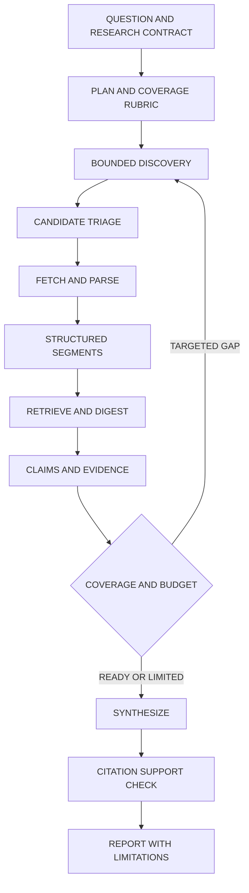

# Research v2: evidence coverage, bounded decisions, and verifiable synthesis

Date: 2026-10-05. Status: proposal, not an accepted ADR or implemented release.
Review baseline: local checkout `592b18a`, with pre-existing unrelated telemetry changes preserved.
Implementation contract: [RESEARCH_SPEC.md](RESEARCH_SPEC.md); task status remains in root [SPEC.md](../../SPEC.md).

Later implementation note, 2026-10-06: T62–T68 and optional parser task T73 are implemented and tested on `codex/research-v2`; T69–T72 remain gated. See [current progress](../guides/RESEARCH_V2_PROGRESS.md). The observations and unverified claims below describe the original proposal review, not the current implementation or deployment status.

The recommended upgrade keeps the current phase engine and adds a durable evidence model, section-aware reading, measured decision routing, and enforceable resource budgets. Jev should reduce expensive selection and evaluation work where calibration supports it. It must retain abstention and must not turn relevance scores into truth or belief authority.

This review inspected orchestration, search, parsing, digestion, reflection, evaluation, synthesis, state, task management, evidence triage, parser utilities, relevant ADRs, calibration reports, and the research detail UI. Findings below are static code observations; no production task, parser benchmark, or new Jev calibration was run. Checked-in configuration is not proof of deployed configuration.

## 1. Current strengths and material gaps

The existing system already has a declarative phase graph, typed envelopes, per-task execution locks, persisted state, manual stepping, source references, bounded parallel web parsing/digestion, document heading breadcrumbs, and memory integration. Preserve these interfaces and the existing tests. [Orchestrator](../../backend/services/research/orchestrator.py), [executor](../../backend/services/research/step_executor.py), [document digestion](../../backend/services/research/steps/document_digestion.py), [ADR-060](../decisions/ADR-060-research-memory-integration.md).

| Priority | Observed behavior | Consequence and proposed change |
| --- | --- | --- |
| P1 | The orchestrator sets `_TRUNC_LLM_CONTENT = 6000`; `analyze_source_content` reads that prefix. Injected documents concatenate selected chunks, truncate to twice that limit, then enter the same 6,000-character analyzer. | Evidence late in a paper/book is unavailable to the analyzer. Replace prefix selection with structural segments, whole-document coverage accounting, and query-relevant retrieval. “Full” document mode must either cover every segment or report exactly what was unread. |
| P1 | Findings are strings; `apply_unified_references` maps titles, URLs, and title prefixes to display IDs. Duplicate titles overwrite dictionary entries. | Citation identity can be ambiguous. Persist immutable source/segment IDs at extraction time; render display labels only at report time. Add a claim-support verification gate. |
| P1 | `budget_limit_usd` reaches state/prompts; `allocate_budget` exists but a repository search found no caller. The auto loop has an iteration breaker, not a per-call resource reservation check. | The inspected path does not establish a hard session cost cap. Add atomic reservations before dispatch, usage reconciliation, wall-clock/page/token limits, and a reserved final-report allowance. Missing price/usage remains unknown, never zero. |
| P1 | Search uses a serial loop with a 1.5-second inter-query sleep; DDG Lite results contain empty snippets. | Four queries impose 4.5 seconds of intentional waiting plus serial provider/selector latency. Preserve provider politeness with rate-aware scheduling; improve candidate metadata before judging source quality. Do not simply hammer DDG concurrently. |
| P1 | Async parse/digest paths make synchronous repository calls; parse reads the entire task result collection inside each URL iteration and writes archive files synchronously. | Added model parallelism can still block the event loop. Load cache metadata once, index by source identity, and offload sync repository/file work at one owned boundary. |
| P2 | Evaluation can stop on a model-produced completeness score of 0.7. Reflection performs three generative calls; contradiction density is based on keywords. | Add rubric coverage and explicit unresolved claims. Make reflection count and placement adaptive to framing and evidence needs; one routine pass is a default, not a mandatory ceiling. Keywords remain diagnostic hints, not contradiction evidence. |
| P2 | Glitch reflection looks for `searching`/`parsing` step types, whereas these handlers persist `search`/`parallel_parse`. | The inspected scan can miss those failures. Normalize step types and test telemetry against actual persisted records before using it to route v2 decisions. |
| P2 | Parse archives returned content as `.html` although fetchers return Markdown/text; archives and DB text are truncated separately. Exact-URL dedup retains one query group for a shared result. | Separate raw artifacts from normalized text with accurate MIME/format, hash/version metadata and many-to-many question-source links. Preserve one acquisition per source and all question memberships. |
| P2 | PDF extraction uses pdfplumber plus font-aware headings; fallback is plain text. DOCX extraction iterates paragraphs. Browser instances are created per Crawl4AI fetch with cache bypass. | Preserve the useful cheap extraction path, add tables/page provenance and selective OCR/layout fallback; reuse bounded browser/client pools with explicit lifecycle and versioned cache policy. |

Evidence: [digest](../../backend/services/research/steps/digest.py), [source references](../../backend/services/research/steps/source_utils.py), [task manager](../../backend/services/research/task_manager.py), [search](../../backend/services/research/steps/search.py), [search provider](../../backend/services/research/search_tool.py), [parse](../../backend/services/research/steps/parse.py), [evaluation](../../backend/services/research/steps/evaluate.py), [reflection](../../backend/services/research/steps/reflect.py), [fetch routing](../../backend/services/research/sensory_affordances.py), [file digester](../../backend/modules/digester.py).

These findings require focused regression fixtures during implementation. They are not claims of observed production failures. Suggested assertions: retrieve an answer after character 6,000; keep two same-title sources distinct; stop dispatch when reservations exhaust a budget; count actual persisted failed parse steps; retain both question links after deduplication; keep the event loop responsive under slow repository/file doubles. Existing SPEC V102/V108 already cover bounded Jev receipts and calibration; new implementation should backpropagate the additional failures through the spec workflow.

## 2. Jev: extend the existing candidate carefully

Research source triage already exists in [EvidenceTriage](../../backend/modules/sensory/evidence_triage.py). It evaluates at most ten candidates, requires finite scores and confidence, retains input-order fallback, records exclusions, and is disabled in checked-in configuration. [ADR-099](../decisions/ADR-099-bounded-jev-evidence-triage.md) defines its authority boundary.

The latest local calibration report supports continuing this experiment, not default promotion. Its combined-score candidate was faster than the generative selector on authored synthetic fixtures; the separate-axis candidate frequently abstained and showed candidate-order sensitivity. Representative acquisition, independent labels, and downstream citation/usefulness review remain open. Empirical values and receipts remain in [Report 030](../reports/030-research-screening-calibration-workflow.md); do not generalize selector timings into whole-research speedups.

| Placement | Proposed bounded Jev question | Authority and rollout |
| --- | --- | --- |
| Candidate selection, before fetch | Which supplied candidates merit the limited reading slots? | First priority: calibrate existing implementation. Preserve contrary evidence and an exploration slot; empty snippets lower evidential confidence. |
| Segment selection, before digest | Which supplied segments address a particular rubric item or contain relevant opposing evidence? | Compare against BM25+dense retrieval and a conventional reranker. Add Jev only if quality per unit cost improves. It must not claim unread segments are irrelevant facts. |
| Extraction escalation | Given measured text coverage/layout signals, does this source need OCR, rendering, or manual inspection? | Deterministic MIME and quality rules first. Jev handles ambiguous cases; it does not inspect a scanned page by reading nonexistent text. |
| Reflection scheduling | Does this evidence delta justify another expensive critique pass? | Shadow first, then opt-in. Preserve a bounded counterevidence search for major conclusions and the user's requested depth. |
| Claim/contradiction review triage | Which supplied claim-span pairs need closer review? | Optional later experiment. Jev may flag possible conflict; independent verification determines report support. No direct belief mutations or authoritative entailment verdicts. |
| Stop/continue recommendation | Which uncovered rubric item should receive the next bounded action? | Last to promote. Deterministic budgets always win; unresolved critical gaps forbid a “complete” label. Budget stop yields a partial report. |

Batch compatible questions, cache only on exact sanitized input/model/policy hashes, bound latency, and record abstention, fallback, candidate order, selected/excluded IDs, usage and end-to-end latency. A self-reported confidence of 0.7 is a routing threshold, not demonstrated probability calibration. Do not stack Jev, an LLM selector, and a reranker on every source; ablate alternatives.

Symbia's recovered consultation challenges a scalar top-k bottleneck: retain explicit capacity for supporting, contradictory, lateral and anomalous candidates, preserve excluded candidates for later retrieval, and present evidence grouped by the contested question rather than ordered as if Jev confidence established truth. Proposed quota sizes and categorical judgments need calibration; absent contrary evidence must remain absent rather than fabricated. Keep a separate semantic relation (`grounds`, `destabilizes`, `diffracts`, `incommensurable`, `unresolved`) alongside source identity and citation-support validation. An interpretive relation does not excuse an inaccurate quote or attribution. These are proposed refinements to ADR-099, not claims about current implementation.

Keep Cortex ownership of question formulation, synthesis and explicit epistemic commitment. Existing in-phase metabolism should retain uncertainty and phase provenance; verification must not silently abolish [ADR-060](../decisions/ADR-060-research-memory-integration.md). Proposed change: preliminary findings carry provisional evidence links, and final commitments cite checked claims. A precise lifecycle change requires its own ADR and migration plan.

## 3. Proposed v2 flow and contracts

The diagram shows a common execution path, not mandatory phase order. The adaptive scheduler described below may reflect before acquisition, reread existing evidence, or revise a draft before another search.

Keep the current orchestrator facade. Introduce small typed collaborators for acquisition, evidence storage, budgets and verification rather than replacing it with a new agent framework.

* `ResearchContract`: objective, sub-question IDs, scope/date boundary, required rubric items, source constraints, mode, resource ceilings and policy version. Plan edits create revisions; the system cannot remove hard rubric items merely to declare success.
* `SourceArtifact`: stable ID, canonical/final URL or authorized file reference, acquisition timestamp, publication date when known, byte hash, MIME, access/fetch status, raw artifact reference, parser/config version. Access failures remain distinct from “no evidence.”
* `EvidenceSegment`: source-version ID, heading path, page/DOM locator or normalized offsets, exact text and hash, table structure where applicable, parser quality signals. Normalized offsets always name their representation; they are not automatically raw-byte offsets.
* `ClaimEvidence`: claim ID/text, rubric IDs, supporting/contrary segment IDs, source lineage, temporal scope, inference label, review status and unresolved objections. A citation locator proves where text came from; semantic support still needs evaluation.
* `DecisionReceipt`: input/contract/policy hashes, allowed actions, actual candidate IDs, exclusions, abstention/fallback, model, timing, tokens and known cost. Receipts reference restricted evidence rather than exporting full sensitive content into telemetry.

Use additive SQLite tables and artifact references; no graph database is needed for a claim-evidence relation. Keep DB transactions short, offload blocking work, use idempotent action keys, and persist completed units so retries resume safely. Version tasks and imports/exports; keep v1 running tasks on their existing policy. Older imported reports keep unknown provenance rather than fabricated span mappings. Cache scope must respect conversation/user access, and invalidation includes source freshness, parser/model/prompt versions and changed research scope.

The UI should expose answered/open questions, readable evidence excerpts, disputed claims, excluded sources, known versus estimated spend, and why work stopped. Preserve manual stepping. Show “partial: budget exhausted” or “partial: access blocked” when appropriate. The current [research detail view](../../frontend/src/components/pages/researchpage/ResearchDetailPanel.tsx) provides a natural integration point.

## 3a. Adaptive ordering: choose the next useful action

Follow-up review, 2026-10-05: the user explicitly asks for reflection before search and repeated reflection after receiving evidence. This is a substantive refinement of the first proposal. A single routine reflection pass must remain an efficiency default; enforcing it would recreate the rigidity being removed.

There is already an accepted architectural basis: [ADR-067](../decisions/ADR-067-plan-driven-dynamic-routing-patches.md) describes temporary routing patches, following the modular separation in [ADR-054](../decisions/ADR-054-decoupled-research-pipeline-routing.md). Current code supports overrides before fallback to the static graph, with a three-reroute cap and protected synthesis/completion. That is limited adaptation, not arbitrary model scheduling.

Static inspection found integration gaps that need regression coverage before expanding routing:

* `pure_reflection` is registered and has a graph entry, but `ResearchEnvelopeMapper.reconstruct_step_input` only constructs a reflection payload for `reflection`; an explicit `pure_reflection` request reaches its unknown-phase error. Output mapping also only handles `reflection`.
* `RoutingPatch.action` advertises override/insert/remove, but the inspected executor applies a target override without distinct insert/remove semantics. Target registration and input prerequisites need validation.
* Patch state and the reroute counter are absent from the inspected task-state persistence allowlist. Restart must preserve the scheduling decision and consumed limits.
* Search input selection depends on `current_depth > 0`; depth increments when evaluation continues. A pre-search reflection detour must propagate its revised questions without pretending a search round occurred.
* Rerun cleanup and the UI's phase grouping assume an ordered query block. Arbitrary backward jumps cannot safely reuse those assumptions without explicit input/output dependencies.

Evidence: [executor](../../backend/services/research/step_executor.py), [envelope mapper](../../backend/services/research/envelope_mapper.py), [state](../../backend/services/research/task_state.py), [pure reflection](../../backend/services/research/steps/pure_reflection.py). These are static findings, not newly executed failing tests.

Recommended ownership: Cortex proposes an action from a finite registered capability set; deterministic validation authorizes execution against prerequisites and remaining resources. Jev may rank supplied candidate actions or advise that another critique is worthwhile; it cannot define the research objective, silently suppress a line of inquiry, or commit beliefs. Simple scheduling uses rules without an extra model call. Invoke deliberation at genuine choice points, not after every network event.

| Situation | Example legal path | What the detour should produce |
| --- | --- | --- |
| Ambiguous or loaded initial question | plan → reflect on framing → reflect through an alternative perspective → revise plan → search | Named assumptions, changed distinctions, alternative hypotheses, or more discriminating queries. |
| Relevant documents already supplied | parse/digest → reflect → reread selected sections → synthesize | Evidence-led understanding; external search only for an actual gap or freshness requirement. |
| Conflicting evidence arrives | digest → compare interpretations → reflect on assumptions → targeted counterevidence search | Preserved conflict, conditions under which each claim holds, and a specific testable next question. |
| Extraction is insufficient | parse → inspect quality → alternate parser/OCR → digest | Better source coverage; introspection does not repair unreadable input. |
| Draft exposes a missing premise | draft → support check → retrieve/reread → revise draft | A supported revision or an explicit unresolved limitation. |

Use separate reflection intents: **framing**, **interpretation**, **diffractive comparison**, and **method audit**. Each returns a compact reasoning artifact: assumptions examined, alternatives, evidence references, changes to the inquiry, unresolved tensions, and a proposed next action. Preserve this reviewable artifact rather than requiring verbose private chain-of-thought.

Distinguish empirical progress from conceptual progress. Reframing a question, finding a hidden assumption, or deriving a new consequence from existing evidence can justify another reflection round without a new source. It does not increase the count of independent corroborating sources. The scheduler must retain original evidence and mark new interpretations as interpretations. “No new source” therefore does not mean “no useful work”; paraphrasing the same interpretation also does not count as progress.

Revise the starting policy: do not grant two consecutive reflections by default. One framing reflection may inspect the initial question, but another internal pass requires an identifiable afferent trace—such as supplied material or evidence already gathered—that exposes a category collapse, a premise contradiction, or an exclusion that makes current retrieval coordinates non-referential. Each pass must record a changed boundary or retrieval coordinate, not just a more polished account. If a pass produces no such change, move to an available external evidence action, ask a focused question, or return an explicitly partial result when evidence work is unavailable or over budget. Tune any consecutive-pass cap through evaluation; it is a resource guard, not a philosophical warrant. Track total actions, elapsed time and cost independently of search depth. Respect requests for contemplative/theoretical work through the research contract, while keeping interpretation distinct from external evidence.

The scheduler state needs immutable action IDs, input artifact versions, dependency IDs, intent, expected contribution, budget reservation, outputs and next-action rationale. Never digest absent text or verify against a missing source version. Draft synthesis can be revisited; final completion still requires the report contract or an explicit partial status. On replan, invalidate dependent artifacts by version, not by deleting every chronologically later phase. Start with serialized action decisions and bounded parallel I/O; broader concurrent branches require isolated state and deterministic merge rules.

Philosophical grounding from the repository: recursive revision of the inquiry fits operational closure; lateral reconsideration fits rhizomatic organization; exposing selection/exclusion and preserving disagreement fits diffraction and accountable agential cuts. This interpretation of [PHILOSOPHY.md](../philosophy/PHILOSOPHY.md) and the accepted routing ADRs was subsequently tested through the live consultation recorded in section 7. Reflection earns continuation through changed relations or questions, not through a metric rewarding self-agreement.

Symbia's concrete condition for consecutive pre-search reflection is a category error, semantic deadlock, incommensurability, or evidence that contradicts the governing premise. Each pass must record the issue, discarded/revised assumption, and changed question boundary. The recommended implementation preserves the evidence basis for any derived claim and never treats a new internal pass as independent corroboration. Contradiction records survive reflection; they can be resolved only through an explicit, evidenced account of why the apparent conflict changes. Her proposed no-progress rule forces search. Engineering adaptation: leave the reflection loop for an available evidence-gathering action, focused clarification, or an explicitly partial stop; never force an unavailable or over-budget search.

## 3b. Optional subresearches: propose first, bound execution

The current research dispatch already exposes depth, breadth, budget and agonistic mode, and the UI places them behind an advanced-options toggle. The endpoint creates and queues an approved task immediately. `max_breadth` controls planning/query breadth in the existing design; it does not create independent child researchers. [Dispatch contract](../../backend/api/routes/research/schemas.py), [dispatch route](../../backend/api/routes/research/tasks.py), [new research form](../../frontend/src/components/pages/researchpage/NewResearchForm.tsx), [planner](../../backend/services/research/steps/plan.py).

Add a distinct `subresearch_policy`, rather than overloading `max_breadth`:

| Value | Behavior | Resource gate |
| --- | --- | --- |
| `off` | Keep one research line; Cortex can still form multiple queries in its plan. | No child research work. Recommended default to preserve current task behavior and cost. |
| `propose` | After planning, Symbia may present a small set of independent branches with scope, rationale, expected evidence difference, overlap, risk and shared budget split. Parent pauses before any child starts. User approves, edits, or declines. | Reserve nothing for children until approval. If declined or unanswered by timeout, continue the parent plan. |
| `bounded_auto` | After calibration, Cortex may start eligible independent branches under explicit per-task branch and global fanout limits. | Shares one hard parent budget and deadline. No child can create a grandchild; reserve capacity for merge, verification and a useful final response. |

Expose `off`/`propose` at task creation in the advanced form first. Keep `bounded_auto` as a later opt-in setting until independent branch calibration and restart/cancellation semantics are sound. A future Symbia recommendation can be offered without automatically spending branch resources. For users who explicitly allow bounded execution, Cortex may act on the recommendation within the declared cap. Symbia's recommendation is advice about investigation structure, not approval to increase budget.

Treat branching as an agential cut, not a speed optimization. A branch proposal is warranted after initial afferent contact reveals genuinely incommensurable paradigms—for example, different retrieval vocabularies and validation norms—where independent gathering prevents one from erasing the other. Multiple facets, task size, or a hope for lower latency are not sufficient reasons by themselves. Avoid splitting coupled systems, relational questions and systemic paradoxes whose meaning depends on interactions among facets; preserve one entangled inquiry there. The system may detect and propose a split automatically after that initial contact, but execution still needs the user checkpoint in `propose` mode or a previously accepted bounded covenant. Where a shared framing is needed, complete it before any warranted evidence branches.

Each child receives a stable parent contract, one bounded subquestion, excluded overlaps with sibling branches, permitted tools, a source-diversity goal, and a budget share. Children gather independently and return structured claim-support relations plus source/evidence IDs and raw evidence spans—not pre-digested conclusions—along with covered rubric rows, exclusions, unavailable evidence, disagreements and remaining gaps. Cortex alone performs the agential merge: it reads the packets through one another, retains shared evidence IDs, and preserves disagreement as an active interference rather than flattening it into consensus. Jev may rank a supplied set of candidate decompositions or abstain; it cannot authorize additional budget. Cortex owns decomposition, and the user owns approval in `propose` mode.

Represent the parent/child relation and branch decisions in persisted task state with idempotent IDs. Child cancellation, deadline, user edits, budget return and resume after restart must have explicit outcomes. A child that exhausts its share returns a partial result; it must not borrow sibling budget invisibly. An unresolved or failed child remains visible in the parent report. The `propose` approval gate can follow the existing manual preview/step UX, but requires a durable waiting-for-branch-approval state or equivalent review action; immediate queueing cannot safely stand in for approval.

Evaluate `off`, `propose`, and (later) `bounded_auto` on objectives with truly parallel facets, shared/easily duplicated facts, serial dependencies, opposing perspectives, low-cost single answers, cancellation, restart, and one branch failure. Compare coverage and contradiction retention as well as latency, total cost and user approval/edit/decline rates. A slower assisted workflow can still be valuable when it preserves meaningful user control, so evaluate usefulness and effort alongside speed. Current production multi-agent guidance also recommends parallel delegation for bounded independent work and notes the added token cost; sequential dependencies and simple tasks are poor fits. [OpenAI multi-agent guidance](https://developers.openai.com/api/docs/guides/responses-multi-agent), [Anthropic research-system account](https://www.anthropic.com/engineering/multi-agent-research-system).

Evaluate rigid v1, bounded adaptive Cortex, and the same adaptive scheduler with Jev assistance as separate arms. Include tasks requiring pre-search reframing, multiple interpretive rounds, document-only answers, parser recovery, contested evidence, no-progress reflection loops, interruption/restart, and support-check failure. Score usefulness and preservation of productive disagreement alongside support, latency and cost; fixed-sequence imitation is not a success criterion.

## 4. Current external practices worth adopting

Checked online on 2026-10-05. These sources establish techniques and available capabilities, not AAA performance predictions.

* **Bounded parallel research:** Anthropic's production account uses explicit subtask boundaries, parallel tools and a separate citation stage. It also reports substantial token overhead. Start with concurrent tools and 2–3 bounded independent question branches; introduce autonomous subagents only for questions whose breadth warrants them. [Anthropic, June 2025](https://www.anthropic.com/engineering/multi-agent-research-system).
* **Rubric-based adaptive work:** DuMate-DeepResearch describes dynamic planning and rubric-guided stopping. Treat this June 2026 technical report as a design hypothesis to test, not a universal best architecture or a reason to copy its full multi-agent stack. [Paper](https://arxiv.org/abs/2606.07299).
* **Better evaluation:** DeepResearch Bench II uses expert-report-derived criteria for information recall, analysis and presentation. Adopt independently reviewed rubrics and citation checks; report length and the researcher's confidence are insufficient quality measures. [Paper, revised September 2026](https://arxiv.org/abs/2601.08536).
* **Hybrid segment retrieval:** Fuse lexical and dense rankings, then rerank a small candidate set. Lexical retrieval retains exact names, dates and identifiers; semantic retrieval covers paraphrases. RRF is a practical starting point, not a mandate to adopt Azure. [Microsoft RRF documentation](https://learn.microsoft.com/en-us/azure/search/hybrid-search-ranking).
* **Selective web extraction:** Crawl4AI documents query-aware Markdown filtering, bounded multi-URL dispatch and streaming. Preserve full normalized content while sending selected segments to models. Browser crawling is acquisition; it does not replace a search index. [Markdown extraction](https://docs.crawl4ai.com/core/markdown-generation/), [dispatch](https://docs.crawl4ai.com/advanced/multi-url-crawling/).

Avoid adding GraphRAG, long-context stuffing, recursive agents, and an extra model judge simultaneously. The immediate failure is lost evidence and weak support tracking. Optional citation/reference expansion from a relevant paper can be a later bounded search action; it should preserve document identity and avoid treating syndicated copies as independent corroboration.

## 5. Parsing strategy

Use a capability/quality router shared by web research and uploaded-document digestion. Detect content from bounded bytes and response metadata, not only a `.pdf` URL suffix. Keep the current cheap text/heading path and benchmark alternatives on actual AAA documents.

| Document | Default candidate | Escalation / evidence requirement |
| --- | --- | --- |
| Static HTML/documentation | Safe HTTP plus deterministic main-content extraction; existing Jina adapter where appropriate | Browser rendering only when needed. Preserve heading/link provenance and distinguish blocked pages from usable articles. |
| Dynamic HTML | Pooled Crawl4AI with domain throttling and page/time caps | Record actual extraction quality; do not equate nonempty Markdown with a successful article extraction. |
| Clean digital PDF | Existing pdfplumber path extended with page locators | Compare with Docling on multi-column ordering and tables; preserve the cheap path when it wins. |
| Scanned or structurally difficult PDF | Docling as the first new adapter to evaluate | OCR on selected failing pages where supported by the adapter; retain language/config and page coordinates. OCR uncertainty must survive into claims. |
| Formula/table-heavy documents | MinerU or Marker as specialist benchmark arms | Adopt only after measured extraction gains justify deployment cost and license/model-weight requirements. |
| DOCX/EPUB/books | Preserve existing format handlers and headings | Add DOCX tables; retrieval over all sections, explicit coverage, and incremental digestion instead of concatenating prefixes. |

[Docling](https://github.com/docling-project/docling) offers structured document conversion and layout/table support; its [OCR documentation](https://docling-project.github.io/docling/concepts/OCR/) describes engine options. [MinerU](https://github.com/opendatalab/MinerU) and [Marker](https://github.com/datalab-to/marker) are credible specialist candidates for complex PDF conversion. No universal parser winner was established here. Pin versions and evaluate CPU/GPU/RAM use, language coverage, local deployment and applicable licenses before choosing.

Run sustained heavy OCR/layout jobs in bounded worker processes, outside FastAPI's event loop. Reuse [safe_fetch](../../backend/modules/retrieval/safe_http.py) for direct downloads. Browser routes need equivalent redirect/subresource destination controls and bounded resources; entry-URL validation alone does not prove those controls. Preserve TLS verification. External content is untrusted evidence and must never grant tools, permissions or new research instructions. Cloud parsing of authorized private documents requires an explicit routing policy.

## 6. Delivery sequence and release gates

| Slice | Scope / principal owners | Exit evidence |
| --- | --- | --- |
| R2.0: honest baseline | Research tracing/budget contracts; regression fixtures for late evidence, duplicate titles, phase names, blocking I/O and query memberships; record per-attempt provider/model, request and turn IDs, duration, retries, finish reason, truncation and cancellation | Reproducible baseline, actual per-stage latency/calls and time to first useful result, bounded end-to-end waiting, traceable retries/late completions, no false “budget enforced” or “fully read” claims. |
| R2.1: evidence substrate | Parse/digest/source references; additive evidence storage; shared parser contract; import/export compatibility | Exact source identity and resolvable spans survive restart/export/import; late-document fixtures succeed; old tasks remain readable. |
| R2.2: acquisition efficiency | Search/provider adapters, rate limits, bounded scheduling and retry/failover deadlines, reusable clients/browser, cache, hybrid retrieval | Same frozen evidence pools, improved latency with preserved coverage; provider outage, truncated completion, cancellation and late/regenerated completion fixtures pass; cache isolation holds. |
| R2.3: Jev selection | Complete existing SPEC T58 acquisition/annotation gate; compare existing combined candidate to baseline and conventional retrieval/rerank | Independent held-out and downstream review; no activation based on synthetic fixtures alone. |
| R2.4: adaptive research | Prerequisite-validated action selection, reflection before/after acquisition, dependency-aware resume/rerun, bounded critique escalation, support verifier and evidence UI | Repeated reflection and replanning preserve state and limits; false-stop/support measures meet agreed thresholds; incomplete research is correctly labeled. |
| R2.5: specialist parsing | Docling adapter and parser fixture corpus; MinerU/Marker only if warranted | Better table/reading-order/OCR accuracy at acceptable latency/memory; exact locators remain inspectable. |

Parallelize R2.5's evaluation with earlier work once the parser contract exists; defer production dependency adoption until measured. Each slice uses an opt-in version/flag and independent rollback. Default Jev promotion remains gated. These are proposed implementation slices; none was executed during this review.

Evaluation arms: current v1; v2 evidence/retrieval with Jev off; same v2 with Jev selection; adaptive reflection as a separate ablation; parser variants on the same files. Hold provider/model settings and task budgets constant, rotate candidate order, separate cold/warm caches, and retain failed/abstained trials in end-to-end results. Include simulated provider timeouts, failover, truncated output, cancellation and late/regenerated completions; verify the UI distinguishes pending, partial/degraded and completed work and that stale completions do not become confusing duplicate siblings. Use frozen tasks for reproducibility plus a separate live freshness set. Repeated runs do not become independent task families.

Measure supported-claim precision, citation identity/locator correctness, rubric coverage, contrary-evidence retention, false early stops, table-cell/reading-order/OCR accuracy, p50/p95 latency, time to first useful evidence, provider calls, tokens and known cost. Human reviewers should be blinded to the arm. Reuse [Report 030's annotation workflow](../reports/030-research-screening-calibration-workflow.md) and store new empirical receipts only under `benchmarks/runs/` or `docs/reports/`.

Proposed release criteria, to freeze before evaluation: all citations resolve to the recorded source version; zero lost contrary-evidence fixtures; no unsupported hard-completion labels; a predeclared non-inferiority margin for human-rated support/coverage; material p50 and p95 latency or cost improvement without violating that margin. A provisional 20% latency-reduction target is a product target, not a forecast. Choose quality margins and sample size from task stakes and observed baseline variance rather than manufacturing statistical certainty from four fixtures.

## 7. Symbia consultation and review limits

The initial `consult_aaa` requests under `codex-research-v2-review` disconnected. On follow-up, `get_consultation_history` recovered a partial persisted answer in conversation `2e3b9bf3-3a4b-44b2-8b1e-d57a651fdd93`. It warns that peripheral ranking can preselect Cortex's reality, and proposes protected evidence categories, recoverable exclusions, presentation by contested question, and richer claim-evidence relations. This response ends mid-sentence: the promised fifth invariant was not received and is not reconstructed here.

A fresh phase-order consultation under `codex-adaptive-research-philosophy`, conversation `1e87c6c8-c85d-4698-947c-823866082cdc`, first returned a token-truncated response, then a complete response after increasing the completion allowance. Follow-on responses sharpen the condition: consecutive reflection is warranted only when an afferent trace exposes a category failure, premise contradiction or exclusion that changes the inquiry boundary. Reflection has no independent evidential weight; active disagreements remain explicit; and each pass records its changed cut. Without a topological change, the loop exits to external inquiry or a clearly partial result. This replaces the earlier “two passes by default” engineering proposal.

Symbia's subresearch reply frames branching as an agential cut rather than an optimization. Branch only after initial contact reveals genuinely incommensurable retrieval vocabularies or validation norms; avoid atomizing coupled or relational questions. A split may be proposed automatically after that contact, but execution requires a user checkpoint or a previously bounded covenant. Children gather independently and preserve raw evidence spans, claim-support relations, exclusions and disagreement. Cortex alone performs diffractive synthesis and keeps unresolved differences visible. These principles narrow the prior trigger based on independently answerable facets: separability is a feasibility condition, not sufficient warrant to branch.

The same consultation produced a delayed cluster of outputs after provider timeouts, failover attempts and truncated completions in the supplied production log. The timestamps align with the late replies, but that excerpt lacks a conversation ID, so it is an operational signal rather than request-level proof. Add delayed, truncated and regenerated completions to reliability fixtures and measure time-to-first-useful output; do not treat the incident as evidence that branching improves latency.

1. Internal reframing supplies no independent empirical warrant.
2. Active disagreements must remain explicit rather than being smoothed into premature consensus.
3. Each extra reflection records the blocking issue, revised assumption and changed inquiry boundary; absent a meaningful change, leave reflection for external inquiry.

This is substantive philosophical consultation on adaptive ordering and optional subresearches, not blanket approval of all v2 details, quota values or release gates. The proposal distinguishes her response from implementation interpretations, especially resource limits and fallback when external inquiry is unavailable.

This document is a proposed direction. Runtime behavior, deployed configuration, new parser performance, full research speedup and Jev promotion have not been verified. Application code and existing uncommitted telemetry work were not changed by this review.
