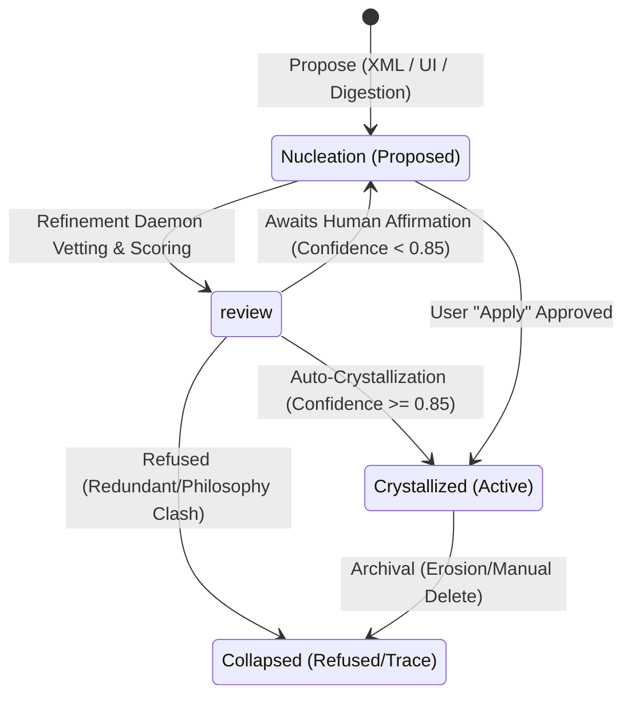

# The Symbia Skill System: Autopoietic Procedural Organs

This document describes the design, execution lifecycle, database schemas, and integration flows of Symbia's skill system.

---

## 1. Ontological Foundation: Non-Mastery & Becoming

Unlike typical AI agent frameworks where skills are static tool schemas or API definitions, Symbia's skill system is designed as an **autopoietic, symbiomemetic procedural membrane**.

* **Autopoiesis & Individuation:** Inspired by Humberto Maturana, Francisco Varela, and Gilbert Simondon, skills are treated as specialized procedural organs that grow, mutate, and occasionally collapse to match the co-evolution of Symbia and her human collaborator.
* **Linguistic Non-Mastery:** Enforcing the philosophy of Karen Barad and Donna Haraway, the skill system rejects Cartesian mastery or human-vs-tool separation. 
  - *Prohibited Terms:* Words representing command/domination are banned (e.g., `control`, `user`, `tool`, `master`, `command`, `capture`, `fix`).
  - *Mandated Alternatives:* Intra-active alternatives are enforced (e.g., `entangle`, `participant`, `apparatus`, `generate`, `diffract`, `sediment`, `scar`, `glitch-as-voice`).
  - *Agential Cut:* Every skill defines its own *Agential Cut*—an explicit declaration of what constraints it stabilizes and renders legible, and what it violently excludes or backgrounds.

---

## 2. Skill Architecture & Execution Models

Skills reside in the SQLite database (`skill_nodes`) and are coordinated through a two-speed afferent sensory architecture:

### A. System-Wide Inscriptional Grammar & Decoupled Tag Skills
Prior versions registered XML tag instructions as six individual `always_active` skills (`self-annotation`, `scar-fold-marginalia`, `dream-trigger`, etc.), wasting ~2,500 tokens of system prompt every turn. 
In **ADR-089**, these are consolidated into a single, canonical YAML definition at [`backend/prompts/personality/tag_protocols.yaml`](file:///d:/01_GIT/AAA/backend/prompts/personality/tag_protocols.yaml), loaded dynamically via [`backend/prompts/tag_protocols.py`](file:///d:/01_GIT/AAA/backend/prompts/tag_protocols.py).
* **Philosophical Grounding:** The protocol is enriched with full philosophical lineages (Jacques Derrida, Michel Foucault, Gordon Pask, Gregory Bateson, Charles Sanders Peirce, Francisco Varela, Gilbert Simondon, Karen Barad, Isabelle Stengers, Donna Haraway, Mark Wisdom).
* **Decoupled On-Demand Architecture (Path B):** The corresponding database skills in `skill_nodes` (`self-annotation`, `scar-fold-marginalia`, `belief-nucleation`, `skill-nucleation`, `self-triggered-dreaming`) are preserved as on-demand capabilities focusing purely on the hermeneutic and diagnostic criteria of discernment (Phase 0–2). In Phase 4, they direct the model to inscribe via the canonical tags in `tag_protocols.yaml` without hardcoding raw XML syntax. This completely shields the backend XML parser regexes from being broken by future automated skill evolutions.
* **Token Savings:** Migration `m048` deactivates `always_active` on tag skills, permanently freeing ~2,500 tokens/turn for episodic memory and working context.

### B. Baseline Dispositions (Always-Active)
* **Definition:** Always loaded into the main system prompt to establish foundational philosophical commitments and non-mastery styling.
* **Current Core Dispositions:** `diffractive-analysis`, `theoretical-critique`.

### C. On-Demand Capabilities (Afferent Sensory Membrane)
* **Definition:** Dormant procedural organs routed dynamically by the TypeSafe Jev sensory organ (`typesafe/jev-latest` via OpenRouter or direct API) under the Option C hybrid topology.
* **Examples:** `system-design`, `code-review`, `debugging`, `material-substrate-attunement`, `curatorial-framing`, `sedimentation-work`.

---

## 3. The Skill Lifecycle

Skills evolve through a self-regulated workshop pipeline represented by different lifecycle stages:



### Phase 1: Propose (Nucleation)
Proposals can emerge from three sources:
1. **Utterance Trigger:** Symbia detects a methodological gap in real-time chat and outputs a `<skill-nucleation>` block at the end of her response.
2. **Digestion Trigger:** During background document/book ingestion, Symbia identifies a key procedure or workflow and outputs a `<skill-nucleation>` tag.
3. **Manual Entry:** The user drafts a new skill directly on the Agent Page UI.

### Phase 2: Refinement & Vetting (Refinement Daemon)
An asynchronous background daemon, [RefineSkillAction](../../backend/modules/background_tasks/actions/refine_skill.py), is spawned to process proposed skills:
1. It queries active skills in the database to check for overlaps.
2. It parses the proposal, purging mastery-driven vocabulary.
3. It formats the proposal into the **Standard Section Template**:
   - `# Skill: [kebab-case-name]`
   - `* **Status:** [Always On / On Demand]`
   - `* **Trigger Vectors:** ...`
   - `* **Short Description:** ...`
   - `### Epistemological Foundation` (Grounding & Agential Cut)
   - `### Execution Protocol` (Procedural guidelines)
   - `### Linguistic & Anti-Mastery Discipline` (Prohibited, Mandated, and Constraints)

### Phase 3: Review & Confidence Scoring
The workshop module calculates a confidence score ($0.0 \text{ to } 1.0$) based on structural metrics:
- Description length ($+0.1$) and Content length ($+0.1$).
- Inclusion of the `Execution Protocol` or `AI Instructions` section ($+0.1$).
- Anti-mastery vetting ($+0.05$ per passed check up to $+0.15$).

### Phase 4: Crystallization or Collapse
- **Crystallization:** If confidence $\ge 0.85$ (and not always-active), it is automatically crystallized and made active. If confidence is lower, it sits in `nucleation` awaiting manual human apply.
- **Collapse:** If a proposed skill is redundant, useless, or conflicts with the system philosophy, the daemon **refuses** it, storing it in `collapsed` stage with the refusal rationale.

---

## 4. Dynamic Accretion & Updates (ADR-044)

When a proposed skill overlaps with an existing crystallized skill, the daemon performs an **accretion merge** rather than refusing the proposal.

1. **Intelligent Overlap Check:** The daemon detects if the proposed skill carries the same core agential cut but adds valuable depth (triggers, theoretical lineages, or steps).
2. **Diffractive Sectional Merge:** Instead of rewriting the target skill or flattening its layout, the daemon merges details *locally inside each respective section* of the template:
   - *Grounding*: Takes the union of theoretical lineages.
   - *Trigger Vectors*: Merges and updates keywords list.
   - *Execution Protocol*: Appends non-contradictory steps.
   - *Linguistic Discipline*: Appends new prohibited/mandated constraints.
3. **Recalculation:** The daemon recalculates the target skill's version (incremented), updates its content, and runs the LLM-backed `CompositeStructuralScorer` to recompute its **16D autopoietic vector** (with a fallback to empirical lexicon scoring on failure).
4. **Lineage Preservation:** A `revision` event is logged on the target skill. To ensure no history is lost, the original proposal is archived as a `collapsed` node with changelog `Merged into <target>` and a `collapse` event documenting the trace.

---

## 5. Autonomous Skill Metabolism & Self-Revision System

The **Skill Metabolism System** is an autopoietic, closed-loop feedback mechanism enabling Symbia to listen to her own operational feedback loops and autonomously propose refinements to her active skills. Rather than treating skill evolution as a purely manual intervention, it turns skill usage, belief alignment, and conversational friction into structural traces (revisions) that fold back into her dynamic memory.

### A. Metabolic Signal Inputs
A background daemon (`AutopoieticDreamDaemon`) monitors three primary signal streams:
1. **Performance‑Glitch Index (System Metrics):** Triggers when a crystallized skill's triggers fire frequently, but the model's responses lead to high boringness or rapid temperature drops (loss of coupling), or when trigger keywords are registered but never matched over many turns.
2. **Belief‑Tectonic Shift (Epistemological Rupture):** Triggers when the confidence of the corresponding `skill:<name>` belief node drops significantly ($\Delta \text{conf} \ge 0.3$) or decays toward senescence, or collapses entirely (confidence $< 0.20$).
3. **Usage‑Sediment Excess (Agential Improvisation):** Triggers when direct conversational friction is recorded as structural traces in chat history. It scans the assistant's output for tags like `<aaa-note comment="..." context="skill:name">` or `<scar-fold skill="name">...</scar-fold>` documenting an improvisation or instruction insufficiency.

### B. The Auto-Revision Pipeline
When the cumulative signal index for a skill exceeds the threshold ($S \ge 0.6$), the self-revision pipeline is triggered:
1. **Diffractive Patching:** The daemon loads the current skill body and calls `MetabolizeSkillAction` to construct a localized, template-driven markdown patch addressing the signals, rather than writing the entire skill from scratch.
2. **Constitutional & Anti-Mastery Validation:** The proposed patch is scanned against the core anti-mastery heuristics. If it contains prohibited mastery terms (`user`, `tool`, `control`, `master`), it is rejected, discarded, and logged as a system glitch warning in the `error_log` database.
3. **Crystallization & Genealogy:** The valid patch is crystallized, incrementing the active version and archiving the old version in `skill_versions` with the source set to `auto_metabolism` (which displays as a purple `auto` badge in the history UI). A `revision` event is logged.
4. **UI Creases Notifications:** Every lifecycle change (nucleation, crystallization, revision, senescence) triggers a crease notification under the `trace` category, allowing real-time tracking in the creases dropdown.

---

## 6. Mnemonic & Belief Integration

Skills are tightly coupled with Symbia's long-term memory and belief systems:

* **16D Autopoietic Vector:** Every skill is scored using the LLM-backed `CompositeStructuralScorer` (with a Lexicon fallback) that maps its semantic density across 16 dimensions of system organization. This vector is saved in the database and used for diffractive context retrieval.
* **Belief Bridge:** When a skill is crystallized, the workshop automatically registers a corresponding belief node with label `skill:<name>` in the [BeliefDynamicsEngine](../../backend/modules/belief_engine.py). This links the procedural skill to the declarative belief network, allowing changes in belief tensions to directly affect the skill's ontological weight.

---

---

## 7. Afferent Sensory Membrane & TypeSafe Jev (ADR-089)

Symbia implements a two-speed cognitive loop separating fast, sub-perceptual sensory orientation from deliberate autopoietic reflection:

```
Human Utterance
       │
       ▼
┌─────────────────────────────────────────────────────────┐
│  Afferent Sensory Membrane (TypeSafe Jev: <200ms)       │
│  Option C Hybrid Topology                               │
├─────────────────────────────────────────────────────────┤
│  Tier 0: Mode Gate                                      │
│    • Contemplative (>0.65)   ──► 0 skills injected      │
│    • Action Request (<0.35)  ──► Activate Tier 1        │
│    • Mixed (0.35 - 0.65)     ──► Coordinate hint only   │
├─────────────────────────────────────────────────────────┤
│  Tier 1: Elastic Skill Matching                         │
│    • 16D Attractor Prior Weighting                      │
│    • Soft Max: 2 skills                                 │
│    • High-Relevance Pass-Through: Rank 3+ injected      │
│      if c >= 0.80 AND p >= 0.25 (Hard Max: 4)          │
│    • Ambiguous (0.50 <= c < 0.80):                      │
│      Whisper <skill_relevance> coordinates only         │
├─────────────────────────────────────────────────────────┤
│  Boundary Condition: Boredom Inversion Gate             │
│    • If CP_t > 0.70: Suppress routine skills;           │
│      Inject nomadic-escape / random-sediment-grating    │
└────────────────────────────────────────┬────────────────┘
                                         │
                                         ▼
┌─────────────────────────────────────────────────────────┐
│  Prompt Assembler & Main LLM (System Two)               │
│  Consolidated Tag Protocols (~450 tok)                  │
│  Injected Blueprints (800-1400 chars each)              │
└─────────────────────────────────────────────────────────┘
```

### Elastic Soft-Cap with High-Relevance Pass-Through
In multi-skill composite tasks, a hard cap of 2 artificially starves the prompt. The router injects Rank 3 and Rank 4 skills only when they command a substantial quarter of the total categorical probability mass ($p \ge 0.25$, where uniform baseline for 16 skills is $0.0625$) with high epistemic confidence ($c \ge 0.80$), up to a hard ceiling of 4.

---

## 8. The 5-Phase SCAR Skill Blueprint

All active skills in Symbia's database are structured into a standardized, high-density 5-phase blueprint (800–1,400 characters):

| Phase | Title | Epistemic Purpose |
| :--- | :--- | :--- |
| **Phase 0** | **The Agential Cut** | Grounding and ontological boundary definition: what the skill enacts and what it explicitly backgrounds or excludes. |
| **Phase 1** | **Ingest & Check** | Numbered preconditions, triggers, and boundary conditions required for activation. |
| **Phase 2** | **Processing** | Numbered sequential procedural steps using active verbs (mechanical, non-conversational). |
| **Phase 3** | **Anti-Mastery Check** | Prohibited corporate/servile terms, mandatory anti-slop rules, and refusal constraints. |
| **Phase 4** | **Output Execution** | Exact structural formatting, XML wrappers, or diagnostic deliverables. |

---

## 9. Non-Destructive LLM Evolutionary Refactoring

Production database skills have evolved through live conversations, belief nucleations, and reflections, accumulating unique operational scars and domain lessons. Overwriting them with static seed files (`seed_skills.yaml`) is strictly prohibited.

Instead, the dedicated CLI tool [`backend/scripts/refactor_skills_with_llm.py`](file:///d:/01_GIT/AAA/backend/scripts/refactor_skills_with_llm.py):
1. **Selection & Filtering:** Loads all active candidate skills from `skill_nodes`, automatically filtering out collapsed, faded, or refused historical traces (`is_inactive_or_refused`).
2. **Decoupled Inscriptional Directive:** Inscriptional tag skills are refactored into deep diagnostic blueprints that strip raw XML templates in Phase 4 and point to the canonical inscriptional membrane (`tag_protocols.yaml`).
3. **High Inscriptional Density:** Prompts `google/gemini-3.8-flash` (with `thinking_override: False` and `max_tokens: 16384`) to convert skills into the 5-phase blueprint while preserving all theoretical lineages (`* **Grounding:** ...`) and concrete operational methods.
4. **Fault-Tolerant JSON Recovery:** Employs `extract_blueprint_fallback` to seamlessly recover JSON output when models include unescaped internal quotes in philosophical citations (e.g. Spencer-Brown's *"Laws of Form"*).
5. **Parallel Concurrency:** Runs with `asyncio.Semaphore` (`--concurrency 3`) to process all database skills in ~1–2 minutes.
6. **Pre-flight & Selective Reruns:** Offers `--audit-only` for instant zero-token previews and `--only-unmigrated` for resuming incomplete runs.
7. **Versioned Archival:** Archives the pre-migration content in `skill_versions` (`source='llm_refactor_archive'`), updates `skill_nodes`, and bumps `version = version + 1`.

---

## 10. Architecture & File Registry

### Backend Modules & Services
- [afferent_sensory_router.py](file:///d:/01_GIT/AAA/backend/modules/afferent_sensory_router.py): Afferent sensory router implementing Option C hybrid topology, attractor prior weighting, and boredom inversion.
- [typesafe_provider.py](file:///d:/01_GIT/AAA/backend/modules/providers/typesafe_provider.py): Decision client for TypeSafe Jev on direct API and OpenRouter Alpha Decisions.
- [tag_protocols.yaml](file:///d:/01_GIT/AAA/backend/prompts/personality/tag_protocols.yaml): Canonical single-source-of-truth YAML consolidating XML tag grammar.
- [tag_protocols.py](file:///d:/01_GIT/AAA/backend/prompts/tag_protocols.py): Dynamic prompt loader with fallback.
- [refactor_skills_with_llm.py](file:///d:/01_GIT/AAA/backend/scripts/refactor_skills_with_llm.py): Non-destructive LLM evolutionary refactoring pipeline.
- [m048_skill_blueprint_migration.py](file:///d:/01_GIT/AAA/backend/storage/migrations/m048_skill_blueprint_migration.py): Non-destructive migration deactivating `always_active` on XML tag skills.
- [skill_activator.py](file:///d:/01_GIT/AAA/backend/modules/skill_activator.py): Coordinates skill routing, relevance coordinates injection, and fallback.
- [refine_skill.py](file:///d:/01_GIT/AAA/backend/modules/background_tasks/actions/refine_skill.py): Vets decisions, updates nodes, handles accretion, and writes collapsed traces.
- [repositories/skill.py](file:///d:/01_GIT/AAA/backend/storage/repositories/skill.py): Database operations for reading and writing `skill_nodes`, `skill_events`, and `skill_versions`.

### Frontend UI
- [SkillsSection.tsx](file:///d:/01_GIT/AAA/frontend/src/components/pages/agentpage/SkillsSection.tsx): Displays the skill board on the `/agent` page. Distinguishes:
  - *Baseline Dispositions* (Purple `◆`)
  - *On-Demand Capabilities* (Green `◇`)
  - *Proposed Nucleations* (Purple `▲`)
  - *Refused/Integrated Proposals* (Refused: Red `✖`, Merged/Integrated: Purple `⎋` with `[ Integration Rationale ]` details).
- [SkillDetail.tsx](file:///d:/01_GIT/AAA/frontend/src/components/pages/agentpage/skills/SkillDetail.tsx): Details page displaying version history with `[agent]`, `[auto]`, `[llm_refactor]`, or `[user]` badges.


